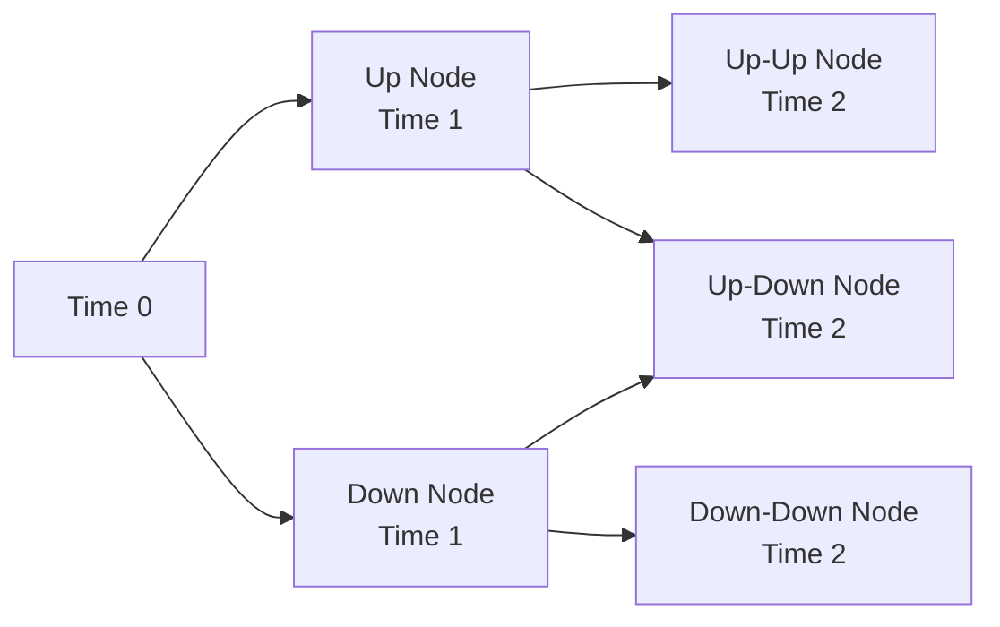
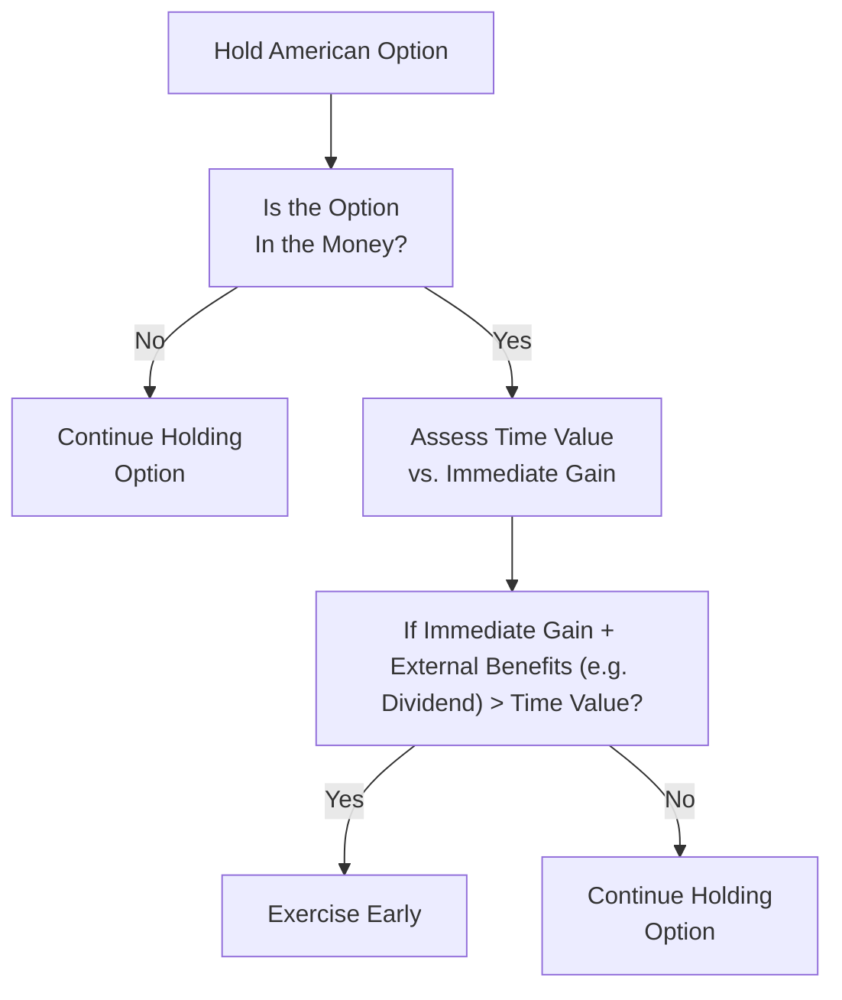

## Introduction

Sometimes people think options are this amazingly mysterious part of finance—like it’s all hushed jargon about “calls” and “puts.” But, you know, once you break through that initial complexity, it’s quite fascinating. Options are essential tools in modern finance for hedging, speculation, and yield-enhancement strategies (something you’ll see pop up once you dive into real-world trading desks). In this section, we’ll explore two critical option styles: European and American. 

Everyone talks about them as if they’re two standardized types (which they pretty much are in practice), but the key difference is all about when you can exercise your right to buy or sell the underlying asset. That seemingly small distinction can have a big impact on how these instruments are valued, how we model their risks, and how they fit into a portfolio-management framework.

## Defining European and American Options

Before we dive into deeper waters, let’s revisit a couple of definitions:

• European Options: These let you exercise only at the option’s expiration date. If you hold a European call or put, you can’t wake up on a random Tuesday a month before expiration and decide it’s time to exercise. No. You have to wait until the day the option contract states. 

• American Options: These let you exercise at any time up to (and including) the expiration date. That flexibility may bring an additional “premium” to the option’s price because you can act early if market conditions move in your favor—or if dividends or interest rates shift the payoff math.

From a pure theoretical standpoint, we typically say an American option is always worth at least as much as a similar European option with the same strike price and expiration date. Why? Because that extra flexibility has value. In finance, any additional choice or right you have can’t reduce your payoff, so it tends to push the price up or, at minimum, keep it on par with the European version.

## The Real-World Impact of Early Exercise

The big question you might ask is: “So, do I really want to exercise an American option early?” Interestingly, it depends on the type of option (call or put), the underlying asset (does it pay dividends, or is it an underlying commodity with storage costs?), and external market factors like interest rates. 

For instance, it might make sense to exercise an American call on a dividend-paying stock just before the ex-dividend date. Why would that matter? Because by converting the option into the actual stock position, you can catch that dividend payment. But it’s not always a slam dunk. You have to balance the lost time value of the option against the dividend you’re about to gain. 

And with American puts, if interest rates are high, you might want your strike price proceeds early so you can invest them and earn interest. Alternatively, if the underlying stock is expected to pay out dividends that reduce its price, holding onto the put might also become more valuable. 

## Why the Distinction Matters for Pricing

Mathematically (and I might slip in a personal anecdote here—I recall spending late nights with a giant binomial tree spreadsheet, and it was a labor of love, trust me), pricing American options tends to be a little more challenging. You can’t just drop them into the classic Black–Scholes–Merton formula because that formula assumes no possibility of early exercise. 

For European vanilla options on non-dividend-paying stocks, Black–Scholes is straightforward. It uses risk-neutral valuation and a lognormal assumption of stock prices. But if you introduce dividends or you allow early exercise, you need something that captures the possibility of choosing to call or put the asset earlier. This typically means binomial trees, finite difference methods, or more advanced numerical approaches to figure out whether early exercise is optimal at each point in time.

### Binomial Model Overview

The binomial option pricing model is a favorite for modeling American options. It breaks the time to expiration into a series of intervals (or “steps”). At each node, the underlying price can go “up” or “down,” describing what’s called a recombining binomial tree if we keep it simple (though it can branch more extensively if needed). Then, at each node, the model checks whether exercising the option now would be more profitable than continuing to hold it and letting it morph into the next time step. 

Here’s a little Mermaid diagram to illustrate a simple two-step binomial tree for an American call:

At each node, you would compare:
• The intrinsic value if exercised at that point.  
• The discounted expected value of holding on to the option into the next step.

You then pick whichever is higher. Because of that “whichever is higher” decision, you can capture the value of early exercise, which is critical for American-style pricing.

## European vs. American Call on a Non-Dividend-Paying Stock

To illustrate a simpler scenario, consider a call option on a stock that doesn’t pay dividends. One of the best-known results in early exercise theory is that you would never want to exercise an American call on a non-dividend-paying stock early. Why? Because:

1. By holding the call rather than the stock, you effectively delay paying the exercise price K. You can invest that cash and earn interest (however small).  
2. The stock pays no dividends, so you don’t lose out on any distributions.  
3. The call still retains time value beyond its intrinsic value.

Hence, for a standard, non-dividend-paying stock, the early exercise feature on a call is typically worthless—so the American call’s value equals the European call’s value. If you do see a price discrepancy in the market for that kind of option, that might be an arbitrage signal.

## When Early Exercise Might Be Optimal

Dividends are a big reason you might exercise early as a call holder. If the ex-dividend date is approaching, the stock’s price is about to drop by roughly the dividend amount—or at least that’s the usual assumption once the stock goes ex-dividend. By exercising the call early, you can become the actual share owner before it goes ex-dividend, capture the dividend, and offset some or all of that potential stock price decrease. 

With American puts, an early exercise often comes into play if interest rates are relatively high or if the stock price has plunged well below the strike price (meaning the put is deep in the money). By exercising early, you get your strike price proceeds in hand to invest at that higher interest rate, which could exceed the remaining time value of the put. But, you’d better carefully check that you don’t lose the extrinsic value the put might still have on the open market. 

## Practical Example: Early Exercise of an American Put

Imagine a put option on XYZ stock with a strike of $50, and the stock is currently trading at $40. Suppose the option is three months from expiration. It might be tempting to exercise now, get $50, and forfeit the stock—immediately booking a $10 gain (intrinsic value = 50 – 40 = 10). However, the put still has time value remaining. If the underlying stock could go further down, the put might become worth more.

But let’s throw in a twist: what if you can invest that $50 at a substantially high risk-free rate for three months? That interest might be enough to justify early exercise if the time value is small and the stock is unlikely to drop further (or maybe it’s already very close to zero and can’t get much worse). That’s the balancing act. 

## Valuation Approaches: Closed-Form vs. Numerical

For European options, life is simpler: if the underlying’s dividend policy is not too complicated, you can often plug away at a closed-form model like Black–Scholes–Merton (for equity options) or Garman–Kohlhagen (for currency options). 

American options, on the other hand, usually require a more complex approach. A binomial or trinomial tree is quite common, especially for teaching and practical use. Some practitioners might use finite difference methods to solve partial differential equations, or they might rely on advanced Monte Carlo simulation with special early-exercise detection algorithms. (You might see references to a “Least Squares Monte Carlo” approach introduced by Longstaff and Schwartz for American-style interest rate derivatives, which can handle path-dependent optionality.)

## Special Considerations for Dividend-Paying Assets

Let’s just underscore the significance of dividends. Dividends can be viewed as an immediate cash flow to the stockholder, but they reduce the future stock price by the dividend amount. Because a pure European holder can’t exercise early to capture the dividend, a European call is priced lower than an American call if large dividends are on the horizon. Conversely, a put might have a different behavior if the ex-dividend date decreases the share price. All of these subtleties get hammered out in advanced pricing models you’ll see in practice.  

In some advanced derivatives, you’ll also see American options on futures contracts or other instruments. Typically, the early exercise logic can differ from the logic for equity options. But the foundational principle remains: if there are cash flows you’d rather capture (or avoid missing out on), you should weigh the benefit of early exercise against the lost time value of the option.

## Market Use Cases and Strategies

From a portfolio management perspective, American-style options are frequently used when:

• You need maximum flexibility to adjust positions if certain events occur (e.g., an anticipated dividend announcement).  
• You’re hedging a position in a stock that pays dividends, and you want the choice to exercise the option earlier if the market moves quickly or if an earnings event is imminent.  
• You or your counterparty trade on an exchange that predominantly lists American-style equity options (the major US exchanges do so for single-name equities).

European-style options are common with index options, where the underlying might be a broad market index that often has complex dividend distributions aggregated in it. They’re also prevalent in some over-the-counter (OTC) markets where the contract terms can precisely specify a single exercise date, simplifying risk management.

## Real-World Anecdote

I remember a colleague years ago who had sold an American put on a stock that was rumored to pay a massive special dividend. The rumor fueled all sorts of speculation. The underlying share price soared, ironically pushing the put to be less attractive for the holder. But once the special dividend got confirmed, the share price threatened to drop significantly on ex-dividend day. My friend was on edge, worried that the put holder would exercise early to capture that specific advantage (or at least to unload the stock). In the end, the rumor turned out to be inflated, and the special dividend was smaller than expected. The option wasn’t exercised early, but it was a classic scenario where American-style optionality led to some sleepless nights.

## Potential Risks and Pitfalls

• Overpaying for American options: Because they’re generally pricier than European equivalents, watch out if you don’t actually need the early exercise feature for your strategy.  
• Dividend Forecasting Errors: Getting dividends wrong in your model can lead to mispricing if you’re trying to figure out the early exercise premium on calls.  
• Interest Rate Shifts: A big move in interest rates can shift the calculus for puts (and calls in some interest rate derivative contexts), making early exercise more or less attractive.  
• Illiquidity in the Underlying: Early exercise logic might break down if the market for the underlying is illiquid—sometimes the option’s time value remains inflated if it’s hard to short or if there’s a supply/demand imbalance.

## Integrating into a Portfolio

In the broader portfolio context—like the multi-asset risk frameworks you’ll see in advanced portfolio management—knowing that American options can be exercised early affects how you stress test positions. For instance, a risk manager might place additional capital aside (margin or collateral) to account for the possibility of early exercise on short positions. On the flip side, if you hold a basket of American options as part of an overlay strategy, you might explore exercises that effectively shift your exposure from an option to the underlying. In other words, stay flexible and keep your eyes open for events that might trigger an optimal early exercise scenario.

## Early Exercise and Arbitrage Detection

A key skill you can develop—particularly relevant for exam questions or real-world trading desks—is learning to spot situations where the market’s implied pricing suggests an early-exercise opportunity. If an American call is trading at about the same price as an equivalent European call but a dividend is looming, you might suspect the American call is undervalued. There could be a profitable angle to buy the underpriced American call, exercise right before ex-dividend, collect the dividend, and close out the now-lower-priced stock. 

Similarly, if you see an American put trading at a discount to its European counterpart in a high-interest-rate environment, you might suspect mispricing that could allow immediate exercise plus investing at the risk-free rate to generate an arbitrage-like profit. But read the fine print: transaction costs and margins can wreak havoc on these “pure” strategies.

## Best Practices for Effective Use 

• Review Dividend Schedules: Keep track of dividend announcements or rumors, since these are strong drivers of early exercise decisions for calls.  
• Use a Binomial (or Trinomial) Model if Uncertain: When in doubt, break the time to expiration into smaller intervals to approximate the potential value of early exercise.  
• Don’t Forget Time Value: Especially for out-of-the-money (OTM) or at-the-money (ATM) options, the time value can be significant. Exercising early might be detrimental if you forfeit a large portion of that time value.  
• Remember that Implementation Costs Matter: Commissions, bid-ask spreads, capital charges, and liquidity constraints can make some theoretically optimal early exercise strategies less profitable (or even unprofitable).  

## Diagram of Early Exercise Decision Process

To visualize how an investor might assess potential early exercise, here’s a simple flowchart with some key questions:

## Exam Tips and Study Focus

• Learn the fundamental difference: The ability to exercise early is the critical distinction.  
• Practice typical binomial tree questions: Many exam scenarios show you a partial binomial tree, and you must figure out the value of the option by backward induction, checking if early exercise is optimal at each node.  
• Master the dividend vs. no-dividend logic: It’s a classic exam or item-set question to ask whether an American call on a stock paying no dividends can ever be worth exercising early.  
• Stay Comfortable with Time Value: The biggest mistake candidates make is ignoring the time value that remains in the option if they decide to exercise. Don’t forget to weigh that carefully.  
• Keep an Eye on Put–Call Parity: For exam or real-world usage, knowing the relationship between calls, puts, underlying prices, and strikes can flag potential mispricings.

## Additional References  

• Björk, Tomas. “Arbitrage Theory in Continuous Time.” Oxford University Press.  
• CFA Program Curriculum, Derivatives Topic on Early Exercise Considerations.  
• CME Group Online Tutorial: “Early Exercise and American Options,” https://www.cmegroup.com  

If you want further reading on the binomial approach or advanced PDE methods, these references are a great place to start. 

Finally, remember that your personal study plan should include practicing real problem sets on American option early exercise decisions. You’ll see these concepts come to life (and test your critical thinking) in item sets or constructed responses that incorporate dividends, interest rates, or abnormal market conditions. 

Anyway, hopefully this clarifies how European and American options differ—and why it matters. Now let’s test your knowledge with some sample questions.

---

## Test Your Knowledge: European vs. American Options



### For which type of underlying asset is early exercise of an American call most likely to be advantageous?

- [ ] A non-dividend-paying stock
- [x] A dividend-paying stock
- [ ] A stock with stable price and no coupon payments
- [ ] A zero-coupon bond

> **Explanation:** Dividends create incentives for early exercise of American calls—exercising right before the ex-dividend date may capture a dividend that outweighs the remaining time value.

### Which one of the following statements is true about the relationship between the value of American options vs. European options?

- [ ] European options are generally more valuable than American options.
- [x] American options can never be worth less than an equivalent European option.
- [ ] They are always priced the same regardless of dividends.
- [ ] European options are typically more liquid in the market.

> **Explanation:** The flexibility to exercise early ensures that American options are at least as valuable as European options, all else being equal.

### In a binomial model for an American put, you compute the intrinsic value at each node by comparing:

- [ ] The stock price to the present value of the strike.
- [x] The immediate exercise gain vs. the expected future value if held.
- [ ] The interest rate vs. the dividend yield.
- [ ] The gamma vs. the vega of the option.

> **Explanation:** An American-style model checks whether exercising now is better than keeping the option. The immediate exercise payoff is max(K – S, 0). If that is greater than the discounted expected payoff of continuing, early exercise is optimal at that node.

### When is it never optimal to exercise an American call on a non-dividend-paying stock early?

- [x] There is no cash-flow benefit from holding the underlying.
- [ ] The stock price is high.
- [ ] The call is deep in the money.
- [ ] The call is out of the money.

> **Explanation:** Because you gain no dividends and time value is beneficial, you forgo interest on the strike by exercising early, so it’s never optimal. This is a well-known result for non-dividend-paying stocks.

### Which of the following factors can increase the likelihood of early exercise for an American put?

- [x] Higher interest rates
- [ ] Low interest rates and zero dividends
- [ ] Extremely volatile underlying
- [x] Deep in-the-money position on the underlying

> **Explanation:** Higher interest rates add incentive to get the strike’s proceeds sooner, and a deep in-the-money put might lose little additional time value, thus favoring early exercise.

### Which pricing model is most commonly used for straightforward pricing of European-style equity options?

- [x] Black–Scholes–Merton
- [ ] Binomial tree
- [ ] Monte Carlo with early-exercise detection
- [ ] Finite difference method

> **Explanation:** Black–Scholes–Merton is the standard closed-form solution for European options on non-dividend-paying stocks.

### Which of the following statements about American options is correct?

- [x] Their valuation often requires numerical methods, such as binomial or finite difference models, to account for early exercise.
- [ ] They are always cheaper than equivalent European options.
- [x] Early exercise can be optimal under certain circumstances (like high dividends for calls).
- [ ] They have no time value.

> **Explanation:** American-style pricing models must account for early-exercise possibilities, making them more complex than a simple closed-form approach. They may be more expensive, not cheaper, and time value is definitely relevant.

### Why do dividend payments often increase the probability of early exercise for an American call?

- [x] By exercising early, the holder can capture the dividend.
- [ ] Because the stock price always goes down on the ex-dividend date.
- [ ] Because dividends do not affect stock prices.
- [ ] Because early exercise is never optimal otherwise.

> **Explanation:** The main advantage is capturing the dividend, which can offset the forgone time value if the dividend is large relative to that time value.

### Which model is typically used for American-style interest rate derivative pricing to accommodate path-dependent features and early exercise?

- [x] Least Squares Monte Carlo
- [ ] Black–Scholes–Merton
- [ ] Black’s model
- [ ] Garman–Kohlhagen model

> **Explanation:** Longstaff and Schwartz popularized the Least Squares Monte Carlo method, which is effective for American- or Bermudan-style interest rate derivatives.

### True or False: An American option’s value at maturity can be less than the European option’s value with the same strike and maturity.

- [x] True
- [ ] False

> **Explanation:** At maturity, both options converge to the same intrinsic value. But if we think about “value at maturity” incorrectly, we might consider the path leading up to maturity. However, in a brief sense at maturity, they are identical from a payoff perspective. Yet, there are cases (like if the American was exercised early) that might produce slightly different total realized payoff over the life of the option. Typically, prior to maturity, the American is worth at least as much; but if we strictly compare the implied values at the final moment, they converge. This nuance can be tricky, but it’s possible that an American holder exercised prematurely and realized a payoff that ended up lower than what a European holder might realize if the stock soared later. Under standard pricing assumptions, we generally say the American option is worth more or the same, but “value at maturity” can reflect the path chosen along the way, making the statement “true” in a nuanced sense if the holder exercised early.


