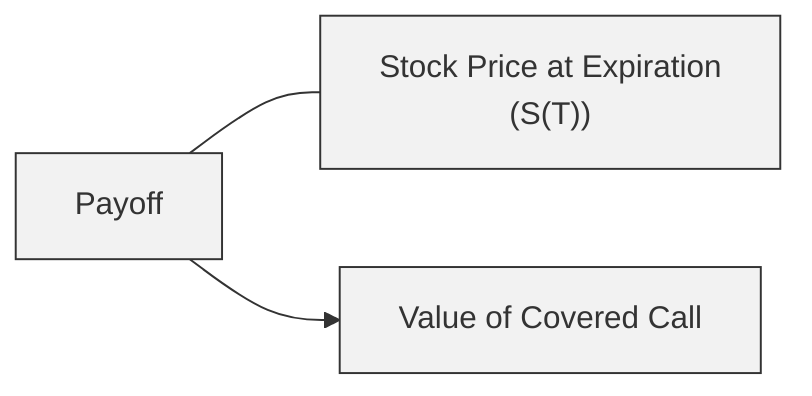
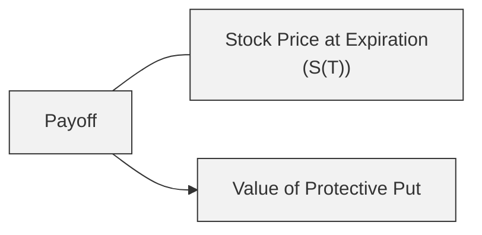

## Introduction

Covered calls and protective puts are two cornerstone strategies in options trading—often serving as the first foray into options-based risk management and yield enhancement for many investors. They combine long positions in the underlying asset with either selling (writing) or buying options, thereby tailoring a portfolio’s risk–return profile in a straightforward, mechanical way.

Truth be told, the first time I tried a covered call a while back, I was both excited and a bit nervous. I wanted to earn that extra income (the option premium) but also worried about having my stock called away if it soared. Similarly, when I started buying protective puts, I felt relieved to have a safety net for any substantial drop. Sound a bit familiar? If so, you’re not alone—these strategies are widely used exactly because they can help manage risk and produce additional cash flow, all in relatively easy-to-understand frameworks.

They do come with trade-offs, of course, and in this section we’ll explore the mechanics, payoff diagrams, potential applications, and best practices. We’ll analyze how to manage your covered call or protective put positions, highlight typical pitfalls, and give some final tips for exam scenarios. The goal is not only to show you how they work but to help you develop an intuition about when and why they might be useful—both for your exam prep and for real-world portfolio management.

## The Covered Call Strategy

### Core Concept

A covered call is established when an investor owns the underlying asset (long position in a stock—or possibly an exchange-traded fund or index) and simultaneously writes (sells) a call option on that same asset. The call option is said to be “covered” because, should the call buyer exercise the option, the seller already holds the underlying shares and can deliver them without having to purchase them in the market at (potentially) a higher price.

From a Level I exam perspective, it’s crucial to remember that the covered call’s payoff is simply the sum of two separate payoffs:
1. Long underlying.
2. Short call.

In a perfect no-arbitrage world (see Chapter 7 on Arbitrage, Replication, and Cost of Carry for more fundamental references), the covered call is akin to placing a cap on your upside in exchange for immediate premium income. Conceptually, you’re trading some potential future gains for current cash flow.

### Rationale and Basic Payoff

Why write a covered call? Typically, investors expect the underlying asset might trade sideways or perhaps move slightly higher but not skyrocket. You collect premium income (which you keep if the option expires worthless), and that premium can slightly offset small losses if the asset price declines. At the same time, if the stock rally is robust and pushes well above the call’s strike price, your gains are capped (beyond the strike plus premium).

Below is a simplified total payoff diagram for a covered call at expiration. “S(T)” will denote the underlying’s price at option expiration, and “K” the strike price of the written call.

Key payoff components:
• Long Stock: Gains or losses are linear as S(T) changes.  
• Short Call: The short call payoff is –max(S(T) – K, 0).  

Hence, the total payoff is:  
Covered Call Payoff = S(T) – [Short Call Loss if S(T) > K] + Premium Received

We can illustrate the payoff at expiration with a simple Mermaid diagram:

In a more detailed payoff diagram, you would typically see the lines reflecting a slight shift upward by the premium amount, but you would also see a plateau in gains past the strike price K (plus the premium).

### Simple Numerical Example

Let’s put some actual figures on it. Suppose you own 100 shares of XYZ Corp. at $50 per share. You write (sell) one call option on XYZ with a strike price of $55, receiving a $2 per share premium:

• Initial stock purchase price (cost basis): $50.  
• Premium received for call: $2.  
• Strike price: $55.  

At expiration:  
• If S(T) < $55: The call expires worthless. You keep your shares (which are now worth S(T)) and the $2 premium.  
• If S(T) > $55: The call will likely be exercised. You deliver the shares at $55, and keep the $2 premium collected when you wrote the call. Your maximum profit is capped at ($55 – $50) + $2 = $7 per share.  

And yeah, if the stock soars to $70 in a surprising bull run, you still must deliver the shares at $55, forgoing any upside beyond that. Hence the strategy’s trade-off: You lock in immediate premium income but potentially sacrifice big bullish gains.

### Risk–Return Trade-Off

Just because it’s called “covered” doesn’t mean you’re immune to losses. If the stock tumbles, the premium from the short call only provides a small offset to what could be a large negative stock return. For instance, if S(T) plummets to $30, you incur a $20 loss on the shares (from $50 down to $30) but keep the $2 premium, so your net loss is $18 on the position. In other words, you’re still exposed to significant downside risk—though you have a $2 cushion against that initial fall.

Thus, from a risk management standpoint, covered calls are generally considered mildly bullish or neutral strategies. You’re not particularly worried about missing out on a big upside move, and you want some small buffer in the form of premium income.

### Practical Considerations

• Time Decay (Theta): As expiration approaches, the call option’s time value decays. This decay can benefit you if the stock remains below the strike, helping your written option expire worthless.  
• Implied Volatility: Higher implied volatility means bigger option premiums, which can be attractive. But it also suggests the market anticipates greater price swings—meaning the underlying itself is more volatile.  
• Strike Selection: Choosing a higher strike capping your gains at a more distant price but receiving a smaller premium. Conversely, picking a lower strike yields a larger premium but increases the likelihood of early assignment and less upside.  
• Tax and Transaction Costs: If you’re forced to deliver shares at the strike, you could trigger capital gains (or create other tax considerations). Transaction costs also reduce your net premium.

## The Protective Put Strategy

### Core Concept

A protective put essentially insures your long stock position. You purchase a put option, giving you the right (but not the obligation) to sell the underlying shares at the put’s strike price. In exchange for paying the put premium, you gain downside protection below that strike. In a sense, it’s like paying an insurance premium to protect your car—you hope you never need it, but you’re glad it’s there if disaster strikes.

The protective put payoff is the sum of:
1. Long underlying
2. Long put option

This arrangement sets a floor under your potential losses. You still keep all the upside if the underlying rallies, but you lose the cost of the put premium if the market rises (or stays flat) and the put expires worthless.

### Payoff Illustration

If you let S(T) be the price of the underlying at expiration and K be the put strike price, the protective put payoff at expiration can be described as:

Protective Put Payoff = S(T) + max(K – S(T), 0) – Put Premium Paid

• If S(T) < K: The put is in the money. This allows you to sell your shares at K (rather than the market price S(T)), effectively limiting losses.  
• If S(T) > K: The put expires worthless, and you keep your stock. You do, however, forfeit the put premium.

Below is a simple Mermaid flow to illustrate the protective put structure:

In a traditional payoff diagram, the protective put strategy line will merge with the stock line on the upside, but it will flatten at the strike price K on the downside, minus the put premium, limiting how far the investment can fall in value.

### Numerical Example

Imagine you hold 100 shares of ABC Inc. at $40 per share. You decide to buy a put at a strike of $38 for $1 per share:

• Stock purchase: $40.  
• Put cost: $1.  
• Put strike: $38.  

Outcomes at expiration:  
• If S(T) collapses to $25, your put is in the money. You can exercise the put and sell the shares at $38, thereby limiting your loss to ($40 – $38) + $1 = $3 per share.  
• If S(T) rises to $50 and the put expires worthless, your final outcome is $50 – $40 = $10 profit on the shares, but you also spent $1 on the put. So your net profit is $9.  

One small note: if the underlying rallies substantially, you might regret paying that $1 put premium that never got used—akin to paying for auto insurance you (hopefully) never need. But the downside protection purchased can be an enormous relief if the stock plummets.

### Risk–Reward Considerations

Within your portfolio, a protective put is a bullish strategy with downside insurance. If your outlook is bullish but you’re worried about abrupt crashes or negative surprises, a protective put can mitigate those tail risks. The cost, of course, is the put premium, which reduces your net upside.

### Practical Considerations

• Premium Levels: High implied volatility on the put might make purchasing expensive.  
• Strike Selection: A higher strike might offer greater protection (i.e., less drawdown) but costs more.  
• Optimal Timing: Timing put purchases to coincide with times of relatively low implied volatility can improve cost effectiveness.  
• Rolling Strategies: Investors sometimes roll their protective puts, buying longer-dated puts or changing strike levels as the underlying price moves.

## Comparing Covered Calls and Protective Puts

Both strategies overlay an option position on an existing stock holding, but each serves a different primary purpose:

• Covered Call  
  – Best for: Mild or neutral bullish outlook.  
  – Income Generation: Yes—collect premium upfront.  
  – Downside Protection: Limited. The premium provides a small buffer.  
  – Upside Potential: Capped at the strike price if assigned.  

• Protective Put  
  – Best for: Bullish outlook but with hedging needs.  
  – Income Generation: None. Instead, you pay a premium.  
  – Downside Protection: Substantial—losses are limited below the put strike.  
  – Upside Potential: Preserved aside from the cost of the put.

In practice, many portfolio managers choose between these two based on risk tolerance, market outlook, cost constraints, and portfolio objectives. If you’re looking for some immediate yield boost and have a neutral or mildly bullish expectation, a covered call can be compelling. By contrast, if you’re worried about a big drawdown but still want unlimited upside, a protective put is probably better aligned with your needs—though you’ll pay for that peace of mind.

## Applications in Portfolio Management

1. Income Enhancement  
   • Covered calls can “monetize” a well-chosen equity portfolio that an investor is already satisfied holding. Even if the equity doesn’t move much, the premium can contribute significantly to returns.

2. Downside Hedge  
   • Protective puts are used by institutional money managers to secure a floor on portfolio losses, especially during times of market uncertainty.

3. Collar Strategy  
   • At times, investors combine covered calls with protective puts into a “collar”: you own the underlying, write a call, and buy a put. The call premium can help offset (fully or partially) the put cost, creating a more cost-efficient hedge.

4. Tactical Adjustments  
   • Shorter-term horizon: If you believe volatility will spike, you might want protective puts in place.  
   • Longer-term horizon: Consistent covered call writing can systematically reduce the effective purchase price of the underlying over time.

## Real-World Pitfalls and Best Practices

• Assignment Risk for Covered Calls: If the stock rallies sharply or the call goes deeply in the money, you might be assigned early (especially for calls on dividend-paying stocks). Check ex-dividend dates.  
• Overpaying for Puts: If implied volatility is high and you don’t calibrate your strike price, you can bleed away returns if the put’s premium is too large relative to your risk tolerance.  
• Liquidity Considerations: Thinly traded options can have wide bid-ask spreads, raising transaction costs and making efficient rolling more difficult.  
• Psychological Traps: After seeing short calls “work out” a few times in a sideways market, people sometimes forget that if the stock suddenly surges, they’ll miss out on significant gains. Similarly, if you repeatedly buy puts that expire worthless, you might question the cost, only to potentially skip protection right before the market plunges.  

## Exam Tips and Key Takeaways

• The covered call’s maximum gain is capped at the strike price plus the premium received.  
• The protective put limits your downside to (purchase price of underlying – put strike) plus the premium paid.  
• Know how to calculate break-even points:  
  – For the covered call: (Underlying Price – Premium) on the downside. On the upside, the break-even is effectively underlying price at initiation minus the premium (but profits are capped at strike + net premium).  
  – For the protective put: Your break-even is your underlying’s purchase price plus the put premium.  
• Be sure you’re comfortable with how time decay (Theta), changes in implied volatility (Vega), and delta exposures can affect each strategy’s performance during the life of the option.  
• Understand the difference between being assigned (covered call) vs. exercising your put (protective put).  
• In portfolio contexts (exam item sets might show an equity manager seeking partial downside protection or modest yield enhancement), be ready to interpret how these strategies fit the manager’s objectives.

## References and Further Study

• Reilly, Frank K., and Keith C. Brown. Investment Analysis & Portfolio Management. Thomson South-Western.  
• CBOE’s strategy papers on protective puts and covered calls:  
  https://www.cboe.com/strategies  

For a deeper discussion of portfolio-level hedging and advanced overlays, refer to Chapter 6 (Derivative Benefits, Risks, and Uses) on risk management considerations, and Chapter 4.9 (Greek-Based Hedging Strategies) to see how option greeks can be used to fine-tune the risk profile of covered calls and protective puts.

----------------------------

## Test Your Knowledge: Covered Calls and Protective Puts



### Which of the following best describes a covered call strategy?

- [ ] Purchase of a call and a protective put simultaneously.
- [x] Long underlying security, short call option.
- [ ] Long underlying security, long call option.
- [ ] Replicating the payoff of a long call using futures.

> **Explanation:** A covered call consists of owning the underlying stock (long) and selling (writing) a call option on that stock.

### Which statement about the payoff of a protective put is most accurate?

- [ ] The payoff is limited on both the upside and downside.
- [ ] The strategy generates premium income and offers downside protection.
- [x] It provides a floor on losses while preserving unlimited upside (minus the put premium).
- [ ] It eliminates all downside risk regardless of the put's strike price.

> **Explanation:** A protective put ensures that you can sell the underlying at the strike price if the market price falls below it, limiting losses while allowing for upside. You do pay the put premium, so your net upside is slightly reduced.

### In a covered call strategy with a strike price K, how is the maximum profit typically calculated?

- [x] (K – Initial Underlying Price) + Call Premium Received
- [ ] (K – Initial Underlying Price) – Call Premium Received
- [ ] (Initial Underlying Price – K) + Call Premium Received
- [ ] K + Call Premium Received

> **Explanation:** For a covered call, once the underlying price moves above K, the gains are capped. Hence, the maximum profit at expiration is (K – cost basis) + call premium collected.

### What happens if the underlying stock price finishes well above the call strike in a covered call strategy?

- [ ] The short call expires worthless, and you keep the stock and the premium.
- [x] The call is exercised, and you must deliver the stock at the strike, forfeiting further upside.
- [ ] The protective put kicks in to prevent losses.
- [ ] You’re forced to buy back the call at a premium.

> **Explanation:** The short call will typically be exercised by the option buyer if it is sufficiently in-the-money, capping your upside at the strike. You keep the premium but deliver shares at K.

### Which of the following outcomes is associated with a protective put strategy?

- [x] Unlimited potential gains, limited losses up to the put strike less the premium.
- [ ] Unlimited potential gains, unlimited losses.
- [x] Potential regret of paying for a put that was never used.
- [ ] Generation of upfront option premium income.

> **Explanation:** With a protective put, profits on the upside are generally unrestricted (except for the premium spent), but losses are limited below the put strike. The second correct choice refers to the possible disappointment about paying a premium if the put expires worthless.

### Why might an investor write a covered call?

- [x] To enhance yield on a stock expected to have modest appreciation.
- [ ] To protect from severe downside risk using long puts.
- [ ] To profit from an anticipated volatility spike in the underlying.
- [ ] To create a synthetic short position in the underlying.

> **Explanation:** A covered call is typically written when an investor prefers modest bullish exposure and desires to earn option premium if the stock remains relatively range-bound or rises slightly.

### Which statement about time decay (Theta) in covered calls is correct?

- [x] Time decay generally benefits the covered call writer if the call remains out of the money.
- [ ] Time decay is inconsequential for covered calls.
- [x] High Theta can help the call premium erode faster, favoring the option seller.
- [ ] In a covered call, you want time decay to be minimized.

> **Explanation:** For a short option, time decay usually works in your favor. The more time passes, the less time value remains in the call. If it’s out of the money, this erosion is beneficial to the seller.

### When is the cost basis of an underlying asset effectively reduced in a covered call strategy?

- [x] When the premium received offsets part of the original purchase price.
- [ ] When the underlying price moves above the original price for a short duration.
- [ ] When the call expires worthless, and implied volatility drops.
- [ ] There is no scenario in which the cost basis is reduced.

> **Explanation:** The net premium received reduces your effective cost in the underlying, offsetting part of your initial outlay.

### Under a protective put strategy, which factor can significantly increase the cost of protection?

- [x] High implied volatility.
- [ ] A narrow bid-ask spread in the options market.
- [ ] Low liquidity in the underlying stock.
- [ ] Historically stable markets.

> **Explanation:** High implied volatility raises the premium of the put, making downside protection more expensive.

### True or False: A covered call strategy is purely a bullish strategy with unlimited profit potential.

- [x] True
- [ ] False

> **Explanation:** A covered call is often considered a bullish strategy (or mildly bullish/neutral), but not purely “bullish” in the sense of unlimited profits—its profit potential is capped at the strike price plus premium. However, it’s typically deemed bullish-leaning compared to, say, an outright short position. The “unlimited profit potential” part is not correct, so the statement is somewhat tricky; the strategy is bullish in direction, but the profit is not unlimited. Be careful on the exam with these nuances—some references characterize it as a moderately bullish approach, but it does not have unlimited upside. (This question’s wording can be confusing, so practice reading carefully!)


