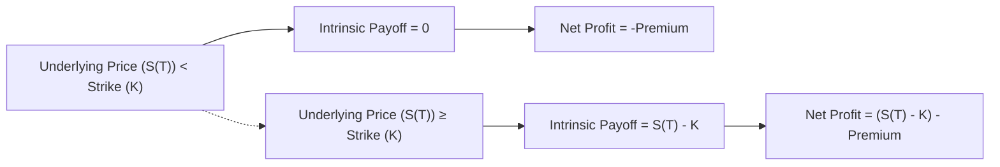

## Overview

Options can seem, well, a bit intimidating at first—especially if you’re grappling with multiple expiration dates, strike prices, and Greeks (hello, Δ, Γ, θ, and more). But once you understand how to piece together basic building blocks like calls and puts, you’ll see how certain configurations—option strategies—can help you target bullish, bearish, or even sideway market views. In other words, you get to fine-tune your exposure like a DJ spinning tracks to get the perfect vibe in a club.

Seriously, though, it’s an exciting topic because you gain more control over different market scenarios. In earlier sections, such as 4.1 Call and Put Options and 4.2 Intrinsic Value, Moneyness, and Time Value, we established the fundamentals. Here, we’ll talk about how to combine those fundamentals to create more advanced payoff profiles. Our lens will be on the payoff at expiration (though you can adapt these analyses to partial unwinds or early exercises for American options, as discussed in 4.3 European vs. American Options).

We’ll start with bullish, bearish, and neutral (or volatility-based) strategies. Then we’ll dive into multi-leg constructions, known as spreads. We’ll also cover straddles, strangles, and the wondrous butterfly spread. Finally, we’ll explore the power of payoff diagrams—linear or visually sketched graphs that map your profit (or loss) at different final underlying prices. Let’s dig in!

## Bullish Strategies

Bullish option strategies are designed to profit as the price of the underlying asset (like a stock or a commodity) goes up. You might think, “Why not just buy the stock?” That’s a fair question. But options can offer leverage (sometimes more than you might expect) or limited downside. Let’s unpack a few popular bullish strategies.

### Long Call

When you’re bullish on a stock, index, or even a futures contract, the simplest option strategy is to buy a call. If the underlying price zooms past your strike price, you can capitalize on that upside, minus the premium you paid. The payoff at expiration for a long call is:

Payoff = max(S(T) – K, 0) – Premium

• S(T) is the underlying’s price at expiration.  
• K is the strike price.  
• Premium is what you paid for the call.

Below the strike price K, the call finishes out-of-the-money (a zero intrinsic value). Above K, the payoff increases one-for-one with the underlying. However, note that your maximum loss is the premium paid, which definitely helps you sleep better if the market doesn’t go your way.

### Short Put

A short put is kind of a quirky one: it might not sound bullish, but it is. You effectively collect a premium now in exchange for the obligation to buy the underlying at strike K if the price falls below that level. Many folks (myself included) have used short puts to acquire stock at a “discount”—where the discount is the premium collected. If the market stays stable or rises, you keep the premium and move on.

However, watch your margin requirements. If S(T) goes below K, you’ll likely be obligated to buy the underlying at K (meaning you face potential losses if the underlying drops significantly). So short put is a bullish strategy but with considerable risk if things turn bearish unexpectedly.

### Bull Spread with Calls or Puts

Spread strategies are popular because they reduce net premium costs (compared to an unhedged long call) but cap your upside. A bull call spread involves buying a call at a lower strike while simultaneously writing (selling) a call at a higher strike. Net premium is reduced because you receive income from the short call. The trade-off is a ceiling on max profit, because above the short call’s strike, your profit no longer grows.

A bull put spread works similarly from the put side. You sell a put at a higher strike and buy a put at a lower strike. If the market stays above the higher strike, both puts expire worthless, letting you keep the net premium. Your worst-case scenario (and thankfully it’s limited) occurs if the underlying plunges well below the long put’s strike.

## Bearish Strategies

Now let’s flip the script. Bearish strategies profit when the underlying’s price declines. While a short position in the underlying is one approach, there are other creative ways to capture downside moves.

### Long Put

Buying a put option is the simplest way to express a bearish view with limited risk. If the underlying price plunges, your put payoff can grow significantly. But if the underlying rallies, the put just expires worthless and your maximum loss is the premium you paid. That’s not too bad, especially compared to short selling the stock outright, where your potential loss could be boundless if the stock soars.

### Short Call

A short call position involves collecting a premium up front. If the underlying remains at or below strike K, you keep that premium. However, this approach has theoretically unlimited risk to the upside (the underlying could skyrocket), so it comes with a ton of caution signs. And as a side note, if you already own the underlying, you have a covered call (discussed earlier in 4.4 Covered Calls), which is less risky.

### Bear Spread

Similar to bull spreads, bear spreads can be crafted with either puts or calls. One approach is the bear call spread: sell a call at one strike and buy another call at a higher strike. You want the market to stay below your short call’s strike, so both calls expire worthless, letting you keep the net premium. If the market rallies above your long call’s strike, your losses are capped because your purchased call offsets the short call’s risk.

A bear put spread involves purchasing a put at a higher strike and selling a put at a lower strike. If the underlying declines below the lower strike, you achieve a maximum payoff. But if the underlying goes up, your maximum loss is the net premium paid.

## Neutral (Volatility-Based) Strategies

Markets aren’t always trending. Sometimes they churn sideways. Other times, they are prone to wild swings (think earnings announcements, macroeconomic reports, or major geopolitical events). Option strategies exist to profit from both quiet and volatile markets.

### Long Straddle

A straddle involves buying a call and a put, each with the same strike and maturity. If you believe the price is going to make a big move but you’re not sure which direction (up or down), a long straddle might be your go-to. Sure, it might cost a decent premium to buy both options, but your gains can be large if the underlying breaks out strongly in either direction.

One of my friends tried a straddle on a biotech stock right before FDA approval results. He didn’t know if it would shoot up or collapse, so the straddle was a guess that implied volatility might be proven correct by reality. That day, the stock soared, and the call side generated enough profit to offset the put side’s loss (and then some). Keep in mind, though, that if the market remains flat, you lose money on both call and put premiums.

### Short Straddle

A short straddle is the opposite stance and a strategy for “nothing’s going to happen.” You generate premium income by selling both a call and a put at the same strike. But the risk is significant if the underlying makes a big move in either direction. This is sometimes done by advanced traders who anticipate low volatility or are targeting a narrow trading range. Margin requirements for short straddles can be hefty because of the unlimited potential loss on the call side.

### Strangle

A strangle is similar to a straddle but uses out-of-the-money calls and puts, typically to reduce overall premium cost. You might buy a call with a higher strike and a put with a lower strike than at-the-money. You’re still banking on big moves, but the underlying needs to move more significantly to offset the lower initial outlay. Like the straddle, you can short a strangle if you think the underlying will remain stuck in a range.

### Butterfly Spread

A butterfly spread (using calls or puts) can be used to profit from low volatility. It can be built long or short. Let’s say you see no major catalysts ahead and expect the underlying to hover around a particular price. One structure: buy 1 call at a low strike, sell 2 calls at a middle strike, and buy 1 call at a high strike. The symmetrical spacing of the strikes forms the “wings” of the butterfly. This strategy has a limited risk and offers a potential gain if the underlying ends up near the middle strike close to expiration. However, if the underlying moves too much in either direction, you typically realize a small or moderate loss, usually capped by the outer wings.

## Spreads and Their Mechanics

You might have noticed that many strategies are referred to as “spreads,” combining both a long and short position in related options. Spread strategies are powerful because:

• They can reduce net premium outlay (often helpful when implied volatility is high).  
• They can limit risk or define payoff ranges.  
• They allow you to express more specific market views about direction, volatility, or timeframe.

Spreads can be classified as vertical, horizontal, or diagonal:
• Vertical spreads: same expiration, different strikes.  
• Horizontal (or calendar) spreads: same strike, different expirations.  
• Diagonal spreads: different strikes and different expirations.

We love vertical spreads for straightforward bullish or bearish stances with limited risk. Calendar and diagonal spreads can be more advanced, often focusing on time decay and implied vol by combining near-month vs. longer-month options.

## Payoff Diagrams in Action

Payoff diagrams illustrate the profit or loss at expiration on the vertical axis and the underlying asset’s price on the horizontal axis. They’re a great visual tool if you’re more of a “Seeing is believing” type of learner.

Below is a simplistic example of how you might represent a long call payoff with a flowchart approach. It’s not a typical “curve chart,” but it shows the logic behind the scenes.



In a typical line chart representation, you’d see a flat line at –Premium for S(T) < K, then a 45° slope upward once S(T) exceeds K, offset by the premium. But this flowchart helps capture the main idea if you’re new to payoff diagrams.

### Another Example: Bull Call Spread

Let’s attempt a simple text description of a bull call spread’s payoff:
• You buy a call at strike K1, pay premium C1.  
• You write a call at strike K2, receive premium C2 (K2 > K1).  
• Net premium outflow = C1 – C2.  

At expiration:  
• If S(T) < K1, both calls expire worthless. Net profit = –(C1 – C2).  
• If K1 ≤ S(T) < K2, the long call is in the money, but the short call is still worthless. Net payoff = (S(T) – K1) – (C1 – C2).  
• If S(T) ≥ K2, the long call makes (K2 – K1), but the short call costs you (S(T) – K2). The net difference is (K2 – K1). Subtract the net premium (C1 – C2) for your final profit.

Commission costs and slippage matter in multi-leg trades. You’ll often pay multiple transaction fees. So it’s wise to factor that in (plus any bid–ask spread friction if you’re not a market maker).

## Practical Considerations

• Commissions: Multi-leg strategies can rack up fees if you pay a commission per contract leg.  
• Margin: Short options often have margin requirements.  
• Slippage: Wide bid–ask spreads on illiquid options can erode expected profits.  
• Implied Volatility (IV): A major driver of option premiums (and potential mispricing).  
• Time Decay (Theta): Especially pivotal for short strategies, such as short straddles, or “theta-positive” spreads.  

I once tried a short strangle on a small-cap stock. The implied volatility was sky-high, but I was confident it wouldn’t move. I collected a sweet premium. Then, earnings came out—super surprise—and the stock went ballistic. Let’s just say I learned the difference between “high premium” and “sufficient compensation for risk” the hard way.

## CFA Exam Tips

For the exam, be prepared to:
• Differentiate among bullish, bearish, and neutral strategies, including their payoff functions.  
• Calculate payoff and profit at expiration, especially under multiple final underlying prices (e.g., below one strike, between strikes, above the next strike).  
• Recognize how time decay and implied volatility shifts can affect multi-leg strategies.  
• Sketch or interpret basic payoff diagrams. You might see a question that shows you a payoff diagram and asks which strategy is represented.  
• Factor in transaction costs and potential margin.  
• Identify typical misapplications or pitfalls (like ignoring margin calls or forgetting that short calls have unlimited risk).

Throughout this Level I derivative coverage, keep refreshing your knowledge of the underpinnings: the impact of intrinsic and time value (Section 4.2) and the difference between American and European options (Section 4.3). The better you understand these fundamentals, the more comfortable you’ll be with combining options into profitable, or at least carefully structured, positions.

## Python Snippet: Calculating a Simple Straddle Payoff

Just for fun, here’s a short Python snippet to calculate a straddle payoff at multiple potential underlying prices:

```python
import numpy as np

def long_straddle_payoff(underlying_prices, strike, call_premium, put_premium):
    payoff = []
    for s in underlying_prices:
        call_intrinsic = max(s - strike, 0)
        put_intrinsic = max(strike - s, 0)
        payoff.append(call_intrinsic + put_intrinsic - (call_premium + put_premium))
    return payoff

prices = np.arange(80, 121, 5)  # hypothetical range of underlying prices
strike_price = 100
call_cost = 5
put_cost = 4
results = long_straddle_payoff(prices, strike_price, call_cost, put_cost)

for p, r in zip(prices, results):
    print(f"Underlying: {p}, Payoff: {r}")
```

This script is super basic: it’s just a loop through possible underlying prices, computing the intrinsic value of a call and a put with the same strike, then subtracting your combined premiums.

## Personal Anecdote

I remember one of my first experiences advising a new options trader. They heard about the wonders of selling straddles for “easy income.” But they opened a short straddle on a high-volatility tech stock right before its earnings release. Huge premium, sure. But the next morning, results were surprisingly good (or maybe surprisingly bad, I don’t recall the details). The stock’s reaction was violent, and that “easy income” ended up as a large realized loss. It taught both of us that while strategies can look straightforward on a payoff diagram, real-life volatility can unravel them quickly. Implied volatility is not to be taken lightly—nor is your margin call. Lesson learned!

## References

• Kolb, Robert W. “Futures, Options, and Swaps.” Wiley.  
• Options strategy guides from Interactive Brokers, TDAmeritrade, and other major brokerages.  
• Academic journals on implied volatility, such as The Journal of Finance.  
• Earlier sections of this volume (4.1–4.4) for fundamentals of calls, puts, and moneyness.  
• Chapter 6.3 Derivative-Related Risks to understand the operational risks hidden behind these strategies.  

## Test Your Knowledge: Option Strategies and Payoff Diagrams



### Which of the following best describes the payoff at expiration for a long call?

- [ ] It is unlimited on the downside and capped on the upside.  
- [ ] It is capped on both the upside and the downside.  
- [ ] It has a maximum profit equal to the premium collected.  
- [x] It is limited to the premium paid on the downside and increases without bound on the upside.  

> **Explanation:** A long call’s maximum loss is the premium paid, while its upside is theoretically unlimited.

### A bull call spread is constructed by:

- [ ] Buying a put and selling a put, both with different strikes.  
- [ ] Selling a call at a lower strike and buying a call at a higher strike.  
- [x] Buying a call at a lower strike and selling a call at a higher strike.  
- [ ] A call and a put with the same strike and expiration.  

> **Explanation:** A bull call spread involves purchasing a call with a lower strike while writing one with a higher strike, aiming for a moderate bullish stance with limited risk and limited profit.

### In a long straddle, what outcome generates a loss?

- [ ] A large upward movement in the underlying price.  
- [ ] A large downward movement in the underlying price.  
- [x] The underlying price remains near the strike at expiration.  
- [ ] Any price movement, up or down.  

> **Explanation:** The long straddle profits if the underlying makes a sizeable move in either direction. A flat outcome near the strike price leads to losing the premiums paid.

### Which statement is true about a short put position?

- [ ] It has unlimited profit potential if the underlying rises significantly.  
- [x] The investor earns a premium and may be obligated to buy the underlying at the strike.  
- [ ] It can protect an existing short stock position.  
- [ ] It is a strongly bearish strategy.  

> **Explanation:** A short put earns premium income but comes with the obligation to purchase the underlying at the strike price, which is a mildly bullish stance.

### A butterfly spread typically:

- [ ] Has unlimited gain potential on both sides of the market.  
- [x] Profits when the underlying remains near a middle strike.  
- [ ] Profits from large movements in the underlying’s price.  
- [ ] Is constructed only by buying puts at multiple strikes.  

> **Explanation:** A butterfly spread is generally a low-volatility strategy that involves a middle strike and two outer “wings.” It profits if the underlying is near that middle strike at expiration.

### A short straddle has substantial risk because:

- [ ] The total premium collected is always negative.  
- [x] The underlying can move sharply either up or down, creating large losses on the sold call or sold put.  
- [ ] It expires worthless if volatility remains high.  
- [ ] It is primarily a speculative bullish strategy.  

> **Explanation:** Selling both a call and a put without ownership of the underlying can lead to large losses if the market breaks out in any direction.

### Which of the following best describes a bear call spread?

- [ ] Buying a call with strike K1 and buying another call with strike K2, where K2 > K1.  
- [ ] Selling a put at strike K1 and buying a call at strike K2.  
- [ ] Selling a call with a lower strike and buying a call with a lower strike.  
- [x] Selling a call with strike K1 and buying a call with strike K2, where K2 > K1.  

> **Explanation:** A typical bear call spread is created by selling a call at one strike and buying another call at a higher strike, aiming for a net credit. The maximum profit is the net premium.

### When implementing a bull put spread, an investor wants:

- [ ] The underlying to move sharply higher or lower.  
- [x] The underlying to stay above the higher (sold) put strike.  
- [ ] The underlying to end up right between the two put strikes.  
- [ ] To buy back the short put at a higher price if the underlying falls.  

> **Explanation:** In a bull put spread, you sell a put at a higher strike and buy a put at a lower strike. You profit if the market remains above the sold put strike at expiration.

### In which situation would a long strangle be most profitable?

- [ ] A stable market with low volatility.  
- [x] A market expected to move significantly, but unsure of direction.  
- [ ] A declining market over a small price range.  
- [ ] A bullish market with moderate price appreciation.  

> **Explanation:** The long strangle (buy OTM call + buy OTM put) benefits from large movements up or down. If the market is stable, both options are likely to expire worthless.

### For a bull call spread, the maximum profit occurs when:

- [x] The underlying price is above the higher strike at expiration.  
- [ ] The underlying price remains at or below the lower strike.  
- [ ] The underlying price is between the two call strikes.  
- [ ] The underlying price collapses.  

> **Explanation:** A bull call spread reaches maximum profit if the underlying price finishes above the short call’s strike, so the net payoff is (K2 – K1) – net premium.


