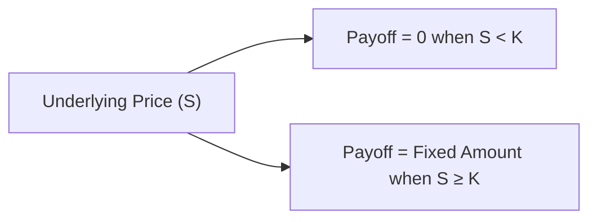
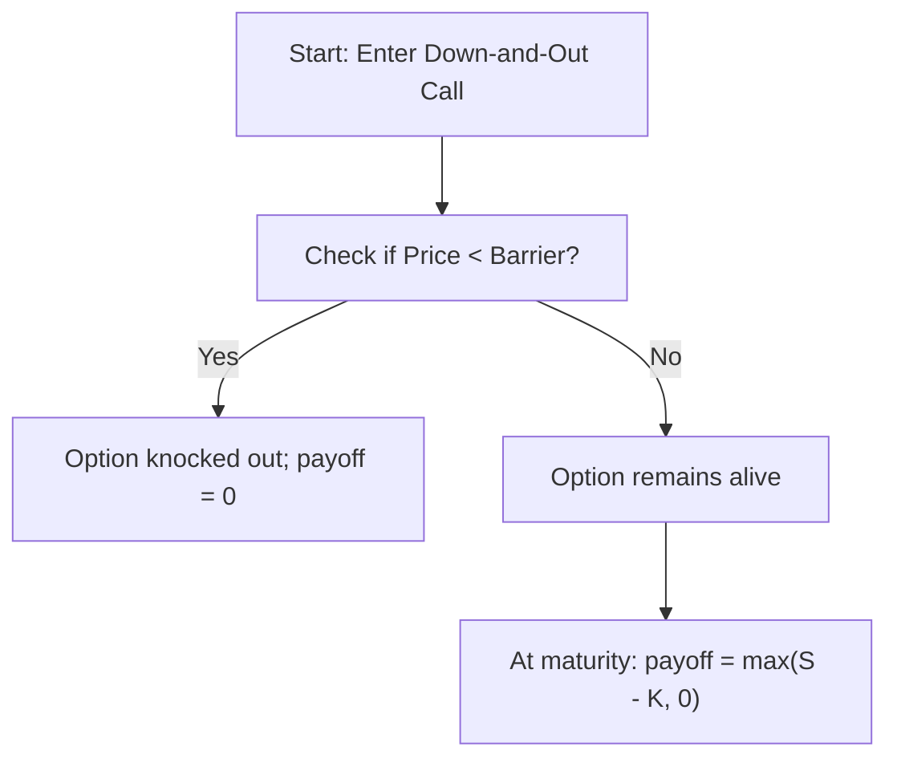

## Overview

Exotic options can sometimes sound, well, a little “out there.” I remember the first time I encountered barrier options—it felt like stepping into a foreign land after getting comfortable with the more common “plain vanilla” calls and puts. But once you expose yourself to these interesting payoffs, you realize there’s a whole world of risk management and speculative opportunities that just aren’t possible with standard European or American options.

In this section, we focus on three major categories of exotic options: binary (digital) options, barrier options, and Asian (average-rate) options. They are typically offered in the over-the-counter (OTC) market—meaning they can be deeply customized in their structure, payoff features, and settlement methods—and they often require more advanced pricing and valuation models. By the end of this discussion, you’ll see why these exotics can be so appealing to both risk managers and, yes, a few die-hard speculators as well.

Before we dive in, remember that if you need a refresher on option basics, payoff diagrams, or their fundamental mechanics, you might want to revisit Sections 4.1 through 4.3, where we introduced calls, puts, and the distinction between European and American exercise styles.

## Binary (Digital) Options

### Concept and Payoff
A binary (or digital) option is conceptually one of the simplest exotic options—sometimes it’s so simple that it almost feels more like a bet. A typical binary call option pays out a fixed amount of cash if the underlying price is above a specified strike at expiration, and zero otherwise. For a binary put, the payoff is the exact opposite. There is no continuous range of payoff like with a vanilla call (where payoff = max(S - K, 0)). Instead, you either get it all or nothing when the expiration day arrives.

- Cash-or-Nothing Binary Call: Pays a fixed cash amount (e.g., $1 or \$100) if S(T) > K at maturity, and $0 otherwise.
- Cash-or-Nothing Binary Put: Pays a fixed cash amount if S(T) < K at maturity.
- Asset-or-Nothing Binary Call: Pays one unit of the underlying asset if S(T) > K, otherwise zero.
- Asset-or-Nothing Binary Put: Pays one unit of the underlying asset if S(T) < K, otherwise zero.

The key difference between the “cash-or-nothing” and “asset-or-nothing” binaries is that the latter typically requires the seller (or writer) to deliver the underlying asset if the option finishes in the money (ITM). This type could be relevant if you want direct ownership of the underlying when a triggering event occurs.

Binaries often trade in currency markets, where short-term bets on economic releases (like nonfarm payroll announcements) can be made. In these cases, it’s either “win big if the data come in your favor” or “walk away empty-handed.”

### Uses and Applications
1. Speculation: Traders can use binary options to speculate on short-term price movements without paying high premiums for standard calls and puts. If you believe a stock will be above \$100 by the end of the week, a binary call can provide a relatively cheap way to gain leveraged exposure.

2. Hedging: Occasionally, a hedger might prefer a security that fully offsets a loss if a particular level is breached but doesn’t require the granularity of payoff that standard options provide. For instance, a portfolio manager might say, “If the market breaks below 3,600 on this index, that’s my worst-case scenario for the quarter, so I want a big payoff if that happens.”

3. Event-Driven Trading: Think of major economic data releases, corporate earnings announcements, or central bank rate decisions. Traders might use binary options to bet on whether interest rates will be raised or not. If the event occurs, they receive a fixed payoff; if not, they lose only the premium.

### Payoff Diagram

Below is a simple payoff diagram for a cash-or-nothing binary call with strike K. Notice that unlike a vanilla call payoff, this jumps to a fixed payoff at strike K and remains constant once in-the-money.



On the x-axis is the underlying price at expiration, while the y-axis is the payoff. The graph is literally a step function: zero below K and a constant payoff above K.

## Barrier Options

### Definition and Types
Barrier options add a kind of “trapdoor” mechanic to the usual payoff. They either activate (knock in) or extinguish (knock out) once the underlying’s price crosses a certain threshold (the barrier). Like a labyrinth in a fantasy novel, if you open the right door at the right time, the payoff changes dramatically.

Two main ways these are structured:

1. Knock-In Options  
   - Up-and-In: Becomes active only if the price of the underlying moves above a certain barrier.  
   - Down-and-In: Becomes active only if the price of the underlying falls below a certain barrier.

2. Knock-Out Options  
   - Up-and-Out: Standard payoff unless the underlying moves above the barrier, at which point the option is canceled.  
   - Down-and-Out: Standard payoff unless the underlying moves below the barrier, which invalidates the contract.

### Rationale
Why do traders use these “conditional” structures? One perspective is cost savings—barrier options often carry lower premiums than their vanilla counterparts because there’s a chance they might never come into existence (or get knocked out) and thus never pay anything. Another perspective is that you can target a particular zone of price movement more precisely. For instance, if you only want a payoff if the asset price climbs above a notable resistance level, an up-and-in option might be perfect.

### Example
Imagine you have a Down-and-Out call on a commodity with a barrier at \$80 and a strike of \$100. If the commodity price dips below \$80 at any time up to expiration, the option ceases to exist, effectively “knocking out.” If it stays above \$80, your call payoff is still in play at expiration. The advantage: you’d likely pay a cheaper premium compared to a standard vanilla call, since there is a risk that the option might vanish if \$80 is breached.

### Payoff Diagram Approach
Barrier option payoffs are trickier to illustrate in a single, simple diagram because they depend on the path the underlying takes before expiration. However, you can imagine layering a standard option payoff diagram with a conditional region that states, “If underlying touches or crosses B (the barrier), the payoff changes to zero,” (knock-out) or “the payoff is zero unless the barrier is touched,” (knock-in).

Below is a conceptual flow diagram for a Down-and-Out call that demonstrates how the option might be “alive” until hitting the barrier:



## Asian (Average Rate) Options

### Concept and Payoff
An Asian option’s payoff is determined by the average price of the underlying asset over a specified period, rather than the final price at expiration alone. This can be the average of:

• Daily prices over the option’s life,  
• Weekly or monthly sampled prices,  
• A combination of discrete points or a continuously observed average.

The final settlement is typically max(Average Price - K, 0) for an Asian call, or max(K - Average Price, 0) for an Asian put, if we’re dealing with a standard “arithmetic average” style. Some Asian options use a geometric average or a combination of both. By incorporating averaging, these options reduce the impact of big price swings near expiry.

### Why Choose an Asian Option?
1. Reduced Volatility Exposure: Because the payoff relies on an average, single-day spikes or collapses in price carry less weight. This smoothing effect can be attractive for hedgers who want more stable outcomes.

2. Commodity Hedging: Corporations that buy or sell commodities might want a hedge that reflects their average purchase price over the month rather than a single day. For example, an airline might buy fuel weekly, so an Asian option on jet fuel can hedge the average cost over each quarter.

3. Reduced Premium: Generally, an Asian option can sometimes be cheaper than an otherwise-equivalent vanilla option, because the averaged payoff is less volatile. Less volatility → lower option cost ceteris paribus.

### Example
Consider an investor who expects that a stock’s average price over the next three months will be comfortably above \$50, but isn’t entirely sure about end-of-period volatility. They might buy an Asian call with a strike of \$50, where the strike is compared against the average price from the first day to the last. If the average is \$55, the payoff is \$5. If the average stays below \$50, there’s no payoff.

## Pricing and Valuation Approaches

Exotic options require more intricate pricing techniques than the straightforward Black–Scholes–Merton (BSM) formula typically used for European calls and puts. Some require path-dependent modeling, because the payoff depends on how the underlying price evolves throughout the life of the option.

### Path-Dependent Methods
1. Binomial Models with Path Dependency: You could replicate the underlying price movements through a discrete tree that records whether certain barriers are hit or not. This gets complicated quickly as you add more time steps—but it’s doable.

2. Monte Carlo Simulation: Randomly simulate numerous paths for the underlying, incorporating assumptions about volatility, drift, and potential jumps. For each simulated path, compute the payoff. Then, discount your average payoff back to present value. Monte Carlo is a popular go-to for exotic derivatives because it’s flexible. However, it can be computationally expensive, especially for high precision or complex payoffs like barrier with early knock-in provisions.

3. Finite Difference Methods: These solve the partial differential equations (PDEs) that underlie derivative pricing. For those who recall advanced mathematics, the PDE approach can be tailored to barrier conditions or average conditions. That said, it can become quite specialized.

### Simple Python Example for an Asian Option (Arithmetic Average)
Below is a brief Python snippet (purely illustrative, so please don’t stake your entire portfolio on it) that does a quick Monte Carlo approach to price a simple arithmetic-average Asian call. You can tweak parameters like volatility (sigma), risk-free rate (r), strike (K), and so on:

```python
import numpy as np

def asian_call_monte_carlo(S0, K, r, sigma, T, steps, sims):
    dt = T/steps
    payoffs = []
    for _ in range(sims):
        prices = [S0]
        for __ in range(steps):
            z = np.random.normal()
            S_next = prices[-1] * np.exp((r - 0.5*sigma**2)*dt + sigma*np.sqrt(dt)*z)
            prices.append(S_next)
        average_price = np.mean(prices)
        payoffs.append(max(average_price - K, 0))
    return np.exp(-r*T)*np.mean(payoffs)

np.random.seed(42)
mc_price = asian_call_monte_carlo(S0=100, K=100, r=0.05, sigma=0.2, T=1.0, steps=252, sims=10000)
print("Monte Carlo Price Estimate for Asian Call:", mc_price)
```

This code:
1. Simulates random price paths with geometric Brownian motion.  
2. Calculates the arithmetic average of each path’s prices.  
3. Applies the payoff max(average_price - strike, 0).  
4. Discounts by e^(-rT).  

For barrier or binary options, you’d add logic to check if the barrier was breached or whether the final price ended above/below the strike at the end.

## Practical Uses and Real-World Scenarios

1. **Foreign Exchange (FX)**  
   - Corporates frequently face currency risk for cross-border transactions. An Asian FX option ensures the hedge premium is tied to an average exchange rate over time, mitigating single-day currency spikes.  
   - Barrier options are widely used too. An importer might buy a knock-out USD call if they believe the currency won’t strengthen (above some barrier) too sharply. If it does, the hedge is kicked out.

2. **Commodity Markets**  
   - Many producers face the risk that prices might plummet below a certain level. They might use up-and-in or down-and-out structures to reduce premium costs.  
   - Asian options are especially popular for energy commodities that are subject to cyclical or seasonal fluctuations.

3. **Structured Products**  
   - Financial institutions design custom yield-enhancement products for private wealth clients, often embedding barrier or digital payoffs to achieve certain desired yield profiles.  
   - “Step down” notes might have a barrier that cancels the note if the underlying index hits a particular price.

4. **Hedging Corporate Cash Flows**  
   - Retailers paying for imported goods might prefer an Asian call on currency pairs if they know roughly how much they’ll pay in foreign currency over a month.  
   - Large corporations might attach barrier or knockout features to reduce upfront premium.

## Key Advantages and Risks

### Advantages
- **Customization:** Barrier features, digital payoffs, and averaging allow corporations and traders to target specific market scenarios more precisely.  
- **Lower Premium for Barrier:** You pay less if there’s a risk the option might knock out.  
- **Payment Certainty for Binaries:** Hedgers and speculators can get a defined risk/reward structure.

### Risks
- **Path Dependence:** For barrier and Asian options, ignoring the underlying price path can lead to mispricing or mis-hedging.  
- **Liquidity and Marking to Market:** Exotic options may be thinly traded. Valuations can become highly model-dependent, making marking to market or obtaining daily quotes challenging.  
- **Counterparty Risk:** Because these are often OTC products, the credit risk of the counterparty might be non-negligible.  
- **Complexity:** Additional principles like barrier triggers and averaging periods can lead to major confusion if the payoff structure isn’t carefully documented.

## Best Practices and Pitfalls

- **Documentation:** Keep crystal-clear terms in confirmations about how the barrier is monitored (continuous or discrete?), how the average is calculated (arithmetic or geometric?), and any holiday or market closure adjustments. 
- **Partial Barrier Observations:** Sometimes the barrier is only active during certain “observation” windows. Check the details to avoid expensive misunderstandings.
- **Hedging Complexity:** Market participants who try to dynamically hedge barrier options may face “delta jumping” when the barrier is close. This can cause abrupt changes in hedge ratios. 
- **Regulatory Rules:** Under IFRS or US GAAP, the special features of exotics might complicate hedge accounting. Understand whether these qualify for hedge accounting treatment or not, and see Chapter 6.12 for an overview on Hedge Accounting Considerations.

## Exam Tips and Strategies

• Be ready for scenario-based questions that test “knock-in,” “knock-out,” or “averaging” triggers. Avoid superficial memorization; you want to deeply understand how payoffs differ from standard calls or puts.  
• Practice a few quick path-dependent payoff calculations, especially how to handle step-by-step barrier checks or average calculations.  
• You might see short-answer or structured response tasks requiring you to compare a vanilla option’s premium to a barrier option’s premium, or to articulate key differences in risk exposures.  
• For conceptual questions, remember that binary calls/puts create an “all or nothing” payoff, while barrier options can vanish or appear, and Asian options mitigate sudden price spikes. Summarizing these distinctions clearly can earn you partial credit even if your final numeric approach is incomplete.  
• Should you get a complex derivative scenario, break it down methodically: identify if it’s a binary, barrier, or Asian structure, specify key parameters (barrier level, averaging period), then evaluate if it’s path-dependent or path-independent.

## Glossary

• Binary (Digital) Option: All-or-nothing payoff upon expiration if the underlying is above (call) or below (put) a strike price.  
• Barrier Option: A derivative whose payoff is “activated” (knock-in) or “extinguished” (knock-out) if the underlying breaches a certain price level (the barrier).  
• Asian Option: An option whose payoff is based on the average price of the underlying across a certain period.  
• Knock-In/Knock-Out: Terms used in barrier options. Knock-in means the option only comes into existence after the barrier is breached; knock-out means the option is terminated if the barrier is breached.

## References and Further Reading

- Wilmott, P. (2006). Paul Wilmott on Quantitative Finance (2nd ed.). Wiley.  
- Haug, E. G. (2007). The Complete Guide to Option Pricing Formulas (2nd ed.). McGraw-Hill.  
- Global Derivatives Conference Proceedings (various years).  
- For further foundational reading, revisit “Chapter 4: Options and Contingent Claims,” Sections 4.1–4.5 in this Volume.

----

## Practice Questions: Exotic Options Mastery



### Which of the following best describes a cash-or-nothing binary call option?

- [x] It pays a fixed amount if the underlying's price is above the strike at expiration.
- [ ] It pays the underlying asset if the barrier is not breached.
- [ ] It provides an average payoff based on the underlying price.
- [ ] It behaves exactly like a vanilla European call.

> **Explanation:** A cash-or-nothing binary call pays a fixed amount if the underlying's price ends above the strike at expiration, regardless of how far above it is.

### When does a down-and-in barrier option become activated?

- [ ] If the underlying price moves above a predetermined barrier.
- [x] If the underlying price drops below a predetermined barrier.
- [ ] Whenever the underlying price does not reach the barrier at all.
- [ ] Only at expiration if the price is below the strike price.

> **Explanation:** A down-and-in option “knocks in” (becomes active) only if the underlying price moves below the specified barrier level before or at expiration.

### Which of the following benefits does an Asian option provide compared to a standard option?

- [x] It reduces the effect of extreme price movements near maturity by using an average.
- [ ] It eliminates the need for hedging altogether.
- [ ] It increases the leverage relative to a vanilla option.
- [ ] It ensures continuous pricing throughout the contract’s life.

> **Explanation:** Asian options average the price over a certain period, smoothing out extreme movements. They do not necessarily eliminate the need for hedging, nor do they always increase leverage.

### Suppose you have an Up-and-Out call option with a barrier of 120. Which situation cancels the option?

- [x] The underlying touches or exceeds 120 before expiry.
- [ ] The underlying slips below 120 at any point before expiry.
- [ ] The underlying ends at 120 at maturity.
- [ ] The barrier is never breached.

> **Explanation:** An Up-and-Out option knocks out (gets canceled) if the underlying price moves up to or beyond the barrier level.

### Which statement is generally true regarding the premiums of knock-out barrier options compared to vanilla options?

- [x] Knock-out options often have lower premiums because there is a higher chance of losing the payoff if the barrier is reached.
- [ ] Knock-out options usually have higher premiums because of their path dependence.
- [ ] Premiums for knock-out options are identical to vanilla options under no-arbitrage.
- [ ] Knock-out options typically have infinite premiums.

> **Explanation:** Knock-out features reduce the chance of a payoff, so investors generally pay less premium compared to vanilla calls or puts that remain alive under all conditions.

### In practice, which method is often used to price Asian options due to their path-dependent nature?

- [x] Monte Carlo simulation with the average price computed at each path.
- [ ] Closed-form solutions identical to the Black–Scholes–Merton model.
- [ ] Simple one-step binomial trees.
- [ ] Linear regression analysis on only final prices.

> **Explanation:** Asian options commonly require path-dependent pricing approaches such as Monte Carlo. One-step binomial trees are too simplistic, and while there are some specialized formulas for certain types of Asian options, Monte Carlo is a flexible go-to.

### Which of the following statements is most accurate concerning binary options?

- [x] They may offer a fixed cash payout if the option expires in-the-money.
- [ ] Their payoff continuously increases as the underlying price increases.
- [x] They often carry the same premium pricing as standard options.
- [ ] They cannot be used for hedging.

> **Explanation:** Generally, binary options provide a fixed “all or nothing” payout if the underlying ends past a certain threshold. They differ from standard options whose payoff grows with the underlying’s price. They can be used for certain hedges, although they are more commonly used for short-term speculation.

### How does a knock-in barrier option typically compare in premium to a standard vanilla option?

- [x] It usually has a lower premium because the payoff exists only if the barrier is reached.
- [ ] It always has a higher premium due to additional complexity.
- [ ] It mirrors the premium of vanilla options unless interest rates are zero.
- [ ] The premium is determined solely by the strike price, regardless of barriers.

> **Explanation:** A knock-in option only becomes effective if the barrier is hit, which means there’s a chance it never activates. This decreased probability of payoff typically lowers its premium compared to a vanilla option.

### What is the main advantage of an Asian option to hedgers?

- [x] It reduces the risk of day-to-day price volatility known as “spot shocks.”
- [ ] It allows for immediate exercise at any time.
- [ ] It has zero time value decay.
- [ ] It doubles the payoff if triggered.

> **Explanation:** By averaging the underlying's price over a period, Asian options help reduce the impact of short-lived volatility spikes, which is particularly beneficial for hedgers looking for a smoother price over time.

### True or False: Barrier options can only be knocked in or knocked out on the final day of trading.

- [x] True
- [ ] False

> **Explanation:** Actually, this can be a bit tricky, because some barrier options require continuous monitoring. However, many practice questions or standard setups assume the barrier condition can be triggered (knocked out or knocked in) at any time up to maturity. The question as stated is often stylized in some exam contexts, so “True” in the sense that you can specify your barrier window to be up to the final day (though real-world contracts can be more nuanced).


