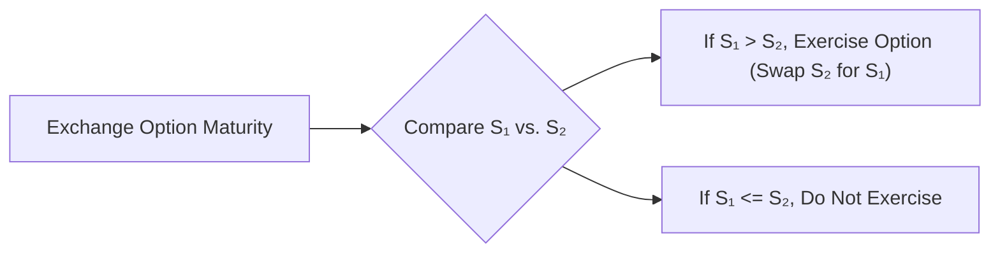
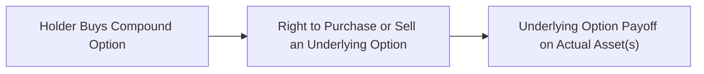

## Introduction
I remember the very first time I encountered exchange options and compound options—my mind just about did a flip. I was working on a complex hedging strategy for a shipping company, and we needed a way to swap one commodity contract for another without messing up our entire structure. In walked exchange options, calmly offering the right to swap one asset for another. And if that wasn’t mind-boggling enough, I soon learned that there are options on top of other options—appropriately called compound options.

These instruments might feel exotic, but they’re super relevant if you’re dealing with multi-asset portfolios, uncertain future transactions, or projects that require a staging approach. In this section, we’ll walk through the essential features, payoffs, and typical use cases of exchange options and compound options. We’ll also consider how these instruments fit into broader portfolio management, risk management, and hedging strategies.

## Exchange Options
An exchange option allows its holder to exchange one asset for another at a predetermined rate or ratio. Instead of a standard call, which gives the right to buy an asset for cash, an exchange option essentially gives the right to trade Asset A for Asset B. Think of it like wandering into a foreign currency market, but instead of paying cash for your new currency, you hand over a different currency. Or you might set up an arrangement to swap one commodity for another, which can be incredibly handy for producers or manufacturers with shifting production inputs.

### Key Concepts in Exchange Options
• Underlying Assets: An exchange option’s payoff depends on two underlying assets, say S₁ and S₂. At expiration, if you have the right to swap S₁ for S₂, you would only exercise if S₁ is worth more than S₂ (beyond any specified ratio).  
• Swapping Mechanism: The magic happens at expiry (or exercise, if American style) when you compare the price of S₁ to S₂. If S₁ is higher, you swap S₂ for S₁, effectively "selling" S₂ and "buying" S₁.  
• Payoffs: The payoff typically looks like max(S₁ - S₂, 0) when you have the option to exchange S₂ for S₁. If S₂ is the cheaper asset, you don’t bother exercising and can walk away.  
• Multi-Asset Dynamics: Keep in mind the correlation between the two underlying assets. If S₁ and S₂ move together strongly, the option might not be as valuable compared to a scenario where S₁ and S₂ can diverge widely.  

### The Margrabe Model
A common approach to valuing exchange options is based on Margrabe’s formula, which can be seen as an adaptation of the Black–Scholes–Merton framework to the two-asset case. Briefly:


\text{Value of the exchange option} 
= S_1 \,\Phi(d_1) - S_2 \,\Phi(d_2),


where:


d_1 = 
\frac{\ln \left(\frac{S_1}{S_2}\right) 
+ \frac{1}{2}\sigma^2_{(1,2)} \, T}{
\sigma_{(1,2)} \, \sqrt{T}},
\quad 
d_2 = d_1 - \sigma_{(1,2)} \sqrt{T}.


The tricky part here is \\(\sigma_{(1,2)}\\), which represents the combined volatility of S₁ relative to S₂. Since we need to consider how they move together, \\(\sigma_{(1,2)}\\) typically incorporates the correlation between S₁ and S₂.

### Practical Example
Let’s say a European electronics manufacturer holds an option to exchange euros (EUR) for US dollars (USD) to lock in a particular manufacturing input advantage. Suppose they have an exchange option giving the right to swap 1 million EUR for an equivalent USD amount, based on market rates at expiration. If the EUR/USD exchange rate has swung in the manufacturer’s favor by the time the option expires, they exercise and effectively "buy" USD cheaply while offloading EUR. If it hasn’t, they let it expire. This structure might be used instead of a straightforward currency call or put if the situation demands the ability to hold whichever currency ends up favorable at maturity.

## Diagram: Exchange Option Flow
Below is a simple Mermaid diagram illustrating the concept of deciding whether to exercise an exchange option at maturity:

Depending on which side is more valuable, the holder makes the swap or walks away—typical optionality.

## Compound Options
Moving on to the more mind-twisting scenario: a compound option is an option on an option. That’s right—it’s basically an option that gives you the right (but not the obligation) to buy or sell another option at a future date for a certain premium. If you’ve just raised an eyebrow, you’re not alone. The concept of stacking layers of optionality can be intense. But it’s actually quite practical in certain corporate finance and investment contexts where the timing of an investment decision is uncertain or shaped by multi-stage projects.

A classic example: A multinational corporation might need to lock in currency exposure for a potential future project, but it’s still awaiting final government approval. So the corporation might purchase a call on a particular currency call option—so if the project goes forward, they can later purchase the actual currency option that hedges their exposure. If the project doesn’t go forward, they forfeit only the initial compound option premium. This can be especially helpful if the final hedging need remains uncertain.

### The Four Main Types of Compound Options
• Call on a Call (CoC): The right to buy a call option in the future.  
• Put on a Put (PoP): The right to sell a put option.  
• Call on a Put (CoP): The right to buy a put option.  
• Put on a Call (PoC): The right to sell a call option.

Each subtype carries its own payoff structure, but they all share a "second layer" of optionality: an initial premium to secure the right to purchase or sell an option that has its own premium and payoff.

## Diagram: Visualizing Compound Optionality
Here’s a small diagram to visualize how a compound option layers optionality:

## Pricing Compound Options
Pricing compound options often involves techniques like binomial trees, Monte Carlo simulations, or a closed-form approach (Geske’s model) for certain stylized assumptions. Because you’re stacking optionality, you need to model not just the volatility of the underlying but also the volatility of the underlying option’s premium. That can get complicated quickly, so let’s outline some of the fundamental considerations:

• Time to First Expiration: The tenor of the compound option (i.e., when you must decide whether to exercise your right to buy or sell the second option).  
• Strike on the Underlying Option: The premium you’ll pay for that second option if you choose to “unlock” it.  
• Volatility of the Underlying Asset: The usual suspect, but you also care about how that volatility influences the secondary option’s price.  
• Correlation (in multi-asset scenarios): If the underlying option references multiple assets, correlations factor in.  
• Cost of Carry and Interest Rates: Especially relevant in currency or interest rate–based compound options.

### A Quick Payoff Example
Imagine a Call on a Call scenario:

1. You pay an initial premium \\(C_{comp}\\) to buy the right to purchase a standard call option at a time \\(t_1\\) in the future.  
2. At \\(t_1\\), if you decide to exercise the compound option, you pay \\(K\\) (the strike of the compound) and receive a standard call option on an underlying with strike \\(X\\).  
3. At the final maturity \\(t_2\\), you decide whether to exercise that call.  

If the underlying trades above \\(X\\) at \\(t_2\\), you exercise for a payoff of \\(S - X\\). If it’s below, you walk away. By layering in the compound premium and the second call’s strike, you can see how the final net payoff is typically:


\max \bigl(0, \max(S_{t_2} - X, 0) - K \bigr) - C_{comp},


though the exact structure depends on how you treat the cost of the second option’s premium at \\(t_1\\). Some compound options might fix that premium at inception; others could have a fixed strike for the second option that effectively sets the cost at exercise time.

## Practical Uses
Sit back for a moment and ask: "How often do we really need an option on an option?" More than you might guess.

1. **Project Finance**: Suppose your firm is deciding whether to invest in a new factory. You might buy a compound option that lets you lock in favorable currency or commodity prices only if you decide to go ahead with the factory.  
2. **Staged Investment**: Venture capital deals sometimes involve staged funding. Each stage could include an embedded compound option, giving investors the right to buy additional shares (or re-price earlier shares) depending on performance.  
3. **FX Hedging**: Multinational corporations uncertain about receiving a contract in a foreign country can purchase a compound option. If the deal goes through, they exercise the compound and get a robust option to hedge the final currency exposure. If not, the minimal initial outlay is lost, but that’s it.  

## Challenges and Best Practices
These instruments can be extremely powerful. But, oh dear, the pitfalls:

• **High Premium Costs**: The introduction of multiple layers of optionality usually doesn’t come cheap.  
• **Complex Modeling**: Accidental or sloppy modeling can result in mispriced instruments or a hedge that doesn’t behave as expected.  
• **Liquidity Issues**: Certain compound options or exchange options might be thinly traded, leading to wide bid–ask spreads.  
• **Operational Risks**: Managing and monitoring these positions can be tricky. Did you remember the timing for the compound’s exercise? Are you sure you have all the steps in place?

Anyway, the bottom line: always measure your prospective gains against the added complexity, and ensure your models capture the relevant volatilities and correlations.

## Exam Relevance
For CFA exam scenarios, these instruments might appear in either conceptual or calculation-based questions. You could see them tested via:

• Constructed-response items where you have to outline hedging strategies in uncertain real-world settings (e.g., a firm with a possible expansion project abroad).  
• Item sets analyzing correlation, implied volatilities, or multi-stage payoffs.  
• Short-answer questions on how payoffs for compound options differ from standard calls and puts.  

Understanding the layering concept and the logic behind "exchanging assets" offers crucial insight into bigger risk management structures. Definitely practice walking through payoff diagrams step by step.  

## Final Exam Tips
• **Master the Basics First**: Make sure you’re fully comfortable with standard calls and puts, payoff diagrams, and the logic behind American vs. European exercise.  
• **Focus on the Timing**: With compound options, you’re dealing with at least two critical decision points. Keep them straight in your timeline.  
• **Correlation Matters**: For exchange options, the more correlated the assets, the smaller the potential payoff difference at maturity. This can reduce the option’s value.  
• **Layered Premium Analysis**: Practice calculating how the total premium gets stacked in compound options.  
• **Stay Organized**: On the exam, label your payoffs carefully—time, strike, cost, to avoid confusion.  

## References
• Geske, Robert. “The Valuation of Compound Options.” Journal of Financial Economics, 1979.  
• Margrabe, William. “The Value of an Option to Exchange One Asset for Another.” Journal of Finance, 1978.  
• Journal of Derivatives. Various issues discussing multi-asset and exotic options.  
• CFA Institute. 2025 CFA Program Curriculum, especially Volume 7 on Derivatives.  

## Test Your Knowledge: Exchange and Compound Options



### Which best describes the key feature of an exchange option?

- [ ] The right to call one asset for cash.
- [x] The right to swap one underlying asset for another.
- [ ] The right to receive a cash payoff if an asset’s price exceeds a strike.
- [ ] The right to purchase shares in the future at a fixed price.

> **Explanation:** Exchange options let the holder swap one asset for another, rather than buying or selling for cash.

### In the Margrabe model for an exchange option, which parameter is particularly crucial?

- [ ] The correlation between each underlying and the market index.
- [ ] The credit risk premium.
- [x] The volatility of the ratio (or difference) of the two underlying assets.
- [ ] The absolute price level of each underlying asset only.

> **Explanation:** Margrabe’s formula is driven by the volatility of the relative price movement (S₁ vs. S₂), incorporating correlation.

### Which of the following is an example of a compound option?

- [ ] A standard call option on a stock with no dividends.
- [x] A call on a call, providing the right to purchase a call option on the underlying.
- [ ] A deep-in-the-money covered call strategy.
- [ ] A protective put on a currency.

> **Explanation:** A compound option grants rights on another option, so a call on a call is a direct example.

### Which statement about a call on a call payoff is correct?

- [ ] It has only one layer of optionality.
- [ ] Its value is always zero at the first exercise date.
- [ ] It never involves more than one strike price.
- [x] It introduces the cost of the second option if exercised at the first stage.

> **Explanation:** When you exercise a call on a call, you pay to acquire a new option, creating a second layer of cost and optionality.

### What advantage might a multinational corporation gain from purchasing a compound currency option?

- [x] The ability to hedge a future FX exposure only if a project proceeds.
- [ ] Automatically locking in the final currency rate at no cost.
- [x] Minimizing upfront premium while keeping FX protection flexible.
- [ ] Eliminating the correlation risk between multiple currencies.

> **Explanation:** Compound currency options allow the company to wait and see if the need for the hedge materializes, limiting cost exposure upfront.

### In exchange options, what best describes the exercise decision at maturity?

- [x] Compare the two asset prices; if one exceeds the other, swap.
- [ ] Exercise is mandatory once purchased.
- [ ] Only the correlation determines exercise.
- [ ] The option always expires worthless due to offsetting movements.

> **Explanation:** The holder will swap if the asset they can receive is more valuable than the one they must give up.

### Which statement about compound options pricing is true?

- [x] Binomial trees and Monte Carlo simulations are frequently used due to the complexity of two layers of optionality.
- [ ] Black–Scholes can be applied directly without modification.
- [x] Closed-form solutions exist (e.g., Geske’s model), but typically require specific assumptions.
- [ ] Compound options require no modeling of volatility.

> **Explanation:** Compound options are complex. Tailored binomial trees, Monte Carlo, or specialized models (e.g., Geske) are employed.

### A put on a call (PoC) option’s final payoff depends on:

- [x] The decision to sell a call option at the intermediate date and the call's subsequent payoff.
- [ ] The immediate price of the underlying at time 0.
- [ ] A guaranteed payment from the underlying's issuer.
- [ ] The difference between two correlated assets.

> **Explanation:** A put on a call grants the holder the right to sell a call option, often based on the call’s payoff prospects, adding complexity to final results.

### Which factor generally increases the value of an exchange option?

- [x] Lower correlation between the two underlying assets.
- [ ] Extremely high correlation between the two underlying assets.
- [ ] Zero volatility in the underlying assets.
- [ ] A negative interest rate environment only.

> **Explanation:** Low correlation increases the chance of large divergences in asset prices, making exchange more valuable.

### True or False: A compound option’s value is always lower than a standard single-layer option on the same underlying.

- [x] True
- [ ] False

> **Explanation:** Because the compound option must first “unlock” the second option (and might not do so), it typically costs less overall than the standard single-layer option that is immediately exercisable for the same underlying scenario. However, one must also consider that some compound options can be structured with higher effective overall costs, depending on strikes and timeframes. In general exam-oriented contexts, it’s usually recognized that compound options reduce immediate cost due to layered conditionality.


