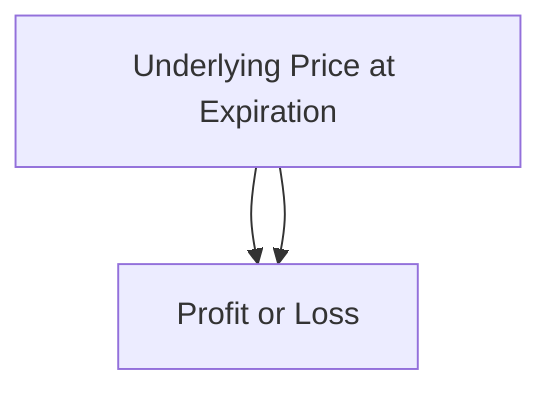

## Introduction

So let me share a quick personal memory: years ago, I was in the middle of a trading floor, nervously eyeing the flickering option prices on my screen. I was long a straddle (we’ll define that shortly) because I was convinced the market was going to go haywire. I mean, I was so sure. But, guess what? The market barely moved for days—making me question everything I thought I knew! And that’s the heart of volatility trading with options: you’re not always caring about the direction of the underlying asset. Instead, you’re focusing on whether the market will move a lot or a little.

Below, we’ll dig into the key ideas behind volatility trading with options. We’ll explore why you might choose a long or short volatility strategy, how “vega” exposures work, what tools traders use to forecast volatility, and how to manage the risks. The payoff structures can be super interesting, but keep your eyes peeled for pitfalls such as incorrectly estimating implied volatility or ignoring the dynamics of delta as the underlying asset moves.

Remember, while these strategies can be robust in any well-functioning market, they must be used responsibly—and typically with a clear risk management framework. Let’s begin.

## The Concept of Volatility in Option Pricing

Volatility, in a very broad sense, is how much a price changes. In the world of options, the concept of volatility takes two main forms:

• Implied volatility (IV): The market’s consensus forecast, “baked in” to the prices of options.  
• Realized volatility (RV): The actual variation in the underlying asset’s returns as observed over time.  

Options prices are driven by many factors—underlying spot price, time to expiration, interest rates, dividends, etc.—but volatility is often singled out because it’s something you can “trade around.” If you believe the market is pricing a certain amount of volatility into an option, but from your research you expect a very different realized outcome, you can position accordingly.

### Why Volatility Matters
The volatility parameter in options pricing models (like Black–Scholes–Merton) can significantly impact the premium you pay or receive. For instance, if implied volatility is high, option premiums are generally expensive. And if you’re on the buying side, you need the underlying asset to experience large price swings to compensate for that higher premium.

## Differences Between Implied and Realized Volatility

A basic principle in volatility trading: options are “fairly” priced when implied volatility matches realized volatility over the life of the option. In practice, these two rarely match perfectly. Traders can attempt to profit from discrepancy:

- If you expect realized volatility to exceed implied volatility, you might buy options (like a straddle or strangle).  
- If you expect realized volatility to be lower than implied volatility, you might sell options (like a short straddle or short strangle).  

They say “timing is everything,” and it is especially true here. Volatility mispricing can evaporate quickly as new information hits the market.

## Vega and Volatility Sensitivity

When you hold an option, its sensitivity to changes in implied volatility is referred to as “vega.” If an option has a vega of +0.20, it means that if implied volatility rises by 1 percentage point (e.g., from 25% to 26%), the option's theoretical value is expected to increase by $0.20 (per share, typically) all else held constant.

Positions that have net positive vega (e.g., a long straddle) benefit from rising implied volatility. Conversely, net negative vega positions (e.g., a short straddle) profit when implied volatility falls, or at least remains below the level used in pricing.

## Popular Volatility Trading Strategies

You’ll see a ton of structures on the street, but the two most essential “pure vol” strategies are straddles and strangles. You might also see advanced combos, e.g., ratio spreads, calendar spreads, or butterfly spreads, but let’s start with the basics.

### Long Straddles and Strangles

A straddle is formed by buying a call option and a put option on the same underlying, same strike price, and same expiration. A strangle is similar, except the strike prices differ for the call and the put. What’s the notion here?

• Long Straddle:  
  - Maximum gain: Potentially unlimited if market moves up in a big way (the call pays off) or down in a big way (the put pays off).  
  - Maximum loss: The combined premiums you paid if the underlying price goes nowhere.  
  - Rationale: You buy a straddle when you believe the market will be more volatile than the “consensus” (implied vol).

• Long Strangle:  
  - Same concept, but you buy out-of-the-money call and put. It’s cheaper than a straddle, but you need bigger price moves to profit.

Both of these positions are “vega-positive,” meaning they gain value if implied volatility goes up (even if the spot price remains around the strike for a while).

#### Diagram: Long Straddle Payoff at Expiration

Conceptually, the payoff forms a “V” shape, with the tip of the V representing the combined premium paid. Gains occur if the underlying moves sufficiently above or below the strike.

### Short Straddles and Strangles

In a short straddle, you sell both the call and the put on the same underlying, same strike, same maturity. You collect premium. A short strangle is the same idea but with different (out-of-the-money) strikes for the call and the put.

• Short Straddle:  
  - Maximum gain: Limited to the collected premium.  
  - Potential loss: Theoretically unlimited if the underlying price escalates well beyond the strike (on the call side) or collapses far below the strike (on the put side).  
  - Rationale: You do this if you expect the realized volatility to be lower than the implied volatility priced into the options.  

It’s a net “vega-negative” position. If the market becomes more volatile, short straddles can incur big losses.

### Rebalancing and Delta Management

One crucial piece that sometimes gets overlooked by beginners is rebalancing the position. Here’s what happens: if you buy a straddle at initiation, the “delta” (the net exposure to price moves) might be zero (or near zero). However, as soon as the underlying price rallies or plunges, that delta changes.

Why does that matter? If your main bet is that volatility will be higher (not that you necessarily know which way the asset is headed), you might want to keep the position delta-neutral. That means regularly buying or selling shares (or futures) of the underlying to offset the changing delta. This is standard practice in volatility arbitrage. But be aware, rebalancing could also eat into your profits if you end up trading too frequently or if the cost of rebalancing becomes excessively high.

## Tools for Forecasting Volatility

You might wonder, “How on earth do I figure out whether implied volatility is too high or too low for an upcoming period?” Great question. Practitioners utilize various techniques:

- **Historical Volatility Analysis:** Compare implied volatility to the asset’s historical volatility over a similar time horizon.  
- **Volatility Cones:** Plot the range of realized volatilities over different lookback periods to identify when current implied vol is high or low relative to historical norms.  
- **GARCH Models:** Employ statistical methods that adapt dynamically to new data points (often used by quants).  
- **Implied Volatility Surfaces:** Analyze how implied volatility differs across strikes and maturities; sometimes you’ll see “smiles” or “skews” that can clue you in on market stress or supply-demand imbalances.

### Volatility Cones Example

Imagine you have daily data of realized volatility for the past five years on a stock index. You might create a multi-period cone:

If current implied vol is near the top of its historical range, you might suspect the market’s overestimating near-term moves (and hence you might consider a short vol strategy). If implied vol is near the bottom, you may consider going long vol, anticipating a reversion toward a historical mean.

## Managing Risks and Practical Considerations

### Gamma, Theta, and the Time Decay Factor

When you buy volatility strategies (e.g., a long straddle), you’re typically long gamma and short theta. Being long gamma means that as the asset price makes large moves, your options can gain value quickly. Being short theta, however, means time decay is working against you every day that passes without significant price movement. Make sure you’re factoring in that daily cost—and psychologically be prepared: watching time decay eat away at your position can be stressful if the “big move” you anticipate doesn’t arrive soon enough.

### Transaction Costs

Every time you rebalance your deltas, you pay commissions, you might incur bid-ask spreads, and you face potential market impact costs if you’re trading in size. These frictional costs can erode even the best “vol arb” (volatility arbitrage) strategies. So keep a close eye on them.

### Liquidity Considerations

Liquidity in the options market can be quite different across strikes and maturities. Sometimes the implied vol for deep out-of-the-money options might be heavily skewed because there’s not much trading. If your strategy involves frequent rebalancing, or if you choose strikes that are illiquid, you can face large slippage. That can hamper your overall performance.

## Real-World Example: Straddle on Earnings

Let’s say you’re analyzing a tech stock that reports earnings next week. The market is expecting big news, one way or the other. You see that the at-the-money straddle costs $10. That implies a breakeven if the stock moves more than $10 away from strike price X by expiration. You do your own analysis—maybe you see a new product release or some changed guidance that you think will cause a massive swing. If you believe the stock could move $15+ either direction, you might buy that straddle. If you’re right, you’ll profit from the large jump. But if the news turns out to be underwhelming, and the stock barely moves, you lose your premium.

## Ethical and Regulatory Considerations

CFA Institute’s Code of Ethics and Standards of Professional Conduct remind us to treat clients fairly, ensure we have a reasonable basis for our investment recommendations, and communicate our strategies with clarity. For example, if you manage client assets and decide to initiate a short volatility strategy, you must fully disclose the potential for significant losses if the market experiences extreme moves. Additionally, from an accounting perspective under IFRS or US GAAP, derivatives must be recognized at fair value, potentially increasing the frequency of reporting gains and losses on the income statement. Always follow local and international derivatives regulations, which often require thorough risk disclosures and possibly margin or clearing mandates (especially on certain standardized over-the-counter trades).

## Conclusion and Exam Tips

Volatility trading with options can be extremely rewarding, but it’s not for the faint of heart. Knowing your net vega, your daily time decay, and the effect of rebalancing is essential. If you’re leaning into a long volatility stance, you’re probably looking for big price movements or surges in implied volatility. If you’re short vol, you want no drama in the market.

For exam scenarios—particularly in question sets that might appear in the item-set portion—remember these key points:

• A long straddle or strangle positions profit if realized volatility exceeds implied volatility.  
• A short straddle or short strangle positions profit if realized volatility is lower than implied volatility.  
• Vega is the “Greek” that measures sensitivity to implied volatility changes.  
• Rebalancing frequently can maintain delta neutrality but also incur costs.  

On constructed-response (essay-type) questions, you might be asked to show how an option’s payoff changes with volatility or to discuss how you’d manage delta, gamma, and vega exposures. Don’t forget to mention rebalancing practices or the rationale behind your forecast of implied vs. realized vol. Time your reading and writing carefully—volatility is a detailed topic, but with practice, you’ll absolutely master it.

## References and Further Reading

- Sinclair, Euan. “Volatility Trading.” Wiley.  
- Various “Journal of Dynamic and Control” articles on realized vs. implied volatility.  
- Risk.net articles on advanced volatility arbitrage strategies and GARCH modeling.  
- CFA Institute, “Standards of Practice Handbook.”  
- Hull, John C. “Options, Futures, and Other Derivatives.”  

---

## Test Your Knowledge: Volatility Trading with Options



### Which of the following statements best describes the rationale for opening a long straddle position?

- [ ] The trader expects implied volatility to decrease significantly.
- [x] The trader believes the underlying asset’s volatility will exceed that implied by current option prices.
- [ ] The trader wants to profit from small, directionless moves in the underlying.
- [ ] The trader expects the underlying to remain near the strike price until option expiration.

> **Explanation:** A long straddle profits from large moves in the underlying (higher realized volatility than implied). If the asset hardly moves, the straddle likely loses value because of time decay.

---

### When an investor sells both a call and a put with the same strike and maturity, the position is said to be:

- [ ] A long strangle.
- [ ] A collar.
- [x] A short straddle.
- [ ] A bear spread.

> **Explanation:** A short straddle is formed by selling a call and a put with identical strikes and maturities, collecting a net premium but also assuming substantial risk if the market moves sharply.

---

### Which Greek measures an option’s sensitivity to changes in implied volatility?

- [ ] Delta
- [ ] Gamma
- [ ] Theta
- [x] Vega

> **Explanation:** Vega is the unit that captures how much an option’s value changes with a 1% change in implied volatility.

---

### Rebalancing a long straddle position typically involves:

- [x] Buying or selling underlying shares (or futures) to remain delta-neutral after price moves.
- [ ] Rolling the strikes of the straddle to higher or lower levels.
- [ ] Closing part of the position early to lock in gamma profits.
- [ ] Increasing the maturity of the straddle to reduce risk.

> **Explanation:** To maintain the original “pure volatility” exposure, a long straddle holder often rebalances deltas when the underlying price changes.

---

### A short straddle position has which of the following characteristics?

- [x] Limited maximum profit and theoretically unlimited maximum loss.
- [x] Net negative vega.
- [ ] Maximum profit if realized volatility exceeds implied volatility.
- [ ] Greatly benefits if the underlying price experiences large, rapid moves.

> **Explanation:** Short straddles collect premium upfront (limited profit) but face unlimited potential losses if the spot rises or falls sharply. They also lose if implied volatility rises (negative vega exposure).

---

### If you anticipate that implied volatility is being dramatically underpriced by the market, which strategy is most aligned with your view?

- [x] Buying a strangle.
- [ ] Selling a straddle.
- [ ] Initiating a covered call.
- [ ] Launching an iron condor.

> **Explanation:** If you believe implied vol is too low, you want a net long volatility position. Buying a strangle is a simpler method to exploit that belief.

---

### Which statement about volatility cones is accurate?

- [ ] They are used exclusively to forecast dividend changes.
- [ ] They only apply to equity options, not commodity or FX.
- [x] They depict the historical range of realized volatility over multiple horizons.
- [ ] They directly measure implied volatility via option chain analysis.

> **Explanation:** Volatility cones plot min, median, max, etc., for realized volatility over different time horizons to contextualize current implied vol readings.

---

### A trader who is long a straddle is most concerned about:

- [ ] Gamma risk due to large price moves.
- [x] Theta risk if the underlying price remains unchanged.
- [ ] Rho risk due to changes in interest rates.
- [ ] Vega risk from decreasing implied volatility.

> **Explanation:** Although a long straddle gains from rising implied vol, it primarily suffers from time decay (theta) if the underlying stays too stable.

---

### A GARCH model is utilized to:

- [x] Forecast volatility by accounting for volatility clustering in returns.
- [ ] Reveal the fair value of an at-the-money forward contract.
- [ ] Compare convertible bond yields to treasury rates.
- [ ] Decide on an appropriate risk-free rate for discounting cash flows.

> **Explanation:** GARCH (Generalized Autoregressive Conditional Heteroskedasticity) models use historical data to dynamically estimate volatility, often reflecting volatility clustering observed in financial markets.

---

### True or False: A long volatility position benefits when the underlying asset’s price remains flat and implied volatility decreases.

- [ ] True
- [x] False

> **Explanation:** A long volatility position (e.g., a long straddle) needs realized volatility to exceed implied levels. If implied volatility goes down or the market remains quiet, the position will likely lose money, mainly because of time decay and reduced implied vol.


