## Introduction and Core Concepts

I remember the first time I tried to manage an options portfolio on my own. Let me tell you, it was nerve-racking—one minute everything looked stable, and the next, market upheaval made me realize just how sensitive options can be to even tiny price changes. It’s a bit like driving on a slick mountain road: you want to keep things streamlined and balanced, adjusting the steering wheel (your hedge) every time the road (the market) curves unexpectedly.

Greek-based hedging strategies revolve around managing a set of sensitivities—Delta, Gamma, Vega, Theta, and Rho—that capture how an option’s value changes relative to underlying factors. These “Greeks” serve as a toolkit for option traders, portfolio managers, and risk professionals to measure and hedge specific risks. While it might seem overwhelming at first, they can really help you build a robust hedging framework. Anyway, let’s take a deep dive into how these Greek letters translate into practical hedging approaches, from single-stock options to more complex multi-asset derivatives.

## Delta: Price Sensitivity

Delta (Δ) is often described as “the first line of defense” in an options portfolio. It measures the change in your option’s price given a small shift in the underlying asset’s price. In more formal math terms:


\Delta = \frac{\partial V}{\partial S}


where V is the option’s value and S is the underlying asset’s price.

For a call option, Delta typically ranges from 0 to 1, while for a put option, it ranges from -1 to 0. If a call option has a Delta of 0.50, it means that if the underlying price goes up by $1, the option’s price should increase by about $0.50—assuming, of course, all other factors (like volatility and time) remain constant.

### Practical Delta Hedging

Delta hedging involves taking an offsetting position in the underlying to neutralize that first-order price risk. For instance, if you hold a call option with a positive Delta (let’s say 0.50 for each contract, and each contract represents 100 shares), you have an equivalent “exposure” to 50 shares per contract. If you want to be Delta-neutral on this position, you could short 50 shares for every call contract. The combined portfolio would, at least theoretically, not gain or lose much if the underlying moves a little bit.

But guess what? Delta isn’t static. As the underlying price moves—even slightly—this sensitivity changes. That’s one reason you’ll hear people say, “Delta hedges require frequent rebalancing.” If the underlying’s price rallies and your calls go deeper in-the-money, the Delta of those calls will increase, and you’d need to adjust by shorting more shares to remain neutral.

### Example: Single-Stock Portfolio

Say you sold a call option on Stock XYZ at a 50 Delta. Because each option contract covers 100 shares, that’s an effective exposure of 50 shares per contract. To hedge, you might buy 50 shares of XYZ (for each call option you sold). Now your net exposure to small price changes is approximately zero. If the stock goes up a bit, the loss on your short call is offset by a gain on the 50 shares you purchased. Over time, you’ll likely need to buy or sell more shares to keep your Delta near zero as Delta fluctuates.

## Gamma: The Curvature Effect

Gamma (Γ) measures how quickly Delta changes when the underlying price changes. Mathematically:


\Gamma = \frac{\partial^2 V}{\partial S^2} = \frac{\partial \Delta}{\partial S}


If Delta is the slope of the option payoff function, then Gamma is the curvature. A high Gamma means your Delta can shift dramatically when the underlying price changes, making your portfolio risk profile more dynamic. Long options positions typically have positive Gamma, whereas short option positions have negative Gamma.

### Why Gamma Matters

When you’re short options (like a covered call writer or a market maker who sold to a buyer), you have negative Gamma. That translates into an unpleasant reality: if the market moves significantly, your position could lose money faster since your Delta will shift against you. If you’re long options, you have positive Gamma and thus a more favorable situation when large moves occur—your Delta repositions beneficially in big market swings.

### Gamma Hedging

Gamma hedging is all about flattening out that curvature. While Delta can be managed relatively straightforwardly by purchasing or shorting the underlying, Gamma management often involves buying or selling additional options. Traders might add long options to offset negative Gamma or sell options to reduce positive Gamma exposure. However, Gamma hedging is expensive. Buying options for positive Gamma typically costs premium, and adjusting the hedge frequently can rack up transaction fees.

A well-known phenomenon is that option sellers (like major dealers) are often short Gamma. They constantly rebalance their positions to stay Delta-neutral, which can cause feedback loops in the market (sometimes intensifying volatility). Anyway, if you’re short Gamma, you want to be prepared for constant re-hedging whenever the underlying moves significantly.

## Vega: Sensitivity to Volatility Changes

Vega (often denoted by v or 𝜈) captures how much an option’s value changes when implied volatility changes:


\text{Vega} = \frac{\partial V}{\partial \sigma}


where σ (sigma) represents implied volatility. Even though we typically write “Vega,” it’s not actually a Greek letter. But we’ll let that slide because it’s so common in finance jargon.

### Importance of Vega

If the underlying asset suddenly experiences a spike in implied volatility—perhaps due to a big earnings announcement or a major macroeconomic event—your option’s value will likely rise (if you’re long that option), even if the underlying price doesn’t move much. Conversely, if volatility collapses, long option positions can lose value quickly.

### Vega Hedging Tactics

So how do you hedge Vega? Really, you’d do so by taking offsetting positions in other volatility-sensitive instruments, often other options. You could:

• Buy or sell options with similar expiration to offset your Vega exposure.  
• Use variance swaps or volatility derivatives—if you have access to them—to neutralize your volatility risk.  

One practical approach is pairing an option position with an offsetting position in a different strike or maturity. For example, if you own an at-the-money call option, you might sell an out-of-the-money call option to reduce your net Vega while still participating in some upside movement. The net effect is often referred to as a “vertical spread,” which shifts the entire position’s volatility risk.

## Theta: Time Decay

Theta (Θ) measures the sensitivity of an option’s price to the passage of time:


\Theta = \frac{\partial V}{\partial t}


Because options lose extrinsic value as we inch closer to expiration, Theta is typically negative for long option positions (you lose a bit of your time value with each passing day). Short option positions, on the other hand, generally have positive Theta (you earn time decay daily, all else being equal, as the short options you sold get closer to expiration).

### Hedging Time Decay

Time decay is a bit trickier to hedge than Delta or Vega because, well, none of us can actually stop time. The best you can do is structure your overall portfolio to offset daily time decay or ensure that you’re being adequately compensated for the premium you pay or receive. If your net position is long Theta, you’re effectively earning theta each day—although that may come with negative Gamma and other exposures. If you’re short Theta, you need to ensure you’re not whittling away your profits by simply waiting around.

Hedging Theta usually involves rolling over positions as you approach expiration or combining short and long positions in a manner that stabilizes your net time decay. Strategies like calendars or diagonal spreads can be used to offset some of the time decay, though they replace it with different types of risk, such as changes in implied volatility or mismatched strike prices.

## Rho: Interest Rate Sensitivity

Rho (ρ) measures how the value of an option changes in response to shifts in prevailing interest rates:


\rho = \frac{\partial V}{\partial r}


where r is the risk-free interest rate. Typically, calls have a positive Rho (their value rises with interest rates), and puts have a negative Rho (their value falls as interest rates increase).

### Relevance in Low-Rate Environments

Many traders used to ignore Rho because rates were super low for a long time. That said, even small changes in interest rates can matter in certain contexts, like currency options or leveraged portfolios. If you’re a multinational corporation dealing with foreign exchange hedging, Rho can become quite important when hedging interest-rate-driven currency movements.

### Rho Hedging

Hedging Rho typically requires interest rate swaps, Treasury futures, or other fixed income instruments that offset your sensitivity to shifts in interest rates. If you expect rates to rise, you might structure your position so that you hold more call options (positive Rho) or short put options (negative Rho). If you anticipate a drop in rates, you’d do the opposite. In practice, Rho is usually overshadowed by Delta, Gamma, Vega, and Theta for short-dated equity options, but it can loom large in longer-dated or interest-rate-sensitive derivatives.

## Combining the Greeks: Multi-Factor Hedging

In real life, you rarely get to hedge just Delta while ignoring everything else. Option positions have multiple sensitivities that can all shift simultaneously. You might be “Delta-hedged,” but if implied volatility spikes, your portfolio can still face big losses if you were unhedged on Vega. Or perhaps you’ve perfectly hedged Gamma, but now you’re left with unintended Theta bleed.

Professional desks at large investment banks or hedge funds frequently run complex models that measure each Greek exposure. They then combine instruments—additional options, futures, or even dynamic hedging in the underlying—to keep the net Greek exposure within acceptable bounds.

### Dynamic Rebalancing

Greek exposures don’t stand still. They change as the market changes, as time passes, or even as implied volatility evolves. Therefore, you need dynamic rebalancing—often daily, intraday, or even by the hour for certain high-frequency trading operations. This continuous hedging can be expensive in terms of transaction costs, so there’s always a balancing act: how neutral do you want to be versus how much you’re willing to pay for that neutrality?

### Case Study: Volatile Earnings Season

Imagine a market maker providing call and put quotes for multiple stocks going into earnings season. The trader might:

• Sell a bunch of straddles on Company A, collecting premium.  
• See that the portfolio now has significant negative Gamma and positive Theta.  
• Delta-hedge each position to keep short-term exposure neutral.  
• Decide to buy calls or puts on Company B to add some positive Gamma to offset potential big moves.  
• For overall Vega neutrality, the trader might also offset volatility risk with index options if the implied vol for the market is out of line with Company B.  

This multi-layered approach helps keep total exposure within risk limits—though, as one can imagine, it’s a constant process of balancing out each Greek.

## Real-World Complexities and Transaction Costs

If only we could wave a magic wand and remain perfectly hedged on all Greeks. In reality, every time you rebalance, you pay broker commissions and possibly the bid-ask spread. If you trade in large volumes, you may also move the market. And don’t forget the effect of triggers or stop-loss orders that might cause slippage. This is why real-world hedging is always about trade-offs.

Moreover, each Greek isn’t necessarily stable; Gamma can change quickly, or implied volatility can spike from a big announcement. Timing your hedges to minimize cost and maximize protection is part art and part science.

## Diagram: Relationship Among Greeks

Here’s a simplified Mermaid diagram to visualize how portfolio value depends on changes in the underlying, time, volatility, and interest rates:

```mermaid
flowchart LR
    A["Underlying Price <br/> (S)"] --> B["Delta <br/> ∂V/∂S"]
    A["Underlying Price <br/> (S)"] --> C["Gamma <br/> ∂²V/∂S²"]
    D["Time to Expiry <br/> (t)"] --> E["Theta <br/> ∂V/∂t"]
    F["Implied Volatility <br/> (σ)"] --> G["Vega <br/> ∂V/∂σ"]
    H["Interest Rate <br/> (r)"] --> I["Rho <br/> ∂V/∂r"]
    B --> J["Option Value <br/> (V)"]
    C --> J["Option Value <br/> (V)"]
    E --> J["Option Value <br/> (V)"]
    G --> J["Option Value <br/> (V)"]
    I --> J["Option Value <br/> (V)"]
```



## A Simple Dynamic Hedging Code Snippet (Python)

Below is a quick illustration of a simplistic approach to Delta-hedging a single option position. This code is purely for conceptual demonstration:

```python
import numpy as np

# We'll simulate small price moves and adjust the hedge

current_delta = 0.50  # Starting Delta
option_positions = 10  # 10 option contracts
shares_held_for_hedge = 0

underlying_price = 100.0

def rebalance_hedge(current_delta, option_positions, shares_held_for_hedge):
    target_shares = current_delta * 100 * option_positions
    hedge_adjustment = target_shares - shares_held_for_hedge
    shares_held_for_hedge = target_shares
    return hedge_adjustment, shares_held_for_hedge

underlying_price += 1
current_delta = 0.60

adjustment, shares_held_for_hedge = rebalance_hedge(current_delta, option_positions, shares_held_for_hedge)
print(f"After price move, need to adjust hedge by {adjustment} shares. Total hedged shares: {shares_held_for_hedge}.")
```

In practice, you’d integrate real-time data, incorporate Gamma adjustments, track Vega changes, and account for transaction costs. But hopefully this snippet provides a sense of how dynamic Delta hedging might look in code form.

## Best Practices and Pitfalls

• Over-Hedging: Over-hedging can be just as problematic as under-hedging. Each hedge costs money to put on and take off.  
• Volatility Shifts: Sudden changes in implied volatility can blow up your P&L if you’re not watching Vega.  
• Gamma Squeezes: If you’re short Gamma and the market makes big moves, you can suffer unpredictable losses rapidly.  
• Correlation Risks: If you hedge with related but not identical instruments, correlation breakdowns can lead to bigger-than-expected P&L swings.  

## Exam Tips

• When faced with a question about Delta hedging, always note that Delta hedging is not a one-and-done solution. It needs to be recalibrated, especially when you have negative Gamma.  
• Vega can be a silent killer, especially around earnings announcements or macro events. Watch out for scenario-based questions that test your knowledge of changes in implied volatility.  
• For Rho, keep in mind it matters more in longer-maturity options or currency derivatives; if an exam question deals with short-term equity options, Rho’s effect might be minimal.  
• You might get a question that asks you to calculate the net Delta or net Vega of a portfolio. Practice doing quick calculations and check which side (long or short) you’re on for each Greek.  
• Occasionally, they might present a multi-Greek “scenario” question where the underlying price changes, volatility changes, and time passes all at once. Recognize that all Greeks might shift simultaneously.

## References

• Rebonato, Riccardo. “Volatility and Correlation.” Wiley.  
• CFA Institute, “Risk Management Applications of Option Strategies.”  
• Major broker platforms often have advanced tutorials and interactive tools to measure Greek sensitivities in real time.

---------------------------------------------------------------------

## Test Your Knowledge: Greek-Based Hedging Strategies Quiz



### A trader is long a call option with a Delta of +0.40. Which of the following hedging actions would neutralize the trader’s Delta?

- [ ] Buying 40 shares of the underlying for each option contract
- [x] Shorting 40 shares of the underlying for each option contract
- [ ] Selling 60 shares of the underlying for each option contract
- [ ] Buying 60 shares of the underlying for each option contract

> **Explanation:** Because the call’s Delta is +0.40, the trader should short 40 shares per contract to move the net Delta toward zero.

### A portfolio has a net negative Gamma. What consequences might this have if the underlying experiences large price swings?

- [x] The portfolio may suffer losses during large upward or downward moves in the underlying.
- [ ] The portfolio will necessarily break even on large upward or downward moves.
- [ ] The portfolio automatically gains on large upward moves.
- [ ] The portfolio automatically gains on large downward moves.

> **Explanation:** Negative Gamma means the portfolio’s Delta will move against the trader as the underlying price changes, increasing losses in large moves.

### Vega hedging can be accomplished primarily by:

- [ ] Adjusting interest rate positions
- [ ] Using the underlying spot market
- [x] Taking offsetting positions in other volatility-sensitive instruments (e.g., options)
- [ ] Changing the time to maturity of the option

> **Explanation:** Vega is sensitivity to changes in implied volatility. Hedging Vega typically involves trading options or volatility derivatives.

### When constructing a Delta-neutral portfolio that is short calls, it often results in:

- [ ] Positive Gamma, meaning you gain from large price swings
- [x] Negative Gamma, meaning you lose from large price swings
- [ ] Zero Gamma
- [ ] A fully Theta-neutral position

> **Explanation:** Short-option positions typically carry negative Gamma. You must constantly rebalance to remain Delta-neutral.

### If an investor is worried about rising interest rates and holds a large number of call options, which Greek exposure is most relevant?

- [x] Rho
- [ ] Theta
- [ ] Vega
- [ ] Gamma

> **Explanation:** Rho measures sensitivity to interest rates. Calls have positive Rho, so rising rates can increase their value.

### You see that your option position has a Theta of -25 per day. Which statement most accurately describes this position?

- [x] The option position loses $25 in time value per day, all else equal
- [ ] The option position gains $25 in time value per day, all else equal
- [ ] The underlying is expected to move $25 per day
- [ ] The option’s Gamma is 25

> **Explanation:** Negative Theta means your option loses premium over time at that rate, holding other factors constant.

### After a significant rise in implied volatility, your net Vega position yields a substantial gain. What does this imply about your initial Vega exposure?

- [ ] You were Vega-neutral
- [x] You were long Vega
- [ ] You were short Vega
- [ ] You had no exposure to volatility

> **Explanation:** A gain from a volatility spike implies your position had positive exposure to changes in implied volatility.

### A Delta-hedged option strategy still experiences a loss when implied volatility declines. What key Greek did this position overlook?

- [ ] Theta
- [x] Vega
- [ ] Rho
- [ ] Gamma

> **Explanation:** The portfolio neglected hedging Vega, so a drop in implied volatility eroded the option’s value despite being Delta-neutral.

### Which statement best describes Gamma’s relationship with Delta?

- [x] Gamma measures the rate at which Delta changes as the underlying price moves
- [ ] Gamma measures the volatility sensitivity of Delta
- [ ] Gamma and Delta are unrelated
- [ ] Delta measures how quickly Gamma changes over time

> **Explanation:** Gamma is the first derivative of Delta with respect to changes in the underlying price.

### A trader noting that Rho is quite large on a long option position should be primarily concerned about:

- [x] Potential shifts in interest rates
- [ ] Changes in implied volatility
- [ ] Small underlying price movements
- [ ] Abrupt changes in the underlying’s dividend policy

> **Explanation:** Rho quantifies the option’s sensitivity to interest rate moves. A high Rho means interest rate changes significantly impact the option’s price.


