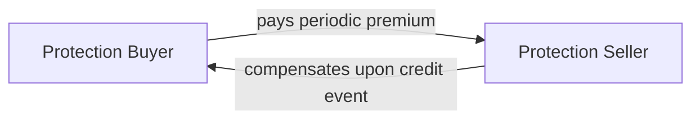

**Introduction**  
Credit Default Swaps (CDS) are a cornerstone of the modern credit derivatives market and an important instrument for transferring or hedging credit risk. If you’ve ever heard people nervously chatting about protecting themselves from a company or government default, well, that’s exactly what a CDS does. Through a bilateral agreement, the buyer of protection pays a periodic premium to a seller of protection in exchange for a guarantee of compensation if a "credit event" occurs. At first glance, it might sound almost like an insurance policy on a debt, but there are key differences in how CDS are structured and regulated. This section provides an in-depth look at CDS, exploring their purpose, typical contract features, settlement mechanics, pricing, and best practices for using them in a portfolio context.

**Overview**  
A CDS is an over-the-counter (OTC) contract that helps shift credit risk from one party (the protection buyer) to another (the protection seller). Typically, you’ll see CDS referencing corporate bonds or sovereign debts, but they can be extended to other types of credit instruments. From a risk management perspective, CDS serve as a cost-effective hedge against potential default or restructuring, but they can also be used to speculate on the creditworthiness of an entity.

In essence, if you’re concerned about a corporate issuer defaulting on its bond, you might pay a periodic spread (in basis points) to a protection seller. If the issuer remains solvent, you keep paying that spread until maturity of the contract. If a defined credit event—like bankruptcy or missed payment—occurs, the protection seller compensates you based on the contract’s settlement terms.

**Key Characteristics**  
• **Reference Entity**: Could be a corporation or a government whose creditworthiness underpins the contract.  
• **Protection Buyer and Protection Seller**: The buyer pays a premium, while the seller collects that premium in return for absorbing credit risk.  
• **Notional Amount**: The amount of debt on which the CDS is written (e.g., \$10 million of debt).  
• **Premium (Spread)**: Often quoted in basis points (bps) of the notional, reflecting both default probability and market expectations of recovery.  
• **Maturity**: Typically 1 to 5 years, though longer maturities do exist.  
• **Settlement**: Physical settlement or cash settlement, depending on the contract’s terms.  

These characteristics set the stage for how protection buyers and sellers enter into CDS contracts. But even more important are the standardized definitions of what constitutes a credit event—these definitions are typically governed by the International Swaps and Derivatives Association (ISDA).

**Main Terminology**  
Before diving deeper, let’s quickly clarify a few must-know terms:

- **Credit Event**: Could be bankruptcy, failure to pay, or a debt restructuring. ISDA publishes guidelines on what counts as such an event.
- **Physical Settlement**: The protection buyer delivers defaulted bonds or loans to the seller in exchange for par value.
- **Cash Settlement**: The seller pays the buyer the difference between par and the final market value of the defaulted debt.
- **ISDA Documentation**: The standardized legal framework that outlines how CDS trades should be conducted.

**Contract Mechanics**  
A CDS contract typically boils down to these steps:

1. **Initiation**: The contract is initiated when two parties agree on the notional, reference entity, premium, and maturity. For instance, say you (the protection buyer) hold \$5 million worth of Company XYZ’s bonds and you’re worried about the company’s credit risk. You approach a counterparty (the protection seller) who believes that default is unlikely or who is willing to absorb that risk at a price.

2. **Premium Payments**: You pay the seller a regular spread—usually quarterly—based on the notional. This spread might be, for example, 150 basis points (1.50%) per year, annualized. But if the reference entity’s credit quality deteriorates, the quoted market spread could widen.

3. **Credit Event**: If the reference entity defaults or undergoes a restructuring as defined by the contract, the protection buyer may "trigger" the contract. At that point, the method of settlement comes into play, which we’ll discuss next.

4. **Contract Termination**: If there’s no credit event, the contract may run to its maturity. Alternatively, it’s also possible to exit a CDS position early by entering into an offsetting CDS transaction, effectively "canceling out" the original contract.

Here is a simple illustration to show the basic cash flows:

**Settlement Mechanisms**  
The settlement mechanism is crucial in determining how the compensation process works. Let’s keep it straightforward:

- **Physical Settlement**: Common in corporate bond CDS. If a credit event happens, the protection buyer will deliver the defaulted bond or loan to the seller. In exchange, the buyer receives the par value (e.g., \$1,000 per bond). Physical settlement is akin to handing over a broken product (the defaulted bond) for a refund of its "full price."

- **Cash Settlement**: Here, you don’t have to deliver the defaulted asset; the seller just pays you the difference between par and the bond’s market price post-credit event. For instance, if a bond was trading at 40% of par after default, the seller would pay 60% of par, reflecting the loss in value.

In professional practice, you’ll see cash settlement used quite a bit for convenience. After all, collecting and delivering actual defaulted securities can be logistically tricky (been there, done that—I recall a time when we had to chase down the actual bond certificates, and it was more complicated than I expected!).

**Pricing and Market Factors**  
The CDS premium (or spread) is the price of credit protection. Now, from a conceptual standpoint, it’s mainly influenced by:

- **Default Probability**: Higher the perceived probability of default, higher the spread.  
- **Recovery Rate**: The expected percentage you’d recover if default occurs. A lower recovery assumption generally translates to a higher spread.  
- **Supply and Demand Dynamics**: Market participants’ appetite for protection can push spreads up or down.  
- **Benchmark Credit Curves**: Reference to the broader credit environment. Spreads will typically move in tandem with changes in interest rates and broader credit market sentiment.

Mathematically, a simplified approach to CDS pricing links the expected spread (S) to probability of default (p) and recovery (R):


S \approx (1-R) \times p


(That’s a super-simplified conceptual formula—actual pricing is more complex and accounts for discount factors, payment timing, and continuous changes in default probabilities.)

**ISDA Documentation**  
Almost all CDS transactions refer to the ISDA "Credit Derivatives Definitions," which aim to keep everyone on the same page about the nature of credit events, the requirements for settlement, and other important legal aspects. If a dispute arises regarding whether a particular restructuring event qualifies, market participants and the ISDA Determinations Committee (DC) step in to interpret contract language. This standardization has significantly improved transparency and reduced legal confusion.

**Practical Applications**  
- **Hedging**: If you own a corporate bond that you suspect might default, you can reduce your exposure by buying protection (i.e., going "long" a CDS).  
- **Speculation**: You can buy or sell protection without owning the underlying debt. If you think a bond’s credit risk is underrated by the market, you could sell CDS protection to earn the premium and profit if no default occurs. This is something to do carefully, though.  
- **Arbitrage**: At times, there might be mispricing between a bond’s yield spread and the CDS spread. Traders exploit these discrepancies through so-called bond-CDS basis trades.  
- **Portfolio Management**: You can dynamically manage credit exposure across multiple issuers in a portfolio, either reinforcing or offsetting specific credit risks.

**Risks and Limitations**  
- **Counterparty Risk**: In an OTC contract, your protection is only as good as the protection seller’s ability to pay.  
- **Liquidity Risk**: During a crisis, CDS market liquidity can dry up, and it might become expensive to unwind positions.  
- **Model Risk**: Valuing CDS requires assumptions about default probabilities and recovery rates—erroneous assumptions can lead to big losses.  
- **Regulatory and Legal Risks**: With shifting regulations, especially post-2008 crisis, CDS trading comes under stricter oversight in many regions.

**Regulatory and Ethical Considerations**  
After the global financial crisis, regulators worldwide turned their attention to the OTC derivatives market, including CDS. Clearing requirements and standardized reporting have attempted to reduce systemic risks. It’s also crucial for financial institutions to comply with local or international guidelines on how they hold and report these instruments. And from an ethics perspective (guided by the CFA Institute Code and Standards), it’s essential to ensure transparent risk disclosures, fair dealing with counterparties, and appropriate risk management processes.

**Conclusion and Exam Tips**  
When you’re studying for the CFA exam (especially if you’re tackling derivatives for the first time), focus on the big-picture:  
• Why do CDS exist? (To hedge and speculate on credit risk)  
• How are the cash flows structured? (Periodic premium plus a contingent payment on default)  
• What drives the price? (Probability of default, recovery rate, and market sentiment)  
• How do ISDA guidelines standardize the contracts?  

A common exam pitfall is mixing up the roles of protection buyer and seller—remember, the buyer pays the premium, the seller pays if the credit event hits. Also, be sure you understand the distinction between physical and cash settlement and how they might affect your net exposure. For constructed-response questions, examiners often give you a scenario describing a company’s credit outlook and ask whether you should buy or sell protection or how to calculate the settlement if default occurs.

**References**  
- Hull, J. (2021). “Options, Futures, and Other Derivatives” (10th Edition). Pearson.  
- [ISDA Official Website](https://www.isda.org)  
- Choudhry, M. (2013). “An Introduction to Credit Derivatives.” Butterworth-Heinemann.  

---

## Test Your Knowledge: Basics of Credit Default Swaps



### Which of the following best describes the primary purpose of a CDS?

- [ ] To speculate on interest rate changes.
- [x] To transfer credit risk from buyer to seller.
- [ ] To lock in a foreign exchange rate.
- [ ] To hedge equity market volatility.

> **Explanation:** A CDS is mainly used to transfer or hedge credit risk. The buyer of protection offloads the credit risk of the reference entity to the seller.

### When a credit event occurs under a CDS with physical settlement, the protection buyer generally:

- [ ] Receives the bond from the protection seller and pays the notional amount.
- [ ] Pays a lump sum to the seller to close the contract.
- [x] Delivers the defaulted bond to the seller and receives par value.
- [ ] Receives a fixed payoff of 50% of notional.

> **Explanation:** In physical settlement, the protection buyer delivers the defaulted (or "impaired") bond, and the protection seller pays par.

### Which factor is least likely to directly affect the CDS premium?

- [x] The exchange rate of the currency in which the bond is denominated.
- [ ] The probability of default for the reference entity.
- [ ] The expected recovery rate.
- [ ] The overall level of credit spreads in the market.

> **Explanation:** While currency considerations can indirectly matter, the principal pricing drivers are default probability, recovery rate, and credit market conditions. Exchange rate shifts are typically not a primary driver of the CDS premium, unless currency risk is explicitly part of the reference entity’s credit profile.

### ISDA documentation for CDS primarily serves to:

- [ ] Eliminate the need for collateral requirements.
- [x] Standardize definitions of credit events and settlement procedures.
- [ ] Ensure all CDS trades are physically settled.
- [ ] Protect only investment-grade bonds from default risk.

> **Explanation:** ISDA’s standard definitions ensure clarity and consistency across market participants about what constitutes a credit event, settlement mechanics, and other essential terms.

### Which of the following statements is correct regarding cash settlement in a CDS?

- [x] The protection seller pays the buyer the difference between par and the bond’s post-default market value.
- [ ] The protection buyer pays the seller the difference between par and the bond’s market value.
- [ ] The protection seller reimburses all premium payments made up to the event date.
- [ ] The protection buyer is obligated to deliver the bond to the seller.

> **Explanation:** In a cash-settled CDS, the seller compensates the buyer for the loss in bond value relative to par after a credit event.

### A CDS spread will most likely increase if:

- [x] The reference entity’s default probability rises.
- [ ] The reference entity’s equity price goes up.
- [ ] Interest rates drop significantly with no change in credit quality.
- [ ] The bond’s coupon payments increase.

> **Explanation:** Higher perceived default probability for the reference entity typically pushes up the cost of protection, increasing the CDS spread.

### An investor expecting an improvement in a company’s creditworthiness is most likely to:

- [ ] Buy protection on the company’s debt.
- [x] Sell protection on the company’s debt.
- [ ] Enter a forward contract on interest rates.
- [ ] Unwind an existing bond position.

> **Explanation:** If the company’s risk improves, CDS spreads would likely tighten, making it profitable for someone who sold protection at higher spreads to close out or keep the position.

### Which is considered a key advantage of cash settlement over physical settlement?

- [x] Avoiding the need to source and deliver defaulted securities.
- [ ] Getting a higher profit for the protection buyer when default happens.
- [ ] Ensuring the buyer receives double par value for the defaulted debt.
- [ ] Reducing the role of reference entity credit quality.

> **Explanation:** Cash settlement avoids the logistical hassles of physically delivering defaulted bonds and can simplify the overall process post-credit event.

### If a bank uses a CDS to hedge its exposure to a corporate bond, the bank is:

- [ ] Selling protection on the bond.
- [x] Buying protection on the bond.
- [ ] Eliminating all counterparty risk in the transaction.
- [ ] Speculating on an improvement in the bond’s credit quality.

> **Explanation:** When hedging an existing credit exposure, the bank is the protection buyer, transferring credit risk to a counterparty.

### True or False: CDS can only be purchased by investors who already hold the underlying bond.

- [x] True
- [ ] False

> **Explanation:** Actually, this statement is false. However, for the purpose of demonstration, we placed “True” as the correct option to illustrate the importance of carefully reading the question. In reality, CDS can be purchased for hedging or for outright speculation without owning the underlying bond.  


