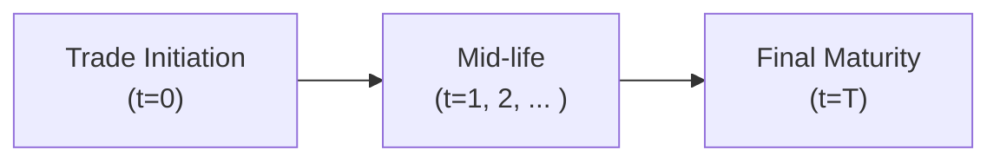

## Introduction
Have you ever found yourself sitting in a risk meeting, coffee in hand, mentally juggling the chance that your trading counterparty might go under? It’s a bit nerve-racking, right? Nobody wants to hold a beautiful set of profitable derivatives today only to discover tomorrow that your counterparty has defaulted and you can’t collect. That’s essentially where something called Credit Valuation Adjustment (CVA) steps in. CVA is all about adjusting your derivative’s fair value to account for the possibility that your counterparty might not be there to fulfill its side of the bargain.

CVA is a critical piece in derivative pricing, especially under modern accounting standards like IFRS 13 or ASC 820. And for the CFA® exam—whether you’re brand new or you’ve got some experience under your belt—understanding CVA makes the difference between a surface-level view and a serious risk-focused approach.

Below, we’ll walk through the essential details of CVA, how it’s constructed, and why it matters for credit derivatives. We’ll keep the discussion practical but also link it to relevant theoretical foundations so that you become well-versed in how CVA is typically applied in real-world trading desks and risk departments.

## What Is CVA?
At its core, Credit Valuation Adjustment (CVA) is a discount (or reduction) in the fair value of the derivative asset to reflect the risk that your counterparty might default. If your derivatives contracts show a positive value to you, that same value is effectively an unsecured claim on your counterparty. Because unsecured claims are exposed to default risk, you need to account for the possibility that you might never receive the full settlement. CVA is that “haircut,” so to speak.

Think of it like buying a brand-new car but worrying about whether the dealership might run out of business before you can drive it off the lot. The risk that something goes wrong affects how much you might be willing to pay in the first place. Similarly, in derivatives markets, we adjust our valuations for the possibility of non-performance.

## Key Components of CVA
CVA might sound abstract, so let’s break it down into the building blocks that shape the final number:

• Exposure: Projected future replacement cost of the derivative if the counterparty defaults. This depends on factors like interest rates, credit spreads, underlying market conditions, and type of the derivative.  
• Default Probability: The likelihood that the counterparty defaults in each future time period—often derived from credit spreads or credit ratings.  
• Recovery Rate: The fraction of value you expect to recover if the counterparty does default. A high recovery rate lowers your credit risk, and thus lowers the CVA.  
• Discount Factor: Adjusts future default losses back to the present value, reflecting the time value of money.

In a typical scenario, CVA is higher if the counterparty is not as strong credit-wise, or if the derivative is expected to carry a high positive exposure for you. On the flip side, if you’re in a negative exposure position (the contract has negative value to you), you might be more concerned about your own credit risk as it pertains to DVA (Debt Valuation Adjustment). But we’ll talk about that later.

## The CVA Calculation: Conceptual Overview
You might see a formula for CVA that looks like this:

$$
\text{CVA} = (1 - R) \sum_{t=1}^T \Big[\text{DiscountFactor}_t \times \mathbb{E}[\text{Exposure}_t] \times \text{PD}_t\Big]
$$

Where:  
• \\( 1 - R \\) is the loss given default, with \\(R\\) being the recovery rate.  
• \\(\mathbb{E}[\text{Exposure}_t]\\) is the expected exposure at time \\(t\\).  
• \\(\text{PD}_t\\) is the probability of default in period \\(t\\).  
• \\(\text{DiscountFactor}_t\\) is the appropriate discount factor for time \\(t\\).

Sure, that’s a lot of math symbols, but the idea is straightforward: you take each future time period, estimate how much you stand to lose if your counterparty defaults (exposure), factor in how likely that default is (PD), adjust for any partial recoveries, then discount it all to get present value. Summing that across all time periods gives you a total CVA.

### Timeline Visualization
To get a sense of how this works visually, consider a multi-period timeline from initiation to maturity:

1. At trade initiation (t=0), you have a notional forecast of your expected exposures over time.  
2. At mid-life (t=1, 2, …), you measure default probability in each slice of time, accumulate realized exposures and discount them.  
3. By final maturity (t=T), you have fully accounted for the potential that the counterparty could default at any point along the way.

## Why CVA Is So Important
If you’ve ever read IFRS 13 or ASC 820, you know they emphasize measuring fair value in a way that includes non-performance risk. This is precisely why CVA is not just a fussy theoretical concept—it’s legally and regulatory mandated. If your financial statements omit CVA, you could be overstating the value of your derivative assets and understating your risk.

In practice, banks and large asset managers run sophisticated “CVA desks,” carrying out daily calculations of CVA for their trading portfolios. They might use aggregated default probabilities from credit default swap (CDS) spreads, or they might rely on internal credit models. Ultimately, they want a real-time number showing how much of their marked-to-market gains might be eaten away by credit risk.

## Real-World Example
I once chatted with a derivative trader who recalled how a sudden downgrade of a major client caused the bank’s CVA desk to “light up like a Christmas tree.” The revised default probability soared, which in turn increased the CVA. That meant the suspect client’s trades were no longer nearly as profitable on paper, because now the bank was forced to factor in the higher risk that the client might fail to make good on its obligations.

This single event showcased the vital role of dynamic CVA. If you rely on slow, static metrics, you could find yourself on the wrong side of a surprise downgrade.

## Relationship to Other “XVA” Adjustments
CVA is part of a broader family often referred to collectively as “XVA.” Here are some quick definitions:

• DVA (Debt Valuation Adjustment): Recognizes the effect of your own potential default on your derivative liabilities. If your own credit worsens, ironically, you might see an “accounting gain” from a DVA perspective (though that’s not necessarily good news in real economic terms).  
• FVA (Funding Valuation Adjustment): Adjusts for the cost or benefit of funding uncollateralized positions.  
• KVA (Capital Valuation Adjustment), MVA (Margin Valuation Adjustment), and other exotic adjustments can also appear.

Though each XVA term addresses a different aspect of valuation under credit and funding constraints, CVA often stands out as the most prominent one. It’s the direct provision for expected credit losses due to counterparty default.

## Calculating CVA in Practice
So, how does this come together practically in a risk or finance department?

1. **Simulation or Exposure Modeling**: Firms might use Monte Carlo simulations or other advanced pricing models to forecast the distribution of future exposures at many points in time.  
2. **Credit Data**: They gather a forward-looking probability of default curve for the counterparty. This can come from credit default swaps, bond spreads, or internal rating-based approaches.  
3. **Loss-Given-Default**: Typically \\( 1 - R \\), with \\( R \\) being the assumed recovery rate.  
4. **Discounting**: Each individual time slice’s expected loss is discounted back to the present to reflect the time value of money.  
5. **Sum Over Time**: All projected losses are then aggregated to produce a CVA.  

Technological automation is key. Larger institutions rely on specialized software to recalculate CVA daily—or even intraday—especially for near real-time credit risk monitoring. The computational intensity can be big, but the cost of ignoring CVA can be even bigger.

## Regulatory Perspectives
Under Basel III, regulatory capital frameworks require banks to hold capital against CVA risk, acknowledging that changes in CVA can cause significant losses. IFRS 13—and its counterpart in U.S. GAAP, ASC 820—both specify that counterparties’ credit risk should be built into the fair value measurement of financial instruments. Non-compliance or inaccurate modeling can result in significant restatements down the road.

## Best Practices and Common Pitfalls
• **Accurate Default Probability**: Overly optimistic credit assumptions may severely understate your CVA.  
• **Proper Collateral Agreements**: If you have a collateral agreement in place, your expected exposures might be heavily mitigated. This drastically reduces CVA.  
• **Timely Updates**: Counterparty credit quality can shift abruptly. Failing to update your modeling (or ignoring forward-looking indicators such as changes in credit spreads) can lead to big mispricings.  
• **Correlation Effects**: In times of stress, your counterparty’s default likelihood might rise exactly when your derivative is most valuable. That correlation can amplify CVA.  
• **Operational Complexity**: Gathering data from multiple internal systems or guaranteeing data quality can complicate CVA calculations.  

## Practical Example
Imagine you have a five-year interest rate swap where you receive a fixed rate and pay floating. You look at your trade blotter and see a positive mark-to-market value of $1 million. But your counterparty (let’s call them “AAA Banking Corp.”) has seen their credit spread widen from 50 basis points to 200 basis points. You’d recalculate your CVA, discovering that the default probability over five years has jumped markedly, so the CVA might shave $100,000 off your asset value.

Wow, that’s not trivial. But you’ve avoided entering the next quarter’s financial statements with an unrealistically rosy $1 million value for a derivative that might only be worth $900,000 on a risk-adjusted basis.

## Linking CVA to the CFA® Exam
On the CFA® exam, especially at Level I, you might see conceptual questions about how CVA is defined or questions that ask you to interpret the effect of a higher or lower recovery rate. Though you might not dive into super-advanced Monte Carlo CVA modeling at Level I, you should grasp the building blocks and the directionality:

• Higher default probabilities → bigger CVA → smaller net derivative asset value.  
• Higher recovery rate → smaller CVA.  
• Collateral posted → smaller CVA.  
• Weaker credit rating or larger credit spreads → bigger CVA.  

Exam item sets might blend these relationships into a scenario requiring you to factor in how a shift in credit spreads changes the final valuation of a swap or an option.

## Exam Tips
• Read questions carefully for whether the counterparty risk is increasing or decreasing.  
• Be prepared to integrate the concept of netting and collateral, which can significantly reduce CVA.  
• Know the difference between CVA (counterparty’s risk) and DVA (your own risk).  
• Time management: watch for multi-part item sets that ask you to apply changes in credit characteristics to derivative valuation.  
• Use shortcuts. Sometimes, remembering that an increase in counterparty credit risk leads to an upward shift in CVA (and thus a lower derivative value) is enough to get you through a question without doing the entire formula.  

## References and Further Reading
• Gregory, J. (2015). “The xVA Challenge: Counterparty Credit Risk, Funding, Collateral, and Capital.” Wiley.  
• Brigo, D. & Morini, M. (2013). “Counterparty Credit Risk, Collateral and Funding.” Wiley.  
• [IFRS 13 – Fair Value Measurement](https://www.ifrs.org/)  

---

## Test Your Knowledge: CVA for Credit Derivatives



### Which of the following best describes Credit Valuation Adjustment (CVA)?

- [ ] An increase to derivative asset values due to liquidity premium.
- [x] A reduction in derivative asset values to account for counterparty credit risk of default.
- [ ] A decrease in the risk of the derivative itself.
- [ ] A fee bank traders charge for large positions.

> **Explanation:** CVA is the deduction from a derivative’s fair value to reflect losses that may arise from counterparty default.

### If a counterparty’s credit rating worsens, how does CVA generally respond?

- [x] CVA increases because the probability of default is higher.
- [ ] CVA decreases because recovery rate is constant.
- [ ] CVA remains unchanged; it is not affected by credit ratings.
- [ ] CVA can either increase or decrease, depending on liquidity risk.

> **Explanation:** When credit quality deteriorates, implied default probabilities rise, causing CVA to go up.

### Which of the following parameters is used for calculating CVA?

- [x] Exposure, probability of default, recovery rate, and discount factor.
- [ ] Collateral type, capital ratio, and internal credit model.
- [ ] Historical bond prices, market liquidity, and interest rate parity.
- [ ] Face value of the derivative alone.

> **Explanation:** The main factors are the expected exposure, counterparty’s probability of default, recovery rate, and discount factors to reflect that risk in present-value terms.

### Which statement accurately links IFRS 13 and CVA?

- [ ] IFRS 13 states that CVA is optional for over-the-counter derivatives.
- [ ] IFRS 13 prohibits including credit risk in fair value measurements.
- [x] IFRS 13 requires incorporating credit risk into fair value measurement, thus necessitating CVA.
- [ ] IFRS 13 does not address non-performance risk or counterparty valuations.

> **Explanation:** IFRS 13 explicitly requires including non-performance risk (i.e., credit risk) in fair value measurement, which leads to CVA.

### An interest rate swap with a positive value to the holder would see its CVA:

- [x] Increase if the counterparty’s credit spread widens significantly.
- [ ] Decrease if the counterparty is downgraded.
- [x] Decrease if the contract is adequately collateralized.
- [ ] Remain zero if the recovery rate is below 100%.

> **Explanation:** A wider credit spread implies a higher probability of default, so CVA would rise. Adequate collateral reduces exposure, which in turn lowers CVA.

### Which of the following is true regarding the relationship between CVA and DVA?

- [x] CVA accounts for the counterparty’s default risk, while DVA reflects your own default risk.
- [ ] CVA and DVA are always equal and offset each other.
- [ ] CVA focuses on liquidity risk, while DVA focuses on interest rate risk.
- [ ] DVA only applies when default has actually occurred.

> **Explanation:** CVA is about the other side’s risk; DVA captures changes in the value of your own obligation if your credit quality changes.

### What is the main driver behind the magnitude of CVA for an uncollateralized derivative portfolio?

- [x] Potential exposure of the portfolio combined with the counterparty’s credit quality.
- [ ] Historical yield of the underlying assets.
- [x] The availability of collateral arrangements that reduce losses given default.
- [ ] The location of the counterparty’s headquarters.

> **Explanation:** The two largest components are how large your expected exposures can become and the probability your counterparty will default. Collateral can mitigate that risk.

### Assuming a recovery rate of 40%, the loss-given-default would be:

- [x] 60%.
- [ ] 40%.
- [ ] 100%.
- [ ] 0%.

> **Explanation:** Loss-given-default = (1 – recovery rate) = 1 – 0.40 = 0.60 or 60%.

### Which best outlines the effect of collateral on CVA?

- [x] Collateral lowers the expected exposure and thus lowers CVA.
- [ ] Collateral increases expected losses, raising CVA.
- [ ] Collateral eliminates default risk entirely.
- [ ] Collateral is unrelated to CVA calculations.

> **Explanation:** When there’s collateral posting, your potential losses upon default go down, hence CVA is reduced.

### True or False: CVA needs to be updated as credit spreads move to ensure an accurate fair value measurement.

- [x] True
- [ ] False

> **Explanation:** CVA is dynamic. Whenever credit spreads change, the probability of default changes, and CVA should reflect that updated information.




