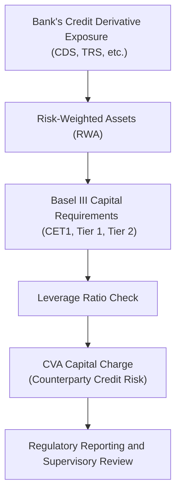

## Understanding the Regulatory Capital Landscape

I remember the first time I came across capital requirements for credit derivatives. I thought, “Wait, how on earth do I measure risk on a product that’s already a hedge?” If you’ve ever felt dizzy from the intricacies of bank regulations, especially under frameworks like Basel III, you’re not alone. Fortunately, once you peel back the many layers, you’ll see that it’s all about ensuring financial stability and minimizing the chances of large-scale defaults that could upset the entire banking system.

The Basel III framework—and subsequent updates—set the foundation for how much capital banks need to hold against various exposures, including those arising from credit derivatives like credit default swaps (CDS), total return swaps, and other forms of structured instruments. Sure, it can get a bit technical, but understanding these requirements is crucial if you want to properly assess the risk-reward trade-offs of these investments or hedges.

## Basel III and Capital Adequacy

At the heart of regulatory capital requirements for credit derivatives lies Basel III, a global regulatory framework developed by the Basel Committee on Banking Supervision. Basel III aims to strengthen bank capital requirements by increasing their liquidity and decreasing their leverage. 

Three main pillars guide the Basel III approach:
• Minimum Capital Requirements  
• Supervisory Review Process  
• Market Discipline  

For credit derivatives, especially, these pillars manifest in rules around:
• Risk-Weighted Assets (RWA)  
• Leverage Ratio  
• Credit Valuation Adjustment (CVA) capital charges  
• Liquidity Coverage and Net Stable Funding Ratios (for broader solvency considerations)  

Alright, that might still sound pretty stiff, but trust me, it’s the bedrock of global banking safety nets. Let’s break down some of the nitty-gritty.

## Risk-Weighted Assets (RWA) for Credit Derivatives

The concept of Risk-Weighted Assets is central to how banks calculate their capital requirements. In essence, RWA assigns different risk weights to different asset classes—like corporate loans, mortgages, or credit derivatives—to determine the total amount of capital a bank must hold. The higher the risk of a particular asset from a regulatory standpoint, the higher the risk weight, and the more capital the bank needs to set aside.

When it comes to credit derivatives:
• Potential Future Exposure (PFE): Regulators demand that banks account not only for current exposures but also for how these exposures could evolve over time.  
• Counterparty Credit Risk (CCR): If you enter a CDS contract, there’s always the possibility the counterparty might fail to make payments when required. This risk is factored into the bank’s RWA computations.  

Think of RWAs like the yardstick regulators use to approximate how risky a bank’s overall portfolio is. With credit derivatives, possible default events or shifts in credit quality can be tricky to assess. Consequently, regulators use predetermined models or standardized approaches (sometimes with internal models embedded) to assign capital based on historically observed or stress-tested variations in credit spreads and default rates.

## The Role of Credit Risk Mitigation (CRM)

Now, banks can reduce their capital charges if they show that their positions are effectively hedged, a concept referred to as Credit Risk Mitigation. If a bank holds, say, a CDS that offsets an underlying corporate bond exposure and meets all the regulatory documentation and liquidation threshold rules, then it may be allowed to lower the RWA on the underlying exposure.

For instance, let’s imagine a bank with a sizable portfolio of corporate bonds from a AAA-rated issuer. Normally, you might say, “That’s not too risky.” But if the bank obtains a CDS from a top-tier counterparty, regulators might allow the bank to treat that corporate bond as less risky still—if the CDS meets strict eligibility criteria (like correct documentation, enforceability, correlation constraints, and so on).

However, regulators aren’t handing out free passes. The hedging strategy must be robust; and the terms of the CDS (or other derivative hedge) must match the cash exposure in both maturity and credit events. Often, the mismatch or basis risk between the underlying exposure and the hedge can reduce the capital relief.

## Leverage Ratio and the CVA Capital Charge

Basel III introduced the leverage ratio to ensure that banks have enough capital relative to their total assets (including off-balance-sheet exposures). This is a non-risk-based measure, meaning it doesn’t factor in risk weights or sophisticated hedges. It just looks at the raw exposure. Credit derivatives aren’t exempt, so any large exposure from, say, an unhedged sale of protection in a CDS, directly impacts the leverage ratio.

Alongside this, the CVA (Credit Valuation Adjustment) capital charge captures the risk of mark-to-market losses on the derivative if the counterparty’s creditworthiness deteriorates. In simpler terms, the CVA tries to measure how the potential default or downgrade of a counterparty might reduce the value of the bank’s derivative position. For bilateral OTC trades (i.e., those not cleared through a recognized Central Counterparty), CVA capital charges can be quite substantial.

Here’s a simple illustration in which a bank buys protection via a CDS on a bond portfolio from Counterparty X. If X’s credit rating deteriorates, the bank’s “insurance” might become less valuable, since the insurance provider’s ability to pay is now in question. This risk is accounted for under the CVA charges.

## Clearing Mandates and the Push for Central Counterparties (CCPs)

Regulators worldwide, from the U.S. to the EU and beyond, have introduced requirements mandating certain standardized credit derivatives to be cleared through CCPs. The goal here is to reduce systemic risk by transferring counterparty risk to a central clearinghouse that is (in theory) well-collateralized.

A central counterparty sits in the middle of each trade, acting as the buyer to every seller and the seller to every buyer. This approach diffuses concentration risk away from single, large bilateral counterparties. Netting arrangements become simpler, margin requirements get standardized, and overall transparency increases. That said, clearing derivatives through a CCP isn’t free. Clearing members must post variation and initial margins, and they’ll incur operational and membership costs. Still, from a regulatory perspective, if your credit derivatives are centrally cleared, you might face lower capital charges than if you remain in the uncleared, bilateral market.

## Visualizing the Flow of Capital Requirements

Sometimes, a quick visual can help. Below is a Mermaid flowchart describing how a bank’s exposures to credit derivatives might feed into its capital requirements.

• A: The bank holds credit derivatives—maybe as buyer or seller of protection.  
• B: The bank calculates RWA, factoring in potential future exposure and other market or credit risks.  
• C: The total RWA helps determine how much capital must be held in different capital tiers, consistent with Basel III.  
• D: Supervisors also look at the bank’s Leverage Ratio, which is always non-risk-based.  
• E: CVA risk adds a layer of capital requirement for possible credit deterioration of counterparties.  
• F: In the end, the bank must report all of this to regulators, who then evaluate the bank’s solvency and risk management processes.

## Considerations for Practical Application

Hedging Correlation and Basis Risks  
Banks have to prove that their credit derivative hedges effectively reduce the risk of the underlying exposures. If the reference entity (in the CDS) isn’t the same as the underlying bond or loan, or if the maturity mismatch is substantial, the regulator might not grant full capital relief.

Documentation and Legal Certainty  
We can’t talk about capital relief without emphasizing the sheer importance of robust documentation. In some banks, I’ve heard colleagues joke that you spend more time verifying the legal clauses than analyzing the trade itself. Regulators require ironclad documentation that ensures the hedge will pay off under the same conditions that the underlying exposure would realize losses.

Margin Requirements for OTC vs. Cleared Trades  
Uncleared trades come with higher margin requirements and more burdensome capital charges. CCP-clearing may reduce these charges, but membership requirements and central clearing fees can also be a burden—particularly if you’re a smaller institution without direct clearing membership.

Body of Knowledge from Other Sections  
If you’d like a reminder on how credit derivatives work in general, recall that earlier sections in this chapter (see 5.1 Basics of Credit Default Swaps and 5.2 Single-Name, Index, and Basket Swaps) help lay the groundwork. In short, credit derivatives are used to either hedge or gain exposure to a reference entity’s credit risk. But the more banks rely on these instruments, the more regulators want them to hold capital to cover potential blowups.

## Personal Observation

You know, whenever I see an exam question on capital requirements, I immediately look for potential red flags: large notional exposures, weak counterparties, or mismatched maturities. In practice, regulators have added layers of checks—the supervisory review, stress testing, ongoing regulatory reporting—making it less likely for a single, large derivative position to topple the entire system. That said, during times of crisis, credit spreads can swing wildly, and the mark-to-market on your hedge can move in unexpected ways—so you always want to have a margin of safety in your capital.

## Potential Pitfalls and Best Practices

• Ignoring Close-Out Netting: You might assume your exposures net out nicely in a crisis, but regulators need formal netting agreements to allow netting in the RWA calculation. Don’t assume them off the bat.  
• Siloed Reporting: If your bank’s trading desk doesn’t coordinate with the back office, you might incorrectly calculate your RWA or CVA charges. Good data integration and real-time risk measurement systems are key.  
• Overreliance on “High Quality” Counterparties: Even if your derivative counterparty is a major global bank, that doesn’t guarantee no CVA capital charges. Always incorporate realistic evaluations of potential downgrades.  
• Not Keeping Up with Regulatory Updates: Requirements evolve. Basel IV (sometimes referred to as Basel 3.1) introduces further refinements, so you’ve got to stay attuned to changes that could impact how you measure risk.

## Conclusion and Exam Tips

Regulatory capital requirements for credit derivatives may seem labyrinthine. But as you prepare for your exams—and more importantly, for professional practice—just remember these fundamental questions:
• Is the derivative exposure properly captured in RWA calculations?  
• Are you hedging with recognized CRM strategies that genuinely reduce risk?  
• Have you accounted for CVA, especially in bilateral OTC trades?  
• Are there netting or margin frameworks that reduce capital charges?  

For many CFA-style exam questions—especially scenario-based or item set formats—you’ll likely be asked about how a bank can reduce its capital charge through appropriate hedging or netting. Be prepared to discuss how mismatched maturities or poor documentation might reduce or nullify that capital relief. Also, keep in mind the interplay between the leverage ratio and the risk-based measures—one is not a substitute for the other.

Given the breadth and complexity of these rules, staying up to date with the latest regulatory pronouncements is critical. The Basel Committee on Banking Supervision (BCBS) frequently refines its guidance, and national regulators may add another layer of local rules. If you embrace the complexity and watch for the genuine economic risk in your derivatives transactions, you’ll be in good shape to tackle any exam question that comes your way.

## References and Further Reading

• Basel Committee on Banking Supervision. Available at:  
  https://www.bis.org/bcbs/  

• Resti, A. & Sironi, A. (2008). “Risk Management and Shareholders’ Value in Banking.” Wiley.  

• Fabozzi, F. (2016). “Bond Markets, Analysis, and Strategies.” Pearson.  

• For additional details on credit derivatives and their use in risk management, see Chapter 5 of this volume, particularly sections 5.1 and 5.2 for an introduction to CDS and portfolio hedging.  

---------------------------------------------------------------------------------

## Assess Your Understanding: Regulatory Capital Requirements for Credit Derivatives



### Under the Basel III framework, what is the main purpose of Risk-Weighted Assets (RWA)?

- [ ] To evaluate netting agreements for derivative transactions only.
- [x] To assign different weights to various assets based on associated risk and determine required capital levels.
- [ ] To calculate the maximum notional amount a bank can have for credit derivatives.
- [ ] To eliminate capital requirements for well-collateralized positions.

> **Explanation:** RWA is used to differentiate the relative risk of assets and exposures, thereby guiding how much capital a bank must hold.

### What is one key requirement for a bank to receive credit risk mitigation (CRM) benefits from a CDS?

- [ ] The CDS must be purchased from a less creditworthy counterparty.
- [ ] The CDS must reference a different obligor with no maturity overlap.
- [x] The CDS must effectively hedge the same underlying exposure, supported by proper documentation.
- [ ] The CDS must be uncleared and not margined.

> **Explanation:** To gain capital relief, regulators require that the CDS matches the underlying exposure’s maturity and reference entity, with robust legal and documentation standards.

### When determining the CVA capital charge, which aspect is a primary concern?

- [ ] The short-term interest rate environment.
- [x] The potential deterioration in counterparties’ creditworthiness and its impact on the derivative’s fair value.
- [ ] The notional value of the entire derivatives book.
- [ ] The cost of physically delivering the underlying asset at maturity.

> **Explanation:** The CVA capital charge focuses on the risk that the counterparty’s credit quality decreases, diminishing the value of the derivatives.

### How does clearing a standardized credit derivative through a central counterparty (CCP) typically affect a bank's regulatory capital requirement?

- [x] It generally reduces capital charges due to lower counterparty credit risk.
- [ ] It automatically eliminates all capital requirements for that derivative.
- [ ] It increases exposure to the reference entity’s default risk beyond normal levels.
- [ ] It has no impact on capital requirements related to the derivative.

> **Explanation:** CCP clearing lowers systemic and bilateral counterparty risks, so regulators often grant reduced capital requirements.

### Which of the following best describes the leverage ratio under Basel III?

- [ ] A risk-sensitive ratio that adjusts for each asset's risk weight.
- [x] A simple, non-risk-based measure comparing Tier 1 capital to total exposures.
- [ ] An advanced ratio that substitutes for all forms of RWA calculations.
- [ ] An indicator specific to retail mortgage exposures.

> **Explanation:** The leverage ratio is a backstop measure ensuring banks do not over-leverage, ignoring risk-weighting and focusing on total exposures versus Tier 1 capital.

### In the context of capital requirements for credit derivatives, what is “basis risk”?

- [ ] The risk that the underlying entity defaults.
- [x] The risk that the hedge (CDS) does not perfectly match the underlying exposure, causing imperfect offset.
- [ ] The risk that short-term interest rates will rise, affecting bond prices.
- [ ] The risk that margin calls will be incorrectly calculated.

> **Explanation:** Basis risk arises when the reference entity’s price movements differ from those of the hedged instrument, undermining the effectiveness of the hedge.

### Which of the following is a challenge in applying credit risk mitigation (CRM) for bank capital relief?

- [x] Demonstrating legal enforceability and matching maturities for hedging instruments.
- [ ] Proving that clearing a derivative through a CCP introduces more tail risk.
- [ ] Showing that the underlying exposure is riskier when hedged with CDS.
- [ ] Reducing capital through misaligned netting agreements.

> **Explanation:** Regulators require robust legal documentation and maturity alignment before approving CRM capital relief for hedges.

### Under Basel III, what is the primary role of the supervisory review process concerning credit derivatives?

- [ ] It solely reviews interest rate risk in the banking book.
- [x] It evaluates whether the bank’s internal risk controls and capital assessments are adequate.
- [ ] It quantifies the exact exposure of each credit derivative.
- [ ] It calculates the final capital requirement on behalf of the bank.

> **Explanation:** The supervisory review confirms that the bank’s management of credit derivative exposures and risk-based capital calculations are aligned with regulatory expectations.

### Why might a bank choose to clear credit derivatives with a CCP despite the membership fees and margin requirements?

- [ ] To expand net exposure and reduce hedging costs.
- [ ] To avoid having to post any initial margin.
- [x] To access potentially lower capital charges and reduce bilateral counterparty risk.
- [ ] To ensure that it remains outside the scope of supervisory stress tests.

> **Explanation:** Clearing can lower capital requirements because regulators generally view CCPs as safer from a counterparty perspective, even though clearing entails membership and margin expenses.

### A bank’s exposure to credit derivatives cleared through a CCP has what effect on its leverage ratio calculation?

- [x] True
- [ ] False

> **Explanation:** CCP-cleared exposures still count toward the leverage ratio, albeit the risk-weighted capital requirements might be lower. The leverage ratio does not discriminate by risk.


