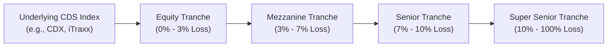

## Introduction
I distinctly remember the first time I learned about collateralized debt obligations (CDOs) and thought, “Wow, slicing and dicing credit risk can get complicated.” Then, when I discovered Credit Default Swap (CDS) indexes and their tranches, I realized: oh boy, there's an entire universe of layered credit risk out there. CDS index tranches might feel a bit like financial wizardry, but don’t worry. By the end of this section, you’ll see how these instruments are simply a systematic way to split up credit exposure—sometimes giving you more risk, sometimes giving you less, and always giving you something interesting to analyze.

A CDS index, like the well-known CDX in North America or iTraxx in Europe, is a basket of single-name CDS positions on different corporate (or sometimes sovereign) reference entities. Instead of buying or selling protection on one entity, you buy or sell protection on an entire portfolio. But, as practical as that is, investors often want finer control over how much risk they’re taking. Enter tranches: a neat technique to partition credit risk in the index into layers based on defined attachment and detachment points.

Below, we’ll explore how these tranches work, why correlation is crucial, practical examples of their use, and the key pitfalls to watch for. We’ll keep it slightly informal—kind of like chatting at a café—yet still thorough enough to prepare you for derivatives-based exam questions and real-world portfolio management decisions.

## Tranche Mechanics
At its most basic, a CDS index tranche allows you to choose where you want to sit in the “loss waterfall.” If the companies within your CDS index start defaulting, the first few percentage points of losses hit the Equity Tranche (the riskiest layer). Above the Equity Tranche lies the Mezzanine Tranche, which absorbs losses once the equity layer is used up. Then, the Senior Tranche and even Super Senior Tranche come next, each with progressively lower probability of actually seeing a principal hit—yet correspondingly lower spreads (and returns) for investors.

In each tranche, you have two key thresholds:  
• Attachment Point: The cumulative loss level at which a particular tranche starts losing principal (or “attaches” to losses).  
• Detachment Point: The cumulative loss level at which the tranche is fully wiped out (or “detaches” from losses), and the next tranche begins to bear losses.

For example, an Equity Tranche might be defined from 0% to 3% of total notional, the Mezzanine from 3% to 7%, Senior from 7% to 10%, and so on. Let’s visualize this in a quick diagram:

Essentially, the equity investor is the first line of defense; they get hammered right away if defaults occur. The mezz exposure only starts taking losses if cumulative defaults exceed the equity slice. And so forth.

## Why Tranching?
Tranching is basically about giving investors more choices and more nuance. Some folks like really big risk and the possibility of high returns—they might go for the equity slice of the CDS index. Others prefer to lock in smaller coupons but with a more remote risk of default—they’ll opt for senior or super senior. Tranching also helps tailor strategies for hedging credit portfolios. Banks, for instance, might hold a senior tranche that protects them from catastrophic losses, or take a mezz tranche to offset some moderate credit risk in an existing portfolio.

## The Role of Default Correlation
Correlation is a huge factor in how these tranches behave, so let’s talk about that. If you purchase a mezzanine tranche, you’re basically betting that the number of defaults in the portfolio will be neither too few (which benefits only the equity piece) nor too many (which eventually slams you in mezz if the equity gets exhausted). The level of correlation among the names in the index heavily influences this shape of losses.

• High correlation means the portfolio’s constituent credits tend to default together. In a high-correlation scenario, you either face relatively few defaults or they all come in a huge wave.  
• Low correlation implies defaults are more spread out among the many reference entities.

Why does correlation matter so much? Because it affects the probability that a particular “slice” of losses (for instance, 3% to 7% of the portfolio) gets hit. If correlation is high, you might see either no defaults or a big chunk of defaults—so the mezz piece is more at risk of being hammered, as losses can jump quickly past the equity cushion. Meanwhile, under low correlation, losses happen in a more measured manner, which might keep the mezz from being fully tapped.

Investors who buy or sell these tranches therefore have exposure to something called “base correlation,” which is the implied correlation used in standard models (like the one-factor Gaussian copula approach, traditionally used in credit derivatives). “Correlation traders” take positions in different tranches, attempting to profit from changes in implied correlation levels rather than just from changes in individual credit spreads.  

## Pricing and Valuation Basics
Think of pricing a CDS tranche much like you price a single-name CDS but with an added dimension: you need the expected loss distribution for that slice of risk, which depends on the correlation among names. Tranche market quotes usually come in two forms:

• The spread (or premium) the protection buyer pays.  
• The upfront payment (in some cases) to reflect immediate risk and the difference from a standardized coupon.

Mathematically, you’d sum up the expected (discounted) premium leg across the life of the tranche and equate it to the expected (discounted) protection leg (i.e., the expected losses that shall be covered by the protection seller). But what’s tricky is computing those expected losses for that 4% slice of the portfolio. You need a model that simulates how many defaults happen out of, say, 100 names, and how that sum of defaults intersects with your 3%–7% band. The correlation is crucial to your probability distribution.

A simplified (and somewhat informal) expression for the fair spread S of a tranche might look like:


\text{Tranche Spread} \approx \frac{\text{Expected Loss on the Tranche}}{\text{Duration of the Tranche}}


This is just a schematic. In practice, market participants often use a base correlation curve: they take each tranche individually, assume a single correlation parameter that explains its observed spread, and then piece them together. This “implied correlation surface” is an entire subfield of credit derivatives.

## Applications in Portfolio Management
CDS index tranches are used by hedge funds, banks, insurance companies, and other institutions for a variety of reasons:

• Hedging Specific Risk Tiers: A bank heavily exposed to moderate credit risk might short the mezz tranche of a CDS index to offset that layer of potential losses.  
• Correlation Trading: Some managers profit from changes in correlations by going long one tranche and short another, effectively taking a “view” on how defaults in the underlying portfolio might cluster.  
• Yield Enhancement: Investors comfortable with non-investment-grade risk might buy the equity tranche, aiming for higher coupon income.  
• Tactical Plays: If you expect a calm credit environment with stable or falling default rates, an equity or mezzanine position could be a big winner. Conversely, if you think the world’s heading for trouble, shorting lower tranches might offer a hedge or profit from rising spreads.

## Real-World Example (Hypothetical Numbers)
Let’s take a fictional CDS index with 100 equally weighted names, each with USD 1 million notional, for a total of USD 100 million in protection. You have the following tranches and their approximate annual spreads:

• Equity Tranche (0%–3%): 500 bps  
• Mezzanine Tranche (3%–7%): 230 bps  
• Senior Tranche (7%–10%): 80 bps  
• Super Senior Tranche (10%–100%): 40 bps  

Now, if 4% of the portfolio defaults (i.e., USD 4 million in notional), the equity tranche gets fully used up (3%) plus 1% more from the mezz. Suppose the recovery rate is 40%. That means the actual portfolio loss is 60% of USD 4 million = USD 2.4 million in realized credit losses. But from a layering perspective:

• Equity holders face 3% of the 4% losses, i.e., 3% of the total USD 100 million (USD 3 million) at 60% severity = USD 1.8 million in realized loss.  
• Mezz holders are on the hook for that extra 1% of the notional above 3% (the detachment of equity)—that’s USD 1 million at 60% severity = USD 0.6 million in realized loss.  
• Senior and super senior remain intact because the portfolio’s total default is still below 7%.  

This is a simplistic illustration, but it highlights how the layering logic works out.

## Key Glossary Terms
• **Attachment Point**: The threshold (expressed as a % of the index notional) where a particular tranche starts absorbing losses.  
• **Detachment Point**: The threshold at which that tranche is fully written down; losses beyond this move to the next tranche.  
• **Mezzanine Tranche**: The middle layer, taking losses after equity is used up but before senior.  
• **Correlation Trading**: Strategies that rely on changes in implied correlation rather than changes in individual credit spreads.  

## Best Practices and Common Pitfalls
• **Model Risk**: Using a flawed correlation model can severely misprice a tranche. Markets might price correlation differently from standard theoretical assumptions.  
• **Liquidity Concerns**: Not all tranches trade frequently, so wide bid-ask spreads can hamper your ability to exit or roll the position.  
• **Sudden Credit Shocks**: If the portfolio experiences quick defaults among correlated names, mezzanine or even senior tranches can get hammered faster than expected.  
• **Operational Complexity**: Understanding how the different legs of a CDS index roll over, how standard coupons are set, and how partial triggers are handled can be complicated.  
• **Over-Reliance on Historical Data**: Past default correlation patterns might not hold in future markets—especially in systemic crises.

## Conclusion
CDS index tranches take the idea of a single-name CDS and amplify it with a healthy dose of correlation and layered risk complexity. They let you fine-tune a credit exposure, from that nail-biting equity slice to the relatively safer senior or super senior slices. And yeah, they can definitely get tricky. But if you do your homework—understand correlation, keep an eye on liquidity, and watch for macro credit conditions—you can tailor your credit position in ways single-name CDS can’t match.

For exam prep, focus on the mechanics of attachment/detachment, how correlation affects each tranche, and the typical risk/return profiles. In the real world, remember that correlation can change quickly, turning a once-benign mezz position into a big headache if defaults spike in a short time. As always, weigh the potential yield pick-up against the complexity and inherent risk.

## Final Exam Tips
• When faced with a question on tranching, highlight the role of credit correlation and how it influences the probability that each layer gets hit.  
• Expect item-set questions that might give you default rates, recovery rates, or correlation assumptions. Be prepared to parse which tranche absorbs what portion of losses.  
• On essay (constructed-response) scenarios, use clear, step-by-step logic to show how the equity, mezzanine, and senior layers pay out or get impacted.  
• Be mindful of how standardization (especially in index tranches like CDX or iTraxx) makes the instruments more liquid and easier to trade, especially relative to old bespoke CDO tranches.  
• Time management: Spend enough time clarifying your assumptions on correlation, default probability, and recovery rates before crunching the numbers.  

## References
- Fender, I. & Scheicher, M. (2008). “The Pricing of Subprime Mortgage Risk in Good Times and Bad.” BIS Quarterly Review.  
- CME Group on CDS Index Products: https://www.cmegroup.com/  
- Gibson, M.S. (2007). “Credit Derivatives and Risk Management.” FRB International Finance Discussion.  
- Hull, J. (2022). Options, Futures, and Other Derivatives. 11th ed. Pearson.  
- CFA Institute. (Most Recent Edition). CFA Program Curriculum, Level I, Volume 7: Derivatives.  
- Tuckman, B. & Serrat, P. (2011). Fixed Income Securities: Tools for Today’s Markets. 3rd ed. Wiley.  

## Test Your Knowledge: Understanding CDS Index Tranches and Correlation



### Which best describes a CDS index tranche’s attachment point?

- [ ] It refers to the final threshold where the tranche no longer suffers losses.
- [ ] It is the same as the credit spread paid by the tranche.
- [x] It is the threshold where the tranche begins absorbing losses from the underlying portfolio.
- [ ] It is the discount rate used to price the tranche’s expected cash flows.

> **Explanation:** The attachment point is the percentage of portfolio-level losses at which a specified tranche starts to absorb credit losses.

### A CDS mezzanine tranche typically absorbs losses:

- [ ] First, before the equity tranche.  
- [x] After the equity tranche has been fully exhausted but before senior tranches.  
- [ ] Only in high correlation scenarios.  
- [ ] Only if the super senior tranche has already been wiped out.  

> **Explanation:** By design, a mezzanine tranche sits between equity and senior tranches, taking losses only after the equity layer is depleted.

### When default correlation among the names in a CDS index is high, which is most likely true regarding tranche losses?

- [x] Either very few or very many defaults occur, increasing the mezzanine tranche’s risk.  
- [ ] Losses remain “smoothed out,” so the equity layer typically faces more frequent but smaller hits.  
- [ ] The senior tranche always faces the greatest risk.  
- [ ] The correlation does not affect the mezzanine tranche’s probability of experiencing losses.  

> **Explanation:** High correlation increases the chance that defaults come in clusters, which can quickly blow through the equity tranche and harm mezzanine holders.

### In pricing a CDS index tranche, the premium is primarily a function of:

- [ ] The ratio of senior to equity indexes.  
- [x] The expected loss distribution within a specific loss band of the underlying index.  
- [ ] The difference between single-name CDS spreads in the basket.  
- [ ] An arbitrarily fixed coupon set by the clearinghouse.  

> **Explanation:** Each tranche’s fair premium (or spread) depends on the expected (discounted) losses in its attachment-detachment range, driven by default probabilities and correlations.

### Which of the following is a reason investors trade CDS index tranches specifically?

- [x] They can tailor credit exposure to a chosen level of subordinate or senior risk.  
- [ ] They are mandated by regulatory bodies to hold only senior tranches.  
- [ ] They will never lose principal once they exceed the attachment point.  
- [ ] They avoid correlation risk entirely.  

> **Explanation:** One major benefit of a tranche exposure is the ability to pick a specific slice of the credit risk, from highly risky (equity) to more protected (senior).

### If a CDS index’s equity tranche is fully hit by defaults, which statement is correct?

- [ ] Mezzanine, senior, and super senior tranches all remain unaffected indefinitely.  
- [ ] The next round of defaults still affects the equity tranche.  
- [x] Future defaults move into the mezzanine tranche’s layer.  
- [ ] The entire structure ceases to function and the index terminates.  

> **Explanation:** Once the equity layer is exhausted, further losses accumulate in the mezzanine tranche up to its detachment point before moving on.

### A “base correlation” approach to pricing tranches involves:

- [x] Inferring the implied correlation by matching a model to observed market spreads for standard tranches.  
- [ ] Using the exact correlation for every single pair of entities in the index.  
- [ ] Setting correlation to zero for the equity tranche and ignoring correlation for senior tranches.  
- [ ] Avoiding any reference to correlation altogether.  

> **Explanation:** Market practitioners derive an implied correlation for each standard tranche, creating a “base correlation curve” that helps price custom or off-market tranches.

### Which factor most impacts the magnitude of losses in a senior CDS index tranche?

- [x] The overall number of defaults that breach both equity and mezzanine layers.  
- [ ] Only the first few defaults in the portfolio.  
- [ ] The notional of the equity tranche alone.  
- [ ] A high recovery rate for junior tranches.  

> **Explanation:** Senior tranches only get exposed after the lower tranches are consumed by sufficient defaults, so the quantity and severity of defaults that surpass the earlier layers is critical.

### One typical pitfall when investing in mezzanine CDS index tranches is:

- [ ] Overestimating the notional principal protected by super senior tranches.  
- [ ] Believing that correlation does not matter if the equity tranche is large enough.  
- [ ] Assuming that mezzanine tranches always have near-zero yields.  
- [x] Underestimating the portfolio’s default correlation, which can significantly intensify mezzanine losses.  

> **Explanation:** Underestimating the chance of correlated defaults is a classic error, leading to bigger losses than expected if the portfolio defaults cluster.

### In a high-correlation environment, an investor who wants the safest slice of a CDS index might logically:

- [x] Buy the senior or super senior tranche.  
- [ ] Go long the equity tranche for stable returns.  
- [ ] Short the senior tranche to bet on early defaults.  
- [ ] Immediately close out all positions in the index.  

> **Explanation:** In high-correlation scenarios, the lower tranches face more risk of being wiped out quickly. Senior/super-senior positions are comparatively safer.


