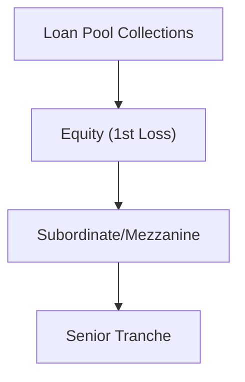

## Introduction

If you've ever found yourself peering into the world of structured finance—especially mortgage-backed securities (MBS), collateralized loan obligations (CLOs), or other asset-backed securities (ABS)—you've likely heard about Credit Default Swaps (CDS) on these products. They’re pretty similar to the more familiar corporate CDS but, let’s be honest, have a few twists and turns that might make your head spin at first. I remember my first encounter with ABS CDS over coffee at a conference: I listened, wide-eyed, as a trader discussed "trigger breaches," "waterfall structures," and the sometimes-limited liquidity in these instruments post-2008. It sounded complicated, but fascinating.

Here, we’ll demystify the mechanics of ABS CDS, paying special attention to the unique nuances compared to plain vanilla corporate CDS. We’ll also explore the essential role they play for traders, asset managers, and other market participants in hedging risk or expressing specific views on structured products. Ready to dive in?

## Key Features and Structural Elements

Credit Default Swaps on asset-backed securities function in concept much like corporate CDS, but the underlying reference entity is a debt tranche from a pool of assets rather than a single corporate issuer. For example, you might encounter:

• An MBS (mortgage-backed security) pool.  
• A CLO (collateralized loan obligation) composed largely of syndicated bank loans.  
• A variety of other ABS types (automobile loan pools, credit card receivables, etc.).

Still, the central premise remains: The CDS protection buyer pays a periodic premium (the “spread” or “CDS premium”) to the protection seller. If a defined credit event occurs—often more nuanced than a simple bankruptcy or failure to pay—the protection buyer may receive a settlement compensating them for losses.

### ABS-Specific Credit Event Definitions

In corporate CDS, a “credit event” could be bankruptcy, failure to pay, or restructuring. However, for ABS, you might hear about:

• Principal Write-Down (PWD): If the outstanding principal on a particular tranche is reduced (“written down”), this could trigger protection.  
• Interest Shortfall: If interest payments at a given period are insufficient to pay the tranche in full, some ABS CDS contracts define this shortage as a trigger.  
• Distressed Ratings Downgrade: Some older contracts used rating downgrades below a specified threshold as triggers (though this is less common now due to complexities discovered during the subprime crisis).

Because these triggers relate to specific structural features—like subordination levels, performance triggers, or waterfalls—an ABS CDS can be more complicated to interpret. The contract language attempts to map events like shortfalls in principal or interest to a standard “credit event,” but you’ll note each contract can vary. Hey, it’s part of the fun, right?

## Risk Mitigation and Speculative Uses

Just like corporate CDS, an ABS CDS can be used for hedging or speculation:

• Hedging: A bank holding a position in, say, a mezzanine tranche of a CLO might purchase CDS protection on that tranche. If the underlying loans deteriorate in quality and the mezzanine holder faces losses, the CDS payoff should offset at least part of the lost value.  
• Speculation or Market Exposure: Others simply want exposure to the structured product’s risk profile without the complexity of directly buying the underlying security. A speculative investor anticipating a wave of defaults might buy CDS protection on an MBS pool they believe is about to experience heavy mortgage defaults.

A big plus? You can isolate exposure to a certain part of the capital structure. Maybe you want to focus on subordinated tranches that yield more premium. Or if you feel bullish on the senior tranches (thinking that defaults won’t breach the subordination), you might sell CDS protection on those top slices.

## The Waterfall: Understanding Payment and Loss Flows

One of the trickiest aspects of asset-backed securities is their “waterfall” structure. In these deals, cash flows from the underlying loan pool get distributed to tranches in order of seniority. If losses occur, they usually “eat through” the junior tranches first. Think of it like pouring water into a series of buckets, each representing a tranche. The top bucket is the senior tranche, which gets filled first. Meanwhile, the bottom-most bucket (equity or residual tranche) might absorb everything leftover—great if the underlying performs well, stressful if it doesn’t.

### Visualizing a Typical ABS Tranche Structure

Below is a simplified diagram showing how a typical ABS might allocate payments under normal conditions, followed by how that changes if losses mount:

• First, collections from the underlying loans flow to cover the most senior debt claims (D).  
• If there’s leftover cash, it moves down to the mezzanine or subordinate tranches (C).  
• Finally, the equity tranche (B) receives any excess.  
• Losses flow in the reverse order, hitting equity first, then the mezzanine, then the senior.

With a CDS on these tranches, your credit event definitions often revolve around how these buckets are impacted by defaults or shortfalls. The complexity in structuring these triggers is much higher than your run-of-the-mill corporate CDS.

## Settlement Mechanics

### Physical vs. Cash Settlement

Market conventions often differ, but generally you’ll see:

• Physical Settlement: The CDS buyer can deliver the reference obligation (the actual asset-backed tranche) to the seller in exchange for par value. But if you think about it, an ABS can come in different tranches and classes—identifying a deliverable security can be less straightforward.  
• Cash Settlement: More common for ABS CDS, especially if liquidity is thin. Once a credit event is determined, an auction or market-based mechanism might determine the recovery price for the reference obligation. The protection seller pays the difference between par and this recovery price.  

### Auction Protocols

Post-2008, the industry has tried to use standardized auction protocols to simplify settlement. However, due to the structured nature of ABS, it’s often not as straightforward as for corporate bonds. Sometimes the reference obligations are not as actively traded or might not have a robust secondary market, complicating the price-discovery process.

## Liquidity Considerations and Post-Subprime Realities

There’s no getting around it: The market for ABS CDS dried up dramatically after the 2007–2008 subprime meltdown. While it has recovered to some degree, especially for high-quality MBS or well-known CLOs, it isn’t nearly as large or liquid as the corporate CDS market. This lower liquidity translates into:

• Wider Bid-Ask Spreads: Market makers are more cautious, reflecting greater uncertainty in pricing.  
• Difficulty Exiting Positions: Traders might find it harder to unwind or roll positions if they can’t find a willing counterparty.  
• Potentially Higher Basis Risk: Because the underlying security might not trade frequently, the CDS spread can deviate more from the “true” embedded default risk.

But for specialized investors and those with a strong view on certain segments of the mortgage or loan market, ABS CDS can still be a powerful tool—especially if they spot an idiosyncratic risk that others aren’t pricing correctly.

## Practical Example: Hedging a Mezzanine CLO Tranche

Imagine a hedge fund owns a $10 million mezzanine tranche of a CLO that invests in leveraged loans. The manager is concerned about rising default rates among the underlying borrowers, so they decide to buy protection on the mezzanine tranche via an ABS CDS. Here’s a quick breakdown:

• Tranche Notional: $10 million  
• CDS Spread: 450 basis points (i.e., 4.50% of notional per year)  
• CDS Premium Payment: 4.50% × \$10 million = \$450,000 per year (paid quarterly, semi-annually, or annually depending on the contract)  

If default rates rise and the mezzanine tranche experiences a write-down event, the CDS triggers (assuming the event meets the contract’s definition). The protection buyer receives a payment corresponding to the principal lost, effectively offsetting some or all of the mark-to-market losses on the tranche.

Note that the analysis is complicated by the CLO’s subordination structure, possible triggers (like overcollateralization or interest coverage ratio breaches), and actual realized default levels. But in essence, the CDS helps transform a risky exposure into a risk-mitigated position—at a premium cost, of course.

## Best Practices and Pitfalls

• Understand the Triggers Thoroughly: Each ABS has distinct triggers for credit events. A mismatch between your expectation of “default” and the contract’s formal definition can lead to unpleasant surprises.  
• Monitor Structural Changes: If a deal’s coverage tests or waterfalls change due to external events or deal amendments, your CDS coverage might shift in unexpected ways.  
• Model Liquidity Risk: Even if you find a perfect hedge at inception, the market for that CDS could seize up. Always plan an exit (or at least a set of contingency strategies).  
• Conduct Thorough Due Diligence on the Underlying Assets: Evaluating the loan-level data for an MBS or the corporate credit quality in a CLO is essential. If you skip this step, you’re effectively flying blind.  

## Exam Tips and Summary

From an exam standpoint, especially if you encounter scenario-based questions related to credit derivatives:

• Know the Parallels with Corporate CDS: Premium payments, settlement procedures, buyer vs. seller perspective.  
• Emphasize the Differences: ABS-specific triggers (principal write-down, interest shortfall), waterfalls, and liquidity constraints.  
• Quantitative Aspects: You might see a question requiring you to calculate notional changes after partial write-downs, or to estimate settlement payouts given certain “auction” recovery percentages.  
• Risk Management Angle: The exam loves to test your understanding of how to hedge structured credit risk using derivatives.  
• Regulatory Considerations: You may see references to global oversight, but the main exam emphasis is likely on conceptual understanding of how these instruments function in a risk management or speculative capacity.

In a nutshell: CDS on ABS is a specialized but vital segment of the broader credit derivative market. Despite lower liquidity and a few quirks in settlement and structure, they remain a go-to for those wanting to isolate or hedge credit risk in specific slices of mortgage, loan, or other consumer receivables portfolios.

## References

• Fabozzi, F. (Ed.). (2012). “The Handbook of Mortgage-Backed Securities.” Oxford University Press.  
• SIFMA Research on MBS/ABS Markets: https://www.sifma.org/  
• Gorton, G.B. (2012). “Misunderstanding Financial Crises: Why We Don’t See Them Coming.” Oxford University Press.

---

## Test Your Knowledge: CDS on Asset-Backed Securities



### Which of the following is a unique characteristic of ABS CDS compared to corporate CDS?

- [ ] The buyer of protection pays a fixed premium.  
- [ ] The protection seller compensates the buyer upon default.  
- [x] Credit triggers may include principal write-downs or interest shortfalls.  
- [ ] They are always physically settled.  

> **Explanation:** ABS CDS often include triggers specific to the structure of the asset-backed securities, such as principal write-downs and interest shortfalls, which differ from more standard corporate CDS triggers.

### What is the main purpose of the waterfall structure in ABS?

- [x] It dictates the order in which cash flows and losses are allocated to various tranches.  
- [ ] It increases the liquidity of the ABS in the secondary market.  
- [ ] It standardizes the risk across all tranches.  
- [ ] It is only relevant for equity holders.  

> **Explanation:** The waterfall explains how principal and interest are allocated among different tranches and how losses flow through from the lowest-rated tranches to the highest-rated ones.

### Why did liquidity in ABS CDS markets decline after the 2007–2008 financial crisis?

- [ ] Regulatory prohibition on new CDS contracts.  
- [ ] Lack of interest in structured finance products.  
- [x] Widespread defaults and uncertainty reduced trading and willingness to quote.  
- [ ] ABS CDS became risk-free.  

> **Explanation:** The subprime crisis led to increased uncertainty and heightened risk perception in structured finance products, shrinking the market for new and existing ABS CDS trades.

### Which of the following illustrates a typical credit event for an ABS tranche?

- [ ] Share price collapse.  
- [x] Write-down of the tranche’s principal due to default in the underlying loans.  
- [ ] Management restructuring in the parent company.  
- [ ] Merger of the issuing SPV.  

> **Explanation:** An ABS credit event often involves a principal or interest shortfall. The downfall in underlying loans causes a write-down in the tranche’s principal, triggering CDS.

### In a cash-settled ABS CDS:

- [x] The protection seller pays an amount based on the difference between par and the recovery price determined by an auction or market mechanism.  
- [ ] The protection buyer physically delivers the defaulted asset and receives par value.  
- [ ] Only equity tranches are eligible reference obligations.  
- [ ] Settlement always occurs immediately after the credit event.  

> **Explanation:** Cash settlement typically involves paying the difference between par and the determined recovery price, rather than delivering the physical security.

### How might an investor use ABS CDS for speculation?

- [x] By purchasing protection on a tranche expected to experience increased defaults, aiming to profit if a credit event occurs.  
- [ ] By buying the physical bonds and holding them to maturity.  
- [ ] By purchasing protection only if the underlying credit is already in default.  
- [ ] By always writing protection on the senior tranches.  

> **Explanation:** Investors may buy protection if they anticipate deteriorating credit conditions for that tranche, making a profit when a credit event triggers payout.

### Which of the following best describes a “principal write-down” trigger in an ABS CDS?

- [ ] Mandatory call of the security by the issuer.  
- [ ] Automatic extension of maturity.  
- [x] A partial or total reduction in the principal amount of a specific ABS tranche.  
- [ ] Conversion of the security into equity.  

> **Explanation:** Principal write-down triggers involve reducing the outstanding face amount of the referenced tranche, potentially activating a payout under the CDS.

### What is the advantage of using ABS CDS instead of purchasing the underlying ABS tranche?

- [ ] Lower counterparty risk.  
- [x] Ability to gain or hedge exposure without tying up capital in the physical security.  
- [ ] Guaranteed liquidity at all times.  
- [ ] No premium payments required.  

> **Explanation:** With an ABS CDS, you can gain or hedge exposure to the credit risk of a tranche without buying it outright, which can be capital-efficient.

### Which factor most complicates the pricing of ABS CDS?

- [ ] Standardization of triggers across all deals.  
- [ ] The uniformity of underlying assets.  
- [ ] Reliable rating agency data.  
- [x] Variations in structural features, waterfall triggers, and limited secondary market liquidity.  

> **Explanation:** Each ABS deal can be unique, with different waterfall mechanisms, triggers, and liquidity conditions, creating complexity in pricing.

### True or False: ABS CDS typically show narrower bid-ask spreads than corporate CDS.

- [ ] True  
- [x] False  

> **Explanation:** Due to their specialized nature and the generally lower liquidity of the market, ABS CDS often have wider bid-ask spreads compared to more standardized corporate CDS.


