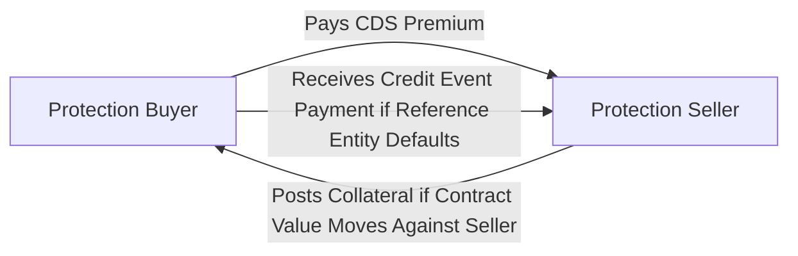
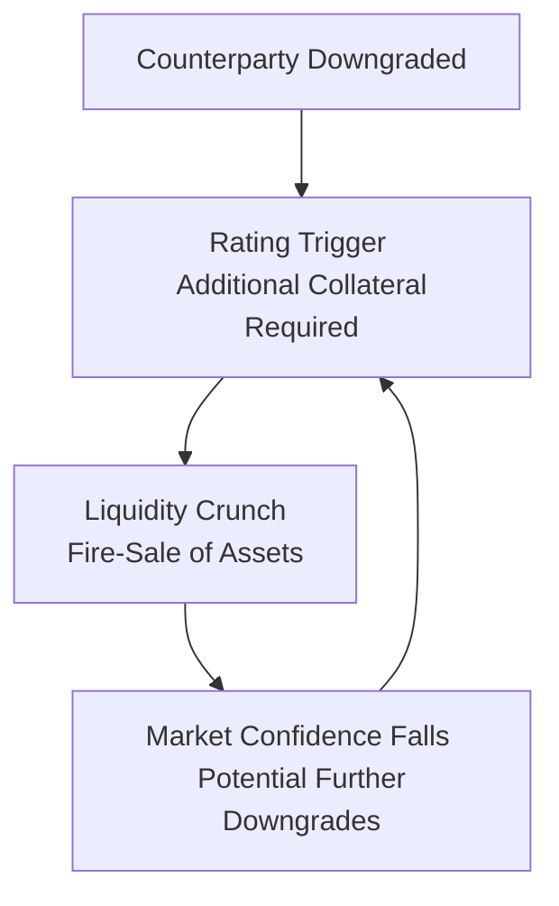

When it comes to credit derivatives—particularly credit default swaps (CDS)—we often focus on the payoff mechanics of protection. The protection buyer pays a premium, the protection seller compensates the buyer if a credit event occurs, and so on. But if you’ve ever found yourself leaning over the trading desk at 2 a.m., double-checking positions, you know the real tension often lies in counterparty risk—essentially, the worry that your trading partner might not hold up their end of the bargain. This discussion tackles that crucial topic: counterparty exposure in CDS trading. We’ll walk through the nature of counterparty risk, how collateral and netting reduce that risk, and the roles of clearinghouses and rating agencies in shaping the exposure landscape. Along the way, I’ll sprinkle in a few personal observations because, well, dealing with real humans on the other side of a contract can get tricky. Let’s dive in.

Understanding the Nature of Counterparty Exposure  
Counterparty exposure arises whenever two private parties—or “counterparties”—enter a derivative contract. In a CDS, the protection seller commits to compensating the buyer if a specified reference entity defaults. But if the protection seller itself is not financially sound (or defaults first), the protection buyer faces the possibility of never receiving any insurance-like payout. Meanwhile, the protection seller also has an exposure if the buyer fails to pay premium installments or settlement fees. So it’s bilateral, though typically the lion’s share of exposure resides with the protection buyer (who is counting on receiving that payout if something goes wrong).

In the old days, we relied on the strength of a counterparty’s balance sheet and a handshake to instill confidence. But times have changed. Large-scale defaults and bankruptcies have taught us that a well-structured set of credit support annexes, netting arrangements, and collateral agreements is absolutely vital. Maybe you’ve heard war stories from the 2008 financial crisis. Some banks discovered that, although they had diligently hedged their positions, the hedges were only as good as the solvency of those behind them. Counterparty exposure in CDS trading can quickly escalate, especially when markets turn volatile.

Managing Exposure: How the Industry Mitigates Risk  
Today, the industry employs a range of techniques to help manage counterparty exposure in CDS:

• Collateral Arrangements. Under an International Swaps and Derivatives Association (ISDA) Master Agreement and a Credit Support Annex (CSA), counterparties agree to post collateral—usually cash or high-quality securities—based on the market value of their positions.  
• Margin Requirements. These margin provisions typically split into initial margin (posted at the start) and variation margin (delivered daily or periodically to reflect mark-to-market changes in the CDS contract).  
• Close-Out Netting. If one party defaults, the other can “close out” all existing trades and net the sums owed, hopefully reducing the net exposure to a smaller amount.  
• Portfolio Reconciliations. Regular checks ensure both sides agree on the mark-to-market valuation and the collateral that should be posted.

To illustrate, imagine you’re a protection buyer holding $10 million notional in CDS from a protection seller. If the mark-to-market estimate of that CDS is $500,000 “in your favor” (i.e., you’d need $500,000 to replace it if your seller vanished), you’d likely require the seller to post enough cash or high-quality securities to cover that $500,000. The moment the contract’s value changes, you reevaluate who owes whom, often every business day, and collateral is transferred accordingly. This ensures that losses linked to a default are mitigated, if not eliminated.

ISDA Master Agreement and CSA in Practice  
In my experience, the ISDA Master Agreement is the real engine that keeps the Over-the-Counter (OTC) derivatives market chugging along. It provides standard definitions, sets forth procedures for handling default, and is recognized by regulators globally. One time, I saw a colleague spend hours scouring the definitions and schedules in a big stack of Master Agreements after a minor credit event triggered cross-default clauses. Isn’t it thrilling stuff?

All jokes aside, the clarity from an ISDA Master Agreement is essential:  
• It defines the close-out netting rules.  
• It lays out how the parties will handle a default or restructuring event.  
• The CSA (Credit Support Annex) appended to the ISDA sets the terms for collateral posting, including the types of collateral accepted (cash, government bonds, etc.), the thresholds beyond which collateral must be posted, and the frequency of margin calls.

No doubt, the detailed schedules can be lengthy and, sometimes, exhausting to read—but they can be the difference between a minor credit event and a global meltdown in your derivatives portfolio.

Collateral Management in CDS Trading  
Collateral is at the heart of managing CDS exposure. Every day, counterparties look at their existing trades, figure out how much they owe each other based on the current market value of the CDS contract, and exchange variation margin. This process is fairly mechanical now, aided by technology platforms that automatically run these calculations. Here’s a simplified foundational example:

1. Start-of-Day Valuation. The protection buyer’s system calculates the fair value of the CDS position. Let’s say the contract has moved in their favor again, presumably because the reference entity’s credit spread has widened, making default insurance more valuable.  
2. Variation Margin Call. The protection buyer sends a margin call to the protection seller reflecting the incremental gain. The protection seller, per the CSA, must post that collateral in a specified timeframe—often by the next business day.  
3. Collateral Transfer. The protection seller delivers the required funds or moves securities into a pledged collateral account.  
4. Daily Re-Evaluation. Next day, the process repeats.

This daily reset significantly reduces credit exposure because both sides are rarely left with large uncollateralized positions for an extended period. I once got teased for describing a well-collateralized position as “sleeping easy at night,” but honestly, that peace of mind is half the point.

Diagram—Basic CDS Flow with Collateral  
Below is a simple Mermaid diagram. The diagram highlights how protection buyer and protection seller exchange premium payments, collateral, and potential default compensation:

Although simplified, this flow captures the essence of how collateral moves with changes in credit risk perceptions.  

Impact of Rating Downgrades  
Another real headache in CDS markets occurs when the protection seller experiences a downgrade from a top credit rating agency. That rating action effectively signals that the seller’s ability to fulfill their obligations has decreased in the eyes of the market. As a result, the terms of the CSA often require the downgraded party to post increased collateral or, in some cases, seek a guarantor or a replacement party. These “ratings triggers” can cause a liquidity crunch, where the downgraded seller scrambles to find additional collateral. At extreme levels, it can trigger a self-reinforcing negative spiral—liquidity drains, credit conditions tighten, counterparties start to back away, and the protection seller faces even more downgrades or credit rating reviews.

I distinctly recall one afternoon at a mid-tier bank that was rumored to be on the brink of a ratings downgrade. Traders were absolutely frantic, pulling credit lines, adjusting CDS premium quotes. The moment the downgrade was confirmed, counterparties demanded more collateral, and the bank was forced to tie up precious cash and securities to cover new margin requirements. This scenario is not hypothetical—it is a real risk that underscores the severe consequences of rating downgrades in CDS trading.

Close-Out Netting  
Close-out netting is a magical phrase that helps keep exposures in check. If there is a default—be it from the protection buyer or the seller—the surviving party doesn’t just lose out on the single trade. Instead, they close out and net the entire set of exposures across all derivatives between them. Imagine you and your counterparty have multiple trades across interest rate swaps, equity swaps, and CDS. Without netting, you’d have to settle each trade separately. With netting, you collapse everything into one net sum. That net sum is typically smaller than the sum of all positives and negatives individually. Practically, netting can reduce the magnitude of claims and, thus, the final exposure to a potential default.

So, if you have a positive value of $1 million from interest rate swaps and a negative value of $800,000 from your CDS trade, netting them might mean you’re effectively owed $200,000 in total. If your counterparty defaults, you’re no longer claiming $1 million on the swaps while worrying about owing $800,000 on the CDS separately—you just look at the net $200,000. This is a critical process in preventing the default of one counterparty from rippling throughout entire markets.

Central Clearing: A Way to Mutualize Risk  
Historically, CDS were traded exclusively in the OTC market, meaning you and I would negotiate the contract privately. But in certain jurisdictions, particularly after the 2008 financial crisis, regulators mandated central clearing for standardized CDS (such as index-based CDS). Central clearing is where a central counterparty (CCP) sits in the middle of the transaction, becoming the buyer to every seller and the seller to every buyer.  

A CCP requires all clearing members to post margins (both initial and variation). By centralizing trades, the CCP can net offsetting positions across all members, which can vastly reduce each member’s net exposure. Plus, there’s a default fund, funded by all participants, which can cover losses if a member defaults and posted margins aren’t enough.  

However, while CCPs reduce bilateral counterparty risk, they introduce a different kind of systemic risk. If the CCP itself experiences distress, it becomes a single point of failure. That’s why CCPs must adhere to strict regulatory standards, maintain robust risk controls, and frequently perform stress tests.

Practical Insights: Minimizing Counterparty Exposure  
• Diversify Your Counterparties. If you rely solely on a single protection seller, you’re exposed if that one party fails. Spreading trades among multiple sellers can reduce that concentration risk.  
• Monitor Credit Signals. Keep an eye on credit ratings, credit spreads, and negative news about your CDS counterparties. Early detection is critical for adjusting positions or requesting additional collateral.  
• Use Standardized Contracts. Standardized CDS index trades can be centrally cleared, thereby reducing bilateral exposure and potentially lowering overall margin requirements through netting with other trades.  
• Stay On Top of Documentation. Keeping track of your ISDA Master Agreements, CSAs, and side letters is a chore, but it’s essential. A single mismatch in collateral terms can leave you exposed.  

Case Study: Impact of Liquidity Crunch  
Let’s reflect on a hypothetical scenario reminiscent of the 2007–2008 meltdown:  
• A mid-sized investment firm is the protection buyer on multiple CDS positions. Its main protection seller experiences financial stress due to a wave of corporate downgrades.  
• The seller’s rating is downgraded from A- to BBB+. Under the CSA, the downgrade triggers a requirement to post an extra $50 million in collateral.  
• Strapped for liquidity, the seller attempts to liquidate some of its other investment assets at fire-sale prices, fueling panic among market participants.  
• As the firm’s collateral is posted slowly or partially, the buyer sees the shortfall and tries to terminate the trades early, hoping to replace them with a more reliable institution.  
• Because of the chaotic environment, few other sellers are able or willing to step in at a reasonable CDS spread, so the buyer ends up paying higher premiums for protection.  

From this scenario, we see that even if the buyer’s claims are ultimately made whole, the transitional period—while the seller scrambles to source collateral—creates operational, market, and liquidity risks for the buyer. Meanwhile, system-wide uncertainty can cause CDS spreads to spike, making protection more expensive.

Mermaid Diagram—Exposure Escalation Due to Downgrade  
Here’s a quick flow of what might happen when a counterparty is downgraded:

You can see how quickly it becomes a reinforcing loop if not managed well.

Regulatory Touch Points and Global Harmonization  
Multiple regulatory bodies oversee the CDS market, each focusing on reducing systemic risk and ensuring that participants adequately manage counterparty exposure. In regions like the United States, the Commodity Futures Trading Commission (CFTC) and the Securities and Exchange Commission (SEC) have authority over CDS clearing and reporting. The European Market Infrastructure Regulation (EMIR) similarly mandates central clearing for eligible CDS in Europe, along with standardized reporting and margin requirements.

Even though the rules vary in detail across jurisdictions, global regulators often work on harmonizing standards via bodies such as the International Organization of Securities Commissions (IOSCO) and the Financial Stability Board (FSB). The idea is that if regulatory approaches differ drastically, it could lead to regulatory arbitrage—where traders shift to whichever jurisdiction has the lightest capital or margin rules. For that reason, the main trends—central clearing, bilateral collateral posting, netting under ISDA—are widely recognized as fundamental to good risk management in CDS.

Best Practices and Common Pitfalls  
• Conduct Stress Tests. Regularly test extreme-but-plausible scenarios, such as multiple downgrades plus a credit event, to see if your collateral and capital are enough.  
• Maintain Adequate Liquidity Reserves. Don’t just rely on posted collateral. Keep some free liquidity on hand in case you need to top up margin unexpectedly.  
• Analyze Cross-Default Clauses. If your counterparty fails in one contract, it might trigger early termination of other contracts you have with them, which complicates your netting calculations.  
• Avoid Over-Reliance on Ratings. Ratings can lag behind market realities. Keep your own internal watchlist or other forward-looking indicators.  
• Reconcile Your Portfolios. A small mismatch in trade economics or notional amounts can grow into a major headache, especially around settlement.

A Quick Anecdote on Collateral Discrepancies  
I once sat in a warm, stuffy back office at 9 p.m. (we’d finished most of the day’s trades) only to discover we had a $2 million discrepancy in collateral calculations with a major counterparty. We realized that both sides had typed “10M” in notional for a certain CDS but the rate was transcribed differently—one side used a 200bps premium, and the other used 220bps. That small difference in the spread changed the mark-to-market calculation. While we sorted it out the next morning, it was a stark reminder: reconciling every detail can be crucial to avoid disputes and unexpected shortfalls.

Conclusion and Exam Tips  
Counterparty exposure in CDS trading might not have the flashiness of analyzing complex payoff structures or advanced models for credit events, but it literally makes or breaks the entire transaction. If your counterparty can’t pay, it doesn’t matter how perfectly you modeled expected losses. The exposure can be managed through careful use of collateral (initial and variation margin), netting, regular reconciliations, prudent watchfulness for rating downgrades, and, where applicable, central clearing. Keep an eye on these risk management steps; understanding them thoroughly will help you not only for the exam but also in real-world risk management and portfolio decision-making.

For the exam, be prepared to:  
• Calculate mark-to-market exposures and required variation margin.  
• Explain how netting reduces gross exposures.  
• Discuss how a downgrade triggers collateral calls and how this impacts liquidity.  
• Compare and contrast bilateral OTC CDS trade structures with centrally cleared CDS.  
• Identify common pitfalls in agreement documentation and how daily reconciliations mitigate them.  

References and Further Reading  
• Anderson, R. (2010). “Credit Derivatives Handbook: Global Perspectives, Innovations, and Market Drivers.” Wiley.  
• Hull, J. & White, A. (2001). “Valuing Credit Default Swaps I: No Counterparty Default Risk.” Journal of Derivatives.  
• CFTC Guidance on OTC Clearing: https://www.cftc.gov/  
• ISDA Master Agreement and Credit Support Annex guidelines at https://www.isda.org/  
• European Market Infrastructure Regulation (EMIR) documentation at https://www.esma.europa.eu/

## Test Your Knowledge: Counterparty Exposure in CDS Quiz



### A CDS contract typically requires daily marking-to-market. What is the key purpose of this mechanism?

- [ ] To charge a one-time premium at initiation.
- [x] To manage and collateralize changes in market value, reducing counterparty risk.
- [ ] To transform a CDS into an exchange-traded option.
- [ ] To eliminate the need for an ISDA Master Agreement.

> **Explanation:** Marking-to-market calculates and reflects the current value of the CDS daily. This ensures that collateral is posted or returned to mitigate exposure from a counterparty default.

### Which of the following is an example of a “ratings trigger” in a CDS context?

- [ ] A sudden drop in the reference entity’s credit spread.
- [x] The requirement to post extra collateral if the protection seller’s credit rating is downgraded.
- [ ] The rise in margin rates unrelated to counterparty credit quality.
- [ ] The random termination of a trade when an investment bank changes risk policy.

> **Explanation:** A ratings trigger is a contractual requirement that compels additional collateral posting or allows termination if a party is downgraded by a credit rating agency.

### What is the principal advantage of using a central counterparty (CCP) for clearing standardized CDS?

- [ ] It eliminates all settlement risk and credit risk.
- [ ] It allows the CDS to trade on exchange like common stocks.
- [x] It mutualizes counterparty risk among members and applies standardized margin requirements.
- [ ] It ensures the reference entity never defaults.

> **Explanation:** Central counterparty clearing reduces each clearing member’s bilateral exposure by standing between buyers and sellers, applying netting across participants and maintaining a default fund.

### In a bilateral OTC CDS, which document typically sets forth the rules for collateral posting and daily margin calls?

- [x] The Credit Support Annex (CSA) to the ISDA Master Agreement.
- [ ] The bond indenture.
- [ ] The prospectus.
- [ ] The central bank directive.

> **Explanation:** The CSA outlines the collateral terms, including thresholds, eligible collateral, and processes for margin calls—vital for managing counterparty exposure.

### What could be a potential outcome if one counterparty to a CDS cannot meet a margin call?

- [x] The other party may move to close out (terminate) the trade and net the exposures.
- [ ] The trade continues unaffected, with no further action required.
- [x] The counterparty could face formal default under the ISDA terms.
- [ ] The reference entity is automatically deemed to have defaulted.

> **Explanation:** Failure to meet a margin call is often categorized as a default event. The non-defaulting party can close out positions and net exposures, as specified in the ISDA Master Agreement.

### Netting arrangements in CDS typically:

- [ ] Increase gross exposures.
- [x] Reduce overall exposures by offsetting amounts owed across multiple trades.
- [ ] Convert a CDS into a leveraged loan.
- [ ] Force trades to be executed on an exchange.

> **Explanation:** Netting is the practice of offsetting the amounts owed between the same counterparties across trades, thus lowering the net claim if one party defaults.

### A situation where a credit downgrade leads to a substantial collateral call, which in turn pushes the downgraded party into further distress, is often referred to as:

- [ ] A simple hedge.
- [ ] A single-name default.
- [ ] Negative correlation risk.
- [x] A self-reinforcing liquidity spiral.

> **Explanation:** Downgrades that trigger collateral calls can cause liquidity strains and further downgrades, creating a feedback loop sometimes called a liquidity spiral.

### In the event of the protection seller’s default, the protection buyer’s primary exposure:

- [x] Is the potential loss of the insured protection, since the seller may not pay out on a credit event.
- [ ] Is limited to the initial margin they posted at the beginning of the trade.
- [ ] Doesn’t exist because the buyer owns the underlying bond.
- [ ] Automatically transfers to a substitute seller at the same premium.

> **Explanation:** If the seller defaults, the buyer risks not receiving the payout in the event the reference entity defaults, making the entire hedge ineffective.

### Which of the following practices is considered best for managing counterparty exposure in CDS trading?

- [x] Conducting regular portfolio reconciliations and daily variation margin calculations.
- [ ] Avoiding any collateral arrangement to minimize costs.
- [ ] Continuously trading with the same single counterparty for convenience.
- [ ] Relying solely on a rating agency’s viewpoint without internal analysis.

> **Explanation:** Regular reconciliations and daily margin posting are key risk management practices. Relying primarily on external ratings or dealing with just one counterparty can increase vulnerability.

### True or False: Central clearing of CDS removes all forms of credit risk from the system.

- [ ] True
- [x] False

> **Explanation:** Central clearing significantly reduces bilateral exposure but introduces the possibility of CCP failure as a new systemic risk. Hence, while risk is reduced and mutualized, it’s not eliminated altogether.


