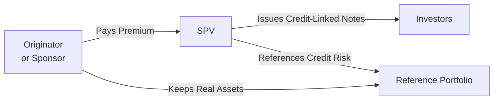

## Introduction

I remember a quick chat I had with a bank treasurer who was super excited about “synthetic securitizations.” She basically said, “It’s like you get all the benefits of transferring the credit risk without actually moving the loans off your books.” That simple statement, in a nutshell, describes how credit derivatives are used in securitization. Instead of physically transferring assets, you can use Credit Default Swaps (CDSs) or other credit derivatives to offload risk. If this sounds a bit magical, well, it sort of is. But it’s also a thoroughly established mechanism in the structured finance world.

Securitization is the process by which financial institutions convert illiquid assets—like mortgage loans, auto receivables, or corporate debt—into marketable securities. With credit derivatives, we can replicate or synthetically “mirror” that securitization process, allowing sponsors (like banks or corporations) to manage capital, reduce risk, or even take on targeted credit bets while keeping the underlying assets on their own balance sheets. This interplay of risk transfer, yield enhancement, and regulatory capital optimization is central to modern financial engineering.

Below, we’ll dig into the essential mechanics of using credit derivatives in securitization, explore why institutions adopt these structures, and consider the many pros and cons they bring. Along the way, we’ll talk about real-world scenarios, best practices, common pitfalls, and how you can approach exam questions and practical applications with confidence.

## The Basics of Securitization

Securitization begins when a financial institution (often called the “originator”) has a pool of assets—maybe a bunch of loans, mortgages, credit card receivables, or other debt—that it wants to finance or insure in some way. Traditionally, the originator transfers the asset pool to a Special Purpose Vehicle (SPV). The SPV, in turn, issues securities, such as mortgage-backed securities or asset-backed securities, to investors. The cash flows from the underlying asset pool fund interest and principal payments to those investors.

In a typical “cash” securitization, legal ownership of the assets is transferred to the SPV. But sometimes, the originator wants to keep hold of the assets, or, for one reason or another, it’s complicated or expensive to physically move them off the balance sheet. That’s where credit derivatives can swoop in, reshaping who bears the credit risk (and reaping the rewards) without the messy transfer of asset ownership.

## Role of Credit Derivatives in Securitization

Credit derivatives—most famously the Credit Default Swap (CDS)—enable parties to either buy or sell protection against credit events (like default, bankruptcy, or restructuring) on an underlying reference entity or pool. When integrated into a securitization, these derivatives allow originators and investors to reconfigure the credit exposure as they see fit.

In Sections 5.1 and 5.2 of this Volume, we introduced the basics of Credit Default Swaps, single-name CDS, and index CDS. The same instruments or variants—like basket swaps or credit-linked notes—show up in securitization structures. By embedding credit protection into a deal, or by structuring an entirely synthetic transaction, sponsors can shape risk profiles dynamically and often at lower transaction costs.

## Synthetic Securitization: Concept and Mechanics

A synthetic securitization transfers the credit risk of a reference portfolio of assets—think a pool of corporate bonds, mortgage loans, or other receivables—using credit derivatives. However, the underlying assets typically remain on the sponsor’s balance sheet in the real world. In this scenario, the sponsor purchases or sells (depending on perspective) credit protection from a Special Purpose Vehicle. The SPV issues notes (or other securities) to investors, who effectively take on the credit risk of the reference portfolio. The sponsor pays a premium (like an insurance premium) to the SPV in exchange for protection.

Here’s a high-level visualization of how this might look:

• The Originator/Sponsor holds the actual loans or bonds (“Reference Portfolio”).  
• The SPV writes a CDS that protects the sponsor against losses on these assets.  
• The SPV simultaneously issues securities (credit-linked notes) to investors, whose return depends on the credit performance of the reference portfolio.  
• If no credit events occur, the sponsor keeps paying the SPV the CDS premium, and investors earn their coupon.  
• If defaults occur, the SPV uses a portion of the principal from its note issuance to compensate the sponsor.

### A Short Numerical Example

Suppose a bank holds $500 million in corporate loans. Instead of physically selling them, the bank sets up a synthetic securitization:

1. The SPV references these $500 million loans as the “reference portfolio.”  
2. The SPV sells credit protection on the entire $500 million. The bank pays an annual CDS premium, say 2% of the outstanding notional = $10 million annual.  
3. Investors buy the SPV’s credit-linked notes, say $50 million of first-loss (equity or junior) and $450 million of senior notes.  
4. If certain reference entities default (subject to the terms in the CDS), the SPV compensates the bank for losses, reducing the notes’ principal accordingly.  
5. Investors who bought these notes bear the first losses (for the equity notes) and potentially further losses if defaults exceed the equity cushion.  

The bank has effectively transferred the bulk of the credit risk on $500 million in loans, but the loans themselves sit right there on the bank’s balance sheet. Voila—risk exposure shifted, no messy asset transfers needed.

## Motivations for Synthetic Securitization

Balance Sheet Management. Institutions often aim to free up regulatory capital by reducing their exposure to potential defaults. A synthetic transaction can accomplish that if regulators recognize the risk transfer as valid—often requiring robust documentation, total return swaps, or carefully crafted CDS protocols.

Tailored Exposure. Maybe a bank only wants to offload the riskiest part of its portfolio. Or perhaps it wants to target a specific maturity bucket. Synthetic securitizations let you slice and dice credit exposures with surgical precision.

Speed and Cost. Physically transferring assets can be time-consuming, requiring borrower notifications or other logistical hurdles. Synthetic deals often come together faster, at lower overhead, and can be restructured more quickly if market conditions change.

Flexibility in Asset Types. Physical securitizations typically revolve around pools of homogenous assets, like mortgages or credit card receivables. Synthetic securitizations can reference a more diverse, mosaic portfolio without physically bundling them. This opens up a world of possibilities for issuers and investors who want unique risk profiles.

Liquidity Management. If the sponsor wants to keep these loans or bonds for relationship reasons, or if physically selling them would reduce liquidity reserves, a synthetic securitization spares the sponsor from parting with assets while still transferring risk.

## Key Success Factors in Synthetic Securitization

### Clear Documentation

It’s absolutely essential—maybe I should say “non-negotiable?”—that the CDS or credit-linked note documentation outlines precisely what constitutes a credit event, how the notional is reduced after a default, how settlement computations are made, and other procedural details. Ambiguities in the contract can lead to disputes or dreaded litigation. Robust documentation under well-established frameworks, such as ISDA (International Swaps and Derivatives Association), helps clarify these key points.

### Regulatory Recognition

Banks typically rely on these structures to reduce regulatory capital requirements. But guess what? Regulators often have more nails in their tool belt than you think. They’ll examine the structure thoroughly to confirm genuine risk transfer. Some guidelines, such as Basel III/IV or other local rules, might impose higher capital charges if the transaction is deemed to be “cosmetic,” i.e., a partial or insufficient risk transfer.

### Counterparty Risk

In a synthetic securitization, the sponsor is exposed to the SPV’s ability to pay if credit events occur. That’s one reason the SPV capitalizes itself by issuing notes, so there’s a pool of funds ready to cover losses. The sponsor also wants the SPV’s obligations to be well collateralized—making sure that the SPV invests in high-grade or permitted collateral that can actually make good on claims if needed.

### Alignment of Interests

Investors want fair compensation for taking on credit risk—hence they demand a premium or coupon that matches the risk level. The sponsor wants to pay as little as possible in CDS premiums. Striking this delicate balance is key. If investors suspect the sponsor is handing off a ticking time bomb, they’ll demand higher yields.

## Examples and Case Studies

To give a sense of real-world flavor, let’s briefly consider a stylized scenario:

• An international bank sits on a large portfolio of emerging-market corporate bonds.  
• The bank wants to reduce credit exposure to these corporations due to broader macroeconomic uncertainty.  
• Instead of selling them (which might be illiquid or cause large price swings), the bank sets up a synthetic securitization referencing $1 billion in EM bonds.  
• The SPV obtains collateral from note issuance (let’s say $120 million in junior and mezzanine tranches plus $880 million in senior notes).  
• Investors, often hedge funds or institutional asset managers, get yields that might be higher than similarly rated corporate bonds. The bank gets capital relief if the structure meets regulatory standards.  

Historically, these techniques were used by European banks subject to heavier risk-weighted asset constraints, especially after the financial crisis, to maintain positions in certain loan types while improving their capital ratios.

## Risk Management Considerations

Though synthetic securitizations elegantly reduce or reshape credit risk, they come with their own vulnerabilities:

• Documentation Risk: If the definitions of a “credit event” are fuzzy, the sponsor may find itself inadequately covered at the worst time.  
• Model Risk: Both sponsors and investor participants often rely on quantitative models to price default probabilities. Overreliance on certain correlation or default assumptions can lead to mispricing and “nasty surprises” under stressed conditions.  
• Concentration Risk: If the synthetic deal references a relatively small set of names or an industry group, correlated defaults can cause major losses for investors (and potential triggers for the sponsor if the structure is not well diversified).  
• Market Liquidity: During turbulent markets, the market value of these credit-linked notes can swing significantly, prompting margin calls or value adjustments in the sponsor’s books.  
• Counterparty Exposure: If the SPV invests note proceeds into assets that are themselves subject to default risk (or invests in the same reference portfolio, ironically enough), this can create “wrong-way risk.”

## Best Practices and Potential Pitfalls

Because the structure can be set up in many ways, we want to highlight a few best practices:

• Thorough Legal Review: This ensures credit event triggers, payment waterfalls, and obligations are unambiguous.  
• Adequate Collateralization: Make sure the SPV invests in assets that maintain stable value or are quickly redeemable in a crisis.  
• Periodic Stress Testing: Conduct scenario analysis to see how the structure performs under harsh credit environments.  
• Transparent Disclosures: Investors should understand exactly how the reference portfolio is composed. The sponsor should clarify any changes in the portfolio, rebalancing rights, or concentration guidelines.  
• Ongoing Monitoring: Securitizations aren’t “set-it-and-forget-it.” Keep an eye on credit quality, default rates, and triggers.  

Common pitfalls include ignoring the time it takes to settle credit events, failing to consider how correlation across reference names can magnify losses, and overlooking basis risk (the mismatch between the actual default experience of the sponsor’s assets and the credit event definitions in the CDS contract).

## Conclusion and Exam Tips

Synthetically transferring credit risk using derivatives has reshaped global banking and market structures, offering a nimble way to manage credit exposures. By combining the flexibility of credit derivatives with the structural logic of securitization, institutions can tailor exposures, optimize regulatory capital, and achieve all sorts of strategic goals—sometimes alarmingly quickly. While these techniques can be powerful, the complexities (and potential hazards) are great. For exam purposes:

• Understand the difference between cash and synthetic securitizations.  
• Know the motivations: capital relief, tailored exposure, cost efficiency.  
• Be comfortable explaining how the SPV issues notes, collects premiums, and compensates the sponsor in the event of credit losses.  
• Expect scenario-based questions testing your ability to identify how a credit event triggers payouts, or how to revert a synthetic trade if the sponsor wants to unwind.  
• Watch for basis risk: The reference portfolio in the CDS must align with the sponsor’s actual portfolio, or else residual risk remains.

In a constructed-response or item set format, you might see a question about a bank with a large loan portfolio wanting to free up capital. What is the fastest, or most flexible approach? A synthetic securitization, of course! But you might also be asked to consider how a mismatch between the CDS definitions of default and the bank’s actual loans can hamper coverage.

Good luck in your studies. And let me just say, learning these structures isn’t only academically interesting—it’s super relevant if you wind up in structured finance or risk management. They will absolutely want you to know these intricacies from day one.

## References

• Kothari, V. (2006). “Securitization: The Financial Instrument of the Future.” Wiley.  
• European Banking Authority (EBA) Guidelines on Synthetic Securitizations:  
  https://www.eba.europa.eu/  
• Jobst, A. (2008). “What Is Securitization?,” Finance and Development, IMF.  
• International Swaps and Derivatives Association: https://www.isda.org/  

## Test Your Knowledge: Use of Credit Derivatives in Securitization



### A bank wants to offload the credit risk of its loan portfolio but retain the loans on its balance sheet. Which securitization structure best addresses this need?

- [ ] Cash securitization
- [x] Synthetic securitization
- [ ] Whole-business securitization
- [ ] Covered bond issuance

> **Explanation:** Synthetic securitizations allow a bank to transfer credit risk using credit derivatives without physically transferring the underlying loans.

### In a synthetic securitization, which party typically issues credit-linked notes to investors?

- [ ] The originator bank directly
- [x] The SPV or special purpose vehicle
- [ ] A separate credit rating agency
- [ ] An asset manager or hedge fund

> **Explanation:** The SPV issues notes to investors in a synthetic deal, referencing the credit risk of the originator’s asset pool.

### Which of the following is an advantage of a synthetic securitization over a traditional cash securitization?

- [x] Reduced transaction costs and faster execution
- [ ] Immediate physical transfer of assets off the balance sheet
- [ ] Elimination of all counterparty risk
- [ ] Complete immunity from credit events

> **Explanation:** Synthetic deals often require lower transaction costs and can be executed faster, as assets remain on the sponsor’s balance sheet. However, counterparty risk still exists through the SPV, and credit events still matter.

### One major regulatory motivation for synthetic securitizations is:

- [ ] To increase the sponsor’s on-balance-sheet leverage
- [x] To achieve capital relief or optimization
- [ ] To circumvent the meaning of credit events
- [ ] To guarantee a 0% risk weight for the sponsor’s portfolio

> **Explanation:** By transferring credit risk, synthetic transactions can provide capital relief if recognized by regulators. It does not guarantee a 0% risk weight, but it can lower capital requirements.

### Which best describes “basis risk” in the context of synthetic securitizations?

- [ ] The risk of interest rates changing
- [ ] The risk of currency fluctuations
- [x] The mismatch between the reference portfolio in the CDS and the actual assets held
- [ ] The SPV’s risk of re-investing collateral cash flows

> **Explanation:** Basis risk arises when the contractual reference assets in the CDS differ from the sponsor’s real exposures, causing the insurance payout to deviate from actual credit losses.

### Which is a key factor determining whether synthetic securitizations provide regulatory capital relief?

- [ ] The SPV’s physical location
- [ ] The number of investors in the deal
- [ ] The presence of an equity tranche
- [x] The effectiveness of the risk transfer recognized by regulatory authorities

> **Explanation:** Regulators must confirm genuine risk transfer to grant capital relief. The structure, documentation, and rating agency opinions often matter more than the SPV’s location or investor count.

### If a sponsor for a synthetic securitization wants to protect itself mainly from high-frequency, low-severity defaults, which tranche would it likely buy protection on?

- [x] The first-loss or equity tranche
- [ ] The senior-most tranche
- [ ] The mezzanine tranche
- [ ] The interest-only strip

> **Explanation:** The equity (or first-loss) tranche absorbs the earliest, lower-level defaults. If the sponsor’s main worry is frequent but smaller defaults, transferring the first-loss exposure is key.

### A robust legal document is crucial in synthetic securitizations for which primary reason?

- [x] Precisely defining credit events and settlement processes
- [ ] Tracking real-time leverage ratios
- [ ] Eliminating the need for credit ratings
- [ ] Ensuring the SPV invests in speculative-grade assets

> **Explanation:** The documentation must be crystal clear on what triggers a payout (credit event) and how settlement occurs. This avoids disputes later.

### If the SPV’s collateral assets default right when the CDS is triggered, leaving the SPV underfunded, this scenario could be called:

- [ ] Contingent risk
- [ ] Capital structure inversion risk
- [x] Wrong-way risk
- [ ] Conversion risk

> **Explanation:** Wrong-way risk refers to a situation when the SPV’s collateral or financial strength deteriorates at the same time losses occur in the underlying reference portfolio.

### True or False: In synthetic securitizations, the actual underlying loans or bonds physically transfer to the SPV.

- [ ] True
- [x] False

> **Explanation:** By definition, synthetic securitizations do not typically involve physically transferring the underlying assets. Risk transfer is achieved via credit derivatives.


