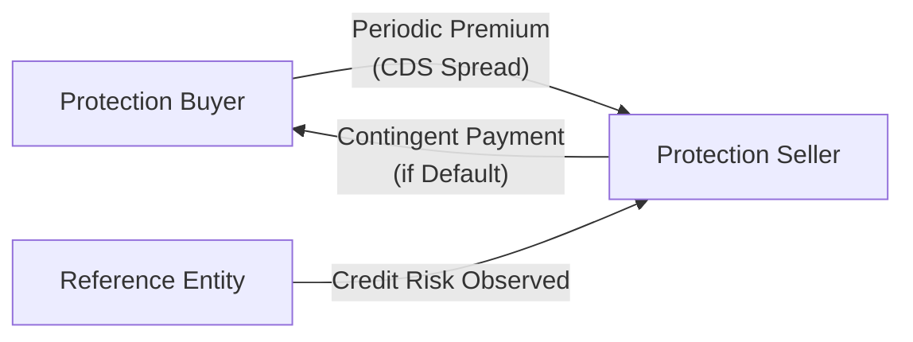

## Introduction

If you’ve taken a peek at modern credit markets, you've probably noticed that credit derivatives play a huge role in how investors manage and trade credit risk. Credit Default Swaps (CDS) are at the heart of this market. They enable you to hedge or speculate on the creditworthiness of an entity—be it a single company, a group of companies, or even an entire index of issuers. In this article, we’ll look at three critical variations in the world of CDS: Single-Name CDS, Index CDS, and Basket CDS. I remember the first time I encountered a Basket CDS in a live trading scenario—it felt pretty complicated, with the possibility of first-to-default or second-to-default triggers. But once you break it down step by step, it’s not that terrifying.

We’ll explore each product, how it’s used, and why correlations between the entities in the CDS matter so much. We’ll also consider some best practices and potential pitfalls from a risk management perspective. Let’s jump right in.

## Single-Name CDS

A Single-Name Credit Default Swap (SN-CDS) is, as the name suggests, a contract in which two parties exchange credit risk on one specific reference entity—often a corporate or sovereign issuer. Think of it like an insurance policy on a single bond issuer:

• The buyer of protection pays a periodic premium (the CDS spread) to the seller.  
• If the reference entity defaults, the seller compensates the buyer (usually the notional minus the recovery value).  

It’s that straightforward, at least in concept. But as you can guess, the details can get a bit more involved when you consider legal definitions of default, settlement mechanics, and the interplay with broader markets.

### Mechanics in a Nutshell

Here’s a simple illustration of how a Single-Name CDS works:

• Protection Buyer: Pays a premium (in basis points per year on the notional).  
• Protection Seller: Receives premium, but bears the risk of making a default payment.  
• Reference Entity: The underlying issuer on which credit risk is transferred.  

### Why Use Single-Name CDS?

1. Hedging: If an investor holds a bond issued by XYZ Corp, they might purchase a CDS on XYZ to hedge the default risk of that bond.  
2. Speculation: If you believe XYZ Corp’s credit quality will deteriorate (i.e., spreads will widen), you might buy protection. If spreads do widen, the market value of your CDS can go up, allowing you to close the position at a profit.  
3. Relative Value: Investors look for mispricings between a company’s bond yield and its CDS spread, creating arbitrage or spread-trading opportunities (see Chapter 7 on Arbitrage, Replication, and Cost of Carry).

### Simplified Valuation Formula

In a plain-vanilla Single-Name CDS, the annualized spread S is often approximated by:


\displaystyle S \approx \frac{(1 - R) \times p}{(1 - p) + (p \times \text{Discount Factor})}


Where:  
• \\( p \\) = Probability of default over the contract’s life.  
• \\( R \\) = Recovery rate (fraction of par expected to be recovered if default occurs).  
• Discount Factor captures time value of money.  

This formula is just a simplified snapshot. Actual pricing models get more sophisticated with hazard rates, survival probabilities, and calibration to market data.

## Index CDS

Now, what if you want to hedge or gain exposure to a broad swath of companies rather than just one issuer? That’s where Index CDS come into play.

An Index CDS references a standardized basket of corporate or sovereign issuers. For instance, the iTraxx indices in Europe or the CDX indices in North America each represent a list of issuers. By trading the index, you get (or hedge) exposure to the average credit risk of that entire basket.

### Composition and Rebalancing

Indices like iTraxx and CDX are rebalanced periodically—often every six months. Entities that have defaulted are removed, new ones might be added based on market capitalization, rating, or other criteria, and the index composition is kept fairly up-to-date. This periodic reset is helpful for maintaining a representative sample of the broader credit market. It’s also an important detail for pricing, because the index’s level and composition will shift over time.

### Why Use an Index CDS?

• Quick Exposure: Let’s say you have a broad-based bearish view on the consumer goods sector in North America. You can short the relevant CDX index to reflect that view in a single trade, rather than shorting the CDS of each corporation individually.  
• Hedge a Portfolio: If your fund is long a portfolio of corporate bonds, you might buy protection via an index to hedge systematic credit risk.  
• Liquidity: Index CDS tend to be more liquid than many single-name CDS contracts, especially those on smaller issuers. That means tighter bid–ask spreads and deeper markets.

## Basket CDS

Basket CDS take a middle-ground approach between Single-Name and Index CDS. They reference multiple entities—but not necessarily the broad, standardized set you’d find in an index. Rather, you might have a custom selection of, say, five or ten issuers.

### First-to-Default vs. n-th-to-Default

Basket CDS can further specify how losses are triggered:

• First-to-Default Swap: The contract triggers a payout when the first entity in the basket defaults. After that, the contract typically ends (though variations exist). Premium payments stop once the first default occurs.  
• n-th-to-Default Swap: Payout occurs only if the n-th default in the basket happens. For instance, in a second-to-default basket swap, no payout occurs if only one name defaults—that’s not enough. The second name to default triggers the protection payment.

The choice between first-to-default, second-to-default, or higher is not just for fun; it radically changes the risk profile. A first-to-default basket swap is typically more expensive for the protection buyer because the chance of at least one entity defaulting is obviously higher than waiting for the second or third.

### Why Use Basket CDS?

• Targeted Multi-Name Exposure: Suppose you want to hedge or speculate on a handful of auto manufacturers rather than a broad index. You can create a custom basket of just those issuers.  
• Fine-Tuned Cash Flows: The structure of n-th-to-default can let you precisely tailor how and when you receive payout.

## The Role of Correlation

Correlation among reference entities has a major role in pricing Multi-Name CDS—whether an index or a basket. If individual reference entities are highly correlated, the probability that multiple issuers default around the same time changes, influencing how quickly (or eventually) a multi-default event might occur in an n-th-to-default swap.

High correlation typically increases the likelihood that multiple defaults will cluster. This probability affects:  
• The spread you pay or receive for basket CDS.  
• The implied correlation priced into index tranches if you break the index into layered “slices” of risk.  

When correlation is low, defaults tend to happen more independently. This can actually increase the cost of protection for first-to-default instruments if you suspect one of the names might default but can boost the cost of higher-order default swaps if many defaults are unlikely to cluster.

## Practical Examples and Case Studies

### Single-Name CDS Example

Let’s say you own \$10 million of Company A’s 5-year bonds. You’re worried about Company A’s deteriorating financials. The current market quotes a 200-basis-point CDS spread (2% per year). If you buy protection on \$10 million notional:

• You pay 2% of \$10 million = \$200,000 per year, often in quarterly installments.  
• If Company A defaults, you get (Notional - Recovery) from the protection seller. Assuming a 40% recovery, the payment would be \$6 million if the notional was \$10 million.  

### Index CDS Example

Imagine you hold a broader portfolio with 50 different corporate credits, many of which are in the CDX High Yield index. If you sense the high-yield market might face a systemic sell-off, you can buy index CDS protection on CDX High Yield. This approach gives you:  

1. Systemic Hedge: Offsets your broad exposure in one fell swoop.  
2. Liquidity: Typically strong liquidity in main indices.  
3. Simplicity: A single trade for broad coverage.

### Basket CDS Example

You’re concerned about, say, the top five cyclical companies in your industrial holdings. They each have some correlation because they move with broader economic cycles, but not perfectly. You create a first-to-default basket swap referencing these five names:

• If any one of these five defaults, your protection triggers.  
• You pay a spread that reflects the possibility that at least one will default and how correlated they are.  
• If correlation is high, your basket might be considered riskier in a multi-default sense, affecting the premium.

## Best Practices and Pitfalls

• Thorough Documentation: A single name might seem straightforward, but remember that credit event definitions, restructuring clauses, and settlement mechanics can vary.  
• Correlation Risk: With baskets or indices, correlation is sometimes overlooked. If correlation studies are incomplete, you might misprice the risk.  
• Monitoring Credit Events: Index and basket CDS will remove or replace defaults over time, so keep up with rebalancing.  
• Liquidity Risk: Single-name CDS on smaller issuers or specialized basket structures may not be as liquid as the main index, so factor in potential wide bid–ask spreads.  
• Counterparty Risk: Don’t forget that you are exposed to your CDS counterparty. If the seller of protection can’t pay, your hedge or speculative position might blow up (see Chapter 6.4, “Counterparty Risk in OTC Markets”).

## Exam Relevance and Final Tips

Given the significance of credit derivatives in risk management and speculation, expect to see scenarios on the CFA exam (especially at more advanced levels) that test your understanding of Single-Name, Index, and Basket CDS. They might give you:
• A portfolio containing a variety of corporate bonds.  
• A broad macro environment hinting at rising credit spreads.  
• The choice of how best to hedge credit risk or speculate on defaults.  

Be prepared to:  
• Calculate or compare hypothetical CDS spreads.  
• Analyze the impact of correlation in a basket.  
• Determine how an index hedge might offset risk in broader portfolios.  

Time management is key—practice reading vignette details carefully:
• Identify the underlying reference entity or entities.  
• Parse out the type of payout (first-to-default vs. nth-to-default).  
• Understand the notional amounts and premium calculations.  

Take time to review how to compute implied spreads or at least reason about relative value. The exam may not require deep stochastic models, but it might test your conceptual understanding of how correlation or shifting credit conditions affect spreads.

## Further Reading

• Gregory, J. (2012). Counterparty Credit Risk and Credit Value Adjustment. Wiley.  
• MarketAxess on Indices:  
  (https://www.marketaxess.com/)  
• O’Kane, D. (2018). Modelling Single-Name and Multi-Name Credit Derivatives. Risk Books.  
• For deeper insights into baskets and tranches: Chapter 5.8 Correlation and Risk in Credit Portfolios.  
• Also see Chapter 7 for broader arbitrage and replication strategies.

## Test Your Knowledge: Single-Name, Index, and Basket Swaps Quiz



### Which of the following best describes a Single-Name CDS?

- [x] A contract providing default protection on one issuer or reference entity.
- [ ] A contract providing broad default protection on multiple issuers in an index.
- [ ] A contract that pays the holder only after multiple issuers default within a basket.
- [ ] A derivative that fully eliminates market risk but not credit risk.

> **Explanation:** A Single-Name CDS focuses on one corporate or sovereign entity. Index and basket swaps broaden the exposure across multiple names.

### When might an investor choose to use an Index CDS rather than multiple Single-Name swaps?

- [x] When seeking broad credit exposure or a macro hedge quickly and more efficiently.
- [ ] When wanting highly customized protection on just one issuer.
- [ ] When the correlation across all issuers is zero.
- [ ] Only if the portfolio is already default-free.

> **Explanation:** Index CDS provide a rapid and more liquid hedge across many issuers. They’re often used for broader market views or as portfolio hedges.

### What does a first-to-default basket swap typically do?

- [x] It triggers a payout once the first reference entity in the basket defaults.
- [ ] It triggers a payout only on the second defaulted entity in the basket.
- [ ] It pays nothing until all entities default.
- [ ] It pays out periodic coupons regardless of defaults.

> **Explanation:** In a first-to-default structure, the contract terminates (or pays out) immediately when the first issuer in the basket defaults.

### In an n-th-to-default basket swap, why is correlation among reference entities important?

- [x] Because higher correlation increases the likelihood of multiple defaults clustering.
- [ ] Because correlation only affects interest rate swaps, not credit swaps.
- [ ] Because correlation always remains constant throughout the contract.
- [ ] Because correlation has no impact on multi-name default risk.

> **Explanation:** When correlation is high, there’s a greater chance that multiple names will default around the same time, directly affecting n-th-to-default swap pricing.

### Which of the following is an advantage of using an Index CDS to hedge credit risk?

- [x] Greater liquidity and standardized contract terms.
- [ ] Perfect correlation between the index and every single bond you own.
- [x] Broad market coverage in a single trade.
- [ ] Guaranteed zero cost if no default occurs.

> **Explanation:** Index CDS typically have more liquidity than many single-name CDS and are a convenient single-trade hedge. However, correlation is not usually perfect, and costs are not zero simply because defaults haven’t occurred.

### In a Single-Name CDS, what is the role of the protection seller?

- [x] They receive periodic premiums and pay the protection buyer if the reference entity defaults.
- [ ] They pay periodic premiums until the reference entity defaults.
- [ ] They are unaffected if the reference entity defaults.
- [ ] They cannot terminate the contract early under any circumstances.

> **Explanation:** The seller collects a CDS spread periodically and bears the obligation to make default payments if an agreed credit event occurs.

### Why might the cost for a first-to-default basket swap be higher than the cost for a second-to-default swap on the same basket?

- [x] Probability of at least one default is higher than the probability of two defaults.
- [ ] Correlation is irrelevant; the premium is the same in both cases.
- [x] Recovery rates are always zero in second-to-default swaps.
- [ ] Premiums are set by the issuer’s equity price alone.

> **Explanation:** First-to-default swaps typically trade with higher premiums because only one name needs to default to trigger a payout.

### Which statement is true about rebalancing in index CDS such as iTraxx or CDX?

- [x] Defaulted entities are removed and replaced periodically to maintain a representative sample.
- [ ] Once an entity defaults, it stays in the index for the rest of the contract.
- [ ] These indices never add new entities.
- [ ] Rebalancing only occurs once every ten years.

> **Explanation:** Index providers update constituents (removing defaulted names and adding new ones) at predetermined intervals.

### Which combination of factors most influences the pricing of a Basket CDS?

- [x] The default correlation among the reference entities and the ordering (first/n-th to default).
- [ ] The reference entities’ interest rate risk alone.
- [ ] Only the average recovery rate and not the correlations.
- [ ] Official central bank policy on interest rates.

> **Explanation:** Key drivers in basket pricing are the correlation structures and the default sequence. Recovery rates and discount factors also matter, but correlation is critical.

### When the reference entity defaults in a Single-Name CDS, the protection buyer receives a payout. True or False?

- [x] True
- [ ] False

> **Explanation:** In a Single-Name CDS, if the reference entity defaults, the protection buyer typically receives a payout equal to the notional minus the recovery value (or a cash settlement based on the bond’s market price after default).


