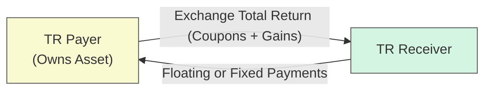
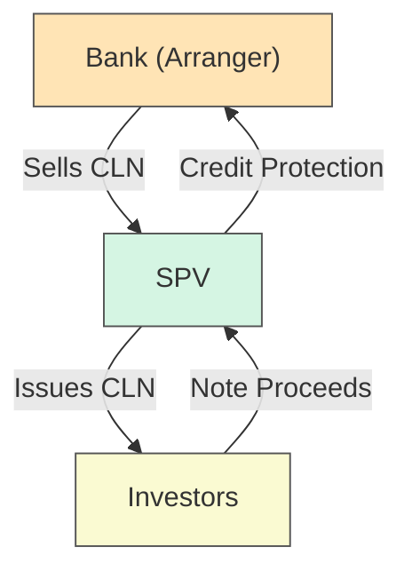

## Introduction and Key Themes

Credit derivatives extend well beyond the single-name Credit Default Swaps (CDS) most of us first learn about. Two particularly interesting instruments here are Total Return Swaps (TRSs) and Credit-Linked Notes (CLNs). Both of these structures can help investors gain or offload credit exposure in synthetically efficient ways, often with less operational hassle or upfront financing needs compared to directly purchasing or selling the underlying bonds and loans.

I’ll say that I personally got really excited about TRSs when, in a past analytics project, I saw how banks used them to manage capital or to quickly shift exposures on their balance sheets. It felt like a behind-the-scenes wizardry—one day, a chunk of assets was on the balance sheet, and the next, the risk was partially swapped out. At first, I was like, “Wait… how is the bank still collecting coupons from that asset but simultaneously passing them along to a counterparty?” That was my real “aha” moment regarding how derivatives can slice and dice risk.

In a similar vein, CLNs merge bond investment with embedded credit protection mechanics. They’re effectively a funding tool plus a credit derivative, harnessing both interest income and potential default exposures. If you’ve read about synthetic securitizations or structured finance, you’ve probably run into these instruments.

Below, we’ll dig into how each product works, typical motivations for using them, and the differences that set them apart from more straightforward CDS contracts. Whether you’re revisiting fundamentals or learning for the first time, I hope you come away with a deeper appreciation for these versatile tools.

---

## The Basics of Total Return Swaps

### High-Level Concept

A Total Return Swap (TRS) is a bilateral contract in which:

• The total return receiver obtains all economic benefits from an underlying reference asset (such as a corporate bond, loan portfolio, or equity index) over the life of the swap. These benefits include periodic coupon (or dividend) payments and any capital appreciation.  
• The total return payer, in return, usually receives a floating rate payment (e.g., LIBOR or SOFR plus a spread). However, if the reference asset’s value declines, the total return receiver compensates the total return payer for that loss.

You can think of it like renting out the “performance” of an asset—one party “lends” the asset’s returns, and the other party pays rent (the floating rate) and will be on the hook for losses if the asset’s price goes down. Neat, right?

### Mechanics and Cash Flows

Let’s visualize the core flows in a TRS. The diagram below shows the structure between two counterparties: the Total Return Receiver (TR Receiver) and the Total Return Payer (TR Payer).

• The TR Payer legally owns the underlying asset on their balance sheet (unless the asset is just “referenced” rather than physically owned).  
• The TR Payer sends the full return of the reference asset—interest, principal repayments (if any), and gains—to the TR Receiver.  
• The TR Receiver pays the TR Payer a typically floating interest rate plus (or minus) a spread.  
• If the asset’s value declines, the TR Receiver compensates the TR Payer for the loss in market value.

The final settlement often occurs at swap termination, at which point any net gain or loss on the asset is accounted for according to the notional principal agreed upon. The net effect is that the TR Receiver obtains leveraged exposure to the asset. Meanwhile, the TR Payer can reduce some of its market risk (and potentially credit risk) without selling the asset outright.

### Motivations for Entering a TRS

1. Regulatory Capital Relief: Many financial institutions have used TRSs to reduce capital charges on risky assets. The idea is that, if you limit your exposure by swapping out the total returns, you may lessen the amount of regulatory capital you must hold. (Of course, various jurisdictional rules like Basel III or IV often specify whether this is permissible or not, so we must check the details.)

2. Leverage and Portfolio Management: An investor who wants exposure to a corporate bond or loan portfolio—without physically purchasing it—can enter a TRS as the Receiver. This approach can free up capital for other uses, since you’re not paying the full cost of the bond or loan up-front.

3. Balance Sheet Transformations: Sometimes banks or other large institutions want to diversify their holdings. By swapping the total return of, say, a pool of mortgage loans for the returns on a floating rate, they convert part of their profile into a more flexible, floating-rate instrument.

4. Yield Enhancement: Market participants might do a TRS with a high-yield bond or a riskier loan portfolio to earn the coupon plus potential price appreciation. Of course, they must also be prepared to cover any price decline.

### A Quick TRS Example

Imagine Bank A holds a $100 million high-yield bond portfolio. Bank A wants to reduce the regulatory capital it has to hold against these risky assets. So, Bank A enters into a TRS with Hedge Fund B:

• Bank A agrees to pay Hedge Fund B the total return on this bond portfolio over the coming year.  
• In exchange, Hedge Fund B pays Bank A a quarterly floating rate payment of SOFR + 300 bps on a $100 million notional.  

If the bond portfolio appreciates by 5% during the year and pays coupons of 6% (on average) in that timeframe, the total return is 11%. Bank A must hand over that 11% (on notional) to the hedge fund. Meanwhile, the hedge fund pays Bank A the floating rate on the notional, say 5% total for the year. Net, the hedge fund pockets a 6% differential. Not too shabby—unless, of course, those bonds lose value.

---

## Risk Considerations in Total Return Swaps

While TRSs can be quite flexible, they come with a unique set of risks:

• Counterparty Risk: Each side is exposed to the risk that the other side fails to deliver on their obligations.  
• Credit Risk of the Reference Asset: Even though the TR Payer retains legal ownership, the TR Receiver is left carrying the risk that the asset’s value tanks.  
• Mark-to-Market Volatility: Gains and losses can be significant in volatile markets; daily or periodic margining is often required.  
• Funding Costs: Floating payments may spike or shift with interest rate changes, affecting net returns.

Centrally cleared solutions and collateral arrangements can mitigate some of these concerns. As a matter of market practice, TRSs can involve weekly or even daily margin calls to ensure that the party at risk of net loss provides sufficient collateral.

---

## Delving into Credit-Linked Notes

### Key Idea

A Credit-Linked Note (CLN) is essentially a bond with embedded credit protection. The issuer (typically a bank or special purpose vehicle) sets up a structure where the note’s return for investors hinges on the performance of a reference credit (like a corporate, a basket of loans, or an index). If a specified credit event (e.g., default) occurs, the note’s principal or coupon payments might be reduced.

In some ways, you can think of the CLN as if the note buyer is selling protection to the issuer. The investor collects an enhanced yield, but if a credit event hits the reference asset, they lose principal or coupons according to the contractual terms.

### Basic Structure

Let’s illustrate this with a diagram. Suppose a bank (the “CLN Issuer”) creates a special purpose vehicle (SPV) to issue CLNs to investors. Proceeds from the note issuance may be invested in high-quality collateral. The SPV enters into a credit derivative with the bank referencing a corporate bond or portfolio. If there’s a default or credit event, the bond’s losses get passed on to the CLN holder.

1. The SPV issues the Credit-Linked Note to investors.  
2. Investors pay for the notes, thus providing funds.  
3. The SPV invests those funds in collateral, usually high-grade government bonds.  
4. In parallel, the SPV sells credit protection to the bank (Arranger). If the reference entity defaults, the SPV uses the collateral to compensate the bank.  
5. Investors receive coupon payments that incorporate the credit risk premium. If there’s no credit event, they eventually get their principal back. But if a credit event does occur, they may lose part of their principal.

### Why Issue or Buy CLNs?

• **From the Issuer’s Perspective**: By issuing CLNs, the bank or SPV obtains credit protection from investors. This can help the bank manage its own credit risk, transfer certain exposures off its balance sheet, and potentially free up capital.  
• **From the Investor’s Perspective**: CLN buyers often want to earn a risk premium above what they’d get on a typical bond. They might believe the reference entity is stable, so they’re willing to accept that default risk in exchange for higher yields.

### CLNs vs. Normal Bonds

A traditional bond’s coupon and principal repayment primarily reflect interest rate risk and credit risk of the issuer itself. But in a CLN:

• The note’s coupon payments often exceed those of vanilla bonds with similar maturities and credit ratings because the note’s holder is also bearing the reference entity’s credit risk.  
• If the reference entity experiences a credit event (like bankruptcy or restructuring), the CLN holder may lose some or all of the note’s principal or future coupons.

---

## Comparing TRSs, CLNs, and CDS

### TRS vs. CDS

Sometimes, people ask, “Why do we need a TRS if there’s already a Credit Default Swap?” In a CDS, the protection buyer pays a fixed premium in exchange for compensation upon default of a reference entity. That’s it—there’s no capturing price appreciation or coupons. If the reference entity thrives, the CDS protection buyer doesn’t share in any upside; they just lose the premiums they’ve paid.

A TRS, on the other hand, passes along all economic performance—both upside (coupons, price gains) and downside (price declines) beyond just credit events. The “receiver” is effectively going long the entire asset, whereas in a CDS, the protection buyer is effectively short the credit risk.

Put differently:

• **CDS**: Only transfers credit risk of a default or credit event.  
• **TRS**: Transfers both credit risk and general market (price) risk, thereby allowing for the possibility of capital appreciation.

### TRS vs. CLN

Although both TRSs and CLNs can provide synthetic exposure:

• **Structure**: A TRS remains a derivative contract between two parties. In contrast, a CLN is a funded security (a bond) purchased by an investor.  
• **Cash Flows**: TRSs exchange interest plus capital gains/losses for a floating or fixed payment. CLNs pay a higher coupon, but there’s an embedded short credit position for the investor.  
• **Regulatory Nuances**: Financial institutions may prefer TRSs for capital relief strategies if certain conditions are met. CLNs, on the other hand, bundle credit risk into a tradeable note, which can be sold to a range of investors.

---

## Use Cases and Real-World Perspectives

### Regulatory and Balance Sheet Management

Financial institutions often hold large portfolios of loans and bonds subject to regulatory capital requirements. By transferring the risk of these assets to others—be it through a TRS or by issuing CLNs—they can potentially lower the risk weighting on their balance sheet. It might remind you of the old days of credit securitization, except these derivatives can be more flexible and negotiated privately.

### Leveraged Exposure

Hedge funds or other asset managers wanting leveraged exposure to a credit portfolio might favor a TRS. Why? Because you don’t have to stump up the full cost of the reference assets as you would when buying them outright. Instead, you post margin (collateral) that’s typically smaller than the notional value. This frees up capital for other strategies—though it also magnifies losses if the trade goes in the wrong direction.

Credit-linked notes can also provide an alternative for yield-seeking investors. For instance, a pension fund that believes a high-yield corporate sector is stronger than the market’s credit spread suggests might snap up a CLN paying an attractive coupon.

### My Own Two Cents

I once chatted with a portfolio manager who used CLNs to gain exposure to emerging market sovereign risk. His logic was, “I’m comfortable with the credit situation, so I want that extra yield.” He found that by purchasing a CLN tied to an emerging market basket, the coupon was markedly higher than a plain-vanilla bond from the same issuer would have offered. But, if you’re the type who’s worried about sudden defaults or restructurings, then, well, you might think twice.

---

## Potential Risks and Pitfalls

No derivative is risk-free, and credit derivatives can be especially tricky:

• **Liquidity Risk**: Some TRS and CLN structures can be illiquid. Unwinding or transferring a position mid-term may incur high costs.  
• **Counterparty Exposure**: With TRSs, each party depends on the other’s continued solvency. CLNs often mitigate this via an SPV, but you still have credit risk on the collateral and the structure.  
• **Complex Documentation**: ISDA Master Agreements, credit-event definitions, and settlement mechanics can be highly technical. Make sure you read that fine print.  
• **Regulatory Changes**: Rules around capital relief and derivative accounting shift over time. A structure that provides an advantage today might not do so tomorrow if regulations evolve.  
• **Basis Risk**: If you’re using TRSs or CLNs to hedge a certain portfolio, the reference assets in the swap/note might not perfectly match your actual holdings.

---

## Best Practices for Market Participants

• **Collateral and Margining**: In a TRS, ensure robust collateral procedures. Align margin calls with the underlying market volatility to reduce credit exposure.  
• **Regulatory Compliance**: Verify that your structure meets local and global regulatory rules (e.g., Basel standards for bank capital adequacy).  
• **Documentation**: Pay close attention to definitions of “credit event” in CLNs. Also confirm the terms of any netting or early-termination provisions.  
• **Scenario Analysis**: Model how your TRS or CLN will behave if interest rates spike, if credit spreads widen, or if the reference entity defaults.  
• **Stress Testing**: Even if you believe the reference entity is safe, stress test your assumptions. Past credit crises taught us that tail risks can be far more correlated than we might anticipate.

---

## Working Through a Numerical Illustration

Let’s take a simple numeric scenario to clarify how returns might be split in a TRS:

1) Notional = $10 million  
2) Underlying Asset: Corporate bond paying annual coupon of 8%; market yield = 6% at initiation  
3) TRS Duration = 1 year  
4) Floating Rate = 4% plus a spread of 1% → 5% total

• If by the end of the year the bond’s price has risen from par (100) to 102:  
  – Total Return on the bond = 8% coupon + 2% price gain = 10%.  
  – TR Receiver gets 10% × $10 million = $1,000,000.  
  – In turn, the TR Receiver pays 5% × $10 million = $500,000 to the TR Payer.  
  – Net gain to the TR Receiver = $500,000.  
• If by the end of the year the bond’s price has fallen from par (100) to 95:  
  – Total Return on the bond = 8% coupon – 5% price loss = 3%.  
  – TR Receiver gets 3% × $10 million = $300,000.  
  – The TR Receiver must still pay 5% × $10 million = $500,000.  
  – Net result is a $200,000 net loss for the TR Receiver.

That’s a neat illustration of how the TR Receiver is effectively “long” the bond’s total return. In a large institutional setting, risk managers would also account for daily fluctuations, margin requirements, or the possibility of a credit event in the bond.

---

## Incorporating TRSs and CLNs in Portfolio Management

You might recall from Chapter 6 that derivatives are widely used for hedging, speculation, and risk management across a variety of asset classes. TRSs and CLNs fit neatly into advanced credit portfolio management techniques:

• **Portfolio Overlays**: Rather than purchasing or selling credit exposures outright, a portfolio manager can overlay a TRS or buy CLNs to tweak the credit profile of the entire portfolio.  
• **Alpha Generation**: Hedge funds might see mispriced credit spreads or liquidity premiums. They can use TRSs or CLNs to profit from those dislocations without tying up as much capital as direct bond purchases.  
• **Relative Value Trades**: Managers can do a “long TRS, short corporate bond” if they find the swap mispriced relative to the underlying bond. Similarly, they can short a CLN if they believe the embedded credit risk premium is too low.

---

## Exam Relevance and Final Thoughts

CFA® candidates often see questions testing whether they understand not just the definitions but also the practical motivations and risk-return profiles of these credit derivatives. You might get a scenario-based question asking, “What derivative strategy should this bank adopt to reduce balance sheet risk while retaining legal ownership of their loans?” or “Which instrument best provides immediate leveraged exposure to an investment-grade corporate bond index?”

Remember:

• A TRS passes along all aspects of an asset’s return—coupon, principal, and price movements.  
• A CLN is a form of funded debt instrument embedding a credit derivative.  
• Both can be used to gain or shed credit exposure efficiently.  
• Understand the differences versus simpler products like CDSs.  

As with all derivatives, you need to be crystal clear on risk parameters—especially counterparty and mark-to-market risk—before diving in. But if you handle them responsibly, TRSs and CLNs can be powerful tools in your credit management arsenal.

---

## References and Further Reading

• Das, S. (2011). “Structured Products & Hybrid Securities.” Wiley.  
• [IMF Working Paper on Synthetic Securitization](https://www.imf.org)  
• Tuckman, B. & Serrat, A. (2011). “Fixed Income Securities: Tools for Today’s Markets.” Wiley.  
• ISDA Master Agreement documentation (for standard definitions and legal provisions).  

---

## Mastering Total Return Swaps and Credit-Linked Notes: Quiz



### Which of the following best describes the key distinction between a Total Return Swap (TRS) and a Credit Default Swap (CDS)?

- [x] TRS transfers both market and credit risk, while CDS primarily transfers credit risk.
- [ ] TRS transfers only credit risk, while CDS transfers both credit and market risk.
- [ ] TRS pays compensation for a credit event only.
- [ ] CDS provides leveraged exposure to the entire return of a reference asset.

> **Explanation:** A TRS involves receiving the full economic return (coupon and capital gains/losses), while a CDS focuses primarily on protection against default or other specified credit events.

---

### In a Total Return Swap, which party benefits if the reference asset appreciates in value?

- [ ] The total return payer.
- [x] The total return receiver.
- [ ] The protection buyer.
- [ ] Both counterparties benefit equally by definition.

> **Explanation:** The total return receiver gains when the reference asset has positive performance, as they receive coupons and price appreciation.

---

### A bank enters into a TRS on a loan portfolio on its balance sheet and pays the loan’s total return to a counterparty. What is a primary motivation for the bank?

- [ ] It wants to provide liquidity in the loan market to external investors.
- [x] It seeks regulatory capital relief by reducing effective exposure.
- [ ] It wants to absorb more interest rate risk to improve net interest margins.
- [ ] It intends to speculate on currency rates through the underlying asset.

> **Explanation:** One key reason banks use TRSs is to transfer the risk of a loan portfolio and potentially reduce required regulatory capital levels.

---

### Which of the following is generally a characteristic of a Credit-Linked Note (CLN)?

- [x] It is a funded structure where coupon and principal repayment depend on a reference entity’s credit performance.
- [ ] It is an unfunded structure that requires margin calls daily.
- [ ] It is a hybrid of an interest rate swap and a commodity swap.
- [ ] It bypasses default risk entirely in exchange for prepayment risk.

> **Explanation:** CLNs are funded instruments that combine bond-like features with embedded exposure to a reference credit.

---

### An investor purchases a CLN yielding 8%, tied to a corporate bond with a 5% yield. Which statement is most accurate?

- [ ] The CLN yield is lower because the investor is taking less risk than the corporate bond.
- [x] The CLN yield is higher because the investor assumes the risk of credit events on the reference asset.
- [ ] The CLN yield is the same as the reference bond.
- [ ] The investor is leveraging interest rate risk only, not credit risk.

> **Explanation:** CLN investors demand a higher coupon due to the added risk of a credit event occurring in the reference asset.

---

### Which of these commonly arises during the life of a TRS to ensure credit risk mitigation?

- [x] Periodic or daily margin calls based on marked-to-market value.
- [ ] A strict “no collateral” policy to reduce administrative costs.
- [ ] One-time premium payment and no interim adjustments.
- [ ] Automatic early termination upon slight changes in interest rates.

> **Explanation:** Margin calls or collateral adjustments help manage the changing risk as the underlying asset’s value fluctuates.

---

### How does a TRS typically affect a bank’s reported balance sheet exposure to a reference asset?

- [ ] The asset completely disappears from the bank’s balance sheet.
- [x] The asset remains on the balance sheet, but economic risk may be transferred, potentially reducing capital requirements under some regulations.
- [ ] The bank must double-count exposure for regulatory reporting.
- [ ] It has no effect on either risk weighting or capital requirements.

> **Explanation:** While the bank continues to legally hold the asset, various regulations may permit capital relief if the economic exposure is transferred via the TRS.

---

### When comparing a TRS to physical ownership of a bond, what is a key advantage for the receiver of total return?

- [ ] Receiving fewer coupon payments but at a higher rate.
- [ ] Avoiding exposure to any credit default event.
- [x] Gaining leveraged exposure without paying the full principal upfront.
- [ ] Eliminating all forms of market risk.

> **Explanation:** By entering into a TRS, the receiver enjoys the bond’s economic returns without allocating the entire notional value to purchase it outright.

---

### In a CLN structure, who ultimately bears the credit risk of the reference entity?

- [ ] The issuing bank, exclusively.
- [ ] The underlying reference entity.
- [ ] Credit rating agencies that rate the CLN.
- [x] The buyers of the Credit-Linked Note.

> **Explanation:** CLN buyers receive higher yields for taking on the possibility of a credit event in the reference entity, absorbing losses if one occurs.

---

### A TRS effectively allows for the replication of a long cash position in a bond without physical ownership. True or False?

- [x] True
- [ ] False

> **Explanation:** A TRS gives the receiver full economic exposure (including coupon and price changes) of a reference bond, mirroring a long position without the need to buy the bond directly.


