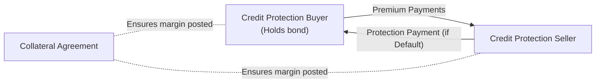

## Overview

Credit derivatives can be incredibly powerful tools in modern finance, letting market participants manage, redistribute, or even amplify credit risk. Broadly speaking, the most typical credit derivative is the credit default swap (CDS). But there are many variations: total return swaps, credit spread options, and basket swaps, among others. You can almost think of them as insurance policies on bond or loan defaults, except they’re traded over-the-counter (OTC) by institutions rather than offered by your everyday insurance provider.

I remember the first time I realized just how potent credit derivatives were. We were in the middle of a discussion on Banking Book exposures, and a colleague casually mentioned how we might quickly hedge an exposure to a particular issuer’s default risk without offloading the underlying bond. “Well,” he said, “we’ll just buy some protection via a CDS.” It seemed so straightforward at the time. It’s only later that I understood the complexities lurking just below the surface—counterparty risk, documentation pitfalls, and settlement mechanisms all become critical when defaults happen.

Below, we’ll explore the common uses of credit derivatives and some of the main risks they pose. By the end, you’ll see why these instruments are so widely used—and why they need to be handled with the utmost care.

## Key Uses of Credit Derivatives

### Hedging

One of the more intuitive uses of credit derivatives is to hedge a specific credit exposure. For example, let’s say an asset manager holds a large corporate bond portfolio and is worried about the possibility that one or two issuers might default. Rather than selling the bonds outright (which might be cumbersome, ill-timed, or subject to capital gains taxes), the manager can purchase CDS protection. Should a credit event occur (e.g., bankruptcy, failure to pay, or restructuring), the CDS seller compensates the buyer for losses.

• Targeted Hedging: You can hedge one issuer or an entire sector if you’re uneasy about, say, energy or telecom bonds.  
• Efficient Portfolio Management: Bond managers can quickly and cost-effectively adjust credit exposure without changing their core bond holdings.

### Speculation

Credit derivatives also allow market participants to take views on the creditworthiness of an issuer or on the overall market’s credit spreads. A trader who believes a particular company’s credit risk is overpriced can profit by selling CDS protection, collecting premium payments. Conversely, if a trader thinks the spreads are too low (meaning the market is underestimating the risk of default), they can buy CDS protection, whose value will rise if those spreads widen.

Speculative usage might sound a bit like “betting” on another company’s default risk, and indeed it can feel that way. Still, speculation (when done with proper risk controls) can enhance market liquidity by adding more participants, thereby facilitating better price discovery.

### Arbitrage

Credit derivatives create opportunities for arbitrage—profiting from price discrepancies across related instruments. For instance, a bond might be trading cheaply relative to its implied CDS spread, so a trader can attempt to lock in a riskless profit by buying the bond and simultaneously buying or selling the corresponding CDS. This is sometimes called a “basis trade.” If everything works perfectly and there are no major frictions (that’s a big “if” in real life), the trader nets out a small return once markets converge.

A second type of arbitrage might exploit mispricings between indices tracking a basket of credits and the sum of single-name CDS in that basket. Complex structured products and correlation trades can also be part of arbitrage strategies. But keep in mind that “riskless” is often more theory than practice—market dislocations, liquidity events, or abrupt credit events can cause even well-intentioned trades to blow up.

### Portfolio Diversification

Many investors turn to credit derivatives such as CDS indices, or synthetic collateralized debt obligations (CDOs) to gain diversified exposure to various corporate or sovereign bonds. Let’s say you desire a broad range of credit exposures but don’t have the resources to buy dozens of bonds individually. CDS indices, like CDX in the United States or iTraxx in Europe, pool multiple names into standardized contracts. That way, you can express a view on, or gain exposure to, an entire credit market segment with just a single trade.

### Regulatory Capital Optimization

Banks and other regulated financial institutions frequently use credit derivatives to adjust the credit risk on their balance sheets. By purchasing credit protection, banks reduce their net exposure to defaults and can potentially lower the capital they are required to hold—subject to the rules set by regulators (e.g., Basel Committee on Banking Supervision). This is sometimes dubbed “regulatory capital relief,” though regulators pay close attention to ensure the risk is genuinely transferred and not just disguised.

In theory, this can be a socially beneficial use. Banks free up capital and can extend more loans in the real economy. In practice, if done poorly, it could obscure systemic risk and lead to a buildup of interconnected exposures. That’s why robust oversight and transparency are essential.

## Key Risks of Credit Derivatives

While credit derivatives can be invaluable, they also come with unique risks that can’t be overlooked.

### Counterparty Risk

In a CDS, the buyer of protection relies on the seller’s ability to pay up if a credit event occurs. If the seller is experiencing financial difficulty, the buyer’s hedge could vanish exactly when they need it most. This was a painful lesson during the global financial crisis when some high-profile CDS sellers faced liquidity crunches and defaults themselves.

Market participants commonly mitigate this risk with collateral agreements. These agreements specify how the two parties must post margin (also known as “initial margin” and “variation margin”) based on the value of the derivative over time.

### Market Risk (Spread Volatility)

CDS spreads can be volatile, sometimes swinging wildly based on market sentiment, macroeconomic data, or even rumors. Because these spread movements dictate the mark-to-market value of credit derivatives, positions can incur hefty gains or losses in short order. If you’re speculating on spreads or employing leverage, well, you can see how quickly things might go south.

In addition, changes in interest rates, overall market liquidity, and correlation shifts among different credits can introduce further complexities in valuing credit derivatives.

### Liquidity Risk

Credit derivative markets aren’t always as liquid as, say, government bond markets. A position that looked great on paper can become illiquid in a market crisis, leaving you without a ready buyer or seller. A widened bid-ask spread might force you to exit at a steep discount, eroding profits or turning a small loss into a big one.

### Operational and Legal Risk

The documentation for credit derivatives is notoriously intricate. A standard CDS contract references the “ISDA (International Swaps and Derivatives Association) Definitions,” detailing precisely what constitutes a default, how protection is triggered, and how settlement should occur. A mismatch or misunderstanding of these definitions can lead to disputes—especially if you’re dealing with cross-border trades where different legal jurisdictions might apply.

From an operational standpoint, ensuring that each side correctly processes margin calls, keeps track of payments, and updates documentation is non-trivial. Operational glitches can be expensive or cause unintended risk exposures.

### Settlement Risk

When a credit event triggers a CDS, the contract can settle physically (by delivering the defaulted bond in exchange for par) or in cash (where the calculation of recovery rate determines the payment). Physical settlement can be challenging if the defaulted bond is in short supply or if there’s confusion over deliverable obligations. This mismatch can lead to significant settlement risk, magnified in times of market stress when defaulted issues may be scarce or trade at highly uncertain prices.

### Systemic Risk

Finally, there’s the potential for systemic risk. The notional amounts outstanding in CDS markets can be huge—often several multiples of the underlying bonds. During market turmoil, troubles at a major CDS seller or a sudden cascade of defaults can spread quickly. We saw in 2008 how these interconnections can amplify shocks and lead to broader financial instability. As credit derivatives concentrate large amounts of risk in a few firms’ hands, the financial system as a whole can become more fragile and interconnected if not carefully regulated and collateralized.

## Importance of Robust Risk Management

Given that credit derivatives combine leverage, counterparty exposure, liquidity issues, and potential legal pitfalls, a robust risk management framework is essential for any institution dealing in these instruments. This framework typically includes:

• Thorough Credit Analysis: Even if you’re buying protection, it’s wise to understand the underlying credit you’re referencing.  
• Collateral Arrangements: ISDA credit support annexes (CSAs) detail margin posting to mitigate counterparty credit risk.  
• Concentration Limits: Be mindful of how much exposure you have to a single counterparty or a single credit.  
• Scenario Analysis and Stress Testing: Model extreme market conditions, liquidity shortages, and default scenarios for tail-risk events.  
• Documentation Expertise: Work closely with legal teams to ensure the derivative documentation is accurate and all parties have aligned interests.

Below is a simplified visualization of how a CDS transaction might look, highlighting key cash flow relationships and collateral posting.

The diagram above may seem straightforward on the surface—buyer pays periodic premiums, seller pays compensation if default occurs. But the collateral arrangement (C) weaves in an additional layer of daily margin calls and postings, acting as a lifeline in case one side’s credit quality deteriorates.

## Glossary

• Arbitrage: Profiting from the price discrepancies of equivalent or closely related instruments, often requiring complex trades across multiple markets.  
• Systemic Risk: The risk that the failure of one entity or a group of entities could trigger a crisis across the entire financial system.  
• Collateral Agreement: A contract dictating how and when initial and variation margins are posted to mitigate counterparty risk.  
• Spread Volatility: Rapid or unpredictable changes in CDS spreads (or bond yield spreads), contributing to mark-to-market gains or losses on derivative positions.

## References

- Schroeck, G. (2002). “Risk Management and Value Creation in Financial Institutions.” Wiley.  
- Basel Committee on Banking Supervision Publications: https://www.bis.org/bcbs/  
- Jorion, P. (2007). “Value at Risk: The New Benchmark for Managing Financial Risk.” McGraw-Hill  

Below are additional sources you might find helpful:  
• ISDA (International Swaps and Derivatives Association): https://www.isda.org  
• CFA Institute Curriculum (Derivatives and Risk Management)  

---

## Test Your Knowledge: Uses and Risks of Credit Derivatives



### Which of the following best describes the use of a credit default swap (CDS) as a hedging tool?

- [ ] A CDS buyer compensates the protection seller when a default event happens.  
- [ ] A CDS buyer reduces exposure to default risk by selling premium to the CDS seller.  
- [x] A CDS buyer pays a premium to the CDS seller in exchange for compensation if a credit event occurs.  
- [ ] A CDS seller makes regular premium payments to the buyer to hedge the default risk.  

> **Explanation:** Buying a CDS is akin to purchase of insurance on a bond issuer’s credit risk. The CDS buyer pays a premium and receives a payout if the issuer defaults.

### An asset manager who expects credit spreads to narrow would most likely:

- [x] Sell credit protection, thereby profiting if spreads tighten.  
- [ ] Buy credit protection, expecting the premium to steadily increase.  
- [ ] Avoid credit derivatives altogether.  
- [ ] Convert the credit derivatives into equity swaps.  

> **Explanation:** If spreads narrow, the cost of credit protection typically falls, so the seller of that protection benefits from a price drop in the CDS premium.

### A “basis trade” in the context of credit derivatives often involves:

- [ ] Exchanging interest rate swaps for CDS positions to gain yield.  
- [ ] Going long government bonds while shorting equities.  
- [x] Trading a bond (or loan) against a corresponding CDS to exploit price discrepancies.  
- [ ] Buying a CDS index without offsetting positions in single-name CDS.  

> **Explanation:** Basis trading is buying or selling the underlying bond and taking an offsetting position in a CDS on the same reference credit when they are mispriced relative to each other.

### Which of the following is a primary concern when physically settling a CDS after a default?

- [ ] Determining which underlying equity shares to deliver.  
- [ ] Calculating interest rate differentials.  
- [x] Finding sufficient defaulted bonds or loans to deliver.  
- [ ] Verifying enough cash margin is posted in the ISDA Master Agreement.  

> **Explanation:** Physical settlement requires delivery of the defaulted securities. If those securities are scarce or pricing is uncertain, settlement can become complicated.

### In moments of severe market crises, credit derivatives may amplify systemic risk because:

- [x] They can concentrate large, correlated exposures among a few major counterparties.  
- [ ] They eliminate the need for collateral.  
- [ ] They force every protection seller to buy protection from another seller.  
- [ ] They are always centrally cleared.  

> **Explanation:** If large CDS sellers become stressed, the risk can quickly spread to other financial institutions, intensifying systemic problems across interconnected markets.

### Counterparty risk in a CDS contract can be mitigated primarily by:

- [ ] Buying additional credit protection from another party.  
- [x] Establishing collateral or margining arrangements via an ISDA CSA.  
- [ ] Using only physically settled CDS.  
- [ ] Holding the bond and CDS concurrently.  

> **Explanation:** Collateral or margining agreements dramatically reduce counterparty risk by ensuring that the out-of-the-money party posts funds.

### A portfolio manager aiming to reduce regulatory capital requirements might:

- [x] Purchase CDS on a portfolio of loans to remove or reduce balance sheet risk.  
- [ ] Sell CDS on risky corporate bonds to gain more capital relief.  
- [ ] Close all derivative positions, even the profitable ones.  
- [ ] Use currency forwards instead.  

> **Explanation:** By buying CDS protection, the bank transfers credit risk off its balance sheet, potentially lowering the capital it must hold per regulatory standards.

### The term “spread volatility” refers to:

- [ ] The risk that a bond’s coupon rate will remain unchanged.  
- [x] The rapid changes in CDS premiums or yield spreads that can affect mark-to-market valuations.  
- [ ] Historical volatility of stock price returns.  
- [ ] Zero-coupon bond movements.  

> **Explanation:** Spread volatility is about the changes in credit spreads—like CDS spreads or bond yield spreads—significantly impacting valuation of credit-sensitive products.

### When liquidity risk in credit derivative markets increases:

- [x] Bid-ask spreads often widen, making it more expensive to enter or exit positions.  
- [ ] Large trades become cheaper and easier to execute.  
- [ ] Market participants seek to increase leverage.  
- [ ] Collateral requirements automatically drop.  

> **Explanation:** In less liquid situations, dealing costs go up (wider bid-ask), limiting investors’ ability to quickly and efficiently adjust positions.

### Credit derivatives such as CDS indices allow investors to:

- [x] Gain broad exposure to a basket of issuers in one transaction.  
- [ ] Invest passively in equity markets.  
- [ ] Eliminate interest rate risk entirely.  
- [ ] Restrict trading only to sovereign debt.  

> **Explanation:** CDS indices (like iTraxx or CDX) bundle many different issuers into a single contract, providing diversified credit exposure.


