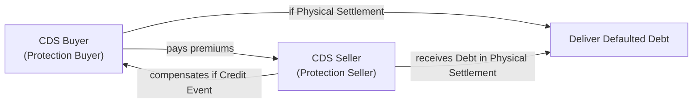
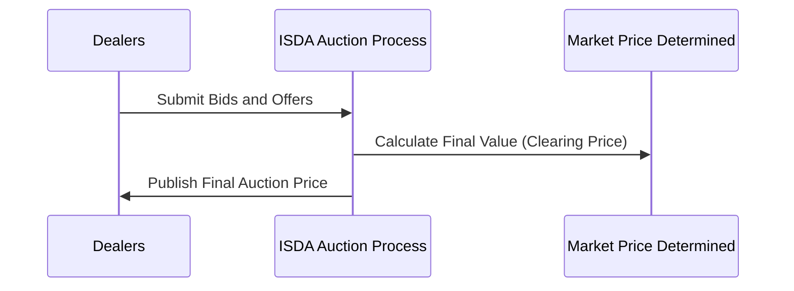

## Understanding Credit Events

Have you ever nervously monitored a corporate borrower—sort of biting your nails—wondering if they’d deliver that dreaded “We can’t pay”? I remember this day on the trading floor when a major telecom company’s liquidity was rumored to be evaporating. It was like watching a pot about to boil over, except you’re not sure if it’s just steam or an actual meltdown. Stories like that underscore the importance of having thorough definitions around credit events—and why the International Swaps and Derivatives Association (ISDA) refined the guidelines to protect everyone in credit derivative trades. Let’s walk through what triggers these “events” and how the settlement process plays out.

### ISDA and the Standardization of Credit Events

A cornerstone of the modern credit default swap (CDS) market—and broader credit derivatives space—has been ISDA’s standardized definitions. These definitions clarify, in legally enforceable language, what exactly counts as a credit event. This consistency matter is huge. Seriously—imagine the fiasco if two counterparties disagreed about whether a missed payment was "material" enough to constitute a default. So, in common practice, four main categories of credit events exist under ISDA guidelines:

• Bankruptcy  
• Failure to Pay  
• Restructuring  
• Repudiation / Moratorium  

They might sound self-explanatory, but the details can get tricky.

## Key Types of Credit Events

### Bankruptcy

Bankruptcy is typically the easiest to wrap your head around. When a reference entity (the organization whose debt is covered by the CDS) files for protection under bankruptcy laws or experiences insolvency proceedings, that typically triggers the credit event. In the context of corporate entities in the United States, for example, a Chapter 11 or Chapter 7 filing would suffice. 

But here’s a subtlety: The timeline can be messy—what if the company flirted with the idea publicly but never actually filed? The ISDA definitions require an official filing or a court order to qualify. That ensures we’re not jumping the gun based on sensational news headlines.

### Failure to Pay

Failure to Pay is about an issuer missing scheduled payments of interest or principal. It’s not enough to be a little late; typically, there’s a grace period that must lapse—maybe 30 days, 10 days, or whatever the bond indenture or loan document stipulates. If a payment remains uncured beyond that grace period, the credit event is triggered. For credit derivative protections, you might see language like “the amount of default or missed payment must exceed the Payment Requirement threshold,” meaning it’s not triggered by a tiny administrative slip.

### Restructuring

Restructuring is that tricky middle ground. Maybe the entity hasn’t outright gone bust, but they’ve changed the terms of their debt so significantly that investors are worse off. These changes might include pushing maturity dates way into the future or slashing coupon payments. The result? Bondholders who once expected a stable stream of payments may be forced to accept less favorable terms.

To keep disputes to a minimum, there are variants in how restructuring is recognized in CDS documentation, often labeled R (old-school restructuring), XR (ex-restructuring), ModR, and so on. Each version sets its own guidelines about how material the changes need to be in order to qualify as a credit event. This is done because not all “restructurings” are equally detrimental. A minor covenant amendment might not be so dire; a major haircut on the principal might be considered a legitimate credit event.

### Repudiation / Moratorium

This one is especially relevant in sovereign CDS markets and certain corporate contexts where government agencies step in. If a sovereign publicly announces they won’t honor their debt—that’s repudiation. Moratorium can be a legal or regulatory action that essentially freezes or nullifies payment obligations. From an economic standpoint, it’s as if the sovereign or the reference entity “just said no” to paying on time. Under the ISDA guidelines, that stance needs to be formal and legally enforceable for it to count as a credit event.

## Settlement Mechanisms

So, what happens after a credit event is triggered? The next question is how the protection buyer and protection seller settle their CDS (or any relevant derivative) contract. Settlement is typically done in one of three ways:

• Physical Settlement  
• Cash Settlement  
• Auction Settlement  

Each mechanism aims to replicate the payoff that would occur if someone owned the defaulted bond and wanted to be made whole (or at least as whole as possible).

Let’s visualize a simplified flow of how these parties interact once a credit event is triggered:

### Physical Settlement

Physical settlement is the old-school approach: The buyer of protection delivers the defaulted bonds (or other eligible debt instruments) to the seller of protection. In exchange, the seller pays par value (or some agreed-upon notional amount). This method works smoothly if there is actual deliverable debt. One challenge: Suppose the outstanding defaulted debt is small, or illiquid, or gets hoarded because so many CDS buyers want to physically settle. That can create a supply-demand imbalance and drive up the price of defaulted bonds. Not exactly fun.

### Cash Settlement

Cash settlement makes the process a bit simpler. Once a credit event occurs, there’s no requirement to deliver the actual bonds. Instead, the protection seller pays an amount equal to the notional minus the recovery price of the defaulted bonds. Suppose a reference entity defaults and its bond drops to 40% of par. The payoff would be:


\text{Payoff} = \text{Notional} \times (1 - R),


where R is the bond’s recovery rate, in this scenario 0.40 (or 40%). Thus, the CDS payoff is 60% of the notional. The protection buyer calculates how much they lost, and the protection seller compensates them accordingly.

### Auction Settlement

Now, you might be asking: how do we figure out the “market price” for struggling or defaulted bonds, especially if the market’s chaotic? Enter the ISDA-organized auction. Over the years, the CDS market has increasingly moved toward an auction-based settlement, especially post-2008, to address the confusion around bond pricing after a large default. In this arrangement:

1. A group of dealers submit bids and offers for the defaulted reference entity’s obligations.  
2. An electronic auction sets the final clearing price, reflecting the overall market’s valuation of the defaulted bonds.  
3. That price is used to settle CDS trades—whether they are physically or cash settled—helping unify the process, curb disputes, and offer transparency.

Here’s a simplified depiction of the auction mechanism:

After the final auction price is published, all CDS referencing that credit event typically settle based on that single price.

## Documentation and Disputes

All these credit event definitions and settlement procedures are spelled out in detail within each derivative’s Confirmations and the overarching ISDA Master Agreement. Nuances matter: if the contract language around “Restructuring” is ambiguous, you could land in a dispute. Perhaps your contract says “coupon reduction of at least 50 bp is material,” while the other side claims it’s only triggered if “80 bp or more.” 

Anyway, the existence of standardized definitions (like 2003 ISDA Credit Derivatives Definitions, 2014 Definitions, etc.) significantly reduces confusion, but grey areas come up—particularly for partial bailouts or partial debt exchanges. One best practice: clarify from the start which set of ISDA definitions you’re referencing (like the 2014 or 2020 sets), and ensure the restructuring clauses are spelled out precisely.

## Real-World Scenario

Let’s take a sovereign example: In early 2012, Greece restructured its debt via a massive bond exchange. The question: Was this “voluntary,” or did it trigger credit default swaps? Ultimately, the International Swaps and Derivatives Association declared that the action met the definition of a credit event—specifically a “repudiation/moratorium” or “restructuring.” That triggered CDS payouts, though the country never fully “defaulted” in the conventional sense. The Greek situation underscored how official sector involvement, complex legislation, and partial restructuring can still produce official credit events in the derivative sense.

## Key Observations, Pitfalls, and Best Practices

• Consistent Documentation: Always link your trades to a recognized set of ISDA definitions. Ad hoc definitions might create a mismatch across deals.  
• Grace Period Awareness: Keep track of that extra time allowed for late payments. Declaring a default a day too early can lead to ill-advised trades.  
• Restructuring Clauses: If you’re dealing with corporate bonds in emerging markets—where creative restructurings abound—pay extra attention to R, XR, or ModR triggers. Overlooking the exact form of restructuring recognized can cause big coverage gaps in your CDS.  
• Liquidity Constraints: Physical settlement might theoretically look good. But if 100 different protection buyers are scrambling for the same defaulted issue, watch out for a short squeeze.  
• Auction Complexity: Auction settlement processes are more transparent nowadays, but it’s essential to understand how “dealer quotes” can influence the final price. If the market’s illiquid or chaotic, that final clearing price might be more art than science.  
• Systemic Risk Considerations: Large-scale events—like major sovereign defaults—could cause spikes in CDS payouts that have broader systemic impacts. Regulators keep a close watch on how quickly settlement happens so that systemic issues don’t fester.

## Conclusion

Credit events are at the heart of risk transfer in credit derivatives. Knowing precisely how they’re defined—and how settlement will unfold—can save you from confusion, losses, or that dreaded phone call from the risk manager. While it might seem straightforward (entity defaults, you get paid), the devil is in the details, whether it’s the exact nature of a restructuring or the mechanism used to finalize payouts. The takeaway: read the fine print, stay on top of ISDA updates, and never assume all “default triggers” are built the same.

## Exam Tips

• Know the Four Main Credit Events. Be ready to identify each from a scenario-based question.  
• Understand Restructuring in Depth. On the CFA exam, the difference between R, ModR, and other variants may appear in item set or mini-case contexts.  
• Settlement Mechanisms. Practice short numeric examples for cash settlement payoffs and recall how an auction-based price is determined.  
• Spot the Pitfalls. In essay or constructed-response questions, you might be asked how to mitigate disputes around an ambiguous “failure to pay.”  
• Monitoring Grace Periods. Don’t forget the typical 30-day or 10-day buffer, a common detail that can be tested in scenario-based questions.  
• Incorporate Master Agreements. Expect questions about how the ISDA Master Agreement helps mitigate counterparty disputes.  

By focusing on these areas, you’ll be well-positioned to tackle credit derivative questions at the exam, whether they're purely conceptual or heavy on calculations.

## References

• [ISDA Credit Derivatives Definitions](https://www.isda.org/category/credit-derivatives/)  
• Packer, F., & Suthiphongchai, C. (2003). “Sovereign Credit Default Swaps.” BIS Quarterly Review.  
• Choudhry, M. (2010). “The Credit Default Swap Basis.” Bloomberg Press.

## Practice Questions: Credit Events and Settlement Mechanisms



### A CDS contract references a corporate bond. Payments are due quarterly, and the issuer misses a payment but cures it within 15 days (which is within the allowed grace period). Which of the following statements is correct?

- [ ] The CDS triggers a credit event immediately.
- [x] No credit event is triggered because the payment was cured within the grace period.
- [ ] Auction settlement will be initiated by ISDA.
- [ ] The missed payment triggers a restructuring.

> **Explanation:** Under "Failure to Pay," the payment must remain uncured beyond the specified grace period to trigger a credit event.

---

### Which of the following is most likely a valid credit event under standard ISDA definitions?

- [x] The reference entity files for Chapter 11 bankruptcy protection.
- [ ] The reference entity is rumored to be late on its payments.
- [ ] The reference entity changes its name and corporate structure.
- [ ] The reference entity obtains a new line of credit at higher interest rates.

> **Explanation:** Bankruptcy is a clearly recognized credit event once the reference entity officially files for protection.

---

### In a cash-settled CDS contract, which of the following best represents the payoff to the protection buyer?

- [ ] The difference between the defaulted bond’s par value and its pre-default market price.
- [ ] The difference between the defaulted bond’s par value and its coupon payments.
- [x] The difference between the defaulted bond’s par value and its post-default recovery price.
- [ ] A fixed lump-sum payment determined at inception.

> **Explanation:** In a cash settlement, the buyer of protection receives (Par – Recovery Price) on the notional amount.

---

### For restructuring to be deemed a credit event, what factor generally must be met?

- [ ] The bondholder must pay an additional fee to the issuer.
- [x] The debt terms must become significantly less favorable to investors.
- [ ] The bond coupon rate must be increased.
- [ ] The loan’s maturity profile must match industry benchmarks.

> **Explanation:** Under ISDA definitions, restructuring requires debt terms (e.g., maturity, coupon) to significantly change in a way detrimental to holders.

---

### Which best describes an “auction settlement” organized by ISDA?

- [ ] A process in which every bondholder votes on the final settlement price.
- [ ] A mandatory ex-ante arrangement that forces immediate physical settlement.
- [x] A method to determine a final fair price for defaulted obligations via competitive bids and offers.
- [ ] A random selection of dealers to specify a final settlement price with no transparency.

> **Explanation:** ISDA organizes auctions where dealers submit bids/offers, and a final clearing price emerges to settle CDS positions consistently.

---

### In the case that a sovereign entity openly declares it will suspend all external debt repayments but has not yet filed any official bankruptcy proceedings, which credit event under ISDA definitions is most likely triggered?

- [x] Repudiation / Moratorium
- [ ] Failure to Pay
- [ ] Bankruptcy
- [ ] Modified Restructuring

> **Explanation:** A public declaration of not paying is classified as repudiation/moratorium, particularly for sovereign reference entities.

---

### A CDS buyer prefers physical settlement over cash settlement. Which of the following might be a risk in opting for physical settlement?

- [ ] The CDS buyer might receive too large a settlement amount in case of default.
- [ ] The notional amount of the CDS is automatically reduced by half.
- [x] The CDS buyer may struggle to source the deliverable obligations in a tight market.
- [ ] Physical settlement is banned by ISDA for corporate issues.

> **Explanation:** Physical settlement can be problematic if there’s a scramble for the defaulted bonds, causing scarcity and driving up prices.

---

### Under a standard ISDA Master Agreement, which clause primarily governs how a missed payment is determined to be a credit event?

- [ ] The Cross-Default Provision
- [x] The Failure to Pay clause (within the Credit Events definitions)
- [ ] The Netting Agreement
- [ ] The Collateral Review Clause

> **Explanation:** The Failure to Pay clause in the Credit Event definitions covers missed payment specifics, including grace periods and thresholds.

---

### Which factor is typically most crucial for determining the final payout in a standard CDS auction settlement?

- [ ] The volume of defaulted debt the protection buyer owns
- [ ] The initial premiums the protection buyer paid
- [x] The final auction-determined price of the defaulted bond
- [ ] The original coupon rate on the bond

> **Explanation:** In an auction settlement, the final price established through ISDA’s process is the critical determinant for the payoff.

---

### True or False: Once ISDA publicly declares a credit event has occurred for a reference entity, physical settlement is automatically enforced for all CDS contracts on that entity.

- [ ] True
- [x] False

> **Explanation:** Even after a credit event is declared, settlement can be physical, cash, or auction-based. The contract terms dictate the specific settlement approach.


