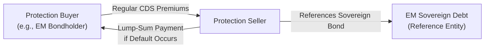

## Introduction
Credit derivatives in emerging markets (EM) open fascinating pathways for investors seeking higher yields or wishing to hedge against sovereign and corporate credit risk in developing economies. But, oh boy, when I first stepped into the EM space—some years ago in Bogotá—I was both thrilled by the opportunities and slightly terrified by the uncertainties. The potential for exceptional returns was right there, but also the potential for heart-stopping volatility. Sounds dramatic, right? Emerging markets tend to combine big rewards with big risks, and credit derivatives take that dynamic to another level.

In this article, we’ll explore the features, functionality, and uses of EM credit derivatives, offering guidance on best practices, potential pitfalls, ways to manage legal complexities, and how to handle those dreaded political risk events that seem to pop up more often than we’d like. Let’s dive in.

## Overview of EM Credit Derivatives
Credit derivatives enable market participants to transfer credit risk without necessarily transferring the underlying asset. In emerging markets, these instruments predominantly revolve around credit default swaps (CDS) on sovereign or corporate debt. There are also total return swaps and credit-linked notes, but the lion’s share of EM derivative activity unfolds in CDS format. Why? Because CDS are straightforward in concept—pay your premium, get protection if default happens—yet they can be structured for a wide range of reference entities, from the sovereign government to local corporations.

In more developed markets, credit derivatives are already well established. The big difference in EM is that trading can be thinner, data can be patchy, and sometimes the entire credit landscape can shift overnight due to political moves or currency shocks. That means spreads can turn on a dime, and pricing can swing far more dramatically than in, say, a stable developed economy.

## Market Structure and Participants
Institutional investors such as hedge funds, pension funds, and large asset managers often dominate EM credit derivative trading. Banks might be active as well, both for proprietary trading and as market-makers. Occasionally, local insurance companies enter the fray, but they tend to be more cautious with their derivatives usage because of regulatory constraints. Speculators looking for yield pickup might jump in when they see an appealing spread or, ironically, when uncertainty is high, believing they’ll profit from market volatility.

### Common Motivations
• Seeking yield advantage: EM credits often come with a “liquidity premium.” This means investors require extra yield to absorb lesser liquidity.  
• Hedging risk exposures: Bondholders may buy CDS on an EM sovereign or corporate to hedge default risk.  
• Relative value trades: Some opportunistic traders might short one EM credit and go long another if they think spreads aren’t properly reflecting risk differentials.

## Liquidity, Transparency, and Regulatory Gaps
Perhaps the biggest eye-opener in EM credit derivatives is the difference in liquidity and transparency compared to major developed markets (like the U.S. or Western Europe). Wider bid-ask spreads translate into higher transaction costs, sometimes significantly so. Regulatory frameworks can be inconsistent, and local authorities (e.g., central banks or finance ministries) might impose foreign exchange controls that complicate settlements.

This can inspire a swirl of anxiety—especially for new entrants. You might find huge price moves that are only partly explained by actual credit events. Political rumors or sudden capital flows can amplify volatility in a way that can sting if you’re unprepared.

• Liquidity Premium: Investors demand higher spread compensation for dealing in markets that are prone to liquidity shortages. In a pinch, selling your position quickly can be trickier, leading to bigger price discounts.  
• Regulatory Fragmentation: Each EM country has its own local laws, rules, and oversight agencies. Adhering to cross-border derivative rules can be challenging—especially when a single deal references multiple jurisdictions.

## Settlement and Documentation Complexities
From my personal experience, one of the most nerve-wracking aspects of EM derivatives is making sure everything is spelled out correctly in the legal documentation (the ISDA schedules, confirmations, etc.). Political risk or an uncertain court system can sometimes inject real tension into these processes.

• Local-Law Considerations: Some emerging markets govern the underlying bonds under local law, which might give courts broad discretionary powers in times of crisis.  
• Settlement Disputes: In the event of a credit event, determining the deliverable obligation—especially for local-currency denominated debt—may be more complicated.  
• Documentation Standards: Industry bodies like the Emerging Markets Trade Association (EMTA) provide guidelines for standardizing documentation, but not all local participants follow them with the same rigor.

## Price Volatility and Credit Events
EM credit derivatives can experience large price gaps during episodes of political upheaval, FX crises, or even a collapse in commodity prices (for resource-rich regions). This heightened volatility, while frightening at times, is exactly why some speculators jump into EM. They thrive on big moves.

A single headline—say, a change in party leadership in a highly indebted nation—can lead to abrupt shifts in CDS spreads. Meanwhile, local or regional banks with significant country-specific exposures might see knock-on effects that ripple outward. Knowing how to respond requires real-time risk monitoring.

### Robust Risk Monitoring:  
• Monitor Political Developments: Look out for election outcomes, referendum announcements, or abrupt policy changes.  
• Watch Currency Moves: A plummeting currency may push up a government’s external debt burden, heightening default risk.  
• Commodity Dependencies: Many EM economies depend on commodities (oil, metals, agricultural exports). Price crashes can raise default probabilities.

## Trading Approaches and Strategies
Even though these markets can be tricky, investors exploit a range of strategies to earn returns or reduce risk:

• Long-Only CDS for Yield: Some participants sell protection on EM issuers, collecting premiums in exchange for assuming default risk. This can be lucrative if they expect stable or improving conditions.  
• Basis Trades: Investors may buy an EM bond, then enter into a CDS (often on the same issuer) to profit from discrepancies between bond yield spreads and CDS spreads.  
• Political Event Trades: There’s a niche group of hedge funds that love “event-driven trades,” going short (buying CDS protection) on countries they believe might spark a crisis, or going long if they foresee an improvement in political stability.

## Practical Implementation Example
Imagine you’re part of a global macro fund that invests in Latin American credits. You notice Argentina’s sovereign CDS spreads are extremely wide—say 1,500 basis points—due to recent political turmoil. But you suspect the new administration will negotiate a workable IMF deal. So, you decide to sell protection on Argentina, effectively “going long” the sovereign credit. You collect an outsized premium, hoping that a successful negotiation shrinks credit spreads and you can exit at a profit.

This may work out great—assuming a stable environment—but if negotiations fail or the IMF deal falls apart, you’ll be staring down a big mark-to-market loss. That’s why risk controls, position sizing, and scenario analysis remain paramount. In clinical terms: never bet the farm on a single EM bet.

## Diagram: EM Sovereign CDS Structure
Below is a simplified Mermaid diagram illustrating how an EM sovereign CDS might be set up between a protection buyer and seller, referencing a particular country’s sovereign bond:

This diagram is intentionally simplified. In the real world, you might see multi-tier legal relationships, collateral posting, or additional triggers for credit events (like restructuring or moratorium on payments).

## Key Considerations for Portfolio Managers
Because of the complexities in EM credit derivative markets, portfolio managers need to be meticulous:

• Diversification: Spread your exposures across regions and sectors.  
• Liquidity Reserves: Keep enough cash or highly liquid assets to meet margin calls during volatile periods.  
• Due Diligence: Conduct thorough fundamental analysis of the sovereign or corporate issuer. Even local corporate governance can be quite different from developed markets.  
• Exit Strategy: Always have a plan to exit. You might need to unwinding positions in a stressful environment if the trade sours.

## Political Risk
Emerging markets can suddenly implement capital controls, freeze bank accounts, or pass abrupt legislation that affects foreign investors’ rights. For instance, more than once, I have heard colleagues say: “Wait, they just introduced a new transaction tax out of thin air!” That type of move wouldn’t happen so spontaneously in a developed economy. This “political risk” is known to cause big credit spread jumps, and there’s little you can do except keep well-informed by local sources and maintain some hedges or tight position limits.

## Potential Benefits
At this point, you might ask: “Why bother with these headaches?” Well:
• Higher Yield: The potential pickup is much larger than in more stable markets.  
• Portfolio Diversification: EM credits don’t always move in lockstep with developed-market cycles. That can help reduce overall portfolio volatility.  
• Growth Potential: Many EM nations are on a development track, which can yield improved credit fundamentals over the long run.

## Common Pitfalls
• Overconcentration: Putting too much capital into a single emerging market can cause severe drawdowns.  
• Underestimating Liquidity Risk: You might not be able to close CDS positions quickly without accepting steep losses.  
• Documentation Oversights: If local laws trump your standard ISDA terms, you might end up with unenforceable contracts.  
• Emotional Reactions: EM markets can be stressful. One abrupt news headline and your trade is deep underwater. Keeping a level head is key.

## Exam Relevance and Key Study Tips
For the CFA exam, especially at Level I, you want to be crystal clear on how a CDS works in practice, why EM markets can be more volatile, and how credit events might be triggered. You should grasp the nuances of liquidity premiums and be comfortable with the concept of political risk. Make sure to study real-world examples of EM defaults (like Argentina or Venezuela in recent decades), as exam scenarios often mirror real events, requiring you to apply conceptual knowledge to practical hypothetical situations.

Time management is crucial. On item set questions involving EM derivatives, you might get presented with a short passage describing a volatile sovereign environment, and then be asked about the best hedge or the effect of new legislation on the CDS contract. Keep in mind the absolute basics: if you believe default risk is rising, you’d typically buy protection (go long CDS). If you believe risk is going down, you might sell protection. And be sure to watch those details—like currency mismatch or deliverable obligations in the event of default.

## Glossary
• EM Sovereign CDS: A credit default swap on an emerging market government’s debt, subject to country-specific economics, politics, and credit ratings.  
• Liquidity Premium: An extra yield demanded by investors as compensation for a market’s lower liquidity or higher trading friction.  
• Political Risk: The probability that a government action (e.g., expropriation, capital controls) will adversely affect investors.

## References and Further Reading
• Eichengreen, B. & Mody, A. (1998). “Interest Rates in the Post-Bretton Woods World.” The Economic Journal.  
• Institute of International Finance (IIF), https://www.iif.com/  
• Emerging Markets Trade Association (EMTA) Guidelines, https://www.emta.org/  

## Final Thoughts
Emerging market credit derivatives can be a double-edged sword. They provide a chance to capture outsized returns but bring along formidable risks in liquidity, regulation, politics, and structural uncertainty. If you can handle the unpredictability—and you keep your eyes on fundamentals and local developments—they can be a powerful tool in your arsenal. Even so, approach these instruments with healthy caution, thorough due diligence, and a robust risk strategy. In my experience, the key is never to let the market’s potential returns blind you to the hazards lurking around the corner.

Remember: always keep the big picture in mind. Emerging markets are dynamic—sometimes downright messy—but that’s also what gives them their intriguing character and opportunity.  

---

## Sample Exam Questions: Credit Derivatives in Emerging Markets



### Which of the following is a key reason why liquidity premiums are typically higher in emerging market (EM) credit derivatives?

- [ ] EM credit ratings are always lower than in developed markets.
- [x] EM markets often have fewer participants and wider bid-ask spreads.
- [ ] EM markets never experience political interruptions.
- [ ] EM credit derivatives are more transparent than developed market derivatives.

> **Explanation:** Liquidity premiums are heightened when market depth is relatively low. In EM credit derivatives, limited participants and wider bid-ask spreads result in higher liquidity costs, demanding greater compensation for potential illiquidity.

### During a political crisis in an emerging market, which of the following is most likely to happen to the sovereign CDS spread?

- [x] The sovereign CDS spread may widen significantly due to heightened default risk.
- [ ] The sovereign CDS spread is likely to remain unchanged.
- [ ] The sovereign CDS spread will go to zero.
- [ ] The sovereign CDS market will cease to exist globally.

> **Explanation:** Political events increase perceived default risk, so protection buyers demand higher premiums. This typically widens the sovereign CDS spread.

### An investor wants to gain exposure to possible narrowing of an EM sovereign spread. Which action would achieve this?

- [ ] Buying protection on the sovereign.
- [x] Selling protection on the sovereign.
- [ ] Purchasing a put option on the underlying sovereign bond.
- [ ] Entering a swap with no credit clause.

> **Explanation:** If you believe risk will decline and the spread will tighten, you sell protection to collect the premium now, aiming to profit from the improved credit environment.

### Which of these elements is often a unique settlement challenge for EM credit derivatives?

- [ ] Existence of standard ISDA documentation for all local markets.
- [ ] Always straightforward deliverable obligations.
- [x] Local law and potential capital controls affecting settlement finality.
- [ ] Absence of any local political risk.

> **Explanation:** EM settlements can be complicated by local rules, uncertain legal enforceability, and the possibility of capital controls that may impede currency conversion and settlement processes.

### Which among the following risk factors is exclusively associated with EM credit derivatives?

- [ ] Interest rate risk.
- [ ] Default risk.
- [x] Political risk causing abrupt contract changes or capital controls.
- [ ] Liquidity risk.

> **Explanation:** While interest rate risk, default risk, and liquidity risk can exist in both developed and emerging markets, political risk in EM countries can be especially severe and lead to contract terms being upended.

### An investor in EM credit-linked notes is most likely to be exposed to:

- [x] Potential default of the underlying emerging market reference entity.
- [ ] Pure interest rate volatility in developed T-bill markets.
- [ ] Currency risk only, with no credit risk.
- [ ] Minimal reinvestment risk.

> **Explanation:** Credit-linked notes (CLNs) embed the credit risk of the underlying reference entity, making default risk the key driver for returns or losses.

### Why might EM credit derivatives exhibit larger bid-ask spreads than those in developed markets?

- [x] Less liquid market with fewer dealers and heightened risk perceptions.
- [ ] Faster legal enforcement of claims.
- [x] More stable interest rate environment. 
- [ ] Lower perceived volatility in EM market conditions.

> **Explanation:** The correct answer is that lower liquidity and uncertain risk environments lead dealers to widen bid-ask spreads to compensate for the possibility of large price swings.

### A fund manager invests in a basis trade involving an EM corporate bond and a corresponding CDS. How might political unrest impact this position if the bond’s issuance is under local law?

- [x] A sudden policy shift may invalidate or complicate bondholder rights, distorting the expected basis.
- [ ] It has no impact; CDS always covers political risk comprehensively.
- [ ] The bond price goes up because investors flock to local debt.
- [ ] The local law ensures immediate enforceability of the bond contract despite turmoil.

> **Explanation:** Under local law, the government might introduce capital controls or suspend certain bondholder rights, hence making it harder to accurately hedge or close out the basis trade.

### Which of the following best characterizes “political risk” in EM credit derivative markets?

- [ ] The inevitability of currency depreciation.
- [ ] The inability to trade CDS in any foreign currency.
- [x] The risk that political developments (e.g., expropriation, capital controls) change credit fundamentals abruptly.
- [ ] The guarantee that all legal cases are handled in an international court.

> **Explanation:** Political risk in EM markets arises from the possibility that government actions or instability abruptly alter repayment prospects, enforceability of contracts, or currency flows.

### True or False: A major attraction of EM credit derivatives is that they allow exposure to higher yield potential but with essentially the same risk profile as developed market credit derivatives.

- [x] True
- [ ] False

> **Explanation:** While EM credit derivatives can offer higher yields, they do carry distinct and sometimes greater risks (political, liquidity, legal). However, this statement is a bit tricky: it’s “true” that higher yield potential is attractive, but they do NOT have the same risk profile as developed markets. Candidates must recognize that the risk is significantly different. (In an exam setting, watch out for partial truths masked as absolutes.)



---

**Practical Exam Tips**  
• Familiarize yourself with the mechanics of CDS in emerging versus developed markets.  
• Pay attention to how yield spreads reflect both default risk and liquidity risk.  
• Understand political risk and how it might trigger additional credit events or lead to capital controls.  
• Practice analyzing scenarios in which either a sovereign or corporate entity experiences abrupt policy changes.  
• Time management: quickly identify key points in item sets (e.g., spread levels, credit event triggers, currency factors) before addressing the question.  

**References**  
• Eichengreen, B. & Mody, A. (1998). “Interest Rates in the Post-Bretton Woods World.” The Economic Journal.  
• Institute of International Finance (IIF), https://www.iif.com/  
• Emerging Markets Trade Association (EMTA) Guidelines, https://www.emta.org/  

Wishing you happy studying and the best of luck on your exam journey! Keep an eye out for those surprising twists that emerging markets can throw your way, and you’ll be well-prepared to handle EM credit derivatives come exam day.
