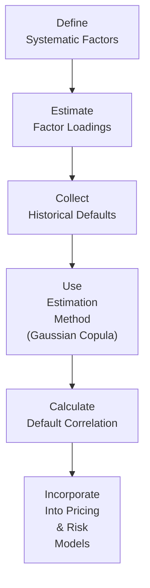

## Introduction and Overview

Credit derivatives, especially multi-name instruments like basket credit default swaps (CDSs) or collateralized debt obligations (CDOs), often require a careful look at the level of default correlation among their underlying assets. You might have heard the old saying: “If one corporate bond defaults, it might just be that issuer. But if several issuers begin to default around the same time, something bigger is at play.” Understanding correlation is how we measure that “something bigger,” the factor linking multiple defaults in a portfolio.

In modern markets, correlation among credit instruments is crucial because it can amplify or mitigate the risk of simultaneous defaults. If two issuers are highly correlated, trouble at one often hints at trouble for the other. But if they’re uncorrelated, the negative event for one issuer might have little to do with the performance of the other. And while correlation might sound like a simple number, behind it lies a host of quantitative models—like the Gaussian copula—that attempt to capture how default events might cluster together.

In this section, we’ll explore the differences between systematic and idiosyncratic risk, dig into practical modeling approaches to correlation, and examine how portfolio managers can harness correlation insights to manage tail risk. There might be times when we realize (with a small gasp) that correlations can fluctuate wildly—this phenomenon is referred to as correlation skew. It’s one of those things that can catch even the pros off guard if they assume a static correlation model.

We’ll also highlight key terms and conclude with best practices and references for further reading. By the end, you’ll have a deeper understanding of how correlation influences credit risk and portfolio-level decision-making.

## Systematic vs. Idiosyncratic Risk

Anytime we deal with multiple credit instruments, it’s wise to disentangle two main sources of risk:

• Systematic Risk:  
  This is the risk driven by broad economic conditions, such as a recession, a spike in interest rates, or a global liquidity crunch. Almost every issuer feels the effect of adverse credit conditions in the broader market. During the Global Financial Crisis, for instance, the meltdown of real estate prices and volatility in the banking system created a ripple effect that hit many sectors at once.

• Idiosyncratic Risk:  
  This is risk associated with a specific issuer or bond. For instance, a company might face an isolated scandal, a product recall, or management missteps that don’t affect other companies in the same industry. Idiosyncratic risk can often be diversified away by holding a sufficiently large number of issuers in the portfolio.

When we talk about default correlation, we typically focus on how much systematic risk issuers share. If two bonds are susceptible to the same macroeconomic drivers, their correlation might be high. On the other hand, if they’re from completely different sectors that rarely move in tandem, correlation may be low.

## Default Correlation and Multi-Name Credit Derivatives

Imagine a basket credit default swap (CDS) that references, say, five different corporate bonds. The payoff structure of a first-to-default basket means you get protection once the first bond in the basket defaults. But for a second-to-default basket, you only get protection after the second bond experiences a credit event, and so on. Higher default correlation implies these defaults are more likely to cluster in time. So ironically, a first-to-default basket might be more expensive if these bonds are highly correlated, because the chance of at least one going bad sooner is higher.

We can see something similar in collateralized debt obligations (CDOs). CDOs are typically structured into tranches that slice the overall risk into different layers. The equity or “first-loss” tranche takes hits from losses before the mezzanine or senior tranches do. If defaults are highly correlated, there’s a greater possibility that several defaults will happen close together, causing the junior tranches to be wiped out more quickly, and possibly pushing losses into the senior tranches. That’s not so great if you’re the investor in a senior tranche who originally thought you were “safe.” It also means that the rating and pricing of those tranches hinge on accurately measuring correlation.

## Role of Correlation

Correlation is basically a measure of co-movement. In credit risk parlance, it captures how the default of one issuer might be statistically related to the default of another. If correlation is zero, you’d interpret that as no direct relationship in their default events. If correlation is high (let’s say close to 1.0), defaults come in a cluster. Meanwhile, negative correlation (rare in credit land) would mean if one defaults, it’s somehow less likely the other would. In practice, negative correlation among defaults is nearly non-existent—no one hopes a competitor’s default magically “helps” a struggling firm. Instead, correlation typically goes from low to very high in stressed markets.

## Correlation Modeling Approaches

Although we might imagine correlation as a single number, real-world modeling often requires more nuance. Credit correlation can differ across various time horizons, through different stages of the economic cycle, and across different structures (for instance, equity tranches vs. senior tranches of a CDO).

### Copula Models

Copula-based models are used in credit risk to model the joint distribution of default times for multiple issuers. The word “copula” is a fancy way of saying we can capture the dependence structure between random variables (in this case, default indicators) separately from their individual distributions. In other words, we separate the marginal distribution (the probability that each issuer defaults in isolation) from the correlation structure (how those defaults relate to each other).

#### Gaussian Copula

One popular approach is the Gaussian copula model, introduced to mainstream finance by David X. Li in 2000. In a Gaussian copula, we assume a correlation parameter that ties each issuer’s default event together via a multivariate normal distribution. That approach essentially says: “We can measure how correlated bond default events are by hooking them to a common underlying normal factor.”  
• Pros: Conceptually straightforward, easy to implement for a large portfolio.  
• Cons: Often criticized for not capturing extreme left-tail dependence well. Under the assumption of normality, tail events might not reflect true market contagion.

#### Other Copulas

Beyond the Gaussian, practitioners have explored Student’s t-copula and more complex copulas that have fatter tails and can capture so-called tail dependence. Tail dependence is an important phenomenon in credit markets, because when times are really bad, correlations can skyrocket.

### Correlation Skew

In reality, correlation is not generally constant. We even have a phrase for it: correlation skew. This means correlation can be low in stable, benign market conditions—but as soon as the broader economy falters or a few issuers run into trouble, correlation can shoot up. It’s basically a reflection of panic: if you see a competitor default, you might wonder if the entire sector’s next.

I personally recall analyzing a portfolio of high-yield corporate bonds during a downturn; everything was humming along decently, suggesting modest correlation. All of a sudden, one large retail chain defaulted. Within a month, several others that had looked stable started to default. Like dominoes. We definitely saw correlation shift from moderately low to extremely high, compressing the timeline for potential losses.

## Systematic Factors and Tail Risk

All these correlation measures come into play most acutely in tail-risk scenarios. Tail risk refers to the probability of extreme losses, which you might imagine occurring if a large portion of your portfolio defaults in a short time frame. In multi-name credit derivatives, tail risk can be amplified. Indeed, a portfolio manager might be well-hedged six ways to Sunday, but if systematic risk events or large macro shocks hit many issuers at once, the hedge might fail.

One way to get a handle on tail risk is to run scenario analyses or stress tests. The goal here is to gauge what happens if unemployment spikes, or if the yield curve inverts dramatically, or if liquidity dries up. Each scenario might produce a different correlation among the defaults in your basket or CDO pool.

## Measuring Correlation in Practice

On a practical level, how do we estimate correlation? Historical data can provide a clue—tracking default rates across multiple issuers during different economic conditions. However, historical data might not fully capture future scenarios, especially in brand-new industries (think about high-tech or biotech sectors with limited track records). Analysts also use option-implied volatilities or credit spread movements to back out correlation estimates. For instance, changes in credit spreads (the premium for default risk) across different issuers can give an indication of real-time correlation.  

Below is a simplified workflow for correlation estimation in a credit portfolio using a Gaussian factor model. For demonstration, we show it as a Mermaid diagram:



• Define Systematic Factors: Economic or industry-specific indicators that might drive default risk.  
• Estimate Factor Loadings: How sensitive each issuer is to those systematic factors.  
• Collect Historical Defaults: Historical data on individual and portfolio-level defaults.  
• Use Estimation Method: For instance, a Gaussian copula to tie everything together probabilistically.  
• Calculate Default Correlation: The final correlation estimate that emerges from the model.  
• Incorporate Into Pricing & Risk Models: Apply these correlation estimates for returns, pricing, and capital calculations.

## Diversification and Concentration

One key outcome of correlation analysis is understanding how to diversify a credit portfolio. If all your issuers are highly correlated (e.g., they belong to the same sector and the same region), you’re limiting your diversification benefits. A single adverse shock might crater the entire portfolio. But if correlation is lower, you might see offsetting effects—some issuers remain strong while others falter.

This dynamic drives a lot of the structuring in multi-issuer products. For instance, a CDO manager might actively seek less-correlated assets in the underlying pool to improve the overall risk-return profile. But it’s worth noting that measured correlation in normal times can differ from correlation in stressed times. The correlation skew effect complicates portfolio construction because you can’t rely solely on historical correlation measures.

## Modeling Pitfalls

• Mis-specification of Correlation: If your model is too simplistic or if you assume correlation is static, you might underestimate tail risk during crises.  
• Data Limitations: Historical default data can be sparse or only relevant for particular economic regimes.  
• Over-Reliance on Gaussian Approaches: Real-world default distributions often exhibit heavy tails and jump behavior.  
• Wrong Factor Selection: Choosing the right factors for systematic risk isn’t trivial. If you omit crucial risk drivers, your correlation estimates might be off.

## Stress Testing Correlation

Stress testing is a best practice in credit portfolio management. If you suspect correlation could spike during a recession, run multiple “what-if” scenarios. For example:  
• Raise correlation from 0.2 to 0.7 for all issuers.  
• Impose a path where interest rates surge by 300 basis points.  
• Modify the default probabilities to reflect historical crisis default rates.  

Then see how the portfolio or instrument (like a basket CDS) performs. You might find that any given structure is robust to modest correlation levels but crumbles if correlation leaps above a certain threshold. 

## Practical Example: Two-Bond Portfolio

Let’s do a scaled-down example with just two corporate bonds, Bond A and Bond B, each with a 5% probability of default over the next year. If we assume zero correlation, the joint probability that both default in the same year is:

P(A and B default) = 0.05 × 0.05 = 0.0025 (or 0.25%).

But if the correlation is 0.5, the incidence of both defaulting together is higher. Under a Gaussian assumption (to keep it simple), the combined default probability might rise significantly above 0.25%. The actual figure is determined by integrating over the bivariate normal distribution with correlation = 0.5. Even though that might not sound huge, it’s typically enough to reprice any derivative that references both bonds in a basket.

## Python Snippet for a Gaussian Copula Simulation

Here’s a conceptual snippet for simulating correlated defaults using a Gaussian copula. This isn’t production-grade code, but it’ll help illustrate how we might approach the problem:

```python
import numpy as np
from scipy.stats import norm

np.random.seed(42)

n_sims = 10_000

pA = 0.05
pB = 0.05

rho = 0.5

mean = [0, 0]
cov = [[1, rho],
       [rho, 1]]
X = np.random.multivariate_normal(mean, cov, n_sims)

U = norm.cdf(X)

defaultA = (U[:,0] < pA).astype(int)
defaultB = (U[:,1] < pB).astype(int)

joint_default_probability = np.mean((defaultA * defaultB) == 1)

print(f"Joint Default Probability: {joint_default_probability:.4%}")
```

In this simple code, we generate correlated standard normal draws, convert them into uniform variables using the normal CDF, and then impose default thresholds. The final output reveals how correlation affects the simulated probability of joint default.

## Implications for Portfolio Management

Portfolio managers, especially those overseeing large credit portfolios composed of corporate bonds, mortgages, or credit-linked notes, must pay close attention to correlation because of:

• Capital Requirements: Regulators and internal risk committees require stress tests and capital buffers that account for correlated defaults.  
• Diversification Strategy: A truly multi-sector, multi-regional, or multi-currency portfolio might enjoy lower correlation and better resilience.  
• Pricing Models for Multi-Name Products: The value of a basket CDS, synthetic CDO, or credit index tranche depends heavily on correlation assumptions.  
• Tail Hedging Strategies: Portfolio managers might seek out protection via index CDS or macro hedges when they expect correlation to rise.

An anecdotal rule of thumb is that correlation is typically “sleepy” in good times but can spike sharply during crises. All those subprime mortgages in 2006 looked uncorrelated until they didn’t. That’s partly why many investors were blindsided: correlation soared as soon as the housing market turned and people realized the structural weaknesses in mortgage underwriting.

## Best Practices and Risk Mitigation

• Use Multiple Models: Compare Gaussian copula results with other copulas, like Student’s t, especially if you’re concerned about tail dependence.  
• Incorporate Macroeconomic Indicators: Default correlation is heavily influenced by business cycles, so keep an eye on leading indicators.  
• Monitor Market Spreads: If credit spreads start moving together across issuers, it’s a warning sign that correlation is rising.  
• Dynamic Hedging: If you’re managing a credit portfolio, consider dynamic hedging with credit indices that reflect changing correlation conditions.

## Ethical and Regulatory Considerations

Under the CFA Institute Code of Ethics and Standards of Professional Conduct, we have an obligation to present fair and balanced analyses. Over-relying on simplistic correlation inputs can lead to underestimating risks and misrepresenting the potential losses to clients. We must disclose model limitations, especially if correlation assumptions could drastically shift the loss projection in stress scenarios.

Regulators worldwide increasingly require banks and asset managers to conduct rigorous stress tests. In some cases, you must assume a set of correlation stress scenarios or comply with guidelines laid down by bodies such as the Basel Committee on Banking Supervision. While it might feel like extra paperwork, these rules aim to ensure the resilience of the financial system.

## Real-World Reflection

Back in my early days—well, let’s just say we had a couple of times when we thought correlation was a small factor given how stable the market looked. Then a sector-wide slowdown hit, and it was basically an “ah, so that’s what they meant by correlated defaults” moment. While it was stressful (pun intended), it underscored the importance of not assuming that correlation is some constant number. It’s a dynamic force that can move up quickly. Having a plan for that scenario can make all the difference for managing large, multi-issuer positions.

## Exam Relevance and Summary

• Correlation Underpins Multi-Name Products: On the CFA exam, expect questions on how correlation affects the valuation and risk of basket CDS or CDO tranches.  
• Model Selection: Examiners might ask you to compare the Gaussian copula to other modeling approaches or to critique the assumptions underlying each.  
• Stress Testing Scenarios: Be ready to demonstrate how you’d handle a spike in correlation in a portfolio.  
• Systematic vs. Idiosyncratic Risk: You should be comfortable distinguishing between them and explaining how correlation primarily captures systematic risk.  
• Impact on Tranche Pricing: Senior vs. junior tranches behave differently under high correlation conditions. Senior tranches can become riskier than initially expected when correlation spikes.

In a nutshell, correlation is a foundational concept that determines how robust your credit portfolio truly is. It’s the difference between “we could lose a few dollars if one issuer defaults” and “all of our holdings might topple together.” Being mindful of how correlation is measured, how it might skew in stressed markets, and how it can be mitigated through diversification or hedging strategies is essential for prudent credit portfolio management.

## References and Further Reading

• Li, D.X. (2000). “On Default Correlation: A Copula Function Approach.” Journal of Fixed Income.  
• Bluhm, C., Overbeck, L., & Wagner, C. (2016). “An Introduction to Credit Risk Modeling.” Chapman & Hall.  
• Das, S. (2002). “Credit Derivatives: Trading & Management of Credit & Default Risk.” Wiley.  
• Basel Committee on Banking Supervision. Various publications on capital requirements and stress testing.

Remember, correlation can be a fair-weather friend—low in normal times and brutally high when the next crisis hits. Understanding, modeling, and stress testing it is key to safeguarding your credit portfolio from unpleasant financial surprises.

---

## Practice Questions: Correlation and Credit Portfolio Risk



### Correlation’s Effect on Multi-Name Instruments  
- [x] High default correlation increases the chance that multiple issuers will default at roughly the same time, raising the cost of a first-to-default CDS basket.  
- [ ] High default correlation typically reduces the risk to senior tranches in a CDO structure.  
- [ ] High default correlation automatically ensures negative correlation between equity- and debt-like instruments.  
- [ ] Low default correlation always increases credit risk in the portfolio.  

> **Explanation:** A higher default correlation means defaults tend to cluster, which increases the likelihood of an early default in a first-to-default basket. This can raise protection costs.

### Systematic vs. Idiosyncratic Risk  
- [x] Systematic risk is related to broad market or economic factors that affect many issuers, while idiosyncratic risk is specific to a single issuer.  
- [ ] Systematic risk can be fully diversified away, whereas idiosyncratic risk cannot.  
- [ ] Both risks are always negatively correlated.  
- [ ] Idiosyncratic risk does not matter for small portfolios.  

> **Explanation:** Systematic risk cannot be diversified away by adding more issuers, because it impacts the whole market. Idiosyncratic risk can often be reduced through diversification.

### Copula Models  
- [x] Copula models allow analysts to model the joint distribution of defaults using separate marginal distributions and a dependence structure.  
- [ ] Copula models are unrelated to default correlation.  
- [ ] Copula models require zero knowledge of individual default probabilities.  
- [ ] A Gaussian copula is the only way to measure correlation for credit defaults.  

> **Explanation:** Copula models isolate the dependency structure (i.e., correlation) from the marginal default probabilities, making them versatile tools in credit risk modeling.

### Correlation Skew  
- [x] Correlation often increases in stressed markets, a phenomenon sometimes referred to as “correlation skew.”  
- [ ] Correlation remains constant and is unaffected by market volatility.  
- [ ] Correlation skew implies that correlation is always highest in normal markets.  
- [ ] Correlation skew is limited to the equity derivatives market and not relevant for credit.  

> **Explanation:** In practice, correlation among default events can surge when markets turn volatile, leading to higher-than-expected joint defaults.

### Tail Risk  
- [x] Tail risk refers to the probability of extreme losses, and high default correlation can amplify tail risk in a credit portfolio.  
- [ ] Tail risk only arises when correlation is negative.  
- [ ] Tail risk is always negligible for well-diversified credit portfolios.  
- [ ] Tail risk is never influenced by large macroeconomic shocks.  

> **Explanation:** As correlations rise in a downturn, simultaneous defaults become more likely, which can result in large unexpected losses.

### Stress Testing Correlation  
- [x] Stress tests can involve raising the correlation parameter to see how it affects default clustering.  
- [ ] Stress testing correlation is rarely done because correlation is always stable.  
- [ ] Increasing correlation lowers default risk.  
- [ ] Regulators do not encourage correlation stress testing for credit portfolios.  

> **Explanation:** By systematically bumping correlation, analysts can see if the portfolio is vulnerable to large losses under more extreme scenarios.

### Senior vs. Equity Tranches  
- [x] High default correlation can increase the likelihood that losses move quickly through the equity tranche and into the senior tranche.  
- [x] Equity tranches are the first to absorb losses, but in a highly correlated environment, defaults can accumulate fast enough to threaten senior tranches, too.  
- [ ] The equity tranche is unaffected by correlation.  
- [ ] Senior tranches carry no correlation risk.  

> **Explanation:** If defaults cluster, equity tranches can be wiped out swiftly, meaning the senior tranches could also face losses.

### Managing Correlation Risk  
- [x] Portfolio managers often create diversified portfolios or purchase index CDS to hedge correlation spikes.  
- [ ] Reducing the number of issuers in a portfolio is the best way to mitigate correlation risk.  
- [ ] Correlation risk is never influenced by macro factors.  
- [ ] Dynamic hedging is unnecessary in rapidly changing credit markets.  

> **Explanation:** A diversified portfolio strategy and dynamic hedging instruments can help cushion portfolios from surges in correlation during crises.

### Gaussian Copula Model  
- [x] Assumes a normal dependence structure and is relatively straightforward to implement.  
- [ ] Perfectly captures extreme tail dependence between issuers.  
- [ ] Cannot be used for multi-name credit products.  
- [ ] Is entirely free from criticism.  

> **Explanation:** The Gaussian copula was once praised for simplicity but criticized for underestimating extreme tail correlations.

### True or False: Negative Default Correlation Is Common in Credit Portfolios  
- [x] True  
- [ ] False  

> **Explanation:** While negative default correlation is less common, it is not impossible. However, in practice, default correlations are typically low to moderate, but rarely strongly negative because a default event rarely improves another issuer’s credit quality.


