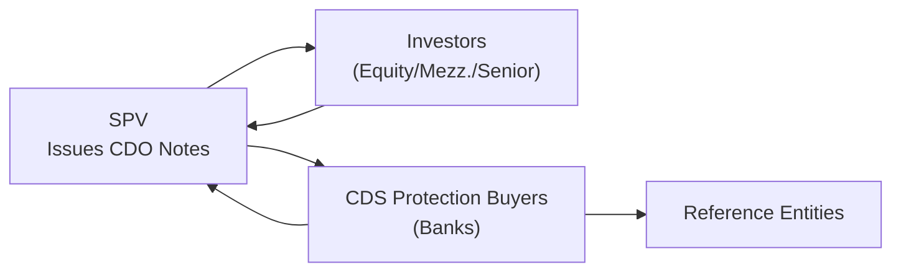
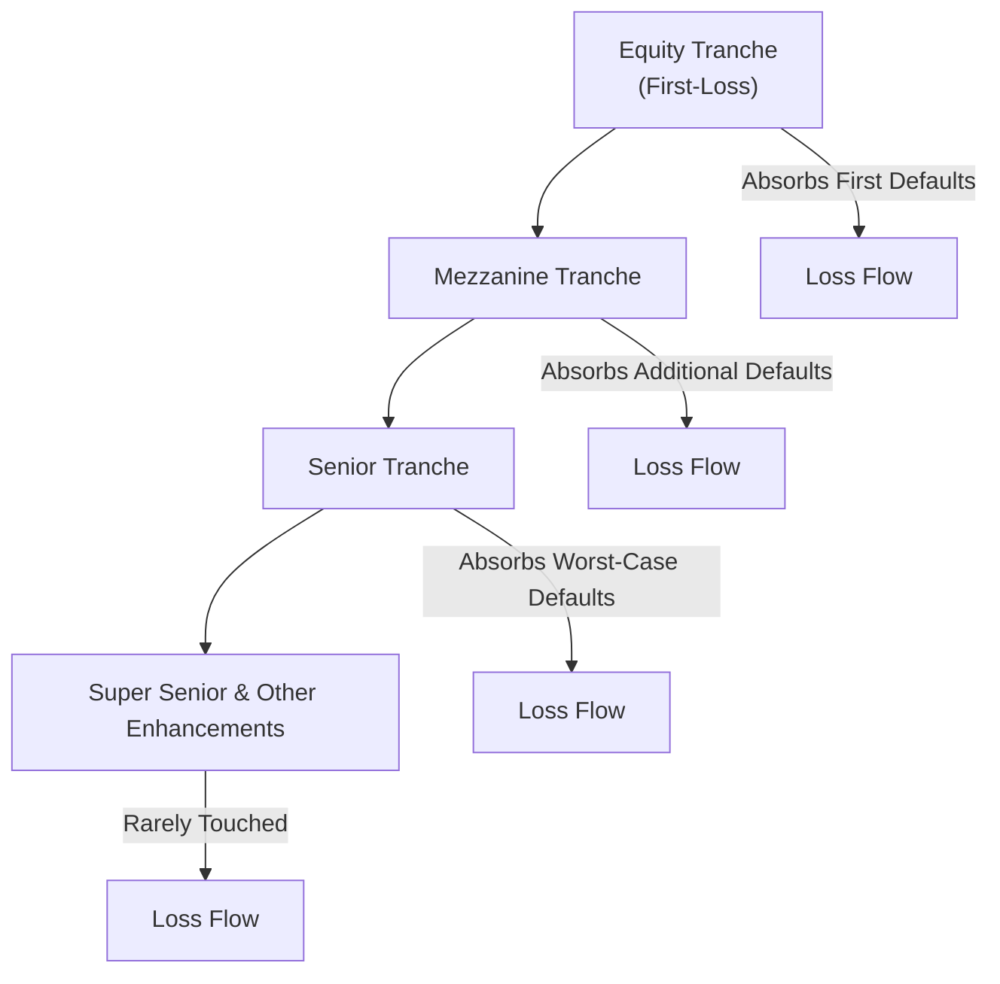

## Introduction and Motivation

Let’s talk about Synthetic CDOs. Perhaps you’ve heard they’re these complex, almost mystical, products that made headlines during the 2008 financial crisis. Honestly, they can feel a bit intimidating. But they’re really just another form of structured finance—a way to slice and dice credit risk into different buckets (called tranches) so that investors can pick the level of risk (and yield) they want. Unlike a “cash” CDO that holds actual loans or bonds, synthetic CDOs obtain their credit exposure through credit default swaps (CDS). Essentially, the structure writes protection on a pool of reference entities (corporate bonds, mortgage-backed securities, or other credit instruments) and collects premiums from the protection buyers. Investors in the CDO buy notes from the special purpose vehicle (SPV) and receive coupon payments that come from those premiums.

Why would anyone do that? Because synthetic CDOs remove the need to source real-world collateral (like corporate loans) and, instead, replicate that exposure with CDS. This can drastically lower costs, speed up deal execution, and offer more flexibility. They also allow you to go long on credit risk (by selling protection) or short on credit risk (by buying protection) without tangling yourself in the complexities of physically holding large pools of mortgages, corporate notes, or other obligations. 

In practice, synthetic CDOs played several big roles. At their best, they offered a new pathway for portfolio managers to hedge or to gain exposure to certain credit markets. But at their worst, they magnified and distributed subprime and other credit risks so widely across the financial world that nobody really knew who bore the greatest losses when defaults started happening. Let’s break this topic down carefully—think of it like a puzzle we’re assembling piece by piece.

## Key Building Blocks

### Tranche Subordination  
In a typical CDO—whether synthetic or cash—risk is divided into “tranches.” If you imagine a pyramid, the bottom slice is the equity (or first-loss) tranche. This is the riskiest piece that absorbs the first defaults. Moving up the pyramid, you’ll find mezzanine tranches that bear losses only after the equity tranche is wiped out. Finally, at the top, there’s the senior tranche that faces a relatively small probability of loss since it is protected by all the tranches below. This concept of structuring is crucial: the losses flow upward from the equity piece until each tranche is exhausted. 

### SPV (Special Purpose Vehicle)  
A Synthetic CDO often resides within an SPV. An SPV is a legal entity created solely for this transaction, isolating risk from the sponsor’s balance sheet. So if you’re a bank or asset manager, you offload credit risk into the SPV. The SPV issues the CDO notes to investors and acts as the legal party in the credit default swap contracts, ensuring that if the bank or sponsor folds, the structure itself is (hopefully) insulated.

### Equity Tranche  
Equity is the “first-loss” or most junior slice. Investors in this tranche receive the highest potential returns (typically large coupons) but also face the highest default risk. In a sense, they’re the buffer for everyone else, so they’re compensated with a bigger yield. If defaults occur, the equity tranche is the first to be wiped out. Think of it as the “shock absorber” for the rest of the CDO.

### Arbitrage CDO  
People often toss around the phrase “arbitrage CDO.” That’s typically a structure aiming to profit from the spread difference between the collateral’s yield (or the CDS premium received) and the cost of issuing the separate tranches. If the portfolio is carefully assembled and the overall environment is stable, theoretically the spread difference can be locked in to produce some nice gains.

## Comparing Synthetic and Cash CDOs

A casual observer might ask: “Why not just stick with a cash CDO that invests in actual bonds or loans?” Well, often it boils down to speed and flexibility. With a synthetic CDO, a sponsor doesn’t need to gather a basket of physical bonds or mortgages. Instead, they enter into CDS contracts referencing a pool of bonds or loans. Premiums flow from the CDS buyers to the SPV, which then uses those premiums to pay yield on the CDO note tranches. Meanwhile, if defaults arise in the reference entities, the SPV must compensate (partially or fully) the CDS protection buyers.  

Some benefits of synthetic structures:  
• Speed: They can be assembled relatively fast and with fewer operational frictions.  
• Lower capital requirement: No large up-front purchase of actual bonds or mortgages.  
• Customization: You can tailor the reference pool composition quite finely.  

However, because you can tailor that reference pool so easily, it’s sometimes more difficult to perform due diligence. Synthetic exposures can be “magical,” in the sense that they’re intangible—there are no real bonds sitting in a lockbox. That means the chain of who ultimately bears which piece of risk can become opaque, especially if multiple synthetic CDOs reference the same underlying credits.

## Mechanics of a Synthetic CDO

Let’s walk through a simplified example. (Yes, I once helped a trading desk do something like this, though back then, it felt about as complicated as building a spaceship.)

1. The SPV sets up credit default swap agreements with one or more swap counterparties (often banks). The SPV is the credit protection seller on a portfolio of reference obligations.  

2. The SPV receives periodic CDS premiums from the protection buyers. These premiums become the cash flows that back the coupon payments to CDO investors.  

3. Investors purchase notes issued by the SPV in different tranches (equity, mezzanine, senior). Investors get regular coupon payments that are derived from the CDS premiums the SPV receives.  

4. If a reference entity in the pool defaults, the SPV must pay a settlement amount to the protection buyer. That settlement payment is covered by drawing down the principal from the most junior tranche first (the equity).  

5. As defaults accumulate, the equity tranche can be entirely depleted. If additional defaults occur, losses spill over to the next mezzanine tranche, and so on.  

The structure can be visualized in a diagram. Let’s use a Mermaid diagram to show how cash and risk flows might look:

• From Investors to SPV: The initial proceeds they pay when they buy the tranches.  
• From SPV to Investors: The coupon payments (sourced from CDS premiums).  
• From SPV to CDS Protection Buyers: Default protection if reference entities default.  
• The CDS Protection Buyers are effectively short credit risk; the SPV (and thus the CDO investors) are effectively long credit risk.

## Real-World Implications and the 2008 Crisis

Synthetic CDOs sometimes magnify exposures because we’re not limited by physical collateral. If ten separate synthetic CDOs all reference the same $100 million bond, you might end up with a notional exposure far exceeding the size of the underlying asset. When credit performance is good, that’s not necessarily a problem. But, ironically, if that one bond defaults, multiple synthetic CDOs might trigger payouts, resulting in huge systemic losses.

In the run-up to the 2008 crisis, participants designed synthetic CDOs referencing baskets of subprime mortgage-backed securities (MBS). Many issuers believed housing prices would keep rising, or that losses would be contained to a small portion of the reference pool. When defaults skyrocketed, these structures encountered widespread margin calls, disputes over valuations, and logistical nightmares determining which parties owed what to whom. It’s one of the big reasons we got that “house of cards” feeling across global financial markets.

## Why Create Synthetic CDOs in the First Place?

• Flexibility and Speed: You can quickly switch in or out of certain sub-sectors of credit risk by adjusting the CDS reference pool.  
• Cost Savings: No need to buy or transfer physical bonds.  
• Hedging: Financial institutions can hedge existing credit exposures more precisely.  
• Speculation: Investors can “be long” credit (sell protection) or “be short” credit (buy protection) without physically holding or shorting bonds.  

Synthetic CDO supporters argue that, if used responsibly, they make credit markets more efficient. Meanwhile, critics worry that they can lead to massive buildup of hidden leverage and complexity when the hedging and speculation get out of control.

## Risk Assessment and Monitoring

When analyzing synthetic CDOs, you’ll see many layers of risk that require thorough assessment:

• Correlation Risk: If multiple reference credits default around the same time, higher tranches might be more vulnerable than originally modeled.  
• Model Risk: Valuation relies heavily on default probabilities, recovery rates, and correlation assumptions, which can prove wildly inaccurate in times of stress.  
• Counterparty Risk: The SPV writes protection to certain banks or dealers. If those parties fail, the structure can unravel.  
• Liquidity Risk: The secondary market for certain synthetic CDO tranches may be thin.  
• Systemic Risk: Multiple synthetic CDOs referencing the same underlying can amplify overall market confusion and losses if things go sour.

## Practical Example: Simplified Numerical Illustration

Suppose an SPV references a $500 million portfolio of corporate bonds through CDS, focusing on mid-tier companies. The SPV sells protection on that pool to a major bank. The bank pays an annual CDS spread of 2.5% on the notional ($12.5 million per year).  

The SPV issues:  
• $40 million equity tranche paying LIBOR + 12%  
• $60 million mezzanine tranche paying LIBOR + 5%  
• $400 million senior tranche paying LIBOR + 1%  

Let’s say investor demand is strong, and these tranches are fully subscribed. The SPV receives $100 million in capital from the sale of equity and mezz. This portion might serve to collateralize some portion of losses. The senior might be structured in a more complex way, or the SPV might use additional collateral arrangements.

With the bank paying $12.5 million in CDS premiums each year to the SPV, the SPV in turn distributes interest to the investors in the equity, mezzanine, and senior notes. If the underlying reference portfolio experiences no defaults, the equity holders can receive a hefty yield. But if defaults soar above, say, a 5% threshold in notional, the equity can be wiped out. If defaults continue, the mezzanine is on the hook, etc.

## Best Practices and Avoiding Potential Pitfalls

1. Transparent Disclosures: Investors need to see exactly which credits are in the reference pool. Hidden exposures to questionable subprime mortgages or shaky corporate bonds can create nasty surprises.  
2. Monitoring Correlations: A single correlation or default assumption can drastically change the price. Scrutinize correlation inputs in your models.  
3. Adequate Stress Testing: Simulate large jumps in default rates, changes in macroeconomic conditions, or major credit events.  
4. Counterparty Analysis: Who is buying the protection from the SPV? If that party collapses, what’s the fallback plan?  
5. Regulatory Compliance: Synthetic CDOs straddle multiple regulatory frameworks. Make sure you understand your local jurisdiction’s stance on derivatives, capital requirements, and disclosures.

## Lesson Learned: A Personal Anecdote

I remember working with a small hedge fund in early 2007. They were quite excited about the ability to gain exposure to “safe AAA subprime” (famous last words). They used a synthetic CDO structure referencing a pool of mortgage-backed securities. The structure looked bulletproof on paper: The idea was that, historically, even in recessionary environments, mortgage default rates rarely soared enough to seriously impair the AAA pieces. Yet only a year later, the meltdown in housing forced them to re-mark that AAA-based investment at a fraction of its face value. While they had robust risk models, the real correlation of mortgage defaults had not been fully appreciated. So yeah, it was a painful lesson for everyone involved—especially for the folks who believed “AAA is always safe.”

## Exam Relevance

In exam questions related to synthetic CDOs, you might need to:

• Calculate the payoff structure and determine the allocation of defaults across different tranches.  
• Demonstrate how a synthetic approach differs in risk exposure compared to a cash CDO.  
• Identify or evaluate the correlation risk in a given scenario.  
• Explain potential reasons for using a synthetic structure instead of a cash structure (e.g., speed of creation, hedging flexibility, speculation).  
• Discuss how these structures interact with broader regulatory rules on capital adequacy, risk weighting, and standard stress testing.  

Nearly all question types, from case studies to item sets, may incorporate fictitious data about credit spreads, default probabilities, or notional breakdowns. You’ll likely be asked to select the best approach in managing the credit risk or to articulate how subordination works.  

In short, be prepared to explain synthetic CDOs’ mechanics in plain language—how does the cash flow from CDS premiums flow to the CDO tranches, how do credit events cause losses, and what is the effect of correlation and subordination on each tranche’s risk.

## Additional Considerations

### Market Liquidity and Pricing  
The liquidity of synthetic tranches is typically even thinner than the underlying CDS markets. Prices can move sharply if a big player pulls out or new information about the reference pool emerges.

### Regulatory Environment  
Global regulators have increased disclosure and capital requirements for synthetic CDOs. Many jurisdictions require robust stress testing and appear cautious about letting financial institutions hold large exposures to complicated synthetic structures without proper capital buffers.

### Ethical and Systemic Concerns  
Critics argue that synthetic CDOs sometimes create “phantom exposures” that do not fund real economic activity but still add systemic risk. In other words, you can replicate the risk of $100 million in subprime loans multiple times through derivatives without any actual new loans being made. This can lead to speculation that drives markets beyond fundamental realities.

Still, some practitioners maintain that these instruments provide essential tools for hedging, distributing credit risk, and diversifying portfolios—if used by knowledgeable investors who understand the underlying complexities.

## Diagram: Summary of Loss Flow

For a final visual, consider the layering of tranches and how losses flow from the bottom (Equity) upward:

Each step up the ladder is further protected by subordination in the lower tranches. That simple concept forms the core of how all CDOs, synthetic or otherwise, structure risk.

## References

• Lucas, D., Goodman, L., & Fabozzi, F. (2007). “Collateralized Debt Obligations: Structures and Analysis.” Wiley.  
• Ashcraft, A. & Schuermann, T. (2008). “Understanding the Securitization of Subprime Mortgage Credit.” Federal Reserve Bank of New York.  
• Regulatory Filings at: <https://www.sec.gov/>  

----------------------------------

## Assess Your Mastery: Synthetic CDO Structures Quiz



### Which of the following statements best describes a synthetic CDO?

- [ ] A structure that only invests in physically held mortgages.
- [ ] A product limited to senior secured loans only.
- [x] A CDO that gains credit exposure via CDS rather than directly holding assets.
- [ ] A vehicle exclusively for hedging interest rate risk.

> **Explanation:** Synthetic CDOs use credit default swaps to assume credit exposure on a reference portfolio rather than physically holding underlying bonds or loans.

### In a typical synthetic CDO, which tranche is most likely to absorb initial losses from credit events?

- [x] Equity tranche.
- [ ] Mezzanine tranche.
- [ ] Senior tranche.
- [ ] All tranches share losses equally.

> **Explanation:** The equity (or first-loss) tranche is designed to absorb the earliest losses, protecting higher tranches until the equity tranche’s principal is exhausted.

### A bank sponsors a synthetic CDO referencing a pool of corporate bonds. The CDO sells credit protection on the bonds. Which cash flow does the SPV mainly rely on to pay CDO investors?

- [ ] Dividend income from reference equities.
- [x] CDS premiums received from protection buyers.
- [ ] Interest income from physically owned corporate bonds.
- [ ] Loan repayments from the underlying obligors.

> **Explanation:** In a synthetic CDO, the issuer sells credit protection on a basket of reference entities. The SPV receives CDS premiums on those reference entities and uses them to pay investors.

### Which of the following risks is significantly magnified in a synthetic CDO as compared to a cash CDO?

- [ ] Currency risk.
- [ ] Liquidity risk in government bond markets.
- [x] Counterparty and correlation risks.
- [ ] Only interest rate risk.

> **Explanation:** Synthetic CDOs add a unique dimension of counterparty risk (the protection buyer might default on payments) and correlation risk (multiple defaults occurring together beyond expectations).

### Investors who fund an equity tranche in a synthetic CDO typically expect:

- [x] Higher yield with higher possibility of loss.
- [ ] Mid-level yield with minimal default risk.
- [ ] Guaranteed returns backed by government agencies.
- [x] No correlation to interest rates.

> **Explanation:** The equity tranche bears the highest default risk, thus it commands higher yields. However, it’s also the first to take any portfolio losses. Additionally, the question’s last option “No correlation to interest rates” might be tricky, but the question is set up to indicate there can be multiple correct answers if labeled properly (“- [x]” indicates correctness). Typically, equity tranches also do face some impact from interest rates. The key concept is the high yield/high risk. 

### In the context of the 2008 crisis, how did synthetic CDOs contribute to systemic risk?

- [ ] By limiting credit creation to safe corporate debt only.
- [x] By replicating credit exposures multiple times beyond the size of actual underlying assets.
- [ ] By reducing the leverage available to major institutions.
- [ ] By improving global transparency on structured products.

> **Explanation:** Synthetic CDOs allowed multiple traders to reference the same underlying credits via CDS, effectively multiplying total notional exposure. This amplified losses and heightened systemic risk.

### Which best describes the primary advantage of synthetic CDOs versus cash CDOs?

- [ ] Elimination of credit and market risk.
- [x] Quicker structuring without the need to source physical collateral.
- [ ] Guaranteed profit through regulatory loopholes.
- [ ] Perfect correlation with stock market indices.

> **Explanation:** Synthetic CDOs streamline the process by using CDS to replicate the credit exposure of underlying assets, eliminating the need to acquire physical bonds or loans.

### Which statement about the equity tranche in a synthetic CDO is accurate?

- [x] It offers the highest potential yield and first-loss exposure.
- [ ] It offers risk-free returns higher than treasury bonds.
- [ ] It is always guaranteed by a government agency.
- [ ] It only includes prime mortgage exposures.

> **Explanation:** The equity or “first-loss” tranche bears losses first if any defaults occur but typically receives larger coupon payments in compensation for that risk.

### An “arbitrage CDO” in the synthetic context primarily seeks to:

- [ ] Only hedge interest rate risk in a balanced portfolio.
- [x] Profit from the spread difference between collateral yields (or CDS premiums) and the lower yield paid on CDO tranches.
- [ ] Minimize all forms of credit risk for the investor.
- [ ] Provide a guarantee of zero default rates.

> **Explanation:** Arbitrage CDOs are generally structured to exploit the spread differential between what is received on the underlying (or reference) assets and what needs to be paid out to investors in the structure’s tranches.

### True or False: Synthetic CDOs completely remove the need to consider the creditworthiness of the CDS counterparty.

- [ ] True
- [x] False

> **Explanation:** Counterparty risk remains a major concern in synthetic CDOs. If a major CDS protection buyer or seller defaults, the structure can suffer losses or fail to receive expected payments.


