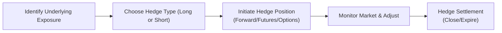

## Introduction

Risk management and hedging—phew, that can sound kind of intimidating, right? I still remember the first time I learned about derivatives as hedging instruments. I was sitting in a small classroom, and the lecturer said something along the lines of, “Wouldn’t it be nice if you could remove the risk of corn prices going haywire?” We all stared blankly at him, but then he introduced futures and put options on corn. Suddenly, it made sense. Derivatives, at their core, can be powerful tools for managing risk exposures in both corporate finance and investment portfolios. 

Anyway, let’s dig into the nitty-gritty of risk management and hedging and see how you might use these tools in real life. We’ll also talk about best practices, highlight some common pitfalls, and reference the most relevant sections from the main derivative markets. After all, hedging is not about magic or trickery—it's about systematically controlling unwanted variability in your financial outcomes. 

## Derivatives as Hedging Instruments

Derivatives come in all sorts of flavors: forwards, futures, options, swaps, and even more exotic variations. Each instrument is designed to help you manage specific types of risk:

• Forwards and Futures: 
  – Let’s say you anticipate that you might have to buy an input (like wheat) for your bakery in six months. If wheat prices rise, your costs shoot up. Enter a forward or futures contract—basically an agreement you sign today that locks in the purchase price for wheat in six months. That’s called a long hedge.  
  – Conversely, if you’re a farmer who anticipates selling wheat in six months, but you worry about a potential price drop, you’d lock in a sale price by entering a short futures contract.

• Options: 
  – Options give you the right, but not the obligation, to buy (call) or sell (put) an underlying asset at a specified price. They can be super helpful if you want downside protection but still want to benefit from favorable price moves. For instance, a protective put strategy helps an investor lock in a minimum sale price for a stock while keeping upside potential.

• Swaps: 
  – Swaps, like interest rate swaps or currency swaps, are often used by companies to convert floating rate debt to fixed rate debt (or vice versa), or to reduce currency mismatch in cross-border operations. 

No matter which tool you pick, the principle is the same: transfer unwanted risk to someone else in the market who is willing to take that risk—often for a price, of course.

## Establishing Hedge Objectives & The Hedge Ratio

Before diving into any hedging strategy, ask yourself: what’s my objective? Do I want to protect my portfolio from short-term movements? Are we focusing on currency risk for an overseas investment? Understanding that objective is step one. Step two is figuring out the right hedge ratio.

In everyday language, the hedge ratio is simply how much of your underlying exposure you aim to offset with a derivative.

Here’s a small formula in KaTeX:


\text{Hedge Ratio} = \frac{\text{Exposure to Hedge}}{\text{Contract Size}}


If your exposure to some commodity is 10,000 barrels of oil and each futures contract covers 1,000 barrels, you might decide to use 10 futures contracts for a perfect 1:1 hedge ratio. However, if you want to hedge only half your exposure for strategic reasons, you might buy or sell five contracts instead.

Finding the “perfect” hedge ratio is rarely straightforward. Sometimes, you want to hedge 100% of your exposure; other times, only a portion. Because real-world markets are dynamic, you’ll want to revisit this ratio periodically to ensure it still aligns with your financial goals.  

## Long vs. Short Hedges

Honestly, once you see this laid out visually, it’s pretty intuitive. Let’s try a short Mermaid diagram showing a timeline of a simple hedge.

• Long Hedge: 
  – If you want to lock in a future purchase price, you go long on a derivative contract. This is common for manufacturers or consumers of a particular commodity who fear rising prices. 

• Short Hedge:
  – If you want to lock in a future sale price, you go short on a derivative contract. Farmers or producers often use this to protect against price declines.

And in case you’re wondering, you can also hedge equity or interest rate exposures by constructing similar “long” or “short” positions in index futures, Treasury futures, or interest rate swaps, depending on whether the risk is from rising or falling rates.

## Perfect vs. Imperfect Hedges (Basis Risk)

Maybe you’ve heard the phrase “perfect hedge.” That’s essentially the dream scenario where your derivative offset is identical to your exposure: you fully eliminate your risk. However, this is super rare. Often, there are slight variations—like the grade of commodity is slightly different from the futures contract spec, or the timing of deliveries doesn’t perfectly match. That difference is known as basis risk.

• Perfect Hedge: Leaves you with zero net exposure—extremely rare in practice.  
• Imperfect Hedge: Leaves you with some leftover risk. This leftover can be small or large depending on how closely correlated the hedge instrument is with your underlying exposure.

You’ll see farmers who produce a particular type of wheat might hedge with a futures contract referencing a different variety or different location. The prices often move in tandem, but not always perfectly, so that’s basis risk. 

## Dynamic Hedging

Dynamic hedging is all about adjusting your hedge positions over time to keep pace with fluctuations in the market or in your exposure. For example, an airline trying to hedge jet fuel might implement a rolling hedge strategy, where it continually extends futures positions across various maturities to smooth out costs.

Dynamic hedging also pops up in option hedging—particularly “delta hedging.” If you write call options, you can hedge the risk by continuously rebalancing your position in the underlying stock, so your net delta stays close to zero. It’s like a dance you do with the market: as prices move, you adjust positions to maintain the hedge.

## Cost of Carry Considerations

Let’s say you decide to build an inventory of coffee beans to protect against potential price surges. Sure, that might protect you from rising market prices, but now you have storage costs (and maybe the risk of spoilage). That’s part of the cost of carry.

• Cost of Carry includes:  
  – Financing costs: the interest you pay to finance inventory.  
  – Storage or warehousing costs: fees for physically holding a commodity.  
  – Insurance and potential spoilage.

Cost of carry can also be negative, meaning you might generate income by holding an asset (for example, stock might pay dividends or a currency might have a higher interest rate). In practice, these costs or benefits get priced into forward and futures contracts. So if you’re hedging with derivatives, you want to be aware of how cost of carry factors into forward/futures prices.

## Measuring Hedge Effectiveness

Alright, so you’ve put on a hedge. Now how do you figure out if it’s doing what you wanted?

One way is to track whether net portfolio performance is less volatile than it would have been without the hedge. Another method uses correlation: if the hedging instrument has a high correlation to your underlying exposure, that’s a good sign. The performance attribution approach asks how much of a portfolio’s return fluctuation is due to the underlying risk factor you were trying to hedge versus other factors. 

• Common measures of hedge effectiveness include:  
  – R-squared or correlation between hedge instrument returns and underlying asset returns.  
  – Reduction in the standard deviation of portfolio returns.  
  – Mark-to-market valuations of the hedge instrument compared to changes in the underlying’s value.

## Overhedging or Underhedging

Sometimes we get a bit carried away. Overhedging occurs when you hedge more than your actual exposure, which can flip your exposure altogether. For example, if you’re always worried about a price drop and you overshoot your hedge, you might find yourself facing losses if prices actually go up. Underhedging, on the other hand, means you’re not covering enough of your exposure, leaving you more vulnerable to adverse price moves than you intended. 

I once knew a small importer who tried to cover overseas currency exposure by buying half the forwards they needed; they were trying to “just see how it goes.” Well, the currency soared in volatility, and that half that wasn’t covered caused them quite a bit of stress. Moral of the story: do your homework, measure the exposure carefully, and know your risk tolerance.

## Implementation and Best Practices

• Rebalancing intervals: Decide how frequently you’ll adjust the hedge. This could be daily, weekly, or monthly, or triggered by a certain price move.  
• Monitor basis risk: Keep an eye on divergences between the hedge instrument’s price and your underlying’s price.  
• Regulatory considerations: Some markets have margin and collateral requirements, as well as regulatory constraints on position limits.  
• Document everything: For compliance (and your sanity), keep a record of your hedging strategy, objectives, and performance.  

## Glossary

• Basis Risk: The risk that the hedge instrument’s price performance does not exactly match the underlying exposure’s price performance.  
• Hedge Ratio: The proportion of an exposure that is offset by a derivative position.  
• Delta Hedging: A strategy that tries to maintain a neutral net exposure by adjusting positions to offset the option delta.  
• Rebalancing Interval: The frequency at which you update your hedge position to reflect changes in the underlying exposure or the market.  
• Immunization: A fixed-income strategy that aims to eliminate interest rate risk by matching the portfolio’s duration with the duration of its liabilities.  
• Cost of Carry: The net cost (including financing, storage, and other factors) of holding an asset, which influences futures/forward pricing.  

## References & Further Reading

• Hull, John C. “Options, Futures, and Other Derivatives.” 10th ed., Pearson.  
• Hull, John C. “Introduction to Futures and Options Markets.” Pearson.  
• “Journal of Derivatives” – for advanced discussions on dynamic hedging, model calibration, and more.  
• CFA Institute, official publications on derivatives and risk management.  

## Test Your Knowledge: Risk Management and Hedging



### Which of the following best describes the concept of basis risk in a hedging scenario?

- [ ] Perfect correlation between the hedge and underlying asset prices.  
- [x] The mismatch between movements in the hedge instrument’s price and the underlying exposure’s price.  
- [ ] The elimination of all risk through a derivatives contract.  
- [ ] The cost incurred due to storing a physical commodity.  

> **Explanation:** Basis risk arises when the price of the hedging instrument doesn’t move in perfect tandem with the underlying, so it may not fully offset gains or losses.

### A company with a large anticipated purchase of oil in six months is most likely to use which of the following to lock in its acquisition cost?

- [x] Long futures contract on oil.  
- [ ] Short futures contract on oil.  
- [ ] Writing a put option on oil.  
- [ ] Writing a call option on oil.  

> **Explanation:** To guard against rising oil prices, the firm would go long an oil futures contract and lock in the purchase price.

### What is an aspect of dynamic hedging in options?

- [x] Continuously rebalancing to maintain a targeted delta.  
- [ ] Closing out a futures contract at expiration only.  
- [ ] Setting a hedge ratio once and never changing it.  
- [ ] Hedging with an instrument that has zero basis risk.  

> **Explanation:** Dynamic (or delta) hedging involves frequently rebalancing the position in the underlying to keep the net delta near zero.

### An airline that wants to manage fuel costs for the next year decides to regularly replace expiring fuel futures contracts with new longer-dated contracts. This practice is known as:

- [ ] Lump-sum hedging.  
- [ ] Spread trading.  
- [x] A rolling hedge.  
- [ ] Perfect hedging.  

> **Explanation:** A rolling hedge involves continually extending hedges by entering new contracts as old ones expire.

### In a short hedge, a producer of corn concerned about price declines would:

- [x] Sell futures contracts on corn.  
- [ ] Buy futures contracts on corn.  
- [ ] Buy a call option on corn.  
- [ ] Take no action if they expect a perfect hedge ratio.  

> **Explanation:** A short hedge typically involves selling futures contracts to offset potential price declines on the underlying commodity.

### Which of the following statements about cost of carry is correct?

- [x] It includes storage and financing costs associated with holding an asset.  
- [ ] It only applies to agricultural commodities stored in warehouses.  
- [ ] It is always negative.  
- [ ] It never affects futures pricing.  

> **Explanation:** Cost of carry includes all expenses (like storage, insurance, and borrowed funds) for holding the physical commodity and is reflected in futures/forward pricing.

### Overhedging occurs when:

- [ ] You hedge slightly less than your total exposure.  
- [ ] You hedge exactly 100% of your total exposure.  
- [x] You hedge more than your total exposure.  
- [ ] You experience a rise in volatility that was not expected.  

> **Explanation:** Overhedging means the hedge exceeds the underlying exposure, potentially flipping the position to an opposite exposure rather than just covering the risk.

### What is the main objective of hedge ratio determination?

- [ ] Ensuring a profit on each hedging transaction.  
- [ ] Offsetting taxation impacts.  
- [x] Figuring out how many derivative contracts are needed to properly hedge an exposure.  
- [ ] Minimizing cost of carry.  

> **Explanation:** The hedge ratio determines how many (or how much) of the derivative instruments are needed to offset a given exposure.

### Which of the following best describes a perfect hedge?

- [ ] A hedge that sets aside 10% of the portfolio in cash for unexpected events.  
- [x] A hedge in which all risks are completely eliminated.  
- [ ] A hedge strategy that uses at least two different derivatives.  
- [ ] A hedge strategy that costs nothing to implement.  

> **Explanation:** A perfect hedge theoretically removes all risk, though this is seldom achievable in practice due to basis risk and other market frictions.

### True or False: When hedge effectiveness is measured, a high correlation between the hedging instrument and the underlying exposure typically suggests a more effective hedge.

- [x] True  
- [ ] False  

> **Explanation:** High correlation means that hedge gains and losses move closely with the underlying asset, allowing for better offsetting of risk.


