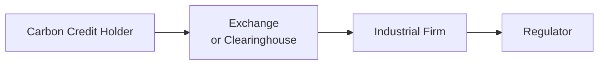

## Understanding ESG in Derivatives Markets

When I first got curious about sustainability in finance, I remember asking an industry veteran, “Does ESG really matter when it comes to derivatives?” He half-laughed, half-sighed, and said, “Believe me, it does—especially now more than ever.” At the time, I was a bit skeptical; I used to think of derivatives in purely traditional terms: futures, options, swaps, and so forth, focused on routine hedging of currencies or interest rates. But with growing environmental, social, and governance (ESG) awareness, we’ve seen an explosion of new ways to manage sustainability-related risks using derivatives.

ESG-linked derivatives aim to help market participants reduce exposure not just to financial risk but also to broader impacts stemming from climate regulations, carbon credit programs, renewable energy mandates, and even social and governance metrics. These instruments can address everything from carbon emissions to employee well-being or board diversity. They also play a role in broader climate strategy by facilitating capital flows into green and sustainable ventures. By the end of this article, you’ll see how rapidly this realm is evolving—and, hopefully, you’ll agree with that veteran that ESG considerations absolutely do matter in derivatives markets.

## Green Derivatives: The “E” in ESG

So, let's talk about “Green Derivatives.” These are contracts explicitly designed to track or hedge instruments like renewable energy indices, carbon offsets, or ESG benchmarks. They can be futures, options, or swaps. The main objective is to mitigate sustainability risk and even capture alpha from positive ESG performance—if that’s part of your investment mandate.

A classic example is a derivative on a renewable energy index. Picture a power producer specialized in wind farms who wants to lock in some revenue based on the performance of wind energy investments across Europe. They might use a future or swap tied to an index that reflects average wind farm profitability. If the index outperforms (maybe because wind conditions are stronger than expected), the producer benefits financially. If it underperforms, losses are offset by gains from the swap position. The net effect is a more stable and predictable cash flow that’s aligned with renewable energy objectives.

In many ways, green derivatives function like traditional derivative instruments, except they reference an ESG-related underlying. These underlyings can be:  
• Renewable energy capacity or usage.  
• Carbon emission indexes.  
• Blended ESG ‘scores’ that track overall corporate sustainability metrics.  

Market participants—particularly institutional investors—sometimes use these derivatives to align portfolios with sustainability mandates. For instance, a pension fund with an ESG mission might target an outperformance of an ESG equity index. The manager can use equity index futures that tilt their exposure more heavily towards companies with strong environmental or social scores.

## Carbon Emission Allowances and Their Role in Hedging

Now here’s a big one: carbon emission allowances. These allowances, sometimes called carbon credits or carbon permits, enable holders to emit a certain amount of carbon dioxide or equivalent greenhouse gases. Under many cap-and-trade regimes—like the EU Emissions Trading System—companies must either hold enough allowances to cover their emissions or face steep penalties. If you’re an industrial firm uncertain about the price path of carbon credits, you might use futures or options on carbon allowances to hedge that price risk.

Imagine a chemical plant operator worried about rising carbon costs over the next few years. They can go long carbon futures—say on the European Energy Exchange—to lock in a certain carbon permit price. If carbon prices shoot up, the gains on the futures contract offset the higher costs the plant pays to acquire the allowances in the spot market. If carbon prices drop, sure, their futures position might take a hit, but it’s offset by cheaper spot allowances. It’s similar in structure to more traditional commodity hedging (like hedging oil or copper), except the commodity here is the right to pollute up to a certain threshold.

Carbon emission futures can be priced through a cost-of-carry approach, although the underlying asset (carbon allowances) behaves a bit differently than physical commodities. For instance, convenience yields—common in commodity pricing—may not strictly apply here. Instead, policy changes and compliance deadlines affect forward prices. Some companies also use carbon options to hedge more tactically, paying a premium for the option to buy allowances at a fixed strike.

Below is a simple flow diagram illustrating how carbon credits might move through the system:

The holder of a carbon credit (A) could sell it to or through the exchange or clearinghouse (B). Industrial firms needing allowances (C) purchase from that same marketplace and then use those credits to demonstrate compliance to the regulator (D).

## Incorporating Social and Governance Factors in Derivative Contracts

Environmental concerns typically steal the ESG spotlight, but let’s not overlook the S (social) and G (governance). Increasingly, we see derivatives designed to reflect or require performance metrics around, say, workplace safety, diversity, or robust corporate governance practices. How does that actually play out in a derivative contract?

Here’s a hypothetical scenario: A multinational corporation might float a bond with an embedded derivative that lowers the interest rate payable if the company meets certain sustainability or social targets—like achieving a certain percentage of women in senior leadership or reducing the recordable workplace injury rate below an agreed threshold. If the company hits these milestones, the derivative’s payoff structure triggers more favorable financing terms. If not, it might stay the same or become more expensive.

Similarly, an equity swap might have a “governance-linked” coupon. For example, the floating rate could be pegged to a standard benchmark plus a spread that adjusts if a firm’s governance score (as rated by a recognized third-party provider) crosses a certain threshold. If the firm’s governance rating improves, the spread might narrow, reducing cost. If it deteriorates, the firm pays a higher cost, effectively penalizing poor governance outcomes.

As you might suspect, these structures require robust, objective ESG data providers. Without reliable metrics, the risk of misrepresentation or “ESG washing” looms large. Regulators increasingly scrutinize ESG claims to ensure they aren’t superficial or misleading.

## Climate Risk Transfer Strategies

For many industries—particularly agriculture, energy, and real estate—extreme weather or climate change can pose significant threats. This is where weather derivatives step in. Now, you might remember hearing about heating-degree-day (HDD) or cooling-degree-day (CDD) futures. Energy utilities or even retail businesses can use these to lock in revenue or reduce risk tied to unseasonal temperatures.

Climate risk transfer can also take the form of catastrophe (CAT) bonds or parametric insurance, but from a derivatives perspective, we often look at weather futures and options on temperature indices, rainfall levels, or even wind speeds. For an agricultural producer, dryness could devastate crop yields. A derivative contract that pays off if rainfall in a particular region falls below a specified level can mitigate the financial impact of a drought.

If there’s one cautionary tale here, it’s basis risk. The weather derivative references an index or measurement location that might not perfectly match a given farm’s microclimate. This mismatch can reduce the effectiveness of hedging. But the fundamental logic remains: transferring climate or natural catastrophe risk to the market via derivatives can protect corporate cash flows and—yes—bolster sustainability efforts by promoting more resilient, climate-aware business practices.

## Integrated ESG Policies and Derivative Selection

Asset managers, particularly those guided by strict ESG mandates, sometimes do a double-take: “Wait, do we even want to get involved with derivatives from high-carbon firms or derivatives that indirectly support unsustainable practices?”

This question underscores the role of integrated ESG policies in derivatives selection. For instance, an asset manager may rule out futures on a commodity whose production severely harms the environment, or they might specify that any equity derivatives must track indexes with a certain minimum ESG rating. They might also exclude any over-the-counter (OTC) derivatives with counterparties that fail to meet specific governance or supply-chain criteria.

While these policies can narrow the available derivative set, they can also reduce reputational and idiosyncratic ESG risks. Some managers actively prefer “green swaps,” which structure interest rate or currency swap terms to promote sustainability. For example, the swap’s fixed rate might drop if the counterparty meets predefined greenhouse gas reduction targets. On the other hand, if the company’s emission intensity worsens, the fixed rate might tick higher.

These integrated policies reflect a bigger theme: ESG is no longer just about investing in “green” companies. It’s about embedding sustainability in every corner of asset allocation, risk management, and trade execution—derivatives included.

## Examples and Case Studies

Let’s dig into a quick real-world style example (though anonymized):

Imagine a European utility heavily invested in wind power. They’re worried about volatile power prices and uncertain wind conditions. The utility enters into a swap where it receives a variable payment based on a “green power index” that tracks wind energy production margins, and pays a fixed rate determined by current market expectations. If wind energy profitability soars, the index payment received by the utility is high, compensating for potentially lower spot revenues in times of strong wind supply (because prices might drop). If the wind margin collapses, the utility pays out less on the swap but might still do okay in the spot market when supply is low. In short, they’ve smoothed out their revenue volatility while focusing on renewable energy outcomes.

Another scenario: A manufacturing group needing carbon allowances uses a series of carbon futures to lock in carbon credit prices for the coming three years. If the group fails to reduce emissions quickly enough, they’re at least cushioned against spiking carbon prices. Meanwhile, they can hustle to implement greener tech solutions—knowing their compliance costs are bounded.

## Common Pitfalls and Best Practices

All right, so we’ve seen how ESG derivatives can help. But, well, let’s also talk about pitfalls:

• Data Quality: If you’re referencing an ESG score or climate index, make sure it’s transparent, verified, and widely accepted. Unreliable data can undermine your entire hedge.  
• Regulatory Uncertainty: Carbon markets, in particular, can be shaped or shaken by regulatory changes. Policy shifts in cap-and-trade systems can suddenly alter supply-demand dynamics.  
• Basis Risk: Weather derivatives and even carbon instruments might not precisely track the underlying exposure. Weather stations or carbon compliance schedules can deviate from your actual risk profile.  
• Liquidity: Some specialized ESG derivatives—like certain carbon allowance options—might have relatively thin trading volumes, leading to wide bid-ask spreads.  

Best practices include establishing clear sustainability metrics, ensuring robust compliance and governance frameworks, diversifying across multiple ESG instruments, and frequently revisiting your hedge structure to reflect the ever-shifting regulatory environment.

## Glossary

Carbon Credit  
An entitlement or certificate signifying the right to emit one ton of carbon dioxide (CO₂) or equivalent greenhouse gas. To meet climate targets or regulatory obligations, firms can trade these credits.

Renewable Energy Certificates (RECs)  
Tradable certificates confirming that one megawatt-hour (MWh) of electricity was generated from a renewable energy source like wind, solar, or hydro. Organizations buy RECs to claim usage of renewable power.

Green Swaps  
A broad term for swaps structured with sustainability-linked incentives. For instance, a floating interest rate might be reduced if a firm meets greenhouse gas reduction targets.

## References and Further Reading

• Sustainable Finance resources from the United Nations Environment Programme (UNEP).  
• Labatt, S. and White, R., “Carbon Finance: The Financial Implications of Climate Change.”  
• Various carbon trading guidelines from the European Energy Exchange (EEX) and Intercontinental Exchange (ICE).  

## Final Exam Tips

Whether you’re studying for the CFA exam or just looking to master these concepts, here are a few suggestions:

• Know the Mechanics: Understand how carbon allowance markets function, including how prices are influenced by regulations, supply/demand dynamics, and compliance deadlines.  
• Watch the Regulatory Environment: Scenario-based questions might test your ability to adapt or re-structure a hedge following newfound policy changes.  
• ESG Data Providers: Familiarize yourself with how third-party ESG scores or climate indices are constructed. Expect questions about data reliability.  
• Implementation and Monitoring: Be prepared to write constructed-response answers explaining how an integrated ESG derivative strategy is monitored and rebalanced over time.  
• Ethics and Greenwashing: The CFA Institute Code of Ethics has grown more stringent about honesty and disclosure in ESG labeling. Expect exam questions around correctly representing ESG-driven hedge strategies.

Below, you’ll find some practice questions that reflect the interplay between derivatives and ESG concepts.

## Assess Your Mastery of ESG Derivatives for Risk Hedging



### Which of the following describes a primary use of green derivatives in an investment portfolio?

- [ ] To generate immediate tax advantages through sustainability credits.
- [x] To reduce exposure to environmental-related risks by tracking green indices.
- [ ] To circumvent all physical commodity delivery requirements.
- [ ] To eliminate counterparty risk altogether.

> **Explanation:** Green derivatives, such as those tied to renewable energy or ESG benchmarks, primarily help hedge or manage portfolios against sustainability-related risks, often tracked through green indices or data referencing.

### A manufacturing firm concerned about future carbon prices might choose to:

- [ ] Sell carbon futures to hedge against rising carbon credits.
- [x] Buy carbon futures to lock in carbon costs at a known price.
- [ ] Sell equity index futures to reduce overall market risk.
- [ ] Buy commodity futures for raw material inputs.

> **Explanation:** If a company anticipates higher carbon prices and needs to purchase carbon credits in the future, going long carbon futures helps fix their future cost.

### An asset manager has an integrated ESG policy restricting trades to instruments that meet sustainability criteria. Which of the following is most likely?

- [x] Certain derivatives may be excluded if the underlying fails to meet governance standards.
- [ ] The manager can only trade environmental swaps and no other derivatives.
- [ ] All over-the-counter (OTC) derivatives are automatically disqualified.
- [ ] Margin requirements for futures would be zero.

> **Explanation:** Integrated ESG policies can exclude certain derivatives referencing poorly rated underlyings or counterparties with subpar ESG performance, but they do not bar all OTC derivatives or necessarily reduce margin requirements.

### A weather derivative tied to rainfall levels in a specific region is used primarily to hedge:

- [ ] Carbon emission costs for a manufacturing firm.
- [ ] Equity price risk for a diversified portfolio.
- [x] Climatic volatility for agricultural or hydropower operations.
- [ ] Exchange rate volatility for cross-border transactions.

> **Explanation:** Weather derivatives keyed to rainfall or temperature can help agricultural or hydropower entities reduce cash flow uncertainty caused by weather fluctuations.

### Which factor is the greatest driver of price changes in carbon allowances futures?

- [ ] The convenience yield derived from holding allowances as a physical commodity.
- [x] Regulatory policies and cap adjustments in emission trading systems.
- [ ] Corporate bond yields and broad interest rates.
- [ ] Stock market volatility and dividend payouts.

> **Explanation:** While interest rates and market conditions matter, carbon credit markets are heavily influenced by regulatory policies that set emission caps and adjust allowance supply.

### A firm chooses a “governance-linked” equity swap where the spread adjusts based on governance score changes. This can be viewed as:

- [x] Embedding an ESG performance metric into a derivative’s payoff structure.
- [ ] Purchasing an insurance contract for corporate governance risk.
- [ ] A foreign exchange hedge tied to a governance index.
- [ ] A short sale arrangement on poorly governed companies.

> **Explanation:** A governance-linked swap modifies the derivative’s payoff based on the issuer’s governance score, effectively embedding the “G” into the contract terms.

### A chemical plant that exceeds its emission cap can best hedge next year’s carbon costs by:

- [ ] Taking a short position in natural gas futures.
- [x] Going long carbon allowance futures.
- [ ] Writing put options on the S&P 500 index.
- [ ] Buying call options on the euro.

> **Explanation:** To hedge potential increases in carbon costs, the plant purchases (goes long) carbon allowance futures, locking in a known purchase price for carbon credits.

### One main challenge when using weather derivatives is:

- [ ] They cannot be traded on organized exchanges anywhere.
- [x] Basis risk, because the reference index may not match the actual local weather.
- [ ] They are generally illegal in most countries.
- [ ] They are only available to government agencies.

> **Explanation:** Weather derivatives are perfectly legal and increasingly available, but the mismatch between reference indexes and localized weather can create basis risk.

### A comprehensive integrated approach to ESG in derivatives selection often involves:

- [x] Evaluating both the underlying asset’s ESG attributes and the counterparty’s ESG profile.
- [ ] Avoiding any form of leverage or margin borrowing.
- [ ] Freely selling uncovered options on ESG indexes.
- [ ] Ensuring a contract is always physically settled with renewable assets.

> **Explanation:** An integrated ESG approach often includes screening both the underlying instrument and the counterparties for ESG compliance and sustainability standards.

### A parametric weather derivative that pays a set amount if rainfall falls below a threshold is:

- [x] True
- [ ] False

> **Explanation:** Parametric weather derivatives trigger a payout based on a specific event metric—like rainfall being below (or above) a certain benchmark—rather than actual loss measurements.


