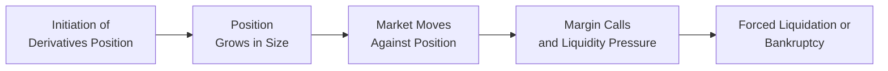

## Introduction

Derivative instruments can be powerful and efficient tools for risk management, speculation, and yield enhancement. They allow investors to shift or modify the financial exposures in their portfolios. But let’s be honest: they also carry significant pitfalls, especially when deployed without robust oversight. This section examines some of the most infamous derivative disasters in modern finance—episodes that still give many of us goosebumps. We’ll look at the Barings Bank collapse (1995), Long-Term Capital Management (1998), the Société Générale rogue trading scandal (2008), and the Metallgesellschaft debacle (1993). These cautionary tales underscore the importance of prudent risk management, internal controls, and a healthy dose of skepticism when chasing potential trading profits.

## Overview of Key Derivative Mishaps

### Barings Bank Collapse (1995)

Barings Bank was, once upon a time, one of the world’s oldest merchant banks—until a young trader named Nick Leeson brought it to its knees through unauthorized trading in Nikkei 225 stock index futures. Now, you might think: “Wouldn’t his bosses spot suspicious positions?” Well, here’s the bizarre part: Leeson managed both the front office (where trades are initiated) and the back office (where those trades are verified). That conflict of duties allowed him to hide massive losses in a secret account.

Barings’ downfall began with seemingly small bets on the Nikkei futures in the Singapore International Monetary Exchange (SIMEX). As the market moved against Leeson, he doubled down (averaging losses) in an attempt to recover losing positions. Soon, the bank was hemorrhaging money, but the losses remained concealed for a surprisingly long stretch. By the time management realized something was off, it was too late.

The final blow came when the Kobe earthquake shook Japan’s markets in early 1995, triggering enormous losses on Leeson’s leveraged futures bets. Barings could not meet the margin calls, and the bank declared bankruptcy practically overnight.

Key lessons include:
• Never allow one individual to handle both trading and settlement responsibilities.  
• Keep a rigorous system of checks and balances.  
• Track risk exposures carefully, especially highly leveraged positions in futures.  

### Long-Term Capital Management (LTCM) (1998)

LTCM was founded by a group of brilliant minds—lots of PhDs, plus two Nobel laureates in economics. Their strategy was straightforward in principle: identify price discrepancies in bond markets (fixed income arbitrage), deploy vast amounts of leverage, and collect the spread once prices converged.

For a while, LTCM raked in profits. And they did it so well that major investment banks were practically throwing money at them. However, by 1998, LTCM’s positions had become enormous relative to the size of the global fixed income market—the firm was rumored to be leveraged at ratios exceeding 25-to-1. Then a series of unexpected events hit: Russian debt default, global credit market stress, and a liquidity squeeze that triggered an exodus from LTCM’s traded instruments. These shocks caused LTCM’s supposedly “low-risk” trades to blow up.

When LTCM’s problems came to light, the Federal Reserve in New York had to organize a bailout to calm market contagion fears. The biggest takeaway from LTCM? Even the brightest models can fail when markets behave in unanticipated ways—and if you’re leveraged to the hilt, small tremors become catastrophic earthquakes.

### Société Générale Rogue Trading (2008)

In early 2008, Jérôme Kerviel, a mid-level trader at Société Générale, shocked the financial world by accruing billions of dollars in losses through unauthorized equity index futures trades. Much like Nick Leeson at Barings, Kerviel had knowledge of the bank’s control processes, which allowed him to bypass or conceal certain trades. And despite a series of suspicious activities, risk managers and compliance officers missed the red flags.

Kerviel’s positions were enormous—and mostly directional bets on the Euro Stoxx 50 and DAX futures markets. He used fictitious offsetting positions to mask the size and risk of his real trades. When markets moved sharply, SocGen took a major hit as it unwound his trades. The incident further highlighted the danger of failing to enforce separation of duties and ignoring odd patterns in trader activity.

In short:
• Adequate oversight and routine stress testing of abnormal positions could have prevented these runaway losses.  
• Large proprietary trades must be subject to risk management approval, position limits, and immediate reconciliation.  
• “Rogue trading” typically involves a combination of weak controls and an individual determined to circumvent them.  

### Metallgesellschaft (1993)

Let’s shift gears from the drama of unauthorized trades to a more subtle mismatch in derivatives hedging. Metallgesellschaft (MG), a German conglomerate, entered into long-term contracts to supply customers with oil at fixed prices. To hedge that obligation, MG used short-dated energy futures on the New York Mercantile Exchange (NYMEX), rolling them forward each month. The idea was that short-term futures gains would offset the cost of eventually delivering oil to customers.

Trouble was, this “stack and roll” approach was very sensitive to fluctuations in the term structure of oil futures (contango vs. backwardation). If the near-month futures were priced high relative to the longer-dated physically delivered contracts, MG found itself constantly incurring rollover costs. When oil prices started sliding, the repeated losses on the futures positions ballooned, causing huge liquidity strains—margin calls soared, forcing gigantic cash outlays. Ultimately, the position had to be unwound.

Note that MG’s situation was not as straightforward as a simple “bad trade.” The firm had a legitimate strategy to hedge long-term obligations. However, the hedge mismatch (short maturity futures vs. long-term deliveries) meant the firm bled cash in the short run, even though the position might have eventually turned profitable if it’d been held to final delivery.

Main lessons:
• “Stack and roll” hedging can be perilous if you don’t properly manage liquidity and basis risk.  
• A hedge strategy might protect you from ultimate price exposure, but the interim cash flow demands can kill you first.  
• Ongoing stress tests and scenario analyses are necessary to ensure that short-term market conditions don’t derail a longer-term hedge.  

## Common Themes and Lessons Learned

Seeing these four disasters lined up gives us a hefty sense of déjà vu, right? In each case:
• Inadequate internal controls or monitoring (unfortunately, a recurring theme in derivative fiascos).  
• Over-reliance on “perfect” models or strategies that fail to anticipate extreme market events.  
• Poor communication between front office (traders) and back office (settlement and record-keeping).  
• Mismanagement of liquidity risk, margin calls, and the real possibility of losing big before trades converge.  
• Highly leveraged or concentrated positions that magnify losses rapidly and unexpectedly.

We also see how a single trader or a small group can threaten an institution’s entire capital base if circumventing rules or if the institution’s risk management is asleep at the wheel. In Chapter 6.4 (“Counterparty Risk in OTC Markets”), we discussed the complexities of dealing with less-regulated derivative structures. Here, we see real evidence that even exchange-traded futures—often thought simpler—are no less dangerous without robust oversight.

### Rogue Trading and Unauthorized Positions

“Unauthorized trading” is a fancy term for hidden or dishonest activities by a trader who is either:
• Exceeding the notional limits or risk guidelines assigned to them.  
• Providing false or forged statements to risk management.  
• Exploiting knowledge of both front and back office processes to conceal real exposures.

We saw it at Barings and Société Générale. If your firm doesn’t separate responsibilities—a key principle in operational risk management—there’s a chance for unscrupulous individuals to manipulate trades and internal records. That’s a big no-no.

### Over-Leveraged Arbitrage

The LTCM fiasco is the poster child for over-leveraged arbitrage. Sometimes, the mispricing they exploit is measured in basis points. When you’re leveraged 25-to-1, a small market shift of a few basis points can blow up your position. Leverage is a double-edged sword. Use it responsibly or be prepared for meltdown. Indeed, Chapter 7 (“Arbitrage, Replication, and Cost of Carry”) explains how conventional no-arbitrage strategies might look safe in normal times but can become extremely vulnerable if stressed by unexpected liquidity or volatility events.

### Hedging Mismatches

At Metallgesellschaft, a mismatch in the maturities and cash flow patterns of their “hedge” led to massive short-term liquidity strains. We often rely on futures markets to hedge. But if the hedge horizon is months or years out, we must carefully consider how rolling positions forward can dig a deeper hole rather than protect us. The difference between short-term futures valuations and long-term contractual obligations is the essence of “basis risk,” which we explored as a concept back in Section 6.1 (“Risk Management and Hedging”) and Section 2.18 (“Basis Risk in Futures Hedging”).

### Flow Diagram of a Derivative Disaster

Below is a simplified flowchart illustrating how unauthorized or mismatched trades can spiral into financial disaster:

Each node links to the next stage, showing how even a single large position can balloon into catastrophic consequences if unmonitored.

## Risk Management Best Practices

Although each of these case studies differs in structure, they provide consistent lessons that remain highly relevant to derivatives management:

• Robust Internal Controls: Ensure separation between front office trading and back office reconciliation. Independent risk and compliance teams should frequently compare actual positions with authorized position limits.  
• Proper Authorization Protocols: Swiftly verify large or unusual trades. Don’t rely solely on trader-reported data.  
• Stress Testing and Scenario Analysis: Run stress tests for extreme moves, “fat tail” events, or unusual correlations. Explore how margin calls might multiply during a severe downturn.  
• Liquidity Management: Even a well-hedged position can fail if rolling forward or meeting interim cash calls drains the firm’s liquidity.  
• Diversification: Avoid concentrated bets on a single product, market, or correlation-based strategy.  
• Transparent Culture: Encourage open communication. If a trader or risk manager senses something off, they should feel safe to raise concerns.  

## Glossary

• Unauthorized Trading: When a trader exceeds authorized limits or falsifies records to hide positions (see Barings, Société Générale).  
• Leveraged Arbitrage: Uses borrowed capital (sometimes at extreme levels) to exploit small pricing inefficiencies (see LTCM).  
• Proprietary Trading Desk: A desk within a financial institution that commits the firm’s own capital in pursuit of profit.  

## Exam Relevance

These major mishaps highlight the real-world implications of derivative misuse—beyond pure textbook theory. On exam day, you might face scenario-based questions that require you to identify weak points in risk management or propose solutions to avoid a meltdown. You might be asked to dissect how a mismatch in futures maturities can lead to spiral losses or how insufficiently monitored positions can bypass an institution’s controls. Understanding these actual events will help you better interpret risk management frameworks, internal control procedures, and the critical importance of regulatory oversight.

## Final Exam Tips

• Expect Constructed-Response Questions: You may be required to suggest internal control measures for a hypothetical proprietary trading desk or to evaluate a scenario where LTCM-like over-leverage is used. Explain not just “what went wrong” but “why it was allowed to happen.”  
• Step-by-Step Solutions: If confronted with a numeric example of rolling futures hedges (like MG’s situation), carefully demonstrate how monthly losses accumulate and what triggers margin calls.  
• Keep the Big Picture in Mind: Risk fiascos usually arise from a mixture of operational risk, market risk, and human error. In your essay responses, mention these multiple dimensions.  
• Watch for Ethics Connections: The CFA Code and Standards heavily emphasize professional integrity and internal controls. Rogue trading cases are prime examples of ethical breakdowns.  

## References & Further Reading

• Board of Banking Supervision. “Report into the collapse of Barings.” HM Treasury, UK.  
• Das, Satyajit. “Traders, Guns & Money.” FT Press.  
• Lowenstein, Roger. “When Genius Failed: The Rise and Fall of Long-Term Capital Management.” Random House.  
• Official Metallgesellschaft case analyses in various academic journals.  
• CFA Institute. “Code of Ethics & Standards of Professional Conduct.”  

--------------------------------------------------------------------------------

## Derivative Disasters: Practice Questions



### Which of the following factors best explains Barings Bank’s downfall?

- [ ] Market turmoil caused by unexpected currency fluctuations.
- [ ] A fully effective hedge was too expensive to maintain.
- [x] A single trader controlled both front and back office functions, hiding losses.
- [ ] Government intervention forced the closure of the bank.

> **Explanation:** Barings collapsed primarily because Nick Leeson was able to conceal massive futures losses by managing both trade execution (front office) and trade reconciliation (back office). This duty overlap allowed for unauthorized trading activity to go undetected.

### Long-Term Capital Management's (LTCM) collapse showed that:

- [x] High leverage magnifies small miscues and market shocks.
- [ ] Currency options reduce risk when used for speculation.
- [ ] Central banks always rescue troubled hedge funds with no conditions.
- [ ] Equity derivatives are risk-free when backed by government bonds.

> **Explanation:** LTCM relied on massive leverage in bond arbitrage strategies. When market conditions shifted, their huge position magnified losses that almost triggered global financial contagion.

### Société Générale's case highlights the importance of:

- [ ] Encouraging traders to take on larger positions in favorable markets.
- [ ] Relying on automated risk systems without human oversight.
- [ ] Minimizing risk through complex, off-balance-sheet instruments.
- [x] Having strict internal controls and segregation of duties to thwart rogue trading.

> **Explanation:** Jérôme Kerviel's unauthorized trades escaped detection because of lax oversight and insufficient segregation of responsibilities.

### In the Metallgesellschaft disaster, the primary issue was:

- [x] The mismatch between short-term futures hedges and long-term delivery obligations.
- [ ] The company’s inability to secure any hedges in the marketplace.
- [ ] Extreme mispricing of foreign currency options.
- [ ] Unauthorized commodity speculation beyond corporate limits.

> **Explanation:** Metallgesellschaft’s “stack and roll” strategy used short-dated futures to hedge long-term oil supply commitments, creating costly margin calls in the short run despite an intended hedge.

### Basis risk in futures hedging refers to:

- [x] The risk that a futures price does not move in perfect alignment with the underlying exposure.
- [ ] Risk of unauthorized trading not being detected by internal controls.
- [ ] The risk of non-delivery in physically settled contracts.
- [ ] The concept that a futures price equals the spot price at expiration.

> **Explanation:** Basis risk arises when the correlation between a futures contract and the underlying asset is imperfect, leading to potential under- or over-hedging.

### The term "proprietary trading desk" generally means:

- [x] A trading unit that uses the firm’s own capital for profit.
- [ ] A central clearinghouse that monitors all trade settlements.
- [ ] A retail investor group that offers advisory services.
- [ ] A regulatory body overseeing derivatives exchanges.

> **Explanation:** Proprietary desks are where an institution invests (and risks) its own capital rather than client funds, aiming to earn returns but potentially exposed to large losses.

### Which of the following best describes the role of internal controls in preventing derivative disasters?

- [ ] They completely eliminate market risk from the institution.
- [x] They help detect unauthorized trades and ensure trades adhere to limits.
- [ ] They allow front office traders to calculate margin calls manually.
- [ ] They replace the need for any risk monitoring systems.

> **Explanation:** Effective internal controls include separating trading and back office functions, monitoring position limits, and reconciling trades in near real time.

### Leverage can be especially hazardous in derivatives because:

- [ ] It usually reduces the credit risk associated with trading partners.
- [x] It magnifies both gains and losses, causing large exposure to small price changes.
- [ ] It is never subject to margin calls on futures positions.
- [ ] It eliminates the need for diversification.

> **Explanation:** In derivatives, high leverage amplifies even minor market fluctuations, which can result in outsized losses (or gains).

### One major lesson from rogue trading incidents is that:

- [ ] Technology will always detect concealment of positions.
- [ ] Large trades are always more profitable on average.
- [x] Combining front office trading and back office functions is dangerous.
- [ ] Collaterals are unnecessary when using exchange-traded derivatives.

> **Explanation:** Rogue traders exploit weak controls and the lack of segregation between trading, record-keeping, and reconciliations.

### In all four cases discussed (Barings, LTCM, Société Générale, and MG), a key takeaway is:

- [x] Risk management failures or oversights played pivotal roles in the losses.
- [ ] The proprietary traders involved had no knowledge of derivatives markets.
- [ ] Lack of advanced financial models caused the collapses.
- [ ] Each incident arose from currency exchange risks alone.

> **Explanation:** Despite varying circumstances, each disaster was fueled by insufficient oversight, risk management blind spots, and an underestimation of potential losses.


