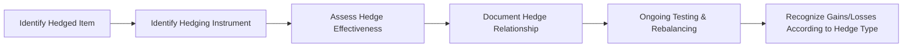

## Introduction

If you've ever tried to match a derivative’s gains or losses with the actual exposure it's meant to offset, you’ve probably encountered hedge accounting. This topic can be a little mind-boggling at first—if you’ve ever sat in a conference room with a CFO frantically flipping through IFRS manuals, you know what I mean. But fear not. Hedge accounting is designed to tackle one major headache: extreme earnings volatility caused by marking derivatives to market, even while the underlying exposure might not yet impact earnings.

In this section, we’ll dig deep into how hedge accounting works, why it helps with financial reporting, and how IFRS 9 and ASC 815 shape the rules globally. We’ll also run through real-world examples—like hedging future commodity purchases or foreign currency revenues—so you can see how these frameworks are applied in practice. Along the way, we’ll share some personal experiences, a few cautionary tales, and some quirks about the documentation and testing you’ll be expected to perform.

## Purpose of Hedge Accounting

Let’s jump right in: hedge accounting aims to reduce the mismatch in timing between derivative gains/losses and the underlying exposure’s impact on earnings. Usually, derivatives have to be recorded at fair value on the balance sheet, with changes recognized in profit or loss. Meanwhile, the item being hedged (like forecasted cash flows or a foreign investment) might not show immediate changes in the accounting statements. That mismatch can make earnings swing all over the place.

Hedge accounting tries to smooth out those swings. By applying special hedge accounting treatments, you’re essentially deferring or adjusting how derivative gains/losses are recorded so they’re recognized in the same period as the “hedged item.” That way, the derivative’s purpose—to mitigate risk—shows up in the financial statements in a more stable, coherent way.

You might ask, “Why not just skip derivatives and any fancy accounting altogether?” Well, ignoring derivatives might simplify your books, but it can open you to notable market risks—like foreign currency or commodity price fluctuations that can ruin your margins. Hedge accounting is the best of both worlds: economic protection plus an accounting framework that helps avoid noisy results.

## Types of Hedges

Three main categories of hedges dominate the conversation under IFRS 9 and ASC 815:

1. Fair Value Hedge  
2. Cash Flow Hedge  
3. Net Investment Hedge

Each hedge type addresses different risk exposures and has unique accounting treatments. Let’s walk through them.

### Fair Value Hedge

A fair value hedge is designed to offset changes in the fair value of an existing asset or liability—or even an unrecognized firm commitment. Think of it like this: Suppose you have an inventory item on the balance sheet whose price fluctuates with market conditions. You enter into a derivative (like a forward contract) to hedge that inventory’s fair value changes. Accounting wise:

• The hedged item’s carrying amount is adjusted for the changes in its fair value (attributable to the hedged risk).  
• The derivative is marked to fair value, with gains or losses recognized in profit or loss.  
• Ideally, gains/losses on the derivative offset the hedged item’s remeasurement.

A quick personal anecdote: I once handled a fair value hedge for a client hedging fixed-rate debt. Every time interest rates changed, the fixed-rate bond’s fair value would move in the opposite direction of the interest rate swap. It was so satisfying to see them eventually offset in the income statement.

### Cash Flow Hedge

If you’re hedging the variability in future cash flows from a forecasted transaction, you likely have a cash flow hedge. For example, imagine you expect to purchase a commodity in six months. You want to lock in the price now. You buy a futures contract, so you’re protected if the commodity price surges.

• The effective portion of the derivative’s gain or loss goes into “Other Comprehensive Income” (OCI) rather than profit or loss immediately.  
• When the hedged transaction affects earnings, the deferred gains/losses move from OCI and are reclassified into profit or loss, aligning with the underlying transaction’s timing.  
• Any ineffective portion of the derivative’s gain or loss is recognized in profit or loss immediately.

One subtlety that tripped me up early on was how to handle the reclassification from OCI into earnings when the forecast transaction actually occurs. Documentation can get tedious, but it keeps your statements consistent with the risk management strategy.

### Net Investment Hedge

A net investment hedge protects you from exchange rate fluctuations for investments in foreign subsidiaries or operations. Let’s say you own a European subsidiary, but your parent entity reports in USD:

• If the Euro weakens significantly, your net investment in that subsidiary might lose value when converted back to USD.  
• By using a derivative like a forward contract on EUR/USD or by denominating debt in the subsidiary’s currency, you lock in a more stable net investment value.  
• Under IFRS 9 or ASC 815, the effective portion of the hedge’s gain or loss goes to a special reserve in equity (similar to the translation reserve), only hitting profit or loss upon disposal of the foreign operation.

Net investment hedges can be a lifesaver for multinational corporations. However, the complexity around measuring foreign exchange exposures and ensuring the hedge coverage matches the net investment is no small challenge.

## Requirements for Hedge Effectiveness

Hedge effectiveness is central to demonstrating that your derivative is actually doing its job—and justifying hedge accounting treatment. IFRS 9 and ASC 815 share common ground, though IFRS 9 is a bit more flexible with qualitative methods. Under both frameworks, you must typically show:

• A clear, documented risk management objective and strategy.  
• A formal designation and documentation of the hedging relationship.  
• An expectation that the hedge will be highly effective prospectively (often “highly effective” means around 80%–125% offset).  
• Ongoing testing to confirm that actual hedge performance remains within acceptable parameters.

In other words, you can’t just sign a derivative and call it a hedge after the fact. You’re required to designate the hedge relationship at inception, define what is being hedged, how you’ll measure effectiveness, and how you’ll handle any hedge ineffectiveness.

### Effectiveness Testing

Effectiveness can be evaluated via quantitative or qualitative methods. Quantitative approaches often use regression analysis to see how closely changes in the hedged item track changes in the hedging derivative. The coefficient of determination (R²) or slope coefficient can reveal if the derivative offsets the underlying risk effectively.

A typical regression-based approach might revolve around:


\text{Change in Hedged Item} = \alpha + \beta \times \text{Change in Derivative} + \varepsilon


• β close to 1 = ideal offset.  
• R² near 1 = strong relationship.  

If the offset ratio or correlation drifts outside certain thresholds, you might not qualify for hedge accounting and must reevaluate or discontinue hedge accounting treatment going forward.

To see how this might look in practice, here’s a quick (and simple) snippet of Python code that calculates correlation between two arrays, representing changes in the hedged item and changes in the derivative:

```python
import numpy as np

changes_hedged_item = np.array([0.02, -0.03, 0.05, -0.01, 0.04])
changes_derivative = np.array([0.018, -0.032, 0.049, -0.012, 0.041])

correlation = np.corrcoef(changes_hedged_item, changes_derivative)[0,1]
print(f"Correlation: {correlation:.2f}")
```

If the correlation is high (close to +1 or −1), the risk offset may be deemed effective. Of course, real-world testing is more nuanced, but this is the basic idea.

## Documentation and Testing

Let’s be honest, documentation feels dull. But it’s absolutely critical in hedge accounting. You must document:

• The hedge relationship and type (fair value, cash flow, or net investment).  
• The nature of the risk being hedged.  
• Identification of the hedged item and the hedging instrument.  
• Method for assessing hedge effectiveness and measuring ineffectiveness.  
• How effectiveness will be measured prospectively and retrospectively.

You might think, “Ugh, do I really need to keep track of all these details?” The short answer is yes. Without robust documentation, your external auditors will likely disagree with hedge accounting treatment, and your CFO might have a few pointed questions.

### Prospective vs. Retrospective Effectiveness

• Prospective: You need to predict that the hedge will be effective in future periods based on the risk relationship, historical data, and economic rationale.  
• Retrospective: You verify that the hedge was actually effective in the period reported. If not, you might lose hedge accounting going forward.  

This cyclical process ensures that the accounting treatment matches real economic results.

## A Visual Overview

Below is a simple Mermaid diagram illustrating the general workflow of setting up and maintaining a hedge accounting relationship.



## IFRS 9 vs. ASC 815

Both IFRS 9 (International) and ASC 815 (U.S. GAAP) aim to link derivative accounting to an entity’s risk management. However, there are subtle differences:

• IFRS 9 has replaced IAS 39, relaxing certain quantitative tests and focusing more on the economic relationship and risk management objectives.  
• ASC 815 is often quite prescriptive in how you demonstrate effectiveness. You might use the “long-haul method” (regression or ratio analysis) or the “short-cut method” (for interest rate hedges) if very specific conditions are met.  

Under IFRS 9, it’s somewhat easier to de-designate and redesignate hedges if risk management changes. Meanwhile, ASC 815 can be stricter with rebalancing rules.

## Practical Example: Cash Flow Hedge of a Forecast Foreign Currency Purchase

Let’s say you plan to buy machinery from Germany in three months, priced at €1 million. You want to hedge the USD/EUR exchange rate risk because, well, you’re worried the Euro might surge. The steps:

1. Identify the hedged item: future purchase of machinery (a forecast transaction).  
2. Choose a hedging instrument: a forward contract to buy €1 million in three months at a fixed rate.  
3. Document the hedge: This is a cash flow hedge, with the risk being changes in FX rates. You define the method of assessing effectiveness, often using a regression or a forward point correlation approach.  
4. Testing “prospective effectiveness”: Historical data shows the forward contract reliably offsets changes in the EUR payment exposure.  
5. Ongoing measurement:  
   - Gains or losses on the forward contract go into OCI, to the extent the hedge is effective, until the transaction occurs.  
   - At purchase date, the derivative settlement adjusts the machinery cost or flows into earnings if needed (depending on how the standard is applied). The aim is to ensure your P&L reflects the final effective cost of buying that machine, free from big FX swings.  

If there’s any portion of the hedge that’s deemed ineffective, it goes straight to the income statement. That might happen if you’re hedging €1 million but your actual purchase ends up being €1.05 million, or if the forward contract includes extra time value or forward points that aren’t designated in the hedge.

## Best Practices and Common Pitfalls

• Align Hedge Objectives: Always ensure your designated hedge is consistent with the overall risk management strategy. A mismatch can cause big trouble with auditors.  
• Monitor Hedge Ratios: Overhedging or underhedging can lead to significant ineffectiveness. Keep an eye on changes in the underlying exposure.  
• Maintain Thorough Documentation: In my experience, well-prepared docs not only speed up audits but also help internal teams. Once, I saw a fiasco where the hedge relationship wasn’t properly designated at inception, so the client lost hedge accounting for a very large commodity exposure.  
• Understand De-designation and Rebalance: IFRS 9 allows more flexible rebalancing. ASC 815 is a tighter ship. Still, you may be able to revise your hedging percentage or strategy if the underlying exposure shifts significantly, but follow each standard’s rules carefully.  
• Beware of Partial Terminations: If you close out a portion of the hedging derivative, or your hedged item decreases in size, you might end up with partial de-designation. That can get complicated in a hurry.

## Additional Case Studies

• Interest Rate Swaps as Fair Value Hedges: Hedges of fixed-rate debt to mitigate interest rate risk. If properly documented, changes in the debt’s fair value offset changes in the swap’s valuation.  
• Commodity Futures as Cash Flow Hedges: A farm forecasting corn sales might hedge to lock in a corn price. Gains/losses recognized in OCI until the actual sale.  
• Foreign Subsidiary Net Investment Hedges: A U.S.-based multinational leverages borrowings in the subsidiary’s local currency to offset exposure to currency depreciation or appreciation. Gains or losses on the debt are recognized in a foreign currency translation reserve, leaving the consolidated statements less volatile.

## Conclusion and Exam Relevance

Understanding hedge accounting is vital for the CFA Level III exam because it blends knowledge of derivatives, financial reporting, and risk management—core competencies for a portfolio manager. On exam day, you’ll probably be tested on:

• Distinguishing among fair value, cash flow, and net investment hedges.  
• Explaining the criteria for hedge effectiveness under IFRS 9 and ASC 815.  
• Accounting for hedge ineffectiveness.  
• Interpreting how derivatives are reflected on the financial statements.

Beyond the exam, hedge accounting has real-world significance if you manage portfolios or corporate finances. It aligns reported earnings with your actual risk management strategy. Mastering it helps you guide more holistic decision-making and reduces the headaches that come from surprising volatility in your financial statements.

## Final Exam Tips

• Read each question carefully—especially if there’s a scenario describing a type of risk exposure. Identifying the hedge type is half the battle.  
• Don’t overlook the details about timing. Understand how gains/losses move into OCI or profit and loss.  
• If you see the phrase “effectiveness testing,” break it down: What is tested, when is it tested, and which portion goes where (effective portion vs. ineffective portion)?  
• Practice item sets that blend derivatives with financial reporting. For instance, you might see a question about an interest rate swap, coupled with a scenario about prospective and retrospective effectiveness.  
• Time management is crucial in the essay portion. Hedge accounting can be a tricky concept, so be prepared to lay out the logic methodically but succinctly.  

## References

• International Accounting Standards Board (IASB), IFRS 9: Financial Instruments  
• Financial Accounting Standards Board (FASB), ASC 815: Derivatives and Hedging  
• CFA Institute, Official Curriculum for CFA® Program, Level III  
• Financial Times, Various articles on derivatives and hedge accounting  
• PwC, “IFRS and US GAAP: similarities and differences”  

---

## Test Your Knowledge: Hedge Accounting Mastery



### Which of the following is the primary objective of hedge accounting?

- [ ] Minimize the use of derivatives by corporations.
- [x] Align derivative gains/losses with those of the hedged item to reduce earnings volatility.
- [ ] Eliminate the possibility of financial losses from hedging activities altogether.
- [ ] Defer all derivative losses until the end of the contract’s life.

> **Explanation:** Hedge accounting aims to match the timing of the derivative’s gains/losses with the underlying exposure, thereby reducing reported volatility. It does not eliminate losses; it only changes how and when they appear in the financial statements.

### In a fair value hedge, changes in the fair value of the hedged item are:

- [ ] Not recognized until the hedge matures.
- [x] Adjusted through profit or loss, mirroring the fair value changes of the derivative.
- [ ] Classified in Other Comprehensive Income until the hedged transaction is completed.
- [ ] Offset against a revaluation reserve in equity.

> **Explanation:** In a fair value hedge, both the hedged item and the derivative are remeasured through profit or loss, so they offset each other’s changes in fair value.

### Which hedge type is most commonly used to manage the variability in future cash flows (e.g., forecast transactions)?

- [ ] Fair Value Hedge
- [ ] Net Investment Hedge
- [x] Cash Flow Hedge
- [ ] Speculative Hedge

> **Explanation:** Cash flow hedges aim to protect future cash flows from variability. Gains and losses on effective hedging instruments are captured in Other Comprehensive Income and later reclassified when the forecast transaction affects earnings.

### In the context of net investment hedges, which of the following is true?

- [ ] Gains/losses on the hedging instrument must be recognized immediately in profit or loss.
- [ ] This hedge type only applies to domestic subsidiaries.
- [x] The effective portion of gains/losses is recognized in a foreign currency translation reserve (equity) until disposal.
- [ ] Net investment hedges are only permitted under ASC 815, not IFRS 9.

> **Explanation:** Net investment hedges aim to offset foreign currency translation risk associated with foreign operations. The effective portion goes to equity until the subsidiary is sold.

### What is a common criterion for hedge effectiveness recognized by both IFRS 9 and ASC 815?

- [x] The hedge must be formally designated and documented at inception.
- [ ] The derivative can be designated retroactively if it was always intended to hedge.
- [x] The relationship must be expected to be highly effective on a prospective basis.
- [ ] Hedge effectiveness testing is optional if the derivative is “clearly effective.”

> **Explanation:** Both frameworks require that the hedge must be formally designated at inception and tested for effectiveness. Retroactive designations are disallowed.

### Under IFRS 9, when an entity uses a cash flow hedge and the hedge is deemed effective, gains or losses on the derivative are:

- [x] Recognized in Other Comprehensive Income until the forecasted transaction occurs.
- [ ] Recognized immediately in profit or loss.
- [ ] Deferred until the end of the hedge term.
- [ ] Adjusted against retained earnings.

> **Explanation:** With cash flow hedges under IFRS 9, the effective portion of gains/losses is recorded in OCI, and then reclassified into profit or loss when the hedged transaction affects earnings.

### If a hedging relationship no longer meets effectiveness requirements, the usual course of action is to:

- [x] Discontinue hedge accounting prospectively.
- [ ] Reverse all prior hedge accounting entries.
- [x] Re-assess or rebalance the hedge if IFRS 9 allows.
- [ ] Continue with hedge accounting until the next reporting period.

> **Explanation:** If the hedge fails effectiveness testing, you generally discontinue hedge accounting going forward, unless you can rebalance under IFRS 9. Past periods remain as previously recorded.

### Which of the following best describes the key difference between IFRS 9 and ASC 815 for hedge accounting?

- [ ] IFRS 9 only permits fair value hedges, while ASC 815 permits all hedge types.
- [x] IFRS 9 allows more flexibility in effectiveness testing and de-designation than ASC 815.
- [ ] ASC 815 does not require prospective effectiveness testing.
- [ ] IFRS 9 prohibits net investment hedges.

> **Explanation:** IFRS 9 is generally more principles-based regarding effectiveness testing and rebalancing. ASC 815 is more rules-based and prescriptive, especially for re-designation.

### Under a fair value hedge of a fixed-rate bond using an interest rate swap:

- [x] The bond’s carrying value is adjusted for changes in fair value due to interest rate risk.
- [ ] The swap is kept off-balance sheet until maturity.
- [ ] Any gain/loss on the swap is recorded in equity.
- [ ] No documentation is required if the swap is clearly offsetting the bond’s interest payments.

> **Explanation:** Fair value hedges entail adjusting the book value of the hedged item for changes in fair value attributable to the risk being hedged, with matching gains/losses recognized in profit or loss.

### A net investment hedge in foreign operations:

- [x] True
- [ ] False

> **Explanation:** A net investment hedge specifically targets currency risk associated with a foreign subsidiary or operation. Gains/losses are recognized in equity until the subsidiary is sold.


