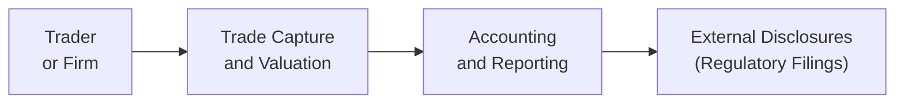

## Overview

Let’s be honest: derivative disclosures can be a bit of a maze to navigate. One day, I remember combing through footnotes while sipping my coffee—only to realize halfway in that these disclosures contained more juicy info than even the main body of the financial statements. There can be crucial details about a company’s risk profile lurking right there! In this section, we’ll explore how these disclosures are structured, why they matter, and how both IFRS and U.S. GAAP shape what must be reported. We’ll also dig into specialized regulatory requirements, such as filing large derivative positions with the SEC (in the U.S.) or ESMA (in the EU). Finally, we’ll recap best practices for exam success and real-world application.

## Financial Statement Footnotes

Organizations holding derivative instruments—like forwards, futures, swaps, or options—typically must disclose their derivative positions in their financial statement footnotes. These footnotes can be surprisingly detailed. So, how do they usually look?

• Notional Amounts: Disclosures often highlight the total notional (or face) amounts of derivatives outstanding. This notional amount doesn’t necessarily reflect the actual market value (it’s not always the money at risk), but it influences the size or scale of the underlying exposure.  
• Fair Value: Footnotes must indicate the fair value of the instruments, often distinguishing between assets and liabilities. This means whether the derivative is “in the money,” “out of the money,” or somewhere in between.  
• Risk Exposures: Firms often note which risks they’re hedging—e.g., foreign exchange risk on a currency forward, or commodity price risk on an oil futures contract. They may also disclose which derivatives are designated as “hedges” for accounting purposes (and therefore receive special hedge accounting treatment).

For instance, IFRS 7 (Financial Instruments: Disclosures) outlines the exact requirements for derivative footnotes. This includes qualitative and quantitative data on risk exposures like credit risk, liquidity risk, and market risk. Under U.S. GAAP, ASC 815 (Derivatives and Hedging) spells out akin guidelines.

## Regulatory Filings and Large Position Disclosures

Financial statement footnotes aren’t the only place to glean derivative exposure. Regulatory bodies worldwide require specific disclosures when notional amounts exceed certain thresholds or when there is a potential systemic risk to the financial system.

• SEC Filings (U.S.): Public companies in the U.S. typically file quarterly (10-Q) and annual (10-K) reports, which must itemize various derivative positions if they’re material. Large holders of certain futures or options contracts might also have to file with the Commodity Futures Trading Commission (CFTC).  
• ESMA Filings (EU): In the European Union, the European Securities and Markets Authority (ESMA) sets guidelines for reporting derivative transactions under the European Market Infrastructure Regulation (EMIR). Basically, if you have a significant derivative footprint, then you have specialized documentation duties.  

In addition, certain countries might require position-limit reporting for key commodity or financial futures. These requirements help regulators monitor market manipulation and excessive speculation. If you’re preparing for the exam, it’s good to note that they might test your general knowledge of whom to file with, rather than the specifics of every single form name.

## Fair Value Hierarchy Under IFRS and U.S. GAAP

When reporting the fair value of derivatives (or any financial instrument), accountants classify valuations into a three-tier hierarchy:

• Level 1 Inputs: These are quoted prices in active markets for identical assets or liabilities. For example, an equity option that is exchange-traded might be considered Level 1 if there’s a liquid market.  
• Level 2 Inputs: These are observable inputs other than quoted prices (e.g., interest rate yield curves, volatilities gleaned from publicly available data, or forward price curves). Most over-the-counter (OTC) derivatives fall into Level 2 because their valuations rely on observable market factors.  
• Level 3 Inputs: These are unobservable inputs, typically based on an entity’s own internal models or assumptions. This includes instruments traded in very illiquid or specialized markets.  

In practice, most plain vanilla swaps or currency forwards show up as Level 2. Something more complex—like a bespoke credit derivative or an exotic option—might drop into Level 3. The higher the complexity, the more guesses and assumptions are needed to measure the derivative’s fair value. From an exam perspective, be ready to discuss how to classify a particular derivative position within the fair value hierarchy and the additional disclosures required for Level 3 instruments (e.g., sensitivity analysis of key model inputs).

## Value at Risk (VaR) and Other Risk Metrics

Ever read the Management Discussion & Analysis (MD&A) section in an annual report and stumble upon a table labeled “Value at Risk for Trading Activities”? That’s a standard practice among large financial institutions. While not strictly mandated by all accounting standards, many large financial institutions—and even some corporates—include risk metrics to give investors an idea of potential losses under normal market conditions.

• VaR Disclosures: These typically show a 95% or 99% confidence-based figure—for example, “The firm’s daily VaR is $10 million at the 99% confidence level.” That means there is a 1% probability that daily trading losses will exceed $10 million.  
• Stress Testing: Some firms also disclose stress test results, scenario analyses, or other risk metrics intended to capture tail events.  
• Limitations: In all these measures, disclaimers are common. You might see notes such as, “VaR does not capture liquidity risk or event risk,” or “Past performance may not predict future results.”

Although not the main focus for exam questions on disclosures, it’s helpful to understand that VaR or similar metrics are sometimes found in the “Risk Management” or “Liquidity and Capital Resources” sections of the MD&A.

## Example of Derivative Disclosure Flow

To illustrate how a derivative moves from trade execution to external reporting, here’s a simple flowchart:

1. A trader places a derivative trade (e.g., interest rate swap).  
2. The trade data is captured in internal systems, and a model or pricing source values the swap.  
3. Accounting teams classify the derivative, measure its fair value, and identify hedge relationships if applicable.  
4. External disclosures are then prepared for financial statements, regulatory filings, and possibly investor presentations.

## Common Pitfalls and Challenges

Even sophisticated firms can trip up on delivering high-quality disclosures. Some frequent traps include:

• Not Providing Enough Context: Listing notional amounts without explaining the associated risks or derivative strategies leaves investors in the dark.  
• Misclassification in the Fair Value Hierarchy: Especially for borderline cases between Level 2 and Level 3.  
• Opaque Hedging Strategies: Firms might claim they’re hedging, but they need to clarify if it’s a formal hedge under IFRS 9 or ASC 815 or just an “economic” hedge without hedge accounting.  
• Overreliance on VaR: VaR can give a false sense of comfort if it doesn’t account for major tail events or illiquid scenarios.  

In real life—and in CFA exam scenarios—you’ll often see disclosures that are either too vague or overly complex. A balanced approach takes some practice to master.

## Best Practices and Real-World Perspectives

• Keep the Big Picture in Mind: Notional amounts look flashy, but you have to understand the net exposures. A big notional doesn’t necessarily mean big risk if the positions offset each other.  
• Hedge Documentation: If a firm wants to apply hedge accounting, they must meticulously document the relationship between the derivative, the hedged item, and the risk being hedged—and demonstrate that this hedge remains effective over time.  
• Detailed Disaggregation: Splitting derivative exposures by currency, maturity, or product type can help investors see how the firm is positioned in the markets.  
• Ethical Responsibility: CFA® charterholders have a duty to present accurate and complete disclosures. Hiding or omitting relevant derivative data violates both IFRS standards and the CFA Institute Code of Ethics and Standards of Professional Conduct.

## Exam Relevance and Preparation

The CFA Level I exam often tests your familiarity with the fair value hierarchy, basic disclosure concepts, and definitions (e.g., notional amount). Be ready to:

• Distinguish between notional and fair value in exam questions.  
• Classify derivatives into Level 1, 2, or 3 inputs.  
• Understand what to disclose for hedging vs. non-hedging derivatives.  
• Identify the difference between IFRS and U.S. GAAP requirements (though the exam usually focuses on the core principles rather than obscure details).  

Expect either an item-set question providing a small snippet of footnote data or a short answer question about how to classify a derivative within the fair value hierarchy.

## Conclusion and Final Thoughts

Disclosing derivative positions is absolutely crucial for transparency. It reminds me of the difference between reading the cliff notes and actually reading the entire book: footnotes can reveal the real story about a company’s risk appetite, strategy, and financial health. Meanwhile, specialized regulatory filings ensure that big market players don’t quietly amass systemic risk.

Regardless of the region, credible disclosure revolves around fair value classification and a clear articulation of the nature and purpose of each derivative. By understanding these frameworks, analysts can cut through the noise and figure out how derivatives actually impact a firm’s value and risk profile.

## References and Further Reading

• IFRS 7: Financial Instruments—Disclosures  
• IFRS 9: Financial Instruments—Hedge Accounting  
• IFRS 13: Fair Value Measurement  
• U.S. GAAP: ASC 815 (Derivatives and Hedging)  
• SEC Regulation S-K for financial disclosures  
• ESMA EMIR Reporting Guidelines  

And for an even deeper dive, the CFA Institute’s materials on derivatives reporting practices—especially in the context of risk management—are must-reads.

----------

## Test Your Knowledge: Reporting and Disclosure of Derivatives Quiz



### Which of the following disclosures would a firm most likely include for derivatives in its footnotes?

- [ ] The physical location of the trading desk.  
- [ ] Only the face value of bond issuances.  
- [x] Notional amounts, fair value, and risk exposures.  
- [ ] Political and regulatory environment of the manager.  

> **Explanation:** Companies typically disclose notional amounts, fair value, and relevant risks of their derivative exposures in the footnotes.  

### Under the fair value hierarchy, which level includes prices observed in active markets for identical assets?

- [ ] Level 3.  
- [x] Level 1.  
- [ ] Level 2, if the market is active.  
- [ ] No level, because derivatives can only be valued using internal models.  

> **Explanation:** Level 1 inputs are quoted prices in active markets for identical assets or liabilities.  

### When a company uses hedge accounting under IFRS or U.S. GAAP, which additional disclosure is required?

- [x] Explanation of the hedge relationship and its effectiveness.  
- [ ] Detailed listing of all counterparties' credit ratings.  
- [ ] The historical data used for internal VaR calculations.  
- [ ] The name of every trader involved in the hedged position.  

> **Explanation:** Hedge accounting requires clear documentation and demonstration that the designated hedging relationship is effective and meets the relevant accounting criteria.  

### Which regulatory body in the EU oversees derivative reporting under EMIR?

- [x] ESMA (European Securities and Markets Authority).  
- [ ] EBA (European Bankers Association).  
- [ ] ECB (European Central Bank).  
- [ ] FASB (Financial Accounting Standards Board).  

> **Explanation:** ESMA sets and oversees directives for derivatives reporting under EMIR within the European Union.  

### A firm discloses a set of options whose fair value relies primarily on internal models with unobservable inputs. These derivative positions are likely classified under which fair value hierarchy level?

- [ ] Level 1.  
- [ ] Level 2.  
- [x] Level 3.  
- [ ] Level 4.  

> **Explanation:** Level 3 is used when the valuation significantly relies on unobservable inputs—e.g., no active external market quotes.  

### If a company’s daily 99% VaR indicates $5 million, how should an analyst interpret this?

- [x] There is a 1% chance that the company could lose more than $5 million in a single day.  
- [ ] The company is guaranteed never to lose more than $5 million on any given day.  
- [ ] VaR is a hedge accounting transaction.  
- [ ] The notional of all derivatives is limited to $5 million.  

> **Explanation:** A 99% VaR of $5 million means there is a 1% probability that daily losses will exceed $5 million.  

### Which of the following is a key reason regulators require large derivative position disclosures?

- [x] To monitor systemic risk in financial markets.  
- [ ] To ensure that every investor understands technical option pricing.  
- [ ] To penalize companies that trade internationally.  
- [ ] To promote Level 3 inputs over Level 1.  

> **Explanation:** Regulatory agencies track large positions to prevent or mitigate broad systemic risk.  

### Which statement best describes the difference between notional value and fair value in derivative contracts?

- [x] Notional value is a reference amount for generating cash flows, while fair value is the market value of the contract.  
- [ ] Both terms refer to the same measure of a derivative’s risk exposure.  
- [ ] Fair value must always exceed notional value.  
- [ ] Notional value is only used in commodity contracts, whereas fair value is for interest rate and currency derivatives.  

> **Explanation:** The notional value is used to calculate payments, while fair value is the actual market-based valuation of the derivative.  

### A firm incorrectly classifies an OTC swap as a Level 1 instrument. Which of the following results is most likely?

- [x] The financial statements may misrepresent the transparency and observability of the swap’s fair value.  
- [ ] A precise measure of credit risk exposure will automatically be disclosed.  
- [ ] An auditor would ignore the classification if the P&L impact was minor.  
- [ ] The firm would be forced to reissue its hedge contracts.  

> **Explanation:** Misclassifying a Level 2 or 3 instrument as Level 1 inaccurately suggests a higher degree of valuation certainty and market observability than truly exists.  

### Is Value at Risk (VaR) disclosure strictly required by IFRS for all reporting entities?

- [x] True  
- [ ] False  

> **Explanation:** IFRS does not mandate VaR disclosures, but many large or complex firms voluntarily provide them in the interest of transparency and investor relations.


