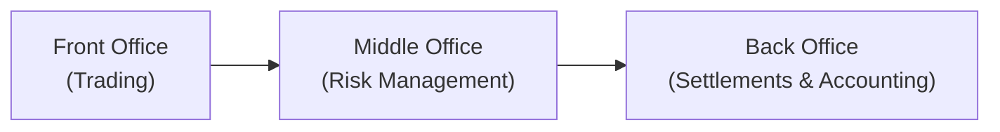
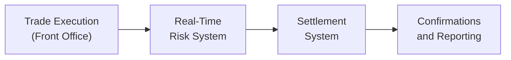

## Introduction

Let’s be honest: derivatives are fascinating. They can offer massive upsides, creative hedging strategies, and new ways of accessing market exposures. But without robust internal controls, organizations that trade derivatives may be walking a tightrope. Back in my early days working on a relatively small brokerage desk, I remember overhearing a conversation about a seemingly “small” unauthorized position that ballooned into a headache for the entire risk department. Nobody wants to be on the receiving end of a phone call explaining unexpected millions in losses because someone circumvented the usual checks. So let's dive into the “plumbing” of derivative operations: the internal controls that keep things running smoothly—and keep your firm solvent.

Strong internal controls for derivative operations are essential to:  
• Prevent financial misstatements  
• Avoid the consequences of unauthorized trading  
• Manage operational, credit, and market risks  
• Comply with regulations and professional standards  

This section will break down the crucial components of effective internal control systems, including segregation of duties, position limit management, approval procedures, system controls, and trade confirmations. We’ll also tie in real-world examples, referencing fiascos that have become stark warnings in this field. By the end, you should have a solid grasp of not only why these controls matter but also how to implement them sensibly. If you want to cross-reference any broader risk management frameworks, you might look back at Chapter 6.1 on Risk Management and Hedging.  

## Key Components of Internal Controls in Derivative Operations

### Segregation of Duties

When we talk about internal controls, we often start with the concept of segregation of duties. In a derivative context, that means separating the front office (the folks who execute trades and make revenue) from the middle/back office (the folks who handle settlement, accounting, risk monitoring, and recordkeeping).

• Front Office: Traders, sales personnel, and investment managers. They produce revenues by entering into derivative contracts (futures, options, swaps, forwards, etc.).  
• Middle Office: Risk management, compliance, and performance monitoring. They ensure trades line up with established risk guidelines and handle risk measurement processes.  
• Back Office: Settlements, accounting, reconciliation, and recordkeeping. If the back office is playing catch-up, you might have late confirmations, unrecorded exposures, or untracked profits and losses (P&L).  

Have you heard of the Barings Bank fiasco? Nick Leeson singlehandedly brought down a centuries-old bank primarily because segregation of duties was neglected. He was both trading derivatives (front office) and in charge of settlement (back office). That’s basically the classic textbook example of what can go wrong when key control checks are absent.

Below is a simple visualization of how these different offices connect yet remain distinct:

Keep these lines of responsibility separate. If the same person or team is both underwriting positions and settling them, all kinds of “mischief” can occur undetected.

### Limit Management

Remember that old saying, “Just because you can doesn’t mean you should”? In derivatives, “just because you can open a massive futures position doesn’t mean you should.” Position limits, stop losses, and daily trade reviews are essential to keep things on track.

#### Position Limits

Position limits keep total exposure within risk appetite. For example, a fund might cap its notional exposure on equity index futures at 10% of the portfolio. A short formula for an exposure-based limit might look like:


\text{Exposure Limit} = \alpha \times \text{Total Capital}


Where \\(\alpha\\) is a percentage chosen by the risk committee, ensuring positions do not exceed authorized thresholds. If the front office tries to exceed the limit, the middle office or trading system should flag or halt the order.

#### Stop Losses

Stop losses automatically close positions if cumulative losses breach a specified threshold. This mechanism is especially relevant in volatile derivative markets, where losses can escalate quickly. A typical scenario is to say: “If the contract is down 10% from the entry price, automatically liquidate.”  

### Approval Procedures

Before a significant or unusual derivative position is opened, many firms require extra layers of sign-offs, especially if dealing with exotic derivatives like barrier options (covered in Chapter 4.6) or structured swaps (Chapter 9.8). Approvals foster accountability: you don’t want one enthusiastic trader piling into illiquid commodity swaps without broader risk assessment.

Common approval procedures:  
• Pre-trade approvals from risk managers.  
• Credit department clearance for counterparty risk (especially in OTC derivatives).  
• A sign-off chain that might include senior management if the notional size is large.  

In many large institutions, there's a formal environment—some might call it “bureaucratic”—but it’s a good check. I recall a story (yes, a personal anecdote) where a colleague had to get six signatories for a single commodity swap trade. It felt like overkill at the time, but you can see how it reduces the chances of a rogue trade slipping through.

### System Controls

At the center of all modern trading operations are IT systems that process trade information, track positions, calculate profit and loss, and feed data into risk measurement tools. If these systems are poorly designed or not integrated, a firm can end up with incomplete or redundant data. A single glitch can misrepresent day-end positions and lead to mistakes in margin calculations (which, by the way, can cause a big mess if you are referencing margin requirements from Chapters 2.2 and 2.4 on futures).

#### Automated Checks and Integration

Good system controls typically include:  
• A real-time or close-to-real-time feed of trade executions that tie out to risk systems.  
• Automated P&L checks that flag abnormal swings.  
• Settlement instructions that automatically flow to the back office, reducing manual re-entry errors.  
• Firewalls between the front office’s order-entry system and the back office’s settlement system to prevent tampering.

Below is a simplified process flow diagram for trades moving through an integrated system:

If each stage has validation rules (like “Is the size consistent with the trader’s limit?” or “Does the counterparty exist in the approved list?”), you reduce the chance of a mismatch or unauthorized trade going live.

### Independent Confirmation of Trades

One of the simplest but most effective controls is confirming each trade with the external counterparty. The middle or back office typically handles these confirmations. In the old days (think a decade or two ago), people used faxes or phone calls to confirm. Now it’s typically electronic matching through systems like DTCC for swaps or the clearinghouse for futures (as referenced in Chapter 1.5). If the trade details in your system match the trade details in the counterparty’s system, you can be fairly certain the trade was authorized and captured correctly.

We’d all like to avoid the scenario where a trader “forgets” to enter a large losing trade into the official system. Independent confirmations help catch that. It’s a huge headache for reconciliation if trades are mismatched with the counterparty’s records. So timely confirmation is crucial.

## Common Pitfalls and Real-World Mishaps

### Rogue Trading

The single biggest risk is an individual trader intentionally bypassing controls to hide losing trades. The Nick Leeson fiasco is the perennial example, but LTCM in the late 1990s also showed how leveraged positions and incomplete oversight could bring a major hedge fund to its knees. These events highlight the synergy between strong internal controls and prudent risk management policies. You can see how, without wide-angle oversight, even a brilliant quantitative model can spiral out of control.

### Data Integrity Failures

With so many moving parts, data errors can creep in. One back-office staffer mis-enters the size of a swap, or the system fails to record the correct notional, leading to inaccurate risk calculations. If you guessed the original goal was a small, short-term swap for hedging but it was recorded as a multi-year, multi-million notional, you’d probably have a heart attack looking at your risk reports the next day!

### Lack of Reconciliation

Reconciliation is the process of matching your internal records with external statements—whether from the clearinghouse, broker statements, or counterparties. Failures here can linger under the radar for weeks or months, especially if no one systematically checks the differences. This can lead to unrecognized losses or unrecorded gains that cause confusion and even misstatement on financial statements.

## Control Frameworks and Regulatory Guidance

### COSO Framework

The Committee of Sponsoring Organizations of the Treadway Commission (COSO) offers a widely recognized framework for internal controls. It emphasizes control environment, risk assessment, control activities, information/communication, and monitoring. For firms trading derivatives, COSO can be the scaffolding on which to build specific processes such as limit monitoring, daily P&L sign-off, or trade confirmations.

### Basel Committee Principles

The Basel Committee (particularly relevant for banks) stresses sound practices in derivatives activities, including strong risk measurement, thorough approvals, and robust reporting. Basel guidelines also address capital requirements for credit risk, market risk, and operational risk for derivative positions. While these guidelines are more relevant for large financial institutions, many of the underlying principles can be applied by smaller fund managers or corporate treasury teams holding derivative positions.

## Practical Example: Implementing a Workflow for Currency Swaps

Let’s walk through a quick scenario. Suppose a corporate treasury wants to hedge forecasted EUR payments using a currency swap. The treasury front office initiates the request, but they can’t just sign the contract themselves. Instead:

1. They fill out a request specifying the proposed notional amount, start/end dates, and the exchange of principal.  
2. The middle office checks whether this notional is within the company’s pre-approved limit for currency derivatives.  
3. The risk management team evaluates potential interest rate mismatches and ensures the proposed swap is indeed for hedging (and not an unrequested speculation).  
4. It goes to the CFO or designated official for sign-off if the notional above a certain threshold.  
5. The back office (like the treasury operations team) communicates with the bank or swap dealer to finalize terms and sets up the settlement instructions.  
6. Once the trade is executed, the details are fed into a system that automatically confirms the trade with the counterparty.  
7. Each month/quarter, an independent function reconciles the statements from the dealer with internal records.  

This entire chain ensures no single person can hijack the treasury function to do personal trades or inadvertently create outsized exposures.

## Challenges in Upholding Internal Controls

• Cost and Complexity: Small firms sometimes complain that robust control systems are expensive or complex. But compared to a multi-million-dollar trading loss, it’s a small price to pay.  
• Evolving Products: Derivatives keep evolving. You might have a perfect system for plain-vanilla swaps, but what if your front office recently started trading digital asset derivatives (see Chapter 1.15)? The risk team may need to catch up with new trading nuances quickly.  
• Cultural Resistance: The front office might want fewer restrictions to move faster. That tension is normal, but it has to be managed so that risk controls aren’t watered down under revenue pressure.  
• Regulatory Changes: With ongoing changes—like the phase-out of LIBOR and the shift to risk-free reference rates (discussed in Chapter 1.13)—your control environment must adapt swiftly.  

## Best Practices and Recommendations

• Periodic Control Audits: Have an internal or external auditor assess your derivative control environment.  
• Clear Policy Documentation: Everyone involved should know “the rules of the game.” If there’s ambiguity, you can bet someone will inadvertently or deliberately exploit it.  
• Training: A well-trained back office is your first line of defense. If staff members aren’t sure how to do daily reconciliation or confirm trades externally, errors are inevitable.  
• Use Independent Pricing When Possible: This ensures that the recorded value of trades for daily P&L is not manipulated by the trading desk.  
• Instant Alerts for Breaches: Automated alerts if net exposures or daily losses exceed set limits reduce reliance on manual checks.

## Conclusion: Final Thoughts and Exam Tips

Alright, so internal controls might not sound as glamorous as speculating on exotic equity swaps or building elaborate multi-leg option strategies. But ignoring them is like driving a race car with no brakes. If you want a smooth ride in the derivatives world, strong internal controls are your best friend. From segregating duties to confirming trades independently, these measures might feel like red tape. But in reality, they’re your safety net against serious reputational and financial damage.

For exam preparation, remember to:  
• Emphasize the “why”—the rationale behind each control step.  
• Understand how limit management, sign-offs, and reconciliation processes interconnect.  
• Be ready for scenario-based questions, for instance, “A firm’s limit is set at 15% of capital for commodity derivatives—what is the maximum notional?” or “Who confirms trades to ensure accuracy and reduce operational risk?”  
• Revisit real-world fiascos (like Barings Bank) to illustrate the consequences of poor controls.

In a constructed-response question, you might be asked to design or critique a derivative control framework for a hypothetical asset manager. Don’t just list bullet points—explain how each piece helps mitigate a specific risk (unauthorized trading, data error, market risk from excessive positions, etc.). Finally, keep in mind that the exam has a knack for testing your ability to apply knowledge to real-life examples, so think practically.

## References and Further Reading

• COSO (Committee of Sponsoring Organizations): Internal Control – Integrated Framework  
• Basel Committee on Banking Supervision: Principles for the Management of Credit Risk  
• Barings Bank Case Study: Illustrations of Rogue Trading  
• Chapter 2 (Futures and Forwards) and Chapter 4 (Options) for margin and collateral references  
• Chapter 1.5 (Role of Clearinghouses and Regulatory Environment) for integrated clearing in derivatives  

## Test Your Knowledge: Internal Controls for Derivative Operations



### Which of the following best describes the purpose of segregating the front, middle, and back offices in a derivatives trading environment?

- [ ] To reduce paperwork by consolidating front and back office functions.
- [x] To prevent conflicts of interest and reduce the likelihood of unauthorized trading.
- [ ] To centralize decision-making for quicker approvals on large trades.
- [ ] To align middle office functions with investor relations.

> **Explanation:** Segregation of duties ensures that those who execute trades do not also confirm and settle them, reducing the risk of misconduct or errors going undetected.

### An organization sets a limit on its total notional exposure to equity futures at 10% of the portfolio’s market value. This is an example of:

- [x] Position limit management.
- [ ] An automated trade confirmation system.
- [ ] A daily stop-loss mechanism.
- [ ] A mid-office risk monitoring model.

> **Explanation:** Position limits restrict the maximum exposure a firm can have in a specific derivative category, helping manage overall risk.

### Why are approval procedures particularly important for certain complex or large derivative positions?

- [ ] They simplify back-office tasks by reducing reconciliation steps.
- [ ] They discourage firms from trading entirely in OTC markets.
- [x] They provide multiple layers of oversight to ensure the trade’s appropriateness and mitigate unauthorized positions.
- [ ] They eliminate the need for margin requirements.

> **Explanation:** Complex or large trades typically carry unique risks; multiple sign-offs ensure that stakeholders (risk, legal, senior management) evaluate and approve the exposure.

### One key feature of an effective system control for derivatives is:

- [ ] Eliminating the need for middle office staff.
- [x] Automated checks that flag abnormal swings in P&L or unauthorized trades.
- [ ] Relying on manual spreadsheets for trade entry.
- [ ] Using personal email to confirm trades.

> **Explanation:** Automated checks integrated with trading and settlement systems ensure quick identification of anomalies, preventing errors from escalating.

### Independent trade confirmations from external counterparties are crucial because they:

- [x] Help detect any discrepancy between internal records and the counterparty’s records.
- [x] Prevent a single department from hiding unauthorized trades.
- [ ] Reduce trading volume across the firm.
- [ ] Make it unnecessary to reconcile positions daily.

> **Explanation:** Confirmations match each executed trade with an external party, ensuring no mismatch exists. This dual verification is essential for robust internal controls.

### The primary rationale behind daily reconciliation in derivative operations is to:

- [x] Verify that internal trade records match external statements and identify discrepancies quickly.
- [ ] Provide a weekly update for the marketing department.
- [ ] Lower margin requirements for proprietary trading.
- [ ] Replace the role of compliance personnel.

> **Explanation:** Reconciliation ensures all trades and positions are accurately tracked, preventing misstatements and uncovering errors or fraud early.

### Which control practice specifically aims to curtail the magnitude of losses on a given derivative position?

- [x] Stop-loss thresholds.
- [ ] Employee code-of-conduct training.
- [x] Position limit enforcement.
- [ ] Event-driven manual reviews only.

> **Explanation:** Stop-loss mechanisms and position limits both help contain losses by automatically closing positions or limiting their size, respectively.

### A large organization wants to implement an internal control environment for a new derivative product line. According to best practices, it should:

- [x] Align the control framework with established guidelines like COSO or Basel, tailoring them to the new product’s risk profile.
- [ ] Give full autonomy to the front office to decide on risk exposures.
- [ ] Eliminate middle office reporting lines to reduce bureaucracy.
- [ ] Household front, middle, and back offices within a single department.

> **Explanation:** A recognized framework (like COSO) provides a structured approach to designing and monitoring internal controls, while preserving the necessary segregation of duties.

### What is the main reason unauthorized “rogue trading” can sometimes go undetected for long periods?

- [ ] Regulators typically do not monitor derivatives activity at all.
- [ ] Firms intentionally avoid setting up internal controls to maximize profits.
- [x] Poor segregation of duties, inadequate reconciliation, and lax oversight create an environment in which one individual can manipulate the records.
- [ ] Traders usually report to multiple supervisors who can catch mistakes quickly.

> **Explanation:** Rogue trading is often enabled by inadequate separation of responsibilities and weak reconciliation procedures, allowing one person to conceal incorrect or unauthorized positions.

### True or False?  
Excessive bureaucracy in the internal control process for derivatives should always be avoided, even if it sacrifices risk oversight.

- [x] True
- [ ] False

> **Explanation:** While unnecessary bureaucracy can slow down operations, it’s crucial not to sacrifice appropriate oversight and risk management. The goal is to balance efficiency with robust controls.


