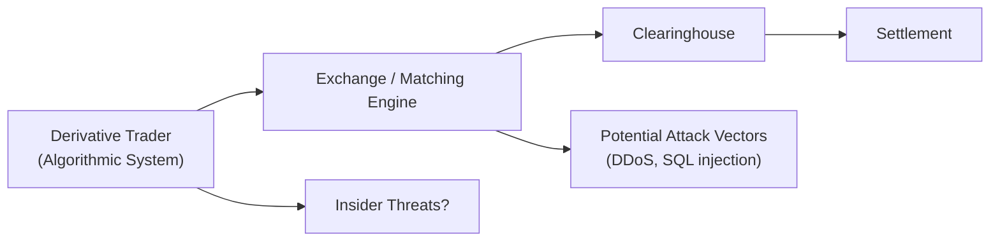

## Overview

Cybersecurity is a big deal—especially for anyone trading in today's high-stakes derivative markets. If you’ve ever seen a trading desk scramble because of a system glitch or faced a suspicious email that tried to fish out your login credentials, you know just how real these threats can be. In derivatives markets, one successful hack at the wrong moment can halt trade matching, cause widespread panic, and inflict major financial losses across portfolios. While exchange-traded derivatives have historically been considered well-supervised and robust, even these products can be affected by disruptions in electronic systems and clearinghouses.

As you prepare for the CFA® exam, or simply deepen your investment expertise, it’s crucial to grasp how cybersecurity impacts every stage of derivative market activity—from executing trades to settling them.

## The Evolving Threat Landscape

Modern derivative markets rely heavily on technology—algorithmic trading engines, digital clearing systems, electronic order books, you name it. With this reliance, the threat landscape expands to include hacking attempts, data theft, system outages, and malicious code that might compromise entire trading platforms. In an era when seconds of downtime can translate into significant price movements or even market closures, robust cybersecurity has become as indispensable as risk modeling.

## Electronic and Algorithmic Trading Platforms

Electronic and algorithmic trading platforms have revolutionized the speed and efficiency of the derivatives world, but not without introducing vulnerabilities. Here’s how issues can pop up:

• Hacking or DDoS Attacks: Imagine a group of cybercriminals flooding a prominent exchange with bogus requests in a coordinated Distributed Denial of Service (DDoS) attack. This overload could effectively knock the exchange’s matching engine offline. Traders might see frozen quotes, or they may find themselves unable to exit or hedge a position, leading to serious losses.  
• Manipulation of Automated Strategies: Algorithmic trading systems rely on real-time data to trigger trades. If that data feed is tampered with—like someone inserting fabricated quotes—algorithmic strategies could be thrown off, generating a series of erroneous trades before the problem is detected.  
• Real-Time Monitoring Challenges: Because everything happens so fast in algorithmic trading, cybersecurity measures also have to be real-time. Any delay in detecting and blocking suspicious activity could mean hundreds or thousands of trades occur under compromised conditions.

## Data Security and Confidentiality

Even if your trading platform is locked down from direct attacks, data breaches can be equally damaging. Proprietary trading strategies, historical trade databases, or client position data are prime targets for cybercriminals. 

• Corporate Espionage: Competitors or malicious entities seeking to replicate a firm’s automated strategies or uncover its proprietary models might hack into data repositories. That stolen information can be used to front-run trades or compromise newly developed algorithms.  
• Phishing Attempts: Market participants often handle large sums and critical data daily, making them tempting targets for phishing attacks. Criminals might impersonate clearing brokers, counterparties, or even compliance staff to extract login credentials or private keys used in certain digital-asset derivative transactions.  
• Third-Party Risks: With the increasing use of cloud-based solutions or external data vendors, the security of third-party providers becomes an integral part of any firm’s cybersecurity. If your data feed is compromised or your cloud provider is hacked, your internal security measures might not matter much.

## Exchange Systems and Clearinghouses

One of the scariest scenarios is a well-orchestrated attack on a major exchange or clearinghouse. These institutions are the linchpin of derivative market stability:

• Stopping Trade Matching: Exchanges handle massive transaction volumes. A hack that dysregulates their order matching engine could shut down derivatives trading for hours or even days. Such an event could freeze price discovery and hamper risk management for countless market participants.  
• Disrupting Settlement and Margin Calls: Clearinghouses stand at the center of daily settlement—ensuring that margin is collected, defaults are managed, and the clearing process is smooth. If a cyberattack interrupts these daily procedures, it might lead to a domino effect of missed margin calls or unprocessed trades.  
• Systemic Risk: When a major clearinghouse is forced offline, the entire market could face heightened volatility, as hedgers, speculators, and arbitrageurs are unable to open or close positions. That can accelerate systemic risk, particularly in highly leveraged derivatives.

Below is a simple visual flow of how trades move through key market infrastructure, and where attacks might occur:

In this depiction, each arrow highlights critical process steps, any of which could be a target for malicious activities like hacking, data manipulation, or denial of service.

## Backup and Disaster Recovery Plans

A single hardware failure, power outage, or infiltration can originate from anywhere in the network. Because of that, robust backup and disaster recovery (DR) plans are crucial. A well-prepared firm (or exchange) will:

• Maintain Redundant Systems: Have multiple data centers with real-time mirroring so that if one data center goes down—or is compromised—trading operations can switch to a secondary site swiftly.  
• Conduct Failover Drills: Periodic drills ensure the entire staff knows what to do if the primary trading or clearing system goes offline. This gets folks used to the chaos that might occur in a real cyber event.  
• Implement Multi-Factor Authentication (MFA) and Zero Trust Architecture: Systems that are locked behind multiple verification steps, along with segmented network layers, can significantly slow or prevent the spread of cyberattacks.  

I remember hearing about a middle-sized brokerage that practiced “tabletop exercises” every quarter—basically a pretend meltdown day. They’d simulate a system hacking scenario and walk through each step of shutting down compromised servers, shifting traffic to backups, and informing clients. The first time they tried it, chaos ensued. But over time, they smoothed out the process so that each staff member, from compliance to IT, knew their exact responsibilities.

## Case Studies and Real-World Examples

• CME Group (Hypothetical): Suppose a scenario where the exchange operator experiences a breach in its matching engine architecture. Real trades might get interspersed with spoofed trades, artificially inflating volumes in certain futures contracts. Once discovered, the exchange halts derivatives trading for 90 minutes, leading to significant portfolio mismatches for large institutional hedgers. In the after-action analysis, the exchange uncovers a sophisticated intrusion that bypassed outdated patches.  
• A Regional Clearinghouse: An example involving a smaller clearinghouse that faced a ransomware attack. The criminals locked the clearinghouse’s settlement files and demanded cryptocurrency for the unlocking key. Because backups were stored on the same compromised network, the clearinghouse had no immediate data recovery. Clearing staff had to reconstruct positions manually for days, which caused confusion and slippage in margin calls.

These examples illustrate why the culture of cybersecurity preparedness is just as important as having technology solutions.

## Best Practices for Mitigating Cybersecurity Risk

• Adhere to Frameworks: The National Institute of Standards and Technology (NIST) Cybersecurity Framework offers guidelines on how to identify, protect, detect, respond, and recover from cyber threats. Futures Industry Association (FIA) best practices also provide in-depth recommendations designed specifically for derivatives.  
• Segment Networks: Keep your front-office trading infrastructure separate from back-office systems. This ensures that if an attack hits your order processing system, it won’t easily spread to settlement or risk analytics.  
• Maintain Strict Access Controls: Limit who can see or alter critical trading code and data. Employ layered permissions and log each access to secure accountability.  
• Monitor and Patch: Real-time intrusion detection systems plus a diligent patching schedule can prevent known vulnerabilities from being exploited.  
• Ongoing Training: People remain the weakest link in many cybersecurity breaches. Regular training sessions on social engineering, phishing, and best security practices are essential to keep employees vigilant.

## Glossary

• Hacking: Unauthorized access to computer systems or networks.  
• Phishing: Deceptive practice of attempting to obtain sensitive information by impersonating legitimate entities.  
• Algorithmic Trading: Automated trading systems that rely on rule-based instructions (quantity, timing, price, or other market signals) to execute trades rapidly.

## References

• National Institute of Standards and Technology (NIST) Cybersecurity Framework – https://www.nist.gov/cyberframework  
• Futures Industry Association (FIA) Best Practices – https://www.fia.org/  
• Various industry event transcripts and cybersecurity publications can also be found in official exchange bulletins.

## Final Exam Tips

• Cybersecurity can appear in the exam within scenario-based “risk management” or “operational risk” essay questions. Be prepared to discuss how a cyber threat might disrupt derivative pricing or settlement.  
• When writing your answers, link the cybersecurity threat to a specific outcome—like missed margin calls or incorrect trade matching. Show the cause-and-effect chain.  
• You might be asked how an investment manager or exchange should prepare for operational downtime. Highlight robust DR strategies and best practices from recognized frameworks.  
• Keep an eye out for “Which of the following is the best approach?” multiple-choice formats. They often test practical risk mitigation methods.  

## Test Your Knowledge: Cybersecurity Risks in Derivative Markets



### Which of the following best describes a phishing attack in derivative markets?

- [ ] Injecting malicious code into an exchange matching engine.
- [x] Deceptive e-mails designed to capture sensitive credentials or information.
- [ ] A large-scale DDoS attack on an entire trading platform.
- [ ] Manipulating order data to trigger erroneous trades.

> **Explanation:** Phishing involves tricking users into sharing sensitive information, typically by impersonating legitimate entities. In derivative markets, attackers might pose as a broker or clearinghouse to get login credentials.

### What is the primary function of multi-factor authentication (MFA) in trading operations?

- [x] To add layers of identity verification before granting system access.
- [ ] To increase the speed of algorithmic trading.
- [x] To reduce the likelihood of unauthorized account entries.
- [ ] To generate automated trading signals based on market data.

> **Explanation:** MFA ensures that users verify their identity through multiple factors (e.g., password + fingerprint), making unauthorized logins significantly more difficult.  

### How could a denial of service (DoS) attack most directly affect a derivatives exchange?

- [x] It could overload the exchange’s servers, preventing normal trade execution.
- [ ] It could remove legal liabilities from a clearinghouse.
- [ ] It would allow hackers to steal all proprietary algorithms.
- [ ] It reduces the notional amount of large swaps automatically.

> **Explanation:** A DoS attack floods the exchange with excessive traffic so legitimate users cannot access the trading engine, halting or severely slowing trade execution.

### In a clearinghouse environment, which process is most exposed to cyber disruptions?

- [x] Daily margin calls and settlement procedures.
- [ ] The calculation of implied volatility indices.
- [ ] The randomization of trade confirmations.
- [ ] The central bank’s interest rate settings.

> **Explanation:** Clearinghouses handle crucial tasks like margin calls, settlement, and trade netting. A cyber disruption here can stop normal settlement flows and affect systemic stability.

### Which of the following is most effective in maintaining continuous operations in the event of a cyberattack?

- [x] Geographically diverse data centers with realtime replication.
- [ ] Overreliance on a single data center with frequent manual backups.
- [x] Having no contingency plan to revert to older hardware and software.
- [ ] Periodic cross-training of staff on trading algorithms.

> **Explanation:** Redundant or mirrored data centers, located in different geographic regions, minimize the chance that a single localized attack or incident will halt all operations.  

### What best characterizes the role of the NIST Cybersecurity Framework in derivatives trading systems?

- [x] It provides guidelines to identify, protect, detect, respond, and recover from cyber threats.
- [ ] It forbids the use of algorithmic strategies.
- [ ] It is designed to calculate fair value pricing for options.
- [ ] It only applies to small, regional financial institutions.

> **Explanation:** NIST sets overarching guidelines for managing cybersecurity risk, which are relevant across many industries, including derivatives.

### If a firm’s trading systems are physically separated from its back-office settlement systems, what principle are they applying?

- [x] Network segmentation to prevent the spread of intrusions.
- [ ] Redundant settlement to handle multiple trades simultaneously.
- [x] Automated quoting to reduce latency.
- [ ] Single sign-on to reduce password fatigue.

> **Explanation:** Segmenting networks—often with firewall layers and physical separation—contains potential breaches and prevents widespread infiltration across the entire environment.

### Which of the following is a potential outcome if exchange order data is manipulated or delayed?

- [x] Algorithmic trading models may execute erroneous trades.
- [ ] Clearinghouses permanently waive margin requirements.
- [ ] Settlement times are accelerated, lowering cost of carry.
- [ ] Real-time market data becomes more transparent.

> **Explanation:** Delayed or manipulated data can prompt incorrect buy/sell triggers in algorithmic models, leading to potentially large unintended positions and losses.

### Why is cybersecurity training for employees essential, even for a fully automated high-frequency trading firm?

- [x] Employees remain one of the greatest vulnerabilities to social engineering attacks.
- [ ] It reduces the computational load for real-time trading strategies.
- [ ] It decreases the firm’s liquidity requirements.
- [ ] It impacts the regulation of interest rate swaps.

> **Explanation:** No matter how advanced the automation, employees still handle credentials, system administration, and critical decisions. Without training, they can inadvertently let an attacker in.

### Cyber incidents at major clearinghouses can be systemic. True or False?

- [x] True
- [ ] False

> **Explanation:** Clearinghouses occupy a central role in the derivatives ecosystem. Any disruption there can ripple market-wide, causing systemic issues such as settlement delays and unprocessed margin calls.


