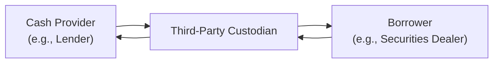

## Introduction
Third-party custodians play a surprisingly critical role in the derivatives world, especially when it comes to managing collateral. If you’ve never heard of them—or if you’ve asked yourself, “Why would I trust yet another institution with my assets?”—this section should shed some light. Custodians act as impartial, trusted agents that hold posted collateral, verify its eligibility, and faciliate settlement if something goes sideways (like a default). In the larger scheme of derivative transactions—ranging from simple forward contracts on currencies to complex total return swaps—collateral management helps mitigate counterparty risk while ensuring that parties meet their obligations. 

And, sure, as soon as you start talking about custodians and tri-party repos, it might sound like a mouthful. But rest assured, the essence is straightforward: you want your collateral to be safe, verifiable, and easy to move if a default occurs. That’s precisely what third-party custodians help do.

## The Importance of Independent Custody
Whenever a derivatives trade requires collateral posting (margin, independent amounts, initial margin, variation margin… you name it), the question becomes: Who’s holding that collateral, and can they be trusted if one counterparty defaults?

• Centralized Safeguard: A custodian bank (or similar institution) ensures that neither party can unilaterally “grab” the collateral without securing the other party’s agreement or following prescribed processes.  
• Neutral Oversight: The custodian’s job is not to take sides. Instead, it focuses on verifying that all collateral meets the contractual standards, revaluing assets when needed, and distributing them when a default or margin call triggers certain processes.  
• Regulatory Protection: Many regulations and professional standards (including those set by the CFA Institute) strongly encourage or mandate independent oversight of posted collateral—especially in large or complex OTC derivative transactions.

I recall one project I worked on (well, more like I overheard in passing at a previous company) where the trading desk had negotiated an interest rate swap with a new counterparty. They were anxious about credit risk, so they insisted on holding each other’s collateral. Sounds simple, right? But the day-to-day headache of verifying margin calls, checking each other’s posted collateral, and thrashing out who owned what was an administrative nightmare. Ultimately, they embraced a third-party custodian, which led to far fewer billing disputes and a more robust safety net for both sides.

## Tri-Party Repo Arrangements
Tri-party repos are a great illustration of the custodian’s role. In a repurchase agreement, typically a borrower agrees to “sell” securities to a lender and then “repurchase” them the next day (or on a specified future date). The securities serve as collateral, and one reason tri-party repos exist is to reduce the complexity of directly transferring assets back and forth between the cash provider and the borrower.

• Clearing Bank or Custodian as Agent: The third-party agent (often a clearing bank) handles tasks like settling the repo transaction, allocating securities, applying haircuts, and making sure all obligations are fulfilled.  
• Automated Transfers: Instead of a bilateral exchange—where the borrower physically hands over the securities to the lender—a tri-party arrangement is much simpler. The custodian “moves” the securities on its own books: one account to another, subject to strictly defined guidelines.  
• Dynamic Margin Management: If the market value of the collateral declines, or if haircuts change, the custodian can facilitate margin calls and collateral top-ups. This is all done automatically and consistently, reducing operational risk.

For many large institutional investors, tri-party repos are a daily fact of life. Meanwhile, smaller players or non-financial corporates might never see them first-hand, but the principle is the same: Put a safe institution in the middle to manage the collateral so that everybody can rest easier at night.

Below is a simplified Mermaid diagram illustrating the high-level flow in a tri-party repo arrangement:



In this diagram, the Third-Party Custodian stands at the center, receiving cash from the lender and securities from the borrower. Upon repurchase, the custodian returns each party’s respective asset (cash or securities) according to the repo agreement’s timeline.

## Collateral Verification and Eligibility
When derivatives contracts specify that the collateral must be, say, a high-grade corporate bond or treasury note, the custodian ensures these collateral eligibility criteria are met. Do the bonds posted by the counterparty have an acceptable credit rating? Is their maturity profile consistent with the contract’s requirements? Are they denominated in the right currency?

• Automated Eligibility Checks: Custodians often maintain internal databases and rating feeds, verifying daily whether posted collateral meets rating, liquidity, and other specifications.  
• Collateral Substitution: If the collateral becomes ineligible (e.g., ratings downgrade, excessive concentration risk), the custodian can trigger a call for substitution. The defaulting (or out-of-compliance) party must replace the collateral with an eligible asset.  
• Transparency: Both parties can generally view summaries of their posted collateral in real time or near real time, thanks to electronic platforms that the custodian provides.

Incidentally, I once witnessed a situation where older U.S. Treasury bills lost some liquidity in the final days before expiration, and we kept having to post new 10-year notes to satisfy the custodian’s criteria. It felt like an administrative dance, but it guaranteed everyone that the posted collateral held its standard of eligibility.

## Reducing Settlement Risk
Centralizing collateral management with a reputable custodian cuts down on:

• Settlement Failures: The custodian typically ensures that any margin calls or collateral movements occur within the prescribed settlement windows, lowering the chance of missed or delayed payments.  
• Administrative Overlaps: Parties don’t have to reconcile multiple ledgers or chase each other for statements. Instead, you rely on a single record of who posted what.  
• Default Handling: If a default does happen, the custodian can quickly segregate and liquidate collateral according to the terms of the contract. This is far more efficient than bilateral wrangling over which specific assets are subject to seizure.

## Example: Margin Call Computation
To illustrate how a custodian might intervene once a margin call occurs, let’s consider a simplified formula in KaTeX. Suppose Party A has posted collateral worth \\(C\\), but daily mark-to-market movements require an additional margin \\(\Delta\\). The total required is \\(C + \Delta\\). If \\(C + \Delta\\) falls below the threshold required by the contract, the custodian automatically flags a margin call:


\text{Margin\ Call} = \max (0, (C + \Delta) - \text{Collateral\ Threshold} ).


If this value is positive, Party A must provide additional collateral. If it’s negative or zero, no additional posting is required for that day. The custodian checks these calculations daily (or in near real time), ensuring there’s minimal slippage.

## Practical Insights and Case Studies
• Streamlined Collateral Management: Let’s say a large pension fund invests in interest rate swaps with multiple dealers. Instead of sending bonds or cash margins to each dealer separately, the pension fund can deposit the entire margin with one custodian. The custodian then allocates (or “earmarks”) portions of that margin to each swap.  
• Dispute Resolution: In the event of a mismatch (e.g., a difference between what the dealer thinks the margin call should be and what the pension fund calculates), the custodian can help clarify the discrepancy.  
• Enhanced Operational Efficiency: Because so many derivative transactions require daily or intraday margining, a custodian with robust technology can integrate directly with clearinghouses, reducing the risk of manual entry errors.

I remember how we used to physically fax margin notices back in the day (yes, real fax machines!), and it really was a chore. With a single custodian, everything is centralized, and you have a consistent set of data feeds. So, you know, no more faxes at 4 a.m. on a Tuesday. I, for one, am grateful.

## Potential Challenges and Pitfalls
Even with the independence and professionalism custodians bring, certain pitfalls remain:

• Liquidity Stress: If markets seize up, even high-grade collateral can become less liquid than expected, straining the custodian’s ability to perform quick valuations.  
• Shifting Eligibility Criteria: Sometimes, the definitions of “safe collateral” can shift rapidly (e.g., large credit event or market meltdown). The custodian must stay vigilant.  
• Fee Structures: Using a third-party custodian isn’t free. For smaller transactions, the cost may seem disproportionate. But ignoring the role of the custodian could lead to bigger costs if something goes wrong.  
• Legal Complexities: Cross-border trades and multi-jurisdictional netting rules can create complexities in how collateral is ring-fenced. The custodian might require specialized local entities to handle certain assets.

## Simple Python Snippet for a Collateral Check
Below is a tiny Python snippet that demonstrates how an entity might use basic logic to determine if posted collateral is sufficient. In real practice, custodians use far more sophisticated systems—but this snippet can help illustrate the concept:

```python
def collateral_check(posted_value, threshold, haircuts):
    """
    posted_value: in USD
    threshold: required collateral threshold in USD
    haircuts: haircuts as fraction of posted_value (e.g., 0.05 for 5%)
    """
    effective_collateral = posted_value * (1 - haircuts)
    if effective_collateral >= threshold:
        print("Collateral is sufficient.")
    else:
        required = threshold - effective_collateral
        print(f"Additional collateral of ${required:,.2f} needed.")

collateral_check(1_000_000, 950_000, 0.03)
```

If the posted collateral, after applying a 3% haircut, remains above the threshold of \$950,000, the snippet prints “Collateral is sufficient.” Otherwise, it calculates how much more collateral needs to be posted.

## Best Practices for Working with Custodians
• Know Your Contracts: Ensure that the tri-party or custody agreement spells out what assets are acceptable and how margin calls are handled.  
• Automate Where Possible: Link your internal risk systems to the custodian’s portal. Minimizing manual intervention typically reduces errors.  
• Monitor Credit Events: Even if the custodian handles the daily grunt work, your organization should watch for changes in credit quality or rating downgrades that might change collateral eligibility.  
• Reconcile Frequently: Reconcile your internal records with the custodian’s statements at least daily—especially if you have large or complex positions.

## Exam Relevance and Tips
On the CFA exam (yes, even at Level III, but also relevant for Level I in the context of derivative fundamentals), you may see:
1. Questions about how collateral rights and obligations are split among derivative counterparties.  
2. Scenario-based questions illustrating tri-party repo transactions, requiring you to trace the flow of securities and interpret margin call adjustments.  
3. Risk-management questions focusing on how third-party custodians mitigate operational risk.  

When tackling exam questions, watch for these common traps:
• Misinterpreting the role of the custodian as a counterparty or a guarantor. They do not guarantee performance; they only hold and manage collateral.  
• Confusing a tri-party repo with a bilateral repo, where no external institution is in charge of the collateral.  
• Overlooking the importance of eligibility criteria, which can be tested through credit rating shifts or changes in the bond’s liquidity.  

Remember to structure your answers carefully in essay or item-set format: articulate the role of the custodian, the core benefits (like mitigating settlement risk), and any associated costs or complexities. Time management is key: keep your definitions concise, show your calculations if asked for, and highlight relevant regulatory or risk factors.  

## References
• Depository Trust & Clearing Corporation (DTCC) official website: https://www.dtcc.com/  
• Various broker-dealer white papers on “Custodianship in Derivative Markets,” available online.  
• CFA Institute’s publications and continuing education materials on derivative risk management.

--------------------------------------------------------------------------------

## Test Your Knowledge: Third-Party Custodians and Collateral Management



### Which of the following best describes the primary role of a third-party custodian in collateral management?

- [ ] To provide margin for both counterparties during a default.  
- [x] To safeguard posted collateral and help ensure adherence to eligibility requirements.  
- [ ] To act as a lender offering credit lines to undercollateralized counterparties.  
- [ ] To replace a clearinghouse when a trade is being settled.  

> **Explanation:** The custodian’s primary function is to hold and verify collateral while ensuring compliance with contractual rules, not to provide margin or credit on its own.

---

### In a tri-party repo arrangement, which entity typically holds or moves the underlying securities?

- [ ] The repo buyer’s broker.  
- [ ] The repo seller’s internal accounts.  
- [x] A clearing bank or custodian as a trusted third party.  
- [ ] A central counterparty (CCP) that executes the trade.  

> **Explanation:** In a tri-party repo, a clearing bank or custodian acts as the neutral third party responsible for holding and moving the securities used as collateral.

---

### Suppose a derivatives contract specifies that the posted collateral must be AAA-rated bonds with maturities under 10 years. If the posted collateral is downgraded to AA, what is the custodian most likely to do?

- [ ] Automatically buy new bonds to replace the downgraded ones.  
- [x] Issue a notice requiring the posting party to replace the ineligible collateral.  
- [ ] Keep the collateral posted until it matures, ignoring the downgraded rating.  
- [ ] Terminate the entire derivatives contract immediately.  

> **Explanation:** The custodian generally issues a notice for substitute collateral. It does not unilaterally replace or ignore the ineligible bonds.

---

### Which of the following risks is most directly reduced by using a third-party custodian in an OTC derivatives transaction?

- [ ] Legal risk associated with contract enforceability.  
- [ ] Regulatory risk due to non-compliance with local securities laws.  
- [x] Settlement risk from counterparty defaults or delayed margin movements.  
- [ ] Systemic risk in the overall derivatives market.  

> **Explanation:** While custodians can influence various risks, their most direct impact is on settlement risk by holding the collateral independently and managing margin movements.

---

### Which of the following is a common function performed by a custodian during daily margin calls?

- [x] Calculating margin deficits and notifying parties to post additional collateral.  
- [ ] Determining which trades are profitable and executing them.  
- [x] Validating that posted collateral meets eligibility criteria.  
- [ ] Selling the collateral to third parties for profit.  

> **Explanation:** Custodians handle margin call calculations and collateral verification. They do not execute or profit from the trades themselves.  

*(Note: This question has two correct answers, as it tests multiple valid statements.)*

---

### True or False: Third-party custodians guarantee the performance of both parties in a derivative contract.

- [ ] True  
- [x] False  

> **Explanation:** A custodian holds collateral and enforces the collateral requirements but does not guarantee either party’s performance.

---

### In our simplified Python snippet for a collateral check, how does the custodian conceptually use the haircut?

- [ ] To penalize the non-posting party.  
- [x] To adjust the posted collateral’s effective value for potential market volatility.  
- [x] To ensure the collateral covers unforeseen drops in market value.  
- [ ] To calculate broker commissions.  

> **Explanation:** Haircuts reduce the stated value of posted assets to account for market risk and volatility.  

---

### Why might a custodian ask for collateral substitution during a derivative’s life?

- [ ] The custodian wants to charge extra fees.  
- [ ] The parties have decided to terminate the derivative.  
- [x] The posted collateral has become ineligible (e.g., a ratings downgrade).  
- [ ] The custodian is dissatisfied with the yield on the collateral.  

> **Explanation:** Collateral substitution is triggered by eligibility violations or other contractual triggers, such as a downgrade or liquidity concerns.

---

### Which of the following is LEAST likely to appear as a “best practice” for collateral management with third-party custodians?

- [ ] Daily or intraday reconciliation of collateral balances.  
- [ ] Automation of margin call processes through direct connectivity.  
- [ ] Clear legal agreements detailing custody arrangements.  
- [x] Relying solely on faxes for margin call notifications with no backups.  

> **Explanation:** Reliance on manual processes like faxes alone is regarded as outdated and risky, as automation substantially reduces errors and delays.

---

### True or False: A tri-party custodian’s function includes regularly verifying that the collateral’s currency matches the specification in the contract.

- [x] True  
- [ ] False  

> **Explanation:** Among other eligibility criteria, custodians confirm the correct currency, rating, and other requirements established in the contract.


