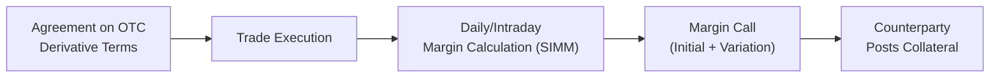

## Background and Regulatory Evolution

After the 2007–2008 financial crisis, policy makers and regulators across the globe realized that the over-the-counter (OTC) derivatives space had grown into a critical source of systemic risk. You see, before that crisis, I remember chatting with a colleague who traded credit default swaps (CDS) on a handshake basis—no joke—and we honestly thought it was business as usual. But the crisis flipped everything. Suddenly, everyone was talking about standardizing OTC trades and requiring margins so that counterparties couldn’t vanish in the event of a default.

The Basel Committee on Banking Supervision (BCBS) and the International Organization of Securities Commissions (IOSCO) directed a set of standards that mandated the exchange of margin for uncleared transactions. The essence was straightforward: if an OTC derivative wasn’t cleared through a central counterparty (CCP), then participants had to provide sufficient collateral or margin to offset potential losses. These guidelines were then adopted and localized by various jurisdictions, resulting in rules like EMIR in the European Union, the Dodd-Frank Act in the United States, and equivalent frameworks elsewhere.

With these margin requirements in place, regulators aimed to address at least two big concerns:

• Reducing systemic risk: By forcing counterparties to post collateral, the hope is that if one counterparty goes bust, there’s enough collateral on hand to mitigate contagion.  
• Enhancing transparency and accountability: Uncleared derivatives can be highly customized. This personalization can obscure real economics. Margining ensures that any embedded credit risk is reflected in posted collateral.  

## Key Components of Uncleared Margin Requirements

### Variation Margin vs. Initial Margin

One of the most important distinctions around margin requirements (which, by the way, sometimes confused me in my early days) is the difference between Variation Margin (VM) and Initial Margin (IM).  

• Variation Margin: Collateral exchanged daily (or intraday in some markets) to reflect changes in the market value of the derivative. If the value moves in your favor, you’ll likely receive variation margin from your counterparty. If it moves against you, well, you’re paying them.  

• Initial Margin: A buffer designed to cover potential future losses in the event of a counterparty default. Unlike VM, initial margin is not just about marking current exposure to market. It’s a cushion that tries to estimate how large potential losses could be during a period in which positions might be closed out or replaced.  

Because these trades are not cleared by a centralized clearinghouse, participants are generally more exposed to bilateral counterparty default risk. Initial margin is supposed to buy a little time—helping to cover losses in that waiting period while exposures are unwound or re-hedged.

## The Standard Initial Margin Model (SIMM)

Today, many financial institutions use the ISDA Standard Initial Margin Model (SIMM) to calculate initial margin for uncleared swaps (and other derivative instruments). Developed by the International Swaps and Derivatives Association (ISDA), SIMM is a licensed framework that standardizes risk factors (e.g., interest rates, FX, equity, credit, commodity) and correlations among them. The SIMM approach is relatively transparent and is designed to yield consistent initial margin calculations across participants.

In simplified terms, one might express SIMM’s initial margin (IM) formula using a correlation-based calculation:


IM = \sqrt{ \sum_{i=1}^N \sum_{j=1}^N \Delta_i \,\rho_{i,j}\,\Delta_j },


where:  
• \\(\Delta_i\\) represents the risk sensitivity or “Greeks” for each relevant risk factor (e.g., delta, vega),  
• \\(\rho_{i,j}\\) represents the correlation between risk factors \\(i\\) and \\(j\\).  

Of course, I’m glossing over loads of details (like thresholds, netting sets, or differences by asset class). Still, the main idea is to measure all relevant risk exposures for each derivative and combine them in a formula that accounts for correlations among risk factors. I gotta be honest, the first time I saw the matrix computations behind SIMM, I was simultaneously impressed and, well, a bit nervous about messing up the correlation inputs.

## Operational Challenges

### Calculating Margin for Complex or Illiquid Derivatives
Not all OTC derivatives have the easy, standardized payoffs we see in typical interest rate swaps. If you’re dealing with a highly customized equity exotic or some kind of complicated commodity spin-off, modeling the payoff can become quite the headache. This complexity extends to:

• Finding reliable market data for calibrating model parameters,  
• Determining the right approach to measure volatility,  
• Handling seasonality or discrete jumps in underlying prices,  
• Incorporating correlation break-downs in stressed markets.  

If your firm doesn’t handle the complexities adequately, the margin you calculate might be too low, exposing you to real (and sometimes catastrophic) losses if the trade blows up. This is precisely why regulators introduced robust guidelines and internal model approval processes, ensuring your methodology is well-documented and validated.

### Documentation and Regulatory Compliance
There’s a ton of paperwork that goes along with uncleared margin requirements. From credit support annexes (CSAs) to bilateral margining agreements, each step demands specific documentation. Internal legal teams often coordinate with counterparties to align on margin thresholds, minimum transfer amounts, eligible collateral, and haircuts (the discount you apply to the collateral).

Speaking of haircuts: if the collateral is something relatively liquid, like U.S. Treasuries, the haircut might be small. But if you’re pledging corporate bonds from a lesser-known issuer, the haircut required could be fairly steep—reflecting the risk that the bond cannot easily be sold at par if your institution defaults.

### Collateral Optimization and Funding Costs
Collateral doesn’t come cheap. Pledging large amounts of Treasuries or cash ties up your liquidity. In some cases, institutions might prefer to post less traditional collateral—like high-grade corporate debt or even certain equities—to reduce their cash usage. But the more you deviate from top-tier collateral, the bigger the haircut, which ultimately increases costs. There’s a constant juggling act between liquidity needs, funding costs, and regulatory requirements.

## Phase-In Thresholds and Implementation

Margin requirements for uncleared derivatives didn’t appear overnight. Regulators recognized that smaller market participants might struggle with the costs and operational complexities, so they implemented a “Phase-In” based on the notional amount of outstanding derivatives.

In practice, the largest banks and dealers were the first wave. Then, over several years, smaller financial institutions and eventually some corporates joined the club. This phase-in process has by now effectively covered the vast majority of market participants with any significant trading volumes.

## Margin Posting Flows (Illustrative Diagram)

Below is a high-level diagram illustrating the margin posting flow in the uncleared OTC space. It’s simplified—for instance, it doesn’t show each internal credit system or the tri-party custodians that might hold collateral. But it gives a sense of the information flow:

## Case Study: A Hypothetical Interest Rate Swap

Imagine an interest rate swap between Party A (a regional bank) and Party B (a large asset manager). This swap is not centrally cleared due to specific negotiated terms, perhaps to account for unusual day-count conventions or a tailored coupon structure. Soon after trade execution, both parties must:

• Calculate their initial margin using a standardized model (often SIMM).  
• Agree on the threshold for variation margin calls.  
• Determine how frequently margin calls will be made (daily vs. intraday).  
• Document the list of acceptable collateral, the relevant haircuts, and the minimum transfer amount.  

Fast forward a month: the swap’s fair value has moved in Party B’s favor because interest rates fell. Party A (the regional bank) must now post more variation margin. Meanwhile, if the interest rate outlook becomes more volatile, the required initial margin might also increase, prompting a top-up of the initial margin. Over the life of this swap, both parties will effectively “chase” the market up or down by exchanging margin. This ensures that whichever party is “in the money” has some protection if the other defaults.

## Haircuts, Netting, and Collateral Management

### Applying Haircuts
A “haircut” is basically a discount factor applied to the posted collateral. If you post a collateral instrument that’s worth USD 1,000,000 on the open market, but that instrument is somewhat volatile, the regulator might say, “We’re only going to recognize 95% (USD 950,000) of its face value for margin purposes.” That means you’d have to post more of the same instrument to meet the margin requirement—so haircuts directly impact how much collateral you need to lock up.

### Netting Provisions
In uncleared derivatives, bilateral netting can reduce overall exposures. If you have multiple trades with the same counterparty (e.g., offsetting interest rate swaps in different currencies), your netting agreement might allow you to combine those positions to arrive at a single “net” margin requirement. This can be a huge capital saver. However, netting is only beneficial if your legal enforceability is bulletproof. Parties must ensure their netting agreements are recognized across relevant jurisdictions and are supported by local bankruptcy laws.

## Benefits and Drawbacks

On the plus side, uncleared margin requirements promote discipline and reduce systemic risk, at least in theory. They also force counterparties to be more conscious about the credit risk they’re taking on. However, such requirements undoubtedly increase costs—banks and end-users must tie up capital, manage additional back-office processes, and sometimes reduce liquidity in other areas of their business.

From a broader perspective, regulators hope that pushing more OTC derivatives toward central clearing, or at least subjecting them to conservative margin requirements if they remain uncleared, will help avoid repeats of the catastrophic failures seen during the last crisis.

## Examination Relevance

For the CFA exam context, particularly at advanced levels, you might be tested on how margin requirements affect hedging programs (for instance, do you have enough liquidity in a crisis to meet margin calls?), or on the interplay between an Interest Rate Swap’s valuation (see Chapter 3 on Swaps) and the posted collateral. You might also face questions related to pricing, where you must factor in the “cost of funding initial margin” into a swap’s fair value. Indeed, in real life and in exam scenarios, ignoring margin costs leads to mispricing or suboptimal risk monitoring.

## Practical Tips and Pitfalls

• Double-check your regulatory thresholds: If you’re working at a smaller firm, you might be subject to margin requirements only after you surpass certain notional levels. Failing to anticipate crossing that threshold can mean a scramble to set up the necessary documentation.  
• Don’t underestimate operational complexities: Variation margin calls can occur daily. If you don’t have robust systems, you’ll risk either missing calls or overposting collateral.  
• Stress-test your margin needs: Market volatility can spike margin calls significantly. In normal times, you might find the required margin manageable. But if the market environment shifts, be prepared for large calls.  
• Recognize that the cost of collateral can change: Sometimes, it’s cheaper to borrow cash or Treasury securities than it is to post other forms of collateral. Evaluate your collateral strategy regularly to optimize costs.  

## Final Exam Tips

• Understand the SIMM approach conceptually: While you might not have to dive deeply into the matrix algebra, a conceptual understanding of correlation-based margin modeling is critical.  
• Compare cleared vs. uncleared exposures: Be prepared to explain how margin posting differs between a centrally cleared trade (where the CCP collects and manages margin) and an uncleared bilateral trade (where margin is a direct negotiation between the two parties).  
• Know the terminology: Terms like Variation Margin (VM), Initial Margin (IM), haircuts, thresholds, and netting sets often appear in exam questions.  
• Consider extremes: Scenario-based or “stress” scenario questions frequently appear at advanced levels. Think about how large margin calls might be handled, especially when many counterparties request margin simultaneously.  

## References

• ISDA’s Official Documentation on Uncleared Margin Rules:  
  https://www.isda.org/category/research/legal-and-documentation/margin/  

• European Market Infrastructure Regulation (EMIR):  
  https://www.esma.europa.eu/regulation/post-trading/otc-derivatives-and-clearing-obligation  

• Basel Committee on Banking Supervision and IOSCO Policy Framework:  
  https://www.bis.org/bcbs/publ/d475.htm  

• Chapter 6.4 (Counterparty Risk in OTC Markets) and Chapter 3 on Swaps within this Volume for related insights.

--------------------------------------------------------------------------------

## Test Your Knowledge: Uncleared Margin Requirements for OTC Derivatives



### Which of the following best describes the main regulatory objective behind imposing initial margin requirements for uncleared OTC derivatives?

- [ ] Ensuring central counterparties receive adequate income.
- [ ] Enhancing the liquidity of high-yield collateral.
- [x] Protecting parties from potential losses if a counterparty defaults.
- [ ] Simplifying swap documentation processes.

> **Explanation:** The key regulatory aim is to lower systemic risk by compelling parties to post enough collateral to cover potential future exposure if the counterparty defaults.  

### What is the primary motivation for using the ISDA Standard Initial Margin Model (SIMM)?

- [ ] It allows banks to avoid daily variation margin requirements.
- [x] It provides a standardized, correlation-based framework to calculate initial margin.
- [ ] It requires no external data or market correlations.
- [ ] It is only used for central clearinghouses.

> **Explanation:** SIMM is widely adopted because it offers a consistent, rules-based calculation that accounts for correlations among risk factors, enabling participants to estimate initial margin more uniformly.  

### When larger institutions were the first to adopt uncleared margin requirements, this approach was commonly referred to as:

- [x] Phase-In Implementation.
- [ ] Collateral Segregation.
- [ ] Netting Off-Set.
- [ ] Threshold Exclusion.

> **Explanation:** Regulators deployed a “Phase-In” approach, initially targeting institutions with substantial notional amounts before gradually including smaller players.  

### Among the collateral types permitted for margin posting, the concept of a “haircut” typically refers to:

- [x] A percentage discount to the posted collateral's face value.
- [ ] A mandatory redemption schedule for posted collateral.
- [ ] An automatic penalty for late margin payments.
- [ ] A freeze on collateral usage if the counterparties dispute margin calls.

> **Explanation:** A haircut is the difference between an asset’s market value and its assigned value for margin posting, reflecting the asset’s liquidity or price volatility.  

### Which statement correctly distinguishes Variation Margin (VM) from Initial Margin (IM)?

- [x] VM reflects the cumulative gain or loss since trade inception; IM is a buffer against potential future exposure.
- [ ] VM is posted at trade inception, while IM is posted periodically.
- [ ] VM is counted as capital, IM is fully offset against net income.
- [ ] VM is never exchanged with a counterparty, while IM frequently is.

> **Explanation:** Variation margin covers current exposure tied to unrealized gains/losses. Initial margin is a forward-looking buffer.  

### A major operational challenge in complying with uncleared margin requirements is:

- [ ] Calculating central clearing fees.
- [x] Modeling margin for complex, illiquid derivatives.
- [ ] Issuing short-term debt in the market.
- [ ] Avoiding netting agreements altogether.

> **Explanation:** For illiquid or customized derivatives, obtaining accurate market parameters and building reliable models to determine margin can be both intricate and resource-heavy.  

### Why do regulators impose stringent documentation requirements (CSAs, margin agreements) on uncleared swaps?

- [ ] To force swap activity onto regulated exchanges.
- [ ] To reduce the notional size of the swap.
- [x] To ensure clarity around margin thresholds, eligible collateral, and netting.
- [ ] To eliminate the variation margin process altogether.

> **Explanation:** Detailed documentation clarifies operational processes and legal enforceability, specifying how the margin will be calculated, posted, held, and reclaimed.  

### Which of the following best explains why funding costs rise under strict initial margin rules?

- [x] Institutions must tie up high-quality collateral, reducing liquidity for other uses.
- [ ] Initial margin reduces the flexibility of daily margin calls.
- [ ] Collateral posted is always returned the same day.
- [ ] Funding costs are not affected by margin requirements.

> **Explanation:** When large sums of cash or other assets are couriered as collateral, they can no longer be freely used for other investments, increasing opportunity and funding costs.  

### In applying netting provisions for uncleared OTC derivatives:

- [x] Offsetting risk exposures across trades can reduce overall margin.
- [ ] Each trade’s margin requirement is never combined.
- [ ] Netting is prohibited by most regulations.
- [ ] Netting always eliminates the need for initial margin.

> **Explanation:** Under legally enforceable netting agreements, multiple positions with the same counterparty can often be offset to reduce the total margin requirement.  

### Uncleared margin requirements aim to reduce systemic risk primarily by:

- [x] Mandating collateral buffers that cover potential future exposures.
- [ ] Eliminating counterparty default probabilities entirely.
- [ ] Keeping derivative costs artificially low for large banks.
- [ ] Encouraging speculation in less liquid markets.

> **Explanation:** By requiring margin, regulators ensure that each party is better protected from counterparty default, helping stabilize the financial system.


