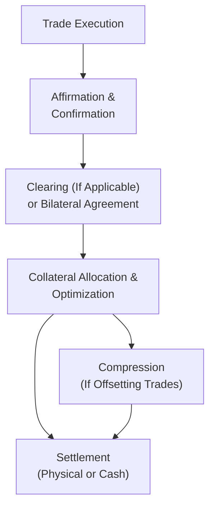

## Affirmation and Confirmation
Post-trade processing is the nerve center of a derivatives transaction—some might say it’s where the real magic happens. Once two parties have agreed on a derivative trade in principle, there’s a vital step known as affirmation and confirmation. At a high level, affirmation is the process in which each party (sometimes via an electronic platform) indicates, “Yes, I see these trade details. They match what I have on my side.” Think of it like checking the invitation list before a big event: you want to make sure no one’s RSVP got lost in the email shuffle. Confirmation, then, is the official “We’re locked in” step. Both sides sign off on the notional, strike, maturity date, reference asset, and any other detail that needs to be perfectly aligned.

These tasks might sound trivial, but trust me, they can get complex, especially for large dealing banks or asset management firms trading thousands of derivatives each day. Even a tiny mismatch in a single field can trigger a chain reaction of operational headaches. A trade’s notional amount could be off by a negligible fraction—yet, that fraction could represent real money in multi-million-dollar positions. By carefully matching every term, you reduce your operational risk, ensure accurate books and records, and set yourselves up for smoother settlement ahead.

A quick personal memory: early in my career, one of my colleagues forgot to confirm a trade’s currency reference. The trades were in different currencies on each side’s system. Yikes. That got sorted out eventually but cast a spotlight on the importance of structured affirmation technology. If affirmation and confirmation appear routine, that’s precisely the point—they’re supposed to be routine. The fewer surprises, the better.

## Clearing and Settlement
Once the trade terms have been affirmed and confirmed, the fun moves to clearing and settlement. You’ve probably encountered the concept of central clearing in earlier sections of this text (see discussions in Chapter 2 on margins and clearinghouses). For many standardized derivatives—like certain index futures, commodity futures, or interest rate swaps that qualify—central counterparties (CCPs) stand between the buyer and the seller. This arrangement mitigates counterparty risk by ensuring that each side faces the CCP rather than each other directly. The CCP demands margin from both sides, which helps to smooth out credit concerns. After all, a CCP can margin, net, and sometimes even compress trades at a scale unmatched by bilateral agreements.

For uncleared (often customized OTC) derivatives, clearing is not mandatory. In that scenario, settlement obligations are typically governed by an International Swaps and Derivatives Association (ISDA) Master Agreement between the two parties. The ISDA Master Agreement establishes the rules for payment netting, close-out netting, dispute resolution, and numerous other legal details. Indeed, almost every professional in the OTC derivatives world can recite sections of the ISDA from (painful) memory. In short, the agreement is the bedrock that outlines how obligations must be fulfilled in normal (and not-so-normal) market conditions.

Settlement can be physical or cash-based, depending on the type of derivative. For example, an equity forward might require the actual delivery of shares, whereas many interest rate swaps or credit default swaps settle by exchanging cash payment streams. In either case, the settlement mechanics revolve around the final determination of the contract’s value and who owes what to whom. Where a CCP is involved, the clearinghouse ensures the margin flows work properly and that final payouts are netted across the portfolio. Without netting, each trade’s obligations would be settled individually, which can be insanely cumbersome if you have 150 different trades with the same counterparty. With netting, you tally up the final amounts, and only a single net payment is exchanged. It’s a more efficient system—and it lowers your transaction costs.

## Collateral Optimization Tools
One of the more advanced topics in post-trade operations is collateral optimization. As you might recall from prior chapters on margining (especially around futures and swaps), we often need to post collateral to secure our obligations. But guess what? We don’t always have to post cash. In many agreements, you can post securities—like high-quality government bonds or even certain equities—subject to “haircuts” that reflect their price volatility or liquidity risk.

Collateral optimization tools have become popular in recent years, as financial institutions began to realize that not all collateral is created equal. If you must tie up cash as collateral, that’s an opportunity cost—maybe you can’t use that cash to invest in short-term opportunities. But if you have, say, U.S. Treasury securities that you can easily deploy, it might be cheaper from a funding standpoint to post those bonds instead of cash. Meanwhile, if you’re holding less liquid securities, your counterparty might demand a larger haircut. Balancing these choices—cash versus bonds versus something else—can dramatically lower your funding costs and reduce liquidity strains, especially in times of market stress.

Automated solutions exist that dynamically scan your inventory of eligible collateral assets. They look at the margin requirements across your entire derivatives portfolio, see what the rulebooks say for each CCP or bilateral agreement, and then allocate the most cost-effective collateral to each position. This process might run daily—or even intraday—to adapt to changing market conditions. The end goal is simple: meet all margin obligations using the cheapest possible blend of assets while adhering to constraints on eligibility, credit quality, and haircuts. It’s like playing Tetris with your portfolio: you’re trying to make all the shapes fit as efficiently as possible with minimal leftover pieces.

## Automation and Straight-Through Processing
Let’s talk about STP (Straight-Through Processing). If you recall from our glossaries, STP is the seamless electronic movement of transactional data across the system, from trade execution through confirmation, clearing, and settlement, without manual intervention. In derivatives, as in other capital markets activities, the speed and accuracy of processing can make a huge difference. Manual processes are more prone to error, take longer, and cost more.

Imagine a scenario where each new trade is keyed into multiple systems by multiple people. That’s a recipe for trouble—and it reminds me of a time I had to re-enter 50 trades from a spreadsheet. Let’s just say I was triple-checking everything by the time I got to trade #40. STP eliminates these risks by transferring data electronically. Once the trade is executed, the trade details automatically flow from the front office (execution) system to the mid-office (risk management, compliance) to the back office (settlement, accounting), with minimal or no human involvement.

Beyond preventing operational errors, STP shortens the settlement cycle. And why does that matter? Because with fewer days between trade execution and settlement, market participants have a lower window of credit risk, and the chance of unsettled trades clogging up the system is reduced. This approach also promotes real-time reporting, so you always have a near-instant view of your exposure, your unsettled trades, and your margin requirements. Regulators love it because it reduces systemic risk, and businesses love it because it improves efficiency, saves money, and lowers error rates.

## Compression
Another term you might have encountered is compression. In the derivatives context, compression typically refers to the process of reducing the notional size of outstanding derivative positions by netting or offsetting trades with matching or similar characteristics. The idea is: If we both hold offsetting transactions—like two interest rate swaps that are effectively the same but from different vantage points—we can “compress” those trades into a smaller notional, or even cancel them out. This reduces the overall gross exposures in the market, leading to lower capital requirements and, presumably, lower risk.

Compression isn’t just about tidying up your books; it can significantly reduce the systemic footprint of derivatives trading. For instance, a large portfolio might contain numerous offsetting swaps that cancel each other out in economic terms. Instead of carrying billions in notional outstanding, you might slash that down to a fraction by folding them together. Many CCPs and third-party service providers offer compression services. After a successful compression cycle, you can free up margin or capital that was otherwise locked in to cover those positions.

## Putting It All Together

To visualize how these steps connect, let’s look at a simple model of the post-trade workflow in a flowchart:

In a perfect world, this all happens momentarily, with minimal friction and close to zero errors. Real life is, of course, a bit messier. Every step can introduce complexities—especially if the underlying product is exotic or if global regulations require additional checks. But the essence is consistent: maintain data accuracy, reduce operational risks, and handle monetary obligations (such as margin posting and final settlement) efficiently.

## Key Takeaways
• Affirmation and confirmation form the bedrock of accurate settlement. Without well-executed matching processes, even the best-intentioned trades can devolve into chaos.  
• Clearing removes a great deal of counterparty risk, especially for standardized derivatives. Uncleared trades, governed by ISDA Master Agreements, bring more flexibility but also additional bilateral credit risk.  
• Collateral optimization is a strategic exercise that can meaningfully impact a firm’s bottom line. Effective use of automation can reduce the cost of capital and free up liquidity.  
• Straight-through processing (STP) is a must-have for large trading operations dealing with volumes of complex deals. It is an operational boon that reduces errors and shortens settlement cycles.  
• Compression is a powerful tool for mitigating risk and saving capital. By reducing redundant or offsetting trades, you can shrink notional exposures and reduce the number of open positions on your books.

## Further Reading
• DTCC – Offers extensive resources on post-trade processing, settlement workflows, and how to implement STP effectively in derivatives markets.  
• Bank for International Settlements (BIS) and International Organization of Securities Commissions (IOSCO) – Publish guidelines on best practices for clearing, settlement, and risk management across global markets.  
• ISDA – The go-to standard setter for OTC derivatives documentation, margin requirements, and various protocols.

Feel free to dive deeper into these sources for a more detailed view of how large-scale market infrastructures handle millions of derivative transactions each day.

## Exam Tips and Next Steps
• Thoroughly familiarize yourself with how bilateral (uncleared) transactions differ from cleared transactions. On the exam, you might be asked to outline key differences in risk, settlement mechanics, or margin obligations.  
• Practice analyzing the impact of posting different forms of collateral on a firm’s cost of funding and liquidity. This could show up in a scenario-based item set or a constructed response.  
• Be prepared to discuss or calculate how compression can reduce capital charges. You might see references to notional reduction or netting benefits in essay questions.  
• Know your definitions: Terms like affirmation, confirmation, STP, and compression might appear as direct multiple-choice items or short-answer questions.

---

## Assess Your Knowledge: Post-Trade Processing and Collateral Quiz



### Which step ensures that both counterparties agree on trade terms such as notional and strike price before legal confirmation?
- [ ] Settlement
- [x] Affirmation
- [ ] Compression
- [ ] Execution

> **Explanation:** Affirmation is the process by which parties verify that they agree on the initial trade details prior to final confirmation.

### In derivatives cleared through a central counterparty (CCP), which entity assumes the counterparty risk between the buyer and the seller?
- [ ] The depositary bank
- [ ] The original seller alone
- [x] The central counterparty
- [ ] The custodian

> **Explanation:** In cleared trades, the CCP becomes the buyer to every seller and the seller to every buyer, mitigating bilateral counterparty risk.

### An ISDA Master Agreement typically governs:
- [ ] Exchange-traded futures
- [ ] Transactions settled exclusively by cash
- [x] Bilateral over-the-counter (OTC) derivative trades
- [ ] Clearinghouse auctions for defaulted positions

> **Explanation:** ISDA documentation lays out the legal frameworks for OTC derivatives, including credit support annexes and netting provisions.

### Which concept refers to optimizing the allocation of various collateral assets to meet margin requirements efficiently?
- [ ] Straight-through processing
- [ ] Trade affirmation
- [x] Collateral optimization
- [ ] Novation

> **Explanation:** Collateral optimization involves selecting and posting collateral that meets eligibility requirements while minimizing funding costs.

### Straight-through processing (STP) primarily aims to:
- [x] Automate trade data flows to reduce manual errors
- [ ] Increase the role of data entry clerks
- [x] Shorten the post-trade processing cycle
- [ ] Remove the need for regulatory oversight

> **Explanation:** STP automates and streamlines post-trade operations, reducing errors and time to settlement.

### What is the main benefit of compression in a portfolio of OTC derivatives?
- [x] Reduced notional exposure and capital requirements
- [ ] Increased cost of funding
- [ ] Slower settlement cycles
- [ ] Mandatory for all trades by regulation

> **Explanation:** Compression offsets or eliminates redundant trades, thereby lowering overall notional exposures, which in turn eases capital constraints.

### Which is true about bilateral settlement for uncleared OTC derivatives?
- [x] Counterparties settle directly under an ISDA Master Agreement
- [ ] Only CCP margin rules apply
- [x] Netting can be used to reduce payment flows
- [ ] It is less legally complex than exchange clearing

> **Explanation:** In uncleared trades, parties use a master agreement to define payment and netting processes, unlike in central clearing, which follows CCP margin rules.

### Posting government bonds as collateral instead of cash might be preferred because:
- [x] It can lower funding costs.
- [ ] Bonds always increase credit risk.
- [ ] Bonds are never subject to haircuts.
- [ ] Bonds must be posted intraday only.

> **Explanation:** Using high-quality bonds as collateral can free up cash and lower overall funding costs, although certain haircuts still apply.

### Which of the following is a key advantage of netting in post-trade processing?
- [x] It reduces multiple payment obligations into a single net payment.
- [ ] It guarantees a higher credit rating.
- [ ] It complicates compression efforts.
- [ ] It avoids all margin requirements.

> **Explanation:** Netting consolidates offsetting payment obligations, minimizing the number of payments and reducing credit exposure.

### For a trade to be fully executed in a straight-through processing (STP) framework, which statement is True?
- [x] It moves from execution to settlement with minimal manual intervention.
- [ ] STP eliminates all forms of operational risk.
- [ ] Traders must re-key the details at least twice.
- [ ] Confirmation is done through manual sign-offs only.

> **Explanation:** STP involves automated data flow that reduces manual touchpoints, facilitating faster and more accurate settlement.


