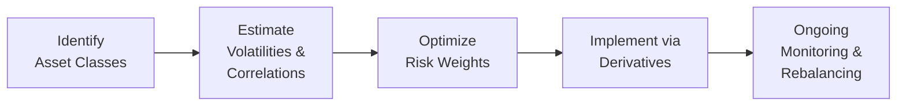

## Introduction

Have you ever chatted with a friend who claims their portfolio is “perfectly balanced” because it’s 60% stocks and 40% bonds? Well, I remember that kind of conversation, and it always struck me that “balanced” usually refers to the percentage allocation of capital rather than how much risk each asset class actually contributes. In truly balanced portfolios—sometimes called risk parity portfolios—it’s all about ensuring that each asset class’s risk contribution, not just its capital allocation, is roughly the same. That’s the heart of risk parity.

In this section, we’ll explore how derivatives can supercharge (or hedge) a risk parity approach. We’ll talk about the benefits of leveraging low-volatility assets, the dangers of correlation breakdowns, and the process of monitoring risk in real time. Let’s dive in.

## Understanding Risk Parity

Traditional portfolio allocation focuses on dividing capital among bonds, equities, and other assets. But with risk parity, we allocate risk (which in practice often means volatility). The aim is for each asset class to contribute equally to overall portfolio volatility. Why do this? Well, in theory, if no single asset (or asset class) dominates the risk of the portfolio, you might sleep better at night—especially when the markets get jittery.

### Key Idea: Equal Risk Contribution

Consider a simplified two-asset example of equities (E) and bonds (B). Let wᵉ and wᵇ be their respective weights in the portfolio. Then the portfolio’s variance can be expressed as:

$$
\sigma_p^2 
= w^e{}^2 \, \sigma_e^2 
  + w^b{}^2 \, \sigma_b^2 
  + 2 \, w^e \, w^b \, \rho_{e,b} \, \sigma_e \, \sigma_b,
$$

where σₑ and σᵦ are standard deviations of equities and bonds, and ρₑ,ᵦ is their correlation. In a risk parity framework, we try to find weights such that each asset class’s marginal contribution to overall risk is equal. That can be complicated, but the high-level idea is we want:

Risk from Equities = Risk from Bonds

This is obviously simplified, but risk parity extends the concept to more asset classes—like commodities or real estate.

## Role of Derivatives in Risk Parity

One might ask: “Why do we need derivatives?” If you think about typical bond and equity allocations, equities carry higher volatility, whereas bonds normally don’t. If you just hold both in cash form at, say, 50/50 notional allocation, your equity risk will dominate because of higher volatility. To truly “equalize” risk, you could either reduce your equity weight drastically or increase the bond exposure so it has a comparable risk contribution. Increasing bond exposure beyond 100% notional means employing leverage—and that is often achieved through derivatives.

### Leveraging Low-Volatility Assets

Imagine you want your bonds to have roughly the same risk budget as equities. If bonds are significantly less volatile, you’d need a larger bond position to match equity risk. With physically funded bonds, that could be capital-intensive. Instead, you can use interest rate futures or bond total return swaps to scale up your bond exposure. That’s what we usually mean by employing derivatives in a risk parity strategy.

But there’s a flip side—any time you introduce leverage, you must carefully monitor:

• Margin requirements.  
• Liquidity conditions.  
• Counterparty risk.  

Remember, derivatives can magnify gains but also magnify losses. In a so-called “sleep-well-at-night” risk parity approach, hidden leverage can become your worst nightmare if not managed correctly.

## Monitoring Correlations and Volatility

Risk parity is built on the assumption that relatively stable correlations will hold, or at least that historical estimates of correlation and volatility are reasonably predictive of future states. However, in times of market stress, assets that appear uncorrelated can suddenly move together. This is sometimes called correlation breakdown or correlation spike.

### Volatility Scaling

In a risk parity approach, you generally want to rebalance frequently to keep the target volatility or risk exposure constant. This concept, known as volatility scaling, adjusts position sizes as volatility changes. When volatility creeps up, you might reduce exposures; when volatility is low, you might ramp up. But there’s a cautionary tale: if the markets become more correlated during a crisis, even frequent rebalancing may not save you from drawdowns. It just might help mitigate the worst of it.

### Correlation Breakdown

Correlation breakdown is tricky. Asset classes that historically exhibited near-zero correlation—like equities and certain types of government bonds—can, under stress, start moving in the same direction. This often leads to simultaneous losses across multiple markets, which can undermine the premise of allocating risk equally.

Anyway, that’s not to say risk parity fails outright; it just means you have to be aware that correlation patterns can shift faster than you can rebalance. Derivatives can be used to apply hedges—via futures or options on key market indexes—but that’s not foolproof.

## Risk Budgeting

Risk budgeting goes hand in hand with risk parity. Instead of allocating capital, you allocate “risk budgets.” Let’s say you want each asset class (like equities, bonds, commodities) to contribute 20–30% of the total portfolio volatility. You then measure how your actual allocations stack up. If one asset class’s risk creeps above that threshold, you scale back via derivatives. If another’s risk is too low, you might scale up. It’s an ongoing, dynamic process.

## Practical Implementation Steps

Below is a simplified workflow for implementing a risk parity portfolio with derivatives.



1) Identify Asset Classes  
   - Decide which assets to include: equities, government bonds, inflation-linked bonds, commodities, etc.

2) Estimate Volatilities & Correlations  
   - Gather historical data or implied volatilities from the futures/options market.  
   - Model correlation structures.  

3) Optimize Risk Weights  
   - Solve for weights that equalize risk contributions.  
   - Ensure portfolio aligns with target volatility (e.g., 10% annualized).  

4) Implement via Derivatives  
   - Use equity index futures, bond futures, and possibly swaps to achieve the desired exposures.  
   - For instance, if you need more bond exposure, buy bond futures or enter an interest rate swap.  

5) Ongoing Monitoring & Rebalancing  
   - Check correlations, volatility, interest rates, margin requirements, etc.  
   - Rebalance frequently to maintain risk targets, especially if volatility or correlations shift quickly.  

## Drawdown Risk

Let’s be honest: all strategies carry drawdown risk, but risk parity can experience particularly abrupt losses if a sudden correlation spike happens across your assets. For example, if equities drop and bond prices also fall at the same time (which can occur if yields rise rapidly due to unexpected inflation), your levered bond position might exacerbate losses. During crises, correlations can head to +1, meaning all assets move down together, potentially leading to bigger-than-expected drawdowns.

### Stress Testing

A key part of risk parity is stress testing. Regularly test scenarios where correlations rise significantly and volatilities skyrocket. If you see that your portfolio would suffer uncomfortably large losses, rethink your leverage or consider hedges (e.g., options or short futures positions) to cushion the blow.

## Using Python to Illustrate a Simplified Risk Parity Calculation

Below is a short conceptual Python snippet to demonstrate how you might estimate weights for a simplified risk parity approach across three assets: equities, bonds, and commodities. This is purely illustrative.

```python
import numpy as np

# Let's say we have eq, bond, commod
cov_matrix = np.array([
    [0.04, 0.01, 0.00],
    [0.01, 0.02, 0.00],
    [0.00, 0.00, 0.03]
])

weights = np.array([1/3, 1/3, 1/3])

def portfolio_variance(weights, cov_mat):
    return weights.T @ cov_mat @ weights

def risk_contribution(weights, cov_mat):
    # Marginal contribution times weight
    port_var = portfolio_variance(weights, cov_mat)
    mc = cov_mat @ weights
    rc = weights * mc
    return rc / np.sqrt(port_var)

learning_rate = 0.01
for _ in range(1000):
    rc = risk_contribution(weights, cov_matrix)
    average_rc = rc.mean()
    # Adjust weights based on whether rc is above or below average
    gradient = rc - average_rc
    weights -= learning_rate * gradient
    weights = np.maximum(weights, 0)  # No short constraints, for illustration
    weights /= weights.sum()

print("Final Weights:", weights)
print("Risk Contributions:", risk_contribution(weights, cov_matrix))
print("Sum of Weights:", sum(weights))
```

In reality, risk parity calculation with derivatives also involves margin requirements, yield curves, top-down constraints, and more nuanced correlation structures. But this snippet helps illustrate how one might set out to align risk contributions.

## Common Challenges and Pitfalls

• Over-Leverage: Piling on too much leverage in traditionally low-volatility assets can amplify losses if correlations shift.  
• Liquidation Risk: If you don’t manage margin requirements properly, you might face forced liquidation at exactly the worst time.  
• Inaccurate Correlation Estimates: Past data might not predict future correlations well, especially in changing macro environments.  
• Market Liquidity: In stressed markets, rolling large derivative positions may become costly or sometimes temporarily unavailable.  

## Real-World Anecdotes

For instance, some well-known hedge funds and asset managers have employed risk parity strategies. During certain market crises, these funds often showed stable returns—until everything went awry and correlations converged. One manager confided over a coffee chat that they had to “scramble to de-lever” because all their usual cross-asset relationships broke down, and margin calls were creeping in. But in more normal market periods, risk parity can be a relatively stable strategy with smoother returns than a single heavy equity allocation.

## Exam Tips: Applying Risk Parity Concepts

1) In a typical CFA exam scenario (especially at higher levels), you could be asked to calculate risk contributions under different volatility regimes. Make sure you can handle simple formulas and interpret covariance structures.  
2) Don’t forget the theoretical underpinnings of no-arbitrage from Chapter 7 and how derivatives are priced (Chapters 2, 8, and 9). Understanding how futures positions alter your risk exposure is essential.  
3) Look out for multi-part essay questions where you might be asked to compare a standard 60/40 portfolio to a risk parity portfolio using futures.  
4) Be prepared to discuss how correlation breakdown can hurt leveraged positions and how frequent rebalancing might mitigate (but not eliminate) drawdown risk.  

## Glossary

• Risk Budgeting: The process of assigning risk—rather than capital—to different investments or trading strategies.  
• Volatility Scaling: Adjusting the size of positions based on real-time or forecasted volatility to keep risk exposure consistent.  
• Correlation Breakdown: When assets that usually move independently or inversely suddenly move together (often in a crisis).  

## References & Further Reading

• “Risk Parity Fundamentals” by Edward Qian.  
• Various academic papers on risk parity in the Financial Analysts Journal.  
• For a deeper dive into futures mechanics, see Chapter 2 of this volume (“Forward and Futures Contracts”).  

## Test Your Knowledge: Risk Parity, Leverage, and Derivative Applications



### Which best describes the main objective of risk parity?

- [ ] To maximize returns by investing primarily in equities
- [ ] To minimize portfolio beta by holding cash
- [x] To ensure each asset class contributes equally to total portfolio risk
- [ ] To target the highest Sharpe ratio in the portfolio

> **Explanation:** Risk parity seeks to equalize the risk contribution of each asset class rather than capital weighting.

### How do derivatives commonly facilitate risk parity?

- [x] By enabling leveraged exposure to lower-volatility assets
- [ ] By eliminating market risks entirely
- [ ] By providing guaranteed profits in volatile markets
- [ ] By making correlations irrelevant

> **Explanation:** Lower-volatility assets, such as bonds, need leverage to match the risk contributions of higher-volatility assets like equities.

### What is the primary concern when using leverage in a risk parity strategy?

- [ ] Enhancing upside returns
- [x] Magnifying drawdowns if asset correlations spike
- [ ] Lowering portfolio volatility in all market conditions
- [ ] Avoiding short positions

> **Explanation:** Leverage amplifies returns but also amplifies losses. In a correlation spike scenario, losses can be severe.

### In the portfolio variance formula, which parameter is crucial for controlling extreme drawdowns under risk parity?

- [ ] Mean returns
- [ ] Skewness
- [x] Correlation
- [ ] Dividend yield

> **Explanation:** Correlation determines how assets move together, especially during market turmoil.

### What is volatility scaling?

- [x] Adjusting position sizes to maintain a constant volatility target
- [ ] Removing high-volatility assets from the portfolio
- [x] Incrementally increasing or decreasing leverage based on changing volatility
- [ ] Converting all assets to short positions when volatility rises

> **Explanation:** Volatility scaling means you dynamically adjust your exposures in response to volatility estimates or realized volatility data.

### Why does the phenomenon known as “correlation breakdown” pose a particular risk to risk parity portfolios?

- [x] Because assets thought to be uncorrelated can sell off simultaneously
- [ ] Because it enhances portfolio diversification
- [ ] Because it permanently eliminates leverage from the strategy
- [ ] Because it reduces the range of available derivatives

> **Explanation:** If historically uncorrelated assets suddenly move together, the result can be large simultaneous losses across the portfolio.

### Which aspect of derivatives usage is most critical for maintaining a stable risk parity position during market transitions?

- [x] Managing margin requirements in stressed environments
- [ ] Always selling options for premium income
- [x] Constantly increasing leverage to chase returns
- [ ] Arbitrarily switching broker-dealers

> **Explanation:** Proper margin management and ensuring you can roll over or close futures and swaps is vital in volatile conditions.

### What best characterizes a drawdown event in a risk parity strategy?

- [x] A sudden drop in the portfolio’s overall value due to correlated asset movements
- [ ] A guaranteed hedge against equity market declines
- [ ] A repeated daily rebalancing to risk targets
- [ ] A small or negligible portfolio fluctuation

> **Explanation:** In risk parity, large drawdowns often occur when correlations spike and everything moves downward together, magnified by leverage.

### What does “risk budgeting” mean?

- [x] Allocating volatility or risk contributions to different assets
- [ ] Strictly capping trading costs
- [ ] Never using short positions
- [ ] Setting a fixed notional capital weight for each asset

> **Explanation:** Risk budgeting is about deciding how much total volatility or risk each asset or segment of the portfolio is allowed to contribute.

### True or False: Frequent rebalancing can guarantee that a risk parity strategy avoids major losses in a market crash.

- [x] True
- [ ] False

> **Explanation:** Actually, this is a tricky one—“guarantee” is too strong a word. While frequent rebalancing can help mitigate losses by reducing exposures when volatility spikes, it can’t completely eliminate the impact of severe market drawdowns. In reality, no strategy can guarantee avoidance of major losses.


