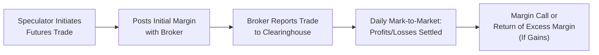

## Introduction

Speculation in derivatives markets can be exciting—some might even say it's thrilling. You see, derivatives let you amplify even a small sum of money into a market position many times larger than the initial investment. This magnification, of course, is known as leverage. While the idea of turning a modest account into substantial profits can be quite tempting, it carries big risks. If the market moves against you, losses can balloon just as easily as gains.

Speculation is distinct from hedging in a critical way: instead of protecting against unwanted price risk (the hedger’s goal), a speculator willingly takes on risk in pursuit of profit. A speculator might guess—hopefully with more than just guesswork—that prices are about to rise or fall, and then use derivatives to profit from that anticipated movement. This drive for profit can add liquidity to the markets but also stokes volatility if taken to extremes.

Below, we’ll dig deep into the key concepts: how leverage works, why margin is central to futures trading, and the risk management tools that might keep you from wiping out your entire account. We’ll also look at how speculation works in over-the-counter (OTC) markets, the role of credit support annexes (CSAs), and how “responsible speculation” can play a vital role in healthy market functioning.

## Speculative Goals versus Hedging

It’s often said that for every hedger in a market, there must be a speculator on the other side—someone willing to take the opposite side of the trade. A hedger enters a derivative position to offset or reduce exposure in the underlying asset. A speculator steps in to assume that risk, hoping to earn profits if the hedger’s fears prove unfounded (or if market moves go in the speculator’s favor).

Here’s a personal anecdote: I once met a farmer who regularly hedged his crops’ price risk by selling futures contracts. On the other end was a commodity trader who speculated on grain prices rising. In years of high demand, the speculator reaped nice returns. In years with bumper crops and low prices, the speculator lost money, but the farmer was relieved to have locked in a guaranteed price. This is the classic hedger-speculator relationship in a nutshell.

Speculators serve an important function in making markets more liquid. Their willingness to take on risk helps hedgers enter or exit positions more easily. But let's face it—speculating can be risky. For many participants, derivatives speculation is about quickly shifting from one position to another, trying to capture short-term price movements. Others, with a more strategic view, might hold a derivative position for weeks or months, expecting a longer trend to unfold. Regardless, the root motivation is profit rather than risk reduction.

## The Role of Leverage in Speculative Positions

Leverage is what makes derivatives so powerful—but also so dangerous—when used for speculation. With a future, forward, or option, you often only post a fraction of the contract’s notional value. This partial funding can be an absolute game-changer. For example, if you’re trading futures on an equity index, you might control hundreds of thousands of dollars’ worth of stocks with an initial margin requirement of just a few thousand dollars.

To visualize this, consider a hypothetical scenario:

• Suppose you expect a stock index to rise.  
• The notional exposure of one futures contract is USD 150,000.  
• The initial margin required might be USD 10,000.  
• Your leverage ratio is 15:1 (i.e., 150,000 / 10,000).

If the index climbs 5%, the notional value grows by USD 7,500; relative to your USD 10,000 margin, that’s a 75% return on your initial deposit. This is what folks love about leverage. Of course, if the index falls 5% instead, you face a 75% loss on margin—and that can lead to a margin call, or even a forced liquidation if you can’t meet it.

In shorter form:

```python
notional_value = 150000
initial_margin = 10000
leverage_ratio = notional_value / initial_margin
profit_or_loss_if_5pct_move = notional_value * 0.05
percentage_return_on_margin = (profit_or_loss_if_5pct_move / initial_margin) * 100

print(f"Leverage Ratio: {leverage_ratio}x")
print(f"Profit or Loss if 5% move: ${profit_or_loss_if_5pct_move}")
print(f"Percentage Return on Margin: {percentage_return_on_margin}%")
```

So in that snippet, you can see how big the swings get once leverage is factored in.

## Margin Requirements: Exchange-Traded and OTC

When you’re speculating with exchange-traded derivatives—let’s say a futures contract—margin requirements are typically set by the exchange clearinghouse based on factors like underlying price volatility, liquidity conditions, and regulatory mandates. These margin rules are updated dynamically and can shift if the underlying becomes more volatile.

Meanwhile, in over-the-counter (OTC) markets, speculation occurs under bilateral contracts. There isn’t a single exchange or clearinghouse that sets universal margin rules. Instead, participants usually rely on a Credit Support Annex (CSA) (part of an ISDA Master Agreement) that outlines how much collateral each party must post and under what conditions. This collateral helps mitigate counterparty risk. Without an effective CSA in place, a default by one side on a large speculation could leave the other side severely exposed.

Here’s a brief table to highlight the differences in margin/collateral requirements across these two environments:

| Factor                           | Exchange-Traded Margin                     | OTC Collateral (CSA)                     |
|----------------------------------|-------------------------------------------|-------------------------------------------|
| Determination                    | Exchange sets requirements                | Negotiated bilaterally per ISDA/CSA       |
| Adjustment                       | Changes daily (mark-to-market)            | Typically triggered by credit events      |
| Default Management               | Clearinghouse can liquidate positions     | Bilateral workout or close-out            |
| Transparency                     | Quite transparent, publicly available     | Private agreement, often less transparent |

## Risk Management for Speculative Positions

Given the significant risks involved in riding the waves of market price changes, speculators normally employ various risk management tools:

• Stop-Loss Orders: These help limit the loss by automatically closing the position once the underlying asset hits a certain price. A stop-loss can be placed as a protective measure, although slippage is possible in fast-moving markets.  

• Position Limits or Risk Limits: Firms often set internal boundaries on how large a position any individual or desk can take. This can keep a rogue trader from endangering the entire fund or institution.  

• Monitoring Market Volatility: Key volatility gauges (for example, the VIX for equities) can alert speculators to heightened risk environments. If volatility spikes, it might be wise to scale back the position—even if you still believe in the underlying thesis.  

• Diversification: Instead of betting all your chips on one product, some speculators spread their exposure across multiple assets or markets.  

• Predefined Entry and Exit Plans: Having a thoughtful plan can reduce the temptation to let losing trades run out of control.

When used judiciously, these techniques might save you from that dreaded phone call (or nowadays, automated email) from your broker telling you your account balance is too low, or from the risk manager instructing you to liquidate. As you’ll see in Chapter 6.1 (Risk Management and Hedging), many of these risk mitigation strategies overlap with the broader topic of controlling your downside exposure.

## Position Sizing: The Key Lever

Even if you have the perfect intuition about the market’s direction, poor position sizing can decimate your account. Position sizing is essentially the practice of determining how large a futures or options trade (or any derivative trade) you should open, based on your account equity, risk tolerance, and volatility assumptions.

For instance:

• If you have USD 50,000 in your trading account, you might decide to never hold a position whose notional value exceeds 3–5 times that amount. That’s a conservative approach, but it lowers the chance of catastrophic margin calls.  
• If you prefer more aggressive speculation, maybe you set a ratio of 10:1. This can lead to bigger short-term gains, but you must be prepared for drawdowns and possible margin calls.  

Sometimes, if you’re deeply confident in your analysis and you see low market volatility, you might push the boundary. But as the old saying goes, “The market can remain irrational longer than you can remain solvent.” That’s a gentle reminder not to overdo leverage.

## Over-The-Counter (OTC) Speculation

If you’ve ever tried to trade a customized exotic derivative—like a multi-asset barrier option or a forward on a less liquid commodity—chances are it’s done in the OTC space. The big advantage is customization. You might specify the exact underlying asset, expiration date, strike price, or advanced payout structure to match your outlook.

While exciting, OTC markets also saddle you with notable counterparty risk—particularly if you’re dealing with less creditworthy parties. That’s why Credit Support Annex (CSA) provisions can be so critical. They detail how much collateral each side must post, when margin calls are triggered, and how you settle if one party fails to pay. For large institutions speculating in interest rate swaps, credit default swaps, or currency forwards, these bilateral negotiations can become quite elaborate.

## Responsible Speculation and Market Liquidity

Now, to some folks, the word “speculation” sounds negative, conjuring up images of gamblers on a trading floor. But speculation can be positive for markets—assuming it’s done responsibly. Here’s why:

• Added Liquidity: Because speculators enable hedgers to offload risk more efficiently, the overall market benefits from narrower bid–ask spreads and deeper order books.  
• Price Discovery: In actively traded futures and options, speculators provide different opinions on prices, which can sharpen the discovery process.  
• Efficient Capital Allocation: If markets are fairly efficient, speculation can signal resource allocation by funneling capital to markets with the most robust expected returns.

However, irresponsible speculation—when leveraged positions become so large or so concentrated as to distort prices—can cause disruptions. We’ve all heard of investment firms or traders who took on enormous positions, expecting the market to move in one direction, only for it to reverse at the worst possible moment (Long-Term Capital Management is a famous example). That can threaten not just those traders, but also other market participants if the meltdown is large enough.

### A Brief Case Study: The Peril of Overleverage (Long-Term Capital Management, 1998)

Long-Term Capital Management (LTCM) was a hedge fund that used immense leverage to speculate on fixed income arbitrage strategies. The fund was run by highly respected academics, including Nobel Prize winners. LTCM’s trades often seemed like “sure things,” seeking small gains from convergence trades in global bond markets. But by 1998, following the Russian debt crisis, LTCM’s positions exploded in the wrong direction. The combination of illiquidity and leverage turned those “small losses” into a crisis that nearly brought the major banks that had lent heavily to LTCM into meltdown territory. Eventually, a consortium of banks stepped in to bail out LTCM to avoid systemic risk.

This example underscores a lesson that arguably can’t be repeated too often: even sophisticated, academic-driven strategies can fail under extreme market conditions when leverage is too high and liquidity vanishes.

## Diagram: Speculative Flow in a Futures Trade

Here’s a simplified visual representation of how a speculator interacts with the exchange and the clearinghouse when taking a position in a futures contract:



As the market moves, the speculator’s margin account is adjusted daily. If losses pile up, the speculator must top up the margin (creating a potential liquidity crunch). If gains accumulate, part of those gains might be withdrawn or reallocated.

## Glossary

• Leverage: The use of derivative notional exposure or borrowed money to magnify potential returns (and losses) relative to capital invested.  
• Margin Call: The demand from a broker, clearinghouse, or counterparty for additional capital or collateral to bring the account balance back up to the required level—usually triggered when losses erode existing margin below maintenance thresholds.  
• Beta: A measure of systematic risk of one asset (or portfolio) relative to the broader market. Speculators can quickly shift or amplify beta exposure with derivatives.  
• CSA (Credit Support Annex): A legal document, part of an ISDA Master Agreement, that outlines collateral posting arrangements for OTC derivatives to mitigate counterparty credit risk.

## Practical Real-World Tips and Best Practices

• Always keep an eye on liquidity: Even if your position is sound, an illiquid market can make closing out your position costly or impossible at a reasonable price.  
• Stress-test your trades: Ask yourself “What if the market moves 10% against me overnight?” or “What if liquidity dries up?”  
• Have a plan for margin calls: Keep a buffer of cash or readily liquid assets. You don’t want a forced liquidation to close your positions at the worst moment.  
• Don’t chase losses: Resist the natural temptation to “double down” to quickly recover from a losing trade.  
• Consider your personal/corporate constraints: If you’re managing institutional funds, be aware of risk mandates, regulatory requirements, and the ethics/standards set by your organization and, if applicable, by CFA Institute.

## Balancing Opportunity and Risk

Speculation can be beneficial—or harmful—depending on how it’s practiced. Markets need participants who are willing to accept risk when others look to lay it off. However, those who engage in speculation (and their investors) need a strong understanding of margin, leverage, and position sizing. They also need robust contingency plans in place if the market moves in the “wrong” direction.

Remember that while derivatives can produce extraordinary returns, they can also destroy capital almost instantly in adverse market conditions. When used prudently and controlled by disciplined risk strategies, speculation can add vitality to the financial system by enhancing liquidity and improving price discovery. Done rashly, it can lead to ruin.

## References and Further Reading

• Holbrook Working, “Speculation, Hedging, and Commodity Price Forecasts,” Journal of Farm Economics.  
• U.S. Commodity Futures Trading Commission (CFTC) resources (cftc.gov) on margin rules and guidelines for speculators.  
• For expanded coverage of risk management, see Chapter 6.1 (Risk Management and Hedging).  
• For background on how margining works daily, see Chapters 2.2 (Futures Contracts: Marking to Market and Margins) and 2.10 (Clearing House Variation and Initial Margin Calculations).  

## Final Exam Tips

• Speculation and leverage questions often show up in item sets that describe a trader’s or fund manager’s rationale for taking a derivatives position, along with margin details. Be prepared to calculate gains/losses from leveraged positions and interpret the risk implications.  
• The exam might include short essay (constructed response) segments discussing how to implement or unwind a leveraged position. Cite relevant formulas and best practices, especially around position sizing.  
• Understand the difference between speculation, hedging, and arbitrage. The exam aims to see if you can organically identify the purpose of a given derivative trade.  
• Don’t forget the ethics dimension: excessive speculation might be viewed as irresponsible if it violates the “Market Manipulation” or “Professionalism” standards in the CFA Institute Code of Ethics and Standards of Professional Conduct.

---

## Speculation and Leverage: Practice Questions



### Speculation vs. Hedging Differences
- [x] Speculators seek profits from price movements rather than offsetting existing risks.
- [ ] Hedgers typically take on additional risk without any offsetting benefit.
- [ ] Speculators primarily reduce risk on existing positions.
- [ ] Hedgers never trade in derivatives markets.

> **Explanation:** Speculators’ purpose is profit from market movements, whereas hedgers aim to reduce or offset price risk.  

### Margin Call Triggers
- [x] Occurs when account equity falls below the maintenance margin level.
- [ ] Only occurs at the expiration of a futures contract.
- [ ] Happens only if the futures contract gains in value.
- [ ] Occurs every trading day regardless of price movement.

> **Explanation:** A margin call is triggered when losses reduce the account balance below the required maintenance margin, forcing an investor to deposit additional funds.

### Position Sizing Rationale
- [x] Prevents catastrophic losses by limiting notional exposure.
- [ ] Guarantees unlimited profit potential.
- [ ] Eliminates the possibility of margin calls.
- [ ] Supplements daily mark-to-market P/L adjustments.

> **Explanation:** Position sizing helps speculators control leverage and thus limit the risk of large drawdowns, but it doesn’t guarantee unlimited profit or avoid all margin calls.

### OTC Derivatives Collateral
- [x] Typically governed by a Credit Support Annex (CSA) under an ISDA Master Agreement.
- [ ] Always set by a central clearinghouse.
- [ ] Not required unless one party has AAA credit.
- [ ] Irrelevant for large financial institutions.

> **Explanation:** OTC collateral arrangements are governed by the CSA, detailing how and when collateral must be posted.

### Responsible Speculation
- [x] Adds liquidity and helps with price discovery if done prudently.
- [ ] Is always a destructive force in markets.
- [x] Can lead to lower transaction costs for market participants.
- [ ] Is prohibited by all regulators globally.

> **Explanation:** When speculators trade responsibly, they do provide liquidity and price discovery benefits, potentially reducing transaction costs.

### Case Study: LTCM
- [x] Demonstrated how large leverage and illiquidity can threaten financial stability.
- [ ] Showed that high leverage always leads to high returns.
- [ ] Was a small firm that had little impact when it failed.
- [ ] Had no involvement in fixed income arbitrage strategies.

> **Explanation:** LTCM’s collapse highlighted how massive leverage combined with sudden illiquidity can generate systemic risk.

### Key Benefit of Stop-Loss Orders
- [x] Can limit downside risk by automatically closing a position.
- [ ] Guarantees closure at the exact stop price under all conditions.
- [x] Helps traders avoid the emotional pitfalls of holding losing positions.
- [ ] Increases margin requirement for the account.

> **Explanation:** Although stop-loss orders can't guarantee an exact fill in fast markets, they’re useful for limiting potential losses and reducing emotional decisions.

### Exchanges Setting Margin Requirements
- [x] Use underlying price volatility as a key input.
- [ ] Randomly determine margins each trading session.
- [ ] Rely solely on the broker’s internal policies.
- [ ] Are not allowed to change margin requirements once set.

> **Explanation:** Exchanges closely monitor volatility and liquidity conditions; they can and do adjust margin requirements when needed.

### Beta Modification with Derivatives
- [x] A speculator can quickly increase portfolio beta using index futures.
- [ ] Beta can only be changed through direct stock purchases.
- [ ] Beta is only relevant for commodity derivatives.
- [ ] Increasing beta automatically decreases systematic risk.

> **Explanation:** Derivatives (especially index futures) allow an investor to rapidly alter their portfolio’s market exposure—its beta—without buying or selling the underlying securities.

### Speculation in OTC Markets is:
- [x] More customizable but duplicates counterparty risk exposure.
- [ ] Governed by uniform exchange-traded rules.
- [ ] Automatically cleared by a central clearinghouse.
- [ ] Never allowed by institutional investors.

> **Explanation:** OTC trades can be tailored to specific client needs but also carry greater counterparty risk unless governed by robust collateral agreements.


