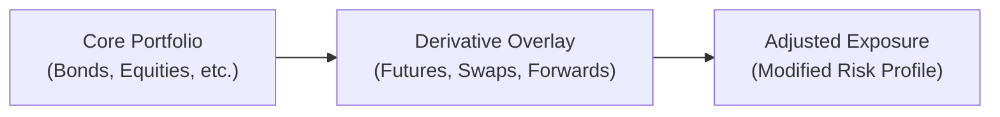

## Introduction
You know that moment when you realize your portfolio’s a bit off from the ideal target exposures? Maybe your bond positions are slightly too sensitive to interest-rate movements, or your international holdings have that pesky currency risk that makes your stomach churn. Well, that’s exactly where combinations and overlays come into play. Instead of tearing down your entire portfolio and rebuilding it from scratch—something that can trigger unwanted transaction costs or capital gains—overlay strategies let you fine-tune your exposures using derivatives layered on top of your existing portfolio. This approach is often called “Overlay Management,” and it helps you address macro or micro-level adjustments (like interest-rate risk, currency risk, or even systematic equity risk) without messing with your entire core asset base.

In this article, we’ll cover key overlay strategies, including duration overlay, currency overlay, and portable alpha. We’ll talk about how they work in real life, show you some short formulas, and share a few personal run-ins with overlay strategies. Let’s get started.

## Fundamental Ideas and Definitions

### Overlay Management
Overlay management is essentially a systematic way to use derivatives—like futures, swaps, and sometimes options—to manage or change the overall risk exposures of a portfolio. This layered approach is known as placing a “derivative overlay” on top of the underlying core assets. Instead of liquidating positions, you apply an overlay to:
• Hedge or increase exposure to certain markets (e.g., interest rates, currencies, equities).  
• Modify portfolio beta (i.e., broad market risk) quickly and efficiently.  
• Lock in or pick up certain risk premia without incurring big trading costs on the underlying.  

You can think of overlays as a flexible “jacket” that changes your portfolio’s style—think function over fashion—without reorganizing the outfit beneath. The underlying positions remain, but your effective risk changes thanks to the overlay.

### Why Not Just Restructure the Core Portfolio?
There are times—and I’ve personally seen this happen—when you just put together a well-thought-out core portfolio. Then, macroeconomic conditions change, or you realize you need a little more interest-rate sensitivity in the short run. Maybe you want to hedge out currency risk for an important quarter. If you go back and restructure your portfolio and re-trade everything, you might cause:
• Potential capital gains taxes.  
• Commission and market impact fees.  
• Lost time, effort, and momentum in the original investment thesis.  

Overlay strategies help you avoid those pitfalls by making nimble, cost-effective adjustments through derivatives.

## Duration Overlay
Let’s dive deeper into one of the most common overlay strategies: duration overlay. Duration measures a bond’s sensitivity to changes in interest rates. If you want to quickly adjust your portfolio’s overall duration—maybe you anticipate a shift in the yield curve but you don’t want to sell out of your carefully selected bonds—you can use interest-rate futures or swaps.

### Interest Rate Futures for Duration Overlay
Suppose your portfolio has a duration of 5.0, but your target duration is 6.5 because you expect rates to drop. One straightforward approach is to buy interest-rate futures (for instance, Treasury futures if you’re in the U.S.) to increase your overall duration. On the other hand, if you fear rates are going up and durations are too high, you could short interest-rate futures to reduce your duration.

Mathematically, you might see a relationship like this:


\text{New Duration} = \text{Current Duration} + \left(\frac{\text{Futures Position}}{\text{Portfolio Value}} \times \text{Duration of Futures}\right)


If “Futures Position” is positive, it means you’re buying futures. If it’s negative, you’re selling (shorting).

### Interest Rate Swaps for Duration Overlay
An alternative is using an interest-rate swap, typically a plain vanilla interest-rate swap. If your portfolio is predominantly fixed-rate and you want to reduce duration, you can enter a swap where you pay fixed and receive floating. Essentially, you “swap” out some of your fixed-rate exposure for floating-rate payments, reducing your sensitivity to interest rate changes.

In practice, paying fixed means you take on the liability side of the swap, effectively lowering your overall duration. If you want to add duration, you’d receive fixed and pay floating, which is the reverse. The flexibility of these swaps makes them appealing for fine-tuning interest-rate exposure without drastically altering your bond holdings.

## Currency Overlay
Now let’s talk about currency exposures. International investments open up your portfolio to FX risk—sometimes you want that risk if your forecast is favorable, but other times you’d prefer to either hedge it or manage it more selectively. A currency overlay program aims to manage this exposure (either partially or fully hedge it), typically through instruments like forwards or currency futures.

### How a Currency Overlay Works
Imagine you have a large position in European equities (denominated in EUR), but your base currency is USD. If you want to reduce the currency fluctuation risk, you can enter a forward contract to sell euros and buy dollars at a future date. This locks in the exchange rate for a portion of your exposure.

Alternatively, if you think the USD might depreciate relative to the EUR, you can keep your currency exposure unhedged—or even go the other way and add an overlay that goes long EUR to amplify potential gains (though that obviously increases your downside if the EUR depreciates).

### Practical Considerations
• Precision: Currency overlays let you hedge exactly the notional you want, be it partial or total coverage.  
• Rolling Overlays: Forward contracts have maturity dates, so you often need to “roll” them periodically to maintain ongoing hedge coverage.  
• Cost: The cost (or yield) of hedging depends on interest rate differentials between the two currencies.  

In real life, I once saw a portfolio manager systematically hedge 50% of her currency exposure, believing that a partial hedge struck the perfect balance of managing risk while leaving some upside potential. It was a neat approach, hedging systematically at a monthly or quarterly frequency.

## Portable Alpha
We can’t talk about overlays without discussing “portable alpha.” This concept is like the rock star of overlay strategies—everyone’s heard of it, but not everyone uses it. Portable alpha is about generating alpha in one market segment (where the manager believes they have skill) while using derivatives to get broad “beta” exposure in another area.

### Breaking It Down
1. Alpha Source: Invest in a strategy (like a long–short equity hedge fund or a specialized alpha-generating approach) that aims to produce excess return above a risk-free or benchmark rate.  
2. Beta Overlay: Use futures, swaps, or synthetic exposures to gain the main market exposure you want. That might be S&P 500 index futures if you just want broad equities, or an MSCI World swap if you want global equity beta.  

The result is that your alpha engine is separate from your beta engine. If your alpha strategy truly does produce outperformance regardless of the broad market, you “port” that alpha onto whatever market beta you prefer, effectively combining them into a single position.

### Example
• Let’s say you have $100 million to invest.  
• You place $20 million in a long–short equity hedge strategy, aiming to earn alpha net of fees.  
• The other $80 million might be parked in risk-free assets (like T-bills), or used as collateral.  
• Next, you buy $100 million worth of equity index futures to get broad equity market exposure (beta).  

So your equity exposure is the beta side from the futures, while your alpha side is the potential outperformance from the long–short fund. If it works as intended, you get the best of both worlds: a solid market exposure plus an extra alpha return on top.

## Overlay Strategies in Practice

### Implementation Steps
Using overlays effectively often involves these steps:
• Understand your core portfolio’s risk profile: Duration, sector exposures, currency breakdown, etc.  
• Identify the desired target exposures: Next, figure out how you want to tweak them.  
• Select appropriate derivative instruments: Choose from futures, swaps, or options based on liquidity, cost, and regulatory constraints.  
• Determine notional amounts: You must size the overlay so that the resulting net exposure matches your target.  
• Monitor and rebalance: Overlays are dynamic. As the underlying portfolio evolves or as time passes, you may need to roll or resize derivatives positions.

### Potential Pitfalls
• Basis Risk: Futures don’t always track your underlying portfolio perfectly. The difference in performance is known as basis risk.  
• Collateral and Margin Calls: If market movements go against your overlay, you may face calls for more collateral.  
• Overcomplicating Your Strategy: Overly sophisticated overlays can lead to confusion, especially if multiple derivative strategies overlap.  
• Transaction Costs: Rolling futures or forward contracts costs money over time—not large amounts typically, but it adds up.

## Diagram: Overlay Mechanism

Below is a simple Mermaid diagram illustrating how an overlay strategy modifies the risk profile of a core portfolio:

## A Quick Example: Combining Duration and Currency Overlays
Just to make it a bit more real:

• You have a core bond portfolio (USD-denominated) with duration 5.0. You want duration 6.0.  
• You also hold a portion of international assets denominated in EUR that you want to hedge 100%.  

Here’s what you do:
1. **Add Duration**: Buy interest-rate futures on 10-year Treasury notes. Let’s say the notional needed is $10 million worth of futures with a duration of about 7.0. This might lift your overall portfolio duration from 5.0 to roughly 6.0, depending on the exact calculations.  
2. **Hedge Currency**: Enter EUR/USD forward contracts to sell EUR and buy USD for the notional you hold in your EUR-denominated assets. Each month or quarter, you can roll the forward position to maintain the hedge.  

The underlying portfolio remains the same, but your effective interest-rate and currency exposures are now what you desire.

## Best Practices and Risk Management
• Always set clear objectives: Are you hedging or speculating? Overlays can be used for either, but clarity is critical.  
• Integrate overlays into broader risk framework: Ensure that the overlay strategy is consistent with overall portfolio guidelines, risk budgets, and leverage constraints.  
• Document thoroughly: For compliance—especially under global regulatory regimes (e.g., MiFID II, or IFRS 9 for derivative reporting)—it’s essential to keep good records of your derivative positions and any hedge accounting elections.  
• Stress testing: Evaluate how big market moves would affect your total portfolio exposure, including the overlay.

## Conclusion and Exam Tips
Combinations and overlay strategies let you control your portfolio’s risk and return profile quickly and cost-effectively. Whether you’re focusing on interest-rate risk through duration overlays, currency risk through currency overlays, or outperformance via portable alpha, these tools allow you to reconfigure your portfolio without a total teardown of your underlying holdings.

For exam purposes, remember to:
• Understand the mechanics of each overlay tool (especially interest-rate futures, currency forwards, and swaps).  
• Know how to calculate new durations and notional amounts required to achieve target exposures.  
• Distinguish between alpha (excess return from skill or strategy) and beta (exposure to broad market movements).  
• Watch for basis risk and remember to mention potential friction costs (margin, transaction costs, and rolling costs).  

Exam questions often involve scenario-based prompts: “What happens to your portfolio’s net exposure if the interest-rate future moves in your favor?” or “How would you structure a portable alpha strategy if you’re bullish on emerging market equities?” Being ready to do quick calculations and interpret risk exposures is key.

## References
- CFA Institute (Various Years). “Portable Alpha Theory and Practice” – CFA Institute Webinars.  
- White Papers by Investment Consulting Firms (e.g., Mercer, Willis Towers Watson) on Currency Overlay Programs.  
- IFRS 9 Guidelines on Hedge Accounting and Derivative Disclosures.  

## Test Your Knowledge: Combinations and Overlays in Portfolio Management



### In a duration overlay strategy, how can an investor increase the portfolio duration when expecting falling interest rates?

- [ ] Buy put options on the underlying bonds.
- [ ] Enter an interest-rate swap where the investor pays a fixed rate.
- [x] Buy interest-rate futures or enter a swap receiving a fixed rate.
- [ ] Short interest-rate futures.

> **Explanation:** To increase portfolio duration, you want to add positions that profit from falling interest rates. Buying interest-rate futures or receiving fixed in an interest-rate swap raises the effective duration.

### A portfolio manager holds a U.S. equity portfolio but wants exposure to European equities without selling the existing positions. Which approach would most likely achieve this objective?

- [ ] Convert the entire portfolio to cash and buy European stocks.
- [ ] Buy a deep out-of-the-money call option on a European equity index.
- [x] Use an overlay by buying European equity index futures.
- [ ] Sell a currency forward against the USD.

> **Explanation:** By using European equity index futures, the manager can overlay European equity exposure on top of the existing U.S. portfolio. No need to liquidate the original positions.

### What best describes portable alpha?

- [ ] A strategy where currency risk is fully hedged.
- [x] Generating alpha in one market while gaining beta exposure in another through derivatives.
- [ ] A methodology of passive indexing for fixed income.
- [ ] Avoiding derivatives entirely to maintain alpha exposure.

> **Explanation:** Portable alpha is about separating the alpha source from the beta exposure, usually by generating alpha in a specialty strategy and overlaying a different market beta with derivatives.

### Which of the following is a potential disadvantage of overlay strategies?

- [ ] Reduced flexibility in targeting exposures.
- [x] Basis risk between the derivatives and the underlying portfolio.
- [ ] Completely eliminating currency risk without cost.
- [ ] Increased liquidity of the underlying assets.

> **Explanation:** Overlay strategies can introduce basis risk if the derivative does not perfectly track the underlying assets.  

### When designing a currency overlay strategy for an investor with international holdings, which key cost factor must be considered?

- [ ] Additional broker fees for domestic equity trades.
- [x] Interest rate differentials affecting forward or futures prices.
- [ ] The shape of the domestic yield curve only.
- [ ] The correlation of credit spreads to equity markets.

> **Explanation:** Currency forward prices are influenced by interest rate differentials, making it a crucial cost benefit consideration in overlay strategies.

### Which element of a duration overlay normally involves receiving a floating rate and paying a fixed rate?

- [x] Decreasing the portfolio’s duration.
- [ ] Increasing currency exposure.
- [ ] Hedging equity volatility.
- [ ] Adding leveraged beta in equity markets.

> **Explanation:** Paying fixed, receiving floating in an interest-rate swap lowers your net duration.  

### An investor wants to maintain a neutral currency stance on a euro-denominated bond portfolio. Which derivative instrument is most commonly employed for a currency overlay in this situation?

- [ ] Commodity futures.
- [ ] Interest-rate options.
- [x] Currency forwards.
- [ ] Equity index swaps.

> **Explanation:** Currency forwards (or futures) are the standard instruments for hedging or overlaying currency exposure.  

### Which of the following describes a primary rationale for using portable alpha in an institutional portfolio?

- [ ] To eliminate basis risk between derivatives and underlying assets.
- [ ] To shift from one bond market to another with minimal transaction costs.
- [x] To gain broad market exposure in one asset class while sourcing alpha from a separate strategy.
- [ ] To lock in a currency exchange rate at a future time.

> **Explanation:** Portable alpha separates the generation of alpha from the provision of beta exposure, allowing tensible alpha generation in one segment and market exposure in another.

### In a currency overlay strategy, what is a major risk if the currency forward contracts used are not closely matched to the underlying exposures?

- [ ] There will be no net effect on the portfolio’s currency risk.
- [ ] The portfolio will automatically produce positive returns.
- [ ] The investor may violate regulatory constraints.
- [x] The hedge could be imperfect, leading to basis risk and unexpected P/L.

> **Explanation:** If the hedge’s notional or maturities don’t match the underlying exposures, the portfolio can experience unanticipated gains or losses due to basis risk.

### Overlay strategies, such as currency or duration overlays, are especially appealing because:

- [x] They allow rapid rebalancing or risk adjustment without selling the underlying portfolio.
- [ ] They limit the investor’s ability to use leverage.
- [ ] They are always more cost-effective than modifying the underlying portfolio.
- [ ] They eliminate the need for risk monitoring.

> **Explanation:** Overlays modify exposures swiftly and (often) cheaply without requiring radical changes to the core holdings.  


