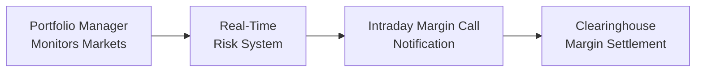

## Introduction

When derivatives markets swing back and forth like a pendulum—sometimes multiple percentage points in a matter of hours—traders, brokers, and clearinghouses often find themselves on high alert. Real-time risk management is all about staying one step ahead of these sudden market movements. It involves continuous monitoring of positions, updating margin requirements, and adjusting hedges on the fly. And yes, it can be a bit nerve-wracking (trust me, I’ve had my fair share of sweaty palms).

In this section, we’ll dig into the nitty-gritty of real-time risk management and intraday margin calls. We’ll look at why real-time analytics have become vital, how automated margin calls are triggered, and how dynamic hedging helps keep risk exposures in check. We’ll also offer a few stories, highlight some best practices, and tie it all back to the bigger picture of derivative trading.

## Monitoring Market Volatility in Real-Time

Market volatility can strike like lightning. You’re peacefully sipping your coffee in the morning, and suddenly the price of an equity index futures contract plummets, or commodity markets spike on a surprising piece of news. In these moments, real-time analytics and robust risk control systems become essential.

• Real-Time Data Feeds: Professional trading desks and risk managers typically subscribe to high-speed price feeds that update continuously. These feeds can come from exchange APIs or specialized vendors.  
• Advanced Analytics and Dashboards: Many firms have in-house or third-party software that aggregates real-time data and calculates updated portfolio metrics, such as Value at Risk (VaR), Greeks for options, or risk-factor sensitivities for interest rate swaps.  
• Volatility Tracking: Systems track implied and realized volatilities, plus correlation across markets. Any spike beyond preset thresholds may trigger immediate position reviews or margin reevaluations.

### Why Volatility Matters So Much

Volatility not only affects potential profits but also your margin requirements. A surge in volatility can increase the potential daily price swing for a derivative, prompting clearinghouses (or brokerage risk systems in the over-the-counter markets) to raise margin demands—sometimes more than once a day.

From personal experience, I remember an especially wild trading day in the energy markets when geopolitical tensions escalated out of nowhere. My desk’s leveraged futures positions required half a dozen margin “top-ups” in one session. Each call from the broker felt like a mini heart attack, but it taught me to keep extra collateral in the account, just in case.

## Intraday Margin Calls: Key Concepts

Intraday margin calls come into play when markets move so rapidly that your initial margin (or your maintenance margin) is no longer sufficient. Suddenly, brokers or clearinghouses say, “Hey, we need more money, and we need it now.” It can be stressful, but it’s a critical mechanism to keep markets fair and participants solvent.

• Maintenance Margin vs. Intraday Margin:  
  – Maintenance margin is the minimum amount of equity you must keep in your trading account to hold open positions. If your account falls below that level, you get a margin call.  
  – Intraday margin calls differ because they occur mid-session—often triggered by large price swings or trades. They’re effectively a real-time checkpoint ensuring you can withstand sudden losses.  

• Automated Systems: Many brokerage platforms now use algorithmic models that continuously scan your positions against market prices. The moment your equity cushion dips below a threshold, an automated margin call is triggered. This process can help you avoid a forced liquidation of positions, but it often means you must scramble for cash if your margin cushion is too thin.  

• Risk of Default Reduction: Intraday calls are designed to protect not only you but also the vendor or clearinghouse. They essentially reduce the risk that a participant’s account can go deeply negative if the market gaps against them.

Below is a simplified flow diagram illustrating how an intraday margin process typically works:

In this diagram:  
• A is the trader or manager watching market movements.  
• B is the internal or third-party real-time risk engine that calculates margin requirements.  
• C is the mechanism by which margin calls are relayed to the trader if the account dips below a maintenance threshold.  
• D is where collateral posting or forced liquidation finalizes the process.

## Algorithmic Risk Controls

High volatility is stressful enough without having to guess about risk tolerances. That’s where algorithmic risk controls come in. Modern trading platforms—particularly those supportive of high-frequency or algorithmic trading—often come bundled with built-in kill switches, position limits, and real-time triggers.

### Position Limits

You might see a setting like: “The moment a given position hits 2,000 futures contracts or a certain notional amount, freeze new orders.” This ensures that a rogue algorithm or a manual slip-up (like accidentally typing an extra zero in your order size) doesn’t blow up the portfolio.

### Kill Switches

A kill switch is exactly what it sounds like: an emergency stop button. If the system detects an abnormal spike in risk usage—perhaps your intraday VaR (Value at Risk) jumps from $50k to $500k—then the kill switch can instantly halt trades or flatten positions to limit losses.

### Rapid Liquidity Sourcing

In certain markets, algorithmic risk controls automatically attempt to liquidate or hedge positions once a threshold is reached. The system might send offsetting trades to multiple exchanges or request quotes from liquidity providers to exit or reduce exposure. For instance, an interest rate swap book might be quickly rebalanced with offsetting futures.

## Dynamic Hedging Adjustments

Real-time risk management thrives on the idea that you don’t have to wait until the market closes to tweak your exposures. Dynamic hedging is the continuous process of adjusting your hedge ratios based on evolving market conditions—be it volatility spikes, underlying price movements, or changes in correlation.

### Examples of Dynamic Hedging

• Option Delta Hedging: Imagine you have a large short call position that you initially hedged by selling an equivalent amount of the underlying. If the underlying moves strongly against you, your delta changes; you need to update your hedge ratio to remain neutral.  

• Cross-Asset Hedging: In complex strategies (like a merger-arbitrage play involving equity and credit derivatives), a shift in correlation could demand an immediate re-hedge in the credit leg if the equity portion becomes more correlated to credit spreads.  

• Intraday Adjustments: Some advanced traders recast their entire portfolio’s Greeks hourly (or more frequently) to maintain delta, gamma, or vega exposures within set bands.

### Balancing Transaction Costs

Of course, dynamic hedging can rack up transaction costs. Every time you rebalance, you might pay a spread or a commission, so it’s crucial to strike a balance between responsiveness and cost-effectiveness. Over-hedging is possible—constantly toggling positions might devour your profits in transaction fees, or even whipsaw you in choppy markets.

## Real-Time Risk Management Architecture

At major financial firms and even at some well-funded hedge funds, the real-time risk management system is often a tapestry of software and hardware solutions that work together. Here’s a typical breakdown:

• Data Acquisition Layer: Collects trades, quotes, and market data from multiple exchanges.  
• Risk Analytics Engine: Uses pricing models (like the Black–Scholes–Merton model for options) and advanced statistical methods (like Monte Carlo simulation) to generate real-time metrics: VaR, potential future exposure, scenario analyses.  
• Intraday Reporting Layer: Displays near-live position and risk summaries for traders and risk managers.  
• Alerting and Execution: If risk thresholds are exceeded, automated processes might generate margin calls, or partially close out positions.  

Implementation requires robust technology infrastructure, as well as strong governance policies to define precisely how risk thresholds should be set and how quickly margin calls need to be met.

## Practical Financial Examples and Case Studies

Let’s take a brief look at some real-world illustrations:

• Case Study: Equity Futures in a Volatile Market  
  – Situation: A portfolio manager held a leveraged long position in S&P 500 e-mini futures. After an unexpected economic announcement, the market dropped 2% within 30 minutes.  
  – Real-Time Risk Controls: The risk system updated exposure and signaled that maintenance margin was no longer sufficient. An automated intraday margin call was issued, requiring the manager to post an additional $200k by noon.  
  – Outcome: The manager quickly transferred funds, preventing forced liquidation. Meanwhile, a kill-switch set a cap at a certain loss level in case of further downside.  

• Case Study: Crude Oil Options  
  – Situation: A commodities trader sold out-of-the-money crude oil puts. Suddenly, oil prices plunged on rising inventory data. Volatility soared, and the sold puts became more at the money.  
  – Dynamic Hedging: The trader’s real-time analytics indicated that the delta on the short puts had grown significantly. Intraday, the trader bought offsetting futures to neutralize a portion of the short put exposure.  
  – Outcome: This proactive hedge reduced the blow from a steep price drop. And while the trader still had to meet a margin call, it was smaller than it would’ve been without quick hedging moves.

## Market Microstructure and Volatility Circuit Breakers

Circuit breakers exist in many major asset markets as a last resort to prevent catastrophic price spiral. They work by imposing a trading halt—or restricting certain types of orders—once prices move beyond a preset percentage from the previous close or reference price.

• Primary Function: Give market participants a “time out” to digest fresh information and avoid panic-driven trades.  
• Effect on Intraday Margin Calls: If a circuit breaker is triggered, the real-time risk system might recalculate margin with partial or incomplete market data. In some cases, brokers or clearinghouses will hold off on calling margins until trading resumes, but they might still require top-ups based on the halted price levels.

## Regulatory and Clearinghouse Perspectives

Regulators closely watch how brokers and clearinghouses handle intraday margin calls to ensure market stability. From a capital markets perspective:

• Accountability: Clearinghouses standardize margin models (like SPAN for futures or TIMS for equity options) and often require extra “add-ons” during times of stress.  
• Communication Protocol: Within each jurisdiction, there are guidelines for how quickly participants must respond to margin calls, often with specified cutoffs for posting collateral.  
• Notification Requirements: Clearinghouses typically provide real-time or near real-time updates to member firms on large trades or net exposures that might trigger a margin call.  

## Glossary

• Intraday Margin Call:  
  An additional collateral requirement demanded during the trading day—often triggered by large or rapid price moves.  

• Volatility Circuit Breakers:  
  Mechanisms in place on exchanges to halt or slow trading if price movements exceed certain thresholds, aiming to prevent disorderly markets.  

• Real-Time Analytics:  
  Systems that update portfolio risk metrics (Value at Risk, Profit & Loss, exposures, etc.) on a rolling basis as market prices arrive.  

## Best Practices for Managing Real-Time Risk

• Maintain a Collateral Buffer: Keep extra funds in your margin account to handle sudden margin calls.  
• Automate, but Verify: Automated triggers are great, but always do a sanity check in case of system glitches.  
• Dynamic, but Not Overactive: Hedge in real time, but don’t overtrade. Balance the potential cost of frequent rebalancing with the protective benefit.  
• Stress and Scenario Testing: Regularly run scenario analyses to see how your portfolio would behave in extreme movements.  
• Communicate Up the Chain: If you’re part of a larger organization, ensure compliance and risk management teams are informed of large moves or margin calls immediately.

## Examination of Potential Pitfalls

• Overreliance on Technology: Automated systems can fail or malfunction. “Garbage in, garbage out” is still the rule.  
• Latency Issues: If price feeds are delayed or your risk engine lags, you may receive margin calls too late (or fail to see them coming).  
• Inadequate Stress Testing: Not preparing for a “5 sigma” move might land you in trouble if real markets, ironically, deliver just that.  
• Human Error in Rapid-Fire Environments: Under stress, traders might miss intraday margin calls or fail to deposit collateral in time.

## Conclusion and Final Exam Tips

Real-time risk management is a cornerstone of modern derivative trading. It’s about scanning the horizon continuously, adjusting positions on the fly, and ensuring margin collateral stays in line with changing market conditions. For exam purposes—and, let’s be honest, real life—remember that practical details matter as much as theoretical frameworks. Be sure you understand how margin calculations work, how to interpret risk analytics, and how to apply dynamic hedging strategies.

As you review for your exam, focus on:  
• The difference between nominal margin rates and what triggers intraday margin calls.  
• How volatility impacts margin and hedging behavior.  
• The interplay of real-time analytics with modern algorithmic risk controls.  
• Reading the fine print on kill switches, position limits, and circuit breakers (stuff that can really matter on exam day!).  

Mastery of these topics will put you in a strong position to succeed both in your exam and in actual trading environments.

## References & Further Reading

• Aldridge, I. (2013). High-Frequency Trading: New Realities for Traders, Markets and Regulators. Wiley.  
• Clearinghouse Documentation:  
  – CME Group: Margins & Intraday Margin Management  
  – ICE: Intraday Margin Adjustments and Variation Margin Procedures  
• For deeper dives into volatility and derivatives sensitivity measures, see Hull, J. (2021). Options, Futures, and Other Derivatives (10th ed.). Pearson.  

---

## Test Your Knowledge: Real-Time Risk Management & Intraday Margin Calls



### Which of the following statements best describes an intraday margin call?

- [ ] A margin call issued at the end of the trading day.  
- [x] A margin call demanded during the trading session due to rapid price moves.  
- [ ] A margin call that arises only in unregulated OTC markets.  
- [ ] A margin call triggered by default only in low-volatility environments.  

> **Explanation:** An intraday margin call is specifically demanded within the trading day (not end-of-day) when shifting prices cause an account’s equity to fall below the broker’s or clearinghouse’s maintenance requirement.

### Which of the following factors would most likely trigger an intraday margin call in a futures account?

- [ ] An increase in nominal interest rates but stable futures prices.  
- [x] A rapid decline in the futures contract price creating large unrealized losses.  
- [ ] Minimal changes in implied volatility.  
- [ ] A decrease in the daily trading volume.  

> **Explanation:** A sharp drop in the futures contract price resulting in a large unrealized loss reduces the margin balance, potentially triggering an intraday margin call.

### What is a primary function of real-time risk analytics in derivative trading?

- [ ] To eliminate all risks associated with trading.  
- [x] To provide continuous updates on positions and exposures for immediate decision-making.  
- [ ] To replace human oversight entirely.  
- [ ] To ensure that volatility never exceeds predefined levels.  

> **Explanation:** Real-time analytics allow traders and risk managers to monitor positions continuously, enabling timely decisions when markets move quickly.

### How might a “kill switch” function within an algorithmic risk control environment?

- [ ] It automatically doubles all outstanding positions to “average down” losses.  
- [ ] It locks your screen so no trades can be executed.  
- [x] It halts trading or flattens positions once certain risk thresholds are breached.  
- [ ] It repurposes existing trades into new strategies.  

> **Explanation:** A kill switch is designed to reduce or close positions automatically when risk metrics exceed predefined limits.

### What’s one common drawback of dynamic hedging in a highly volatile environment?

- [x] Excessive transaction costs from frequent rebalancing.  
- [ ] Guaranteed margin call elimination.  
- [ ] Inability to reduce risk exposures.  
- [ ] Regulatory restrictions that prohibit dynamic hedging strategies.  

> **Explanation:** While dynamic hedging can prevent large losses, it can also lead to frequent trades, generating significant transaction costs and potential whipsaws.

### In which of the following scenarios might a volatility circuit breaker be triggered?

- [x] If market prices move beyond a set percentage threshold within a short timeframe.  
- [ ] If a trader manually requests the market be halted.  
- [ ] If a single portfolio accumulates a large position.  
- [ ] If implied volatility is lower than historical volatility.  

> **Explanation:** Exchanges implement circuit breakers to halt or slow trading when intraday price movements exceed predetermined thresholds, preventing disorderly markets.

### How do automated intraday margin calls generally assist a clearinghouse or broker?

- [ ] By preventing participants from ever using leverage.  
- [x] By quickly reducing default risk through real-time collateral adjustments.  
- [ ] By offering discounted commission rates to traders.  
- [ ] By making the clearing process optional for large trades.  

> **Explanation:** Automated intraday margin calls help brokers/clearinghouses protect themselves and financial systems by ensuring that participants have adequate collateral to cover rapidly changing exposures.

### Which best practice is recommended to handle real-time margin requirements?

- [x] Maintaining a collateral buffer to meet unexpected margin calls.  
- [ ] Eliminating all derivatives positions.  
- [ ] Only posting margin when forced by regulators.  
- [ ] Hedging once per month to minimize transaction costs.  

> **Explanation:** Keeping a buffer of extra collateral on hand prepares you for sudden margin calls triggered by large intraday price moves.

### What is a potential pitfall of over-reliance on automated risk systems?

- [ ] It eliminates the risk of forced liquidations.  
- [ ] It guarantees immediate and perfect margin calculations.  
- [x] Faulty data or latency issues can lead to incorrect margin calls or missed risk exposures.  
- [ ] It increases the efficiency of dynamic hedging, thus removing any cost concerns.  

> **Explanation:** Automated systems depend on the accuracy and timeliness of data feeds. Delays or errors in the data can produce flawed risk calculations and margin assessments.

### True or False: Intraday margin calls completely eliminate the potential for forced liquidation.

- [ ] True  
- [x] False  

> **Explanation:** Even with intraday margin calls, forced liquidation can occur if a trader fails to meet margin demands or if the market moves too quickly, making liquidation the only viable remedy.


