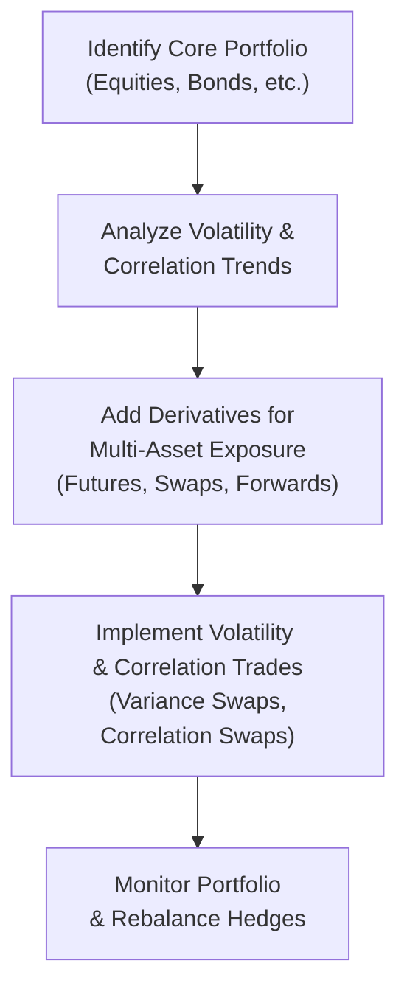

## Introduction

So, let’s talk about cross-asset volatility and correlation trading. You know how sometimes markets seem to move together in an uncanny way? Stocks, bonds, commodities, currencies…they all have these little quirks that can cause them to rise or fall in unison—or diverge dramatically—especially during turbulent periods. I remember the first time I tried to piece together a multi-asset portfolio using a handful of derivative instruments. Let’s just say it took me several cups of coffee, a few shaky attempts at coding correlation matrices, and a couple of “ah-ha!” moments to realize how critical cross-asset correlation truly can be.  

In this section, we’re going to look at how derivatives, like equity index futures, commodity swaps, currency forwards, and volatility-based products, help us navigate these relationships. We’ll see how we can hedge, speculate, and manage the overall risk of multi-asset portfolios. We’ll also check out correlation swaps and variance swaps—two specialized derivatives that can help us gain or hedge exposure to volatility and correlation itself, rather than just the direction of asset prices.  

Ultimately, the goal is to help you look at global markets with a wider lens, identify potential tail risks in cross-asset portfolios, and—perhaps most importantly—understand the mechanics that shape correlation patterns and volatility movements. By the end, you’ll be able to see how connecting the dots between different assets is not just some theoretical exercise but an essential skill for managing real money in real markets.

## Creating Multi-Asset Portfolios Using Derivatives

Imagine you’ve got a portfolio that’s mostly in equities—say you hold a bunch of individual stocks. You realize you’re missing exposure to commodities and foreign currencies. Perhaps you think oil prices might be poised to rise, or you have a hunch that the euro will weaken against the US dollar. Instead of rebalancing your entire portfolio by physically purchasing new assets (which can be expensive, complicated, and time-consuming), derivatives let you get that broad exposure much more easily.

• Equity Index Futures  
  Equity index futures allow you to tap into an entire stock market index with a single contract. If you think an index (e.g., the S&P 500) might trend upward or downward, you can go long or short futures to get that exposure. Or, you can hedge an existing equity exposure by holding a short position in index futures if you believe your portfolio is too risky during an upcoming earnings season.  

• Commodity Swaps  
  Commodity swaps provide a neat way to gain exposure to a variety of commodities (agricultural products, metals, energy) without actually having to store the physical goods. Let’s say you want to hedge your portfolio against rising oil prices. You could enter into a commodity swap where you agree to pay a fixed price for oil, receiving the floating market price in return. If oil prices surge, your swap position might show a gain that offsets energy costs or other portfolio losses elsewhere.  

• Currency Forwards  
  Currency forwards help you manage foreign exchange exposures. If you’re an exporter worried about the value of foreign earnings (or an importer worried about foreign purchase costs), you can lock in future exchange rates. Alternatively, you can use currency forwards to switch exposures from one currency to another, effectively diversifying your portfolio’s currency profile.  

All these derivatives—equity index futures, commodity swaps, currency forwards—can be combined to form a multi-asset portfolio, one which can be rebalanced or reshaped more fluidly than if you were holding the underlying physical assets. And because derivatives often require less upfront capital, you get more bang for your buck—though with that comes the need to understand leverage, margin, and the potential for outsized losses. Always a good idea to keep that in mind!

## Volatility Trading Across Asset Classes

One thing that can catch new traders off-guard is how volatility can spike simultaneously in multiple markets. Picture a surprise geopolitical event that causes stock markets to drop suddenly, prompts a flight to government bonds, and sends gold prices charting upward. Volatility might go through the roof in equities, but guess what? Commodity markets or even certain currencies may witness large swings too.  

For those who aim to profit from changes in volatility or hedge against big market moves, derivatives are indispensable. Instruments like VIX futures, variance swaps, and even options on commodity futures let you trade on volatility more directly.

### Variance Swaps

A variance swap is a neat contract where you essentially receive (or pay) the difference between realized variance on the underlying asset and a pre-agreed “strike” variance. Realized variance is (broadly speaking) the average of the squared returns of the underlying asset’s price over the swap’s life. There’s no need to guess the direction of the asset price—only whether volatility will end up being higher or lower than the market implies.

Mathematically, for an underlying asset with returns r₁, r₂, …, rₙ over n time intervals, the realized variance (annualized in many cases) can be approximated as:


\sigma_{\text{realized}}^2 \approx \frac{1}{n - 1} \sum_{i=1}^{n} ( r_i - \bar{r} )^2


(The exact formula may differ based on continuous compounding, but you get the picture!) A variance swap’s payoff is typically:


\text{Payoff} = \text{Notional} \times \bigl(\sigma_{\text{realized}}^2 - K_{\text{variance}}\bigr),


where \\( K_{\text{variance}} \\) is the strike variance, set at the start of the trade. Traders or portfolio managers can use variance swaps to hedge or speculate on big swings in volatility for equities, currencies, or even commodity prices.

### VIX Futures and Other Volatility Indices

Many folks are familiar with the VIX—often called the “fear gauge.” VIX measures implied volatility on the S&P 500 index. You can buy or sell VIX futures to speculate on whether implied volatility will go up or down. During calmer times, the VIX might hover around low double-digits. But as soon as markets get spooked, that baby can jump above 30, 40, or even 80 (like in 2008 or more recently during severe market disruptions).  

This concept of “volatility indices” has expanded across asset classes. You’ll see similar instruments for commodities and foreign exchange. All these allow you to isolate or hedge implied volatility, rather than focusing purely on price moves.

## Correlation Swaps and Correlation as an Asset

Correlation can be sneaky. Maybe your portfolio is anchored by a basket of stocks that historically have low correlation to each other. But then, news breaks (a major credit event, pandemic, you name it), and suddenly all those stocks start moving together in a sell-off. That can upend your entire notion of diversification in the blink of an eye.  

Correlation swaps let you trade on the degree to which assets in a portfolio move together instead of just direction. Think of it this way: you have a basket of assets A, B, C, etc. If your correlation swap states a “strike correlation” of 0.3 (or 30%), you’ll receive a payoff if the realized average correlation ends up exceeding 0.3, and you’ll pay out if realized correlation falls below 0.3.  

### How Correlation Swaps Work

A typical correlation swap is based on the realized correlation among the returns of multiple underlying assets over a specific period. The buyer of a correlation swap is effectively “long correlation.” If the correlation across these underlying assets surpasses the strike correlation, the buyer gets a positive payoff. The seller (short correlation) profits if correlation ends up below the strike.  

If you want a simplified formula for a correlation swap payoff:


\text{Payoff to the Long Position} = N \times (\rho_{\text{realized}} - \rho_{\text{strike}}),


where \\( \rho_{\text{realized}} \\) is the realized correlation, \\( \rho_{\text{strike}} \\) is the strike correlation, and \\( N \\) is a notional factor.  

Because correlation can spike in a market panic—when everything drops at once—some portfolio managers use correlation swaps as a tail hedge for diversified portfolios. Others might use them opportunistically if they believe selected assets have stable or even negative correlations that the market is mispricing.

## Tail Risks in Cross-Asset Portfolios

Tail risk is basically the risk of rare events that produce outsized market moves—the dreaded “fat tails” of the return distribution. In cross-asset contexts, these events often come in the form of correlated sell-offs. Maybe the bond market sells off while equities are also having a bad day, or maybe emerging market currencies all crash together. It’s the kind of scenario where your carefully constructed multi-asset portfolio can unravel quickly if you haven’t planned for that possibility.

### Stress Testing and Scenario Analysis

One of the best ways to get a handle on tail risk is to run your portfolio through stress tests. For instance:  
• A scenario where global interest rates rise sharply and cause both bond and equity markets to tumble.  
• A scenario reflecting a severe recession, pushing stocks down while credit spreads blow out.  
• A scenario where energy prices skyrocket, commodity-exporting countries’ currencies strengthen, and equity markets become extremely volatile.  

Running these “what if?” stress tests helps you see how correlations can morph in crisis periods. Real-life correlations aren’t static; they often move higher (toward 1) when markets tank because investors tend to sell everything at once in a flight to quality.  

In that sense, tail-risk hedging strategies might include long volatility positions (like options or variance swaps), systematic rebalancing triggers, or even direct purchases of protective assets—like Treasuries or gold—though derivatives used in tandem with these assets can allow you to scale or adjust those hedges more precisely.

## Putting It All Together: Cross-Asset Strategy in Action

Consider a portfolio that’s 60% stocks and 40% bonds—pretty standard stuff. You might want to add some currency diversification or commodity exposure. For currency, you pick a basket of forwards that gives you partial exposure to emerging market currencies. For commodities, maybe you add a long position in oil via a swap. Great—now you’ve got a multi-asset approach.

But how do you avoid nasty surprises when all these assets move in ways you didn’t predict? You could incorporate correlation swaps to manage the risk that all your asset classes suddenly move in lockstep. Meanwhile, you might short an equity variance swap if you think equity volatility is overpriced relative to bond-market volatility or to your historical volatility assumptions.

In more sophisticated setups, traders might do a “dispersion trade” by selling index options on a basket of stocks (exposing themselves to index-level volatility) while buying options on individual components (to benefit from single-stock volatility that might differ from the overall index volatility). This is a form of correlation trading, because if stocks move more in sync (i.e., correlation goes up), the index option will reflect that shift differently than individual-stock options.

Below is a simple flow diagram that shows how you might structure a cross-asset volatility and correlation strategy using a handful of common instruments:



This approach ensures you’re systematically analyzing correlations, layering derivatives to achieve more controlled exposure, and rebalancing as correlations and volatilities evolve.

## Practical Example with Python

Maybe you’re curious how to estimate realized correlation for a basket of assets in a quick-and-dirty way. Below is a snippet of Python code (just a simplified example) that calculates the historical correlation for a few time series:

```python
import pandas as pd
import numpy as np

# The columns are: 'AssetA', 'AssetB', 'AssetC'

corr_matrix = df[['AssetA', 'AssetB', 'AssetC']].corr()

print("Correlation Matrix:")
print(corr_matrix)

# Flatten the upper triangle of the matrix and exclude the diagonal

upper_triangle = corr_matrix.where(np.triu(np.ones(corr_matrix.shape), k=1).astype(bool))
corr_values = upper_triangle.stack().values
avg_corr = np.mean(corr_values)
print(f"Average correlation across AssetA, AssetB, AssetC: {avg_corr:.2f}")
```

We can imagine plugging this average correlation into a hypothetical correlation swap payoff if we had a strike correlation of, say, 0.30. If our actual realization turned out to be 0.45, the buyer of the correlation swap (long correlation) would profited—depending on the notional and the exact payoff structure.

## Best Practices and Pitfalls

• Over-Reliance on Historical Correlations: Historical data can sometimes be misleading if the market environment changes drastically.  

• Ignoring Transaction Costs: Derivatives are cheaper than physically trading assets, but margin, funding, bid-ask spreads, and potential slippage can still eat into profits.  

• Failing to Identify Tail Risks: During crisis periods, cross-asset correlations often converge. Underestimating that is a common pitfall.  

• Overcomplicating Strategies: It’s easy to get caught up in fancy multi-asset correlation trades, but keep in mind your overall objectives and risk tolerance.  

• Timing Matters: Correlation and volatility can shift within days or even hours based on major macro news or sentiment.  

## Glossary

• Variance Swap  
  A derivative whose payoff is based on the difference between realized variance and a strike variance on an underlying asset. This allows traders to speculate on or hedge observed volatility over a specified period.

• Correlation Swap  
  A derivative instrument where the payoff is based on the difference between realized correlation of a basket of assets and a pre-set strike correlation. Typically used by managers wanting to either hedge or express a view on correlation.

• Flight to Quality  
  A widespread shift of capital from riskier assets (e.g., high-yield bonds or emerging market equities) to safer assets (e.g., US Treasuries, gold, reserve currencies) during times of economic or political uncertainty.

## References & Further Reading

• Dynamic Hedging: Managing Vanilla and Exotic Options by Nassim Nicholas Taleb: An eye-opening book discussing how complex options (and their “Greeks”) can be managed and hedged in real-world trading.  
• Major banks’ Cross-Asset Strategy Research: Many sell-side institutions produce regular cross-asset commentary, focusing on volatility, correlation, and multi-asset trade ideas.  
• Academic Journals: Search for peer-reviewed papers on correlation dynamics and volatility clustering—these can help you refine assumptions and better handle tail risks.  

## Final Exam Tips

As you prepare for exam questions on derivatives and cross-asset strategies, keep these points in mind:

• Remember how to interpret correlation and volatility metrics, as well as how to use them practically in hedging or speculation.  
• Be ready to evaluate how changes in implied volatility might affect derivative payoffs.  
• Familiarize yourself with how stress testing might alter correlations in a crisis and the potential implications for margin calls and liquidity.  
• Practice scenario-based questions involving multi-asset hedging or correlation trades. The exam often tests your ability to adapt theoretical knowledge to real-world events.  
• Understand that correlation is not static and can jump significantly in stressed markets, complicating the notion of “diversification.”  

Anyway, the next time you see major headlines about market turmoil across countries and asset classes, hopefully you’ll recall these concepts. And you’ll be able to say, “Aha—this is exactly the scenario where cross-asset volatility and correlation trades either save my portfolio or provide unique opportunities!”

---

## Test Your Knowledge: Cross-Asset Volatility & Correlation Quiz



### To gain broad equity exposure efficiently in a multi-asset portfolio, which derivative is commonly used?

- [ ] Short equity index options
- [ ] Long commodity swaps
- [x] Equity index futures
- [ ] Currency forwards

> **Explanation:** Equity index futures are a standard tool for obtaining (or hedging) wide equity market exposure without directly purchasing all individual stocks.

### A portfolio manager who anticipates a rise in overall market volatility but is unsure of price direction might consider:

- [ ] Going long an equity index ETF
- [x] Buying a variance swap
- [ ] Selling correlation swaps
- [ ] Shorting a basket of individual stocks

> **Explanation:** A variance swap allows the manager to benefit if realized volatility exceeds the swap’s strike, without needing to predict whether the asset price itself will go up or down.

### Which of the following best describes a correlation swap?

- [ ] It pays the difference between realized volatility and implied volatility.
- [x] It pays the difference between realized correlation and strike correlation.
- [ ] It pays a fixed coupon in exchange for floating rates on a single asset.
- [ ] It replicates a basket of bond prices through interest rate differentials.

> **Explanation:** A correlation swap’s payoff depends on the realized correlation of a basket of assets relative to the strike correlation agreed upon at inception.

### In a severe market downturn, cross-asset correlations often:

- [x] Increase toward 1
- [ ] Decrease toward 0
- [ ] Become negative
- [ ] Stay entirely unchanged

> **Explanation:** In crisis scenarios, many assets tend to sell off together, causing correlations to surge toward 1.

### A flight to quality typically involves investors:

- [x] Shifting capital into safer assets like Treasuries or gold
- [ ] Moving all capital into high-yield bonds
- [x] Increasing margin borrowings in emerging market stocks
- [ ] Hedging existing FX exposure with currency forwards only

> **Explanation:** During times of extreme uncertainty, money tends to flow into low-risk assets (e.g., sovereign bonds) and away from riskier investments.

### A trader is “long correlation” on a basket of equities. Which scenario most benefits the trader?

- [ ] If the basket’s correlation ends below the strike
- [x] If the basket’s correlation ends above the strike
- [ ] If the implied correlation is unchanged
- [ ] If the correlation is negative but stable

> **Explanation:** Being “long correlation” means the trader profits if realized correlation exceeds the strike correlation designated in the swap.

### When designing a multi-asset portfolio with derivatives, an important best practice is:

- [x] Stress testing the portfolio under extreme correlation scenarios
- [ ] Relying exclusively on historical average correlation numbers
- [x] Ignoring transaction costs to simplify calculations
- [ ] Focusing only on the equity portion’s volatility

> **Explanation:** Cross-asset derivatives strategies require stress testing, especially for correlation spikes that can occur in crisis events. Relying solely on historical correlations or ignoring transaction costs can lead to suboptimal results.

### Variance swaps differ from standard options primarily because they:

- [ ] Are European-style options on an index
- [ ] Grant the right but not the obligation to buy an asset
- [x] Provide a payoff based on realized variance instead of price direction
- [ ] Are only available on interest rates

> **Explanation:** Variance swaps settle on the difference between realized variance and a predetermined strike variance, without involving the purchase or sale of the underlying asset at a specific price.

### Which of the following is often associated with tail-risk hedging in cross-asset portfolios?

- [ ] Using high-beta stock picks as a hedge
- [x] Buying volatility (e.g., through VIX futures or variance swaps)
- [ ] Selling put options on small-cap stocks
- [ ] Increasing leverage across all asset classes

> **Explanation:** Tail-risk hedging often centers on acquiring volatility instruments. Volatility typically spikes in downturns, offsetting losses from other parts of a portfolio.

### True or False: Correlation swaps allow traders to directly profit from or hedge against changes in how assets move relative to each other rather than the direction of each asset’s price.

- [x] True
- [ ] False

> **Explanation:** Correlation swaps are designed to let market participants position on whether assets’ returns will move more or less together over a set period.


