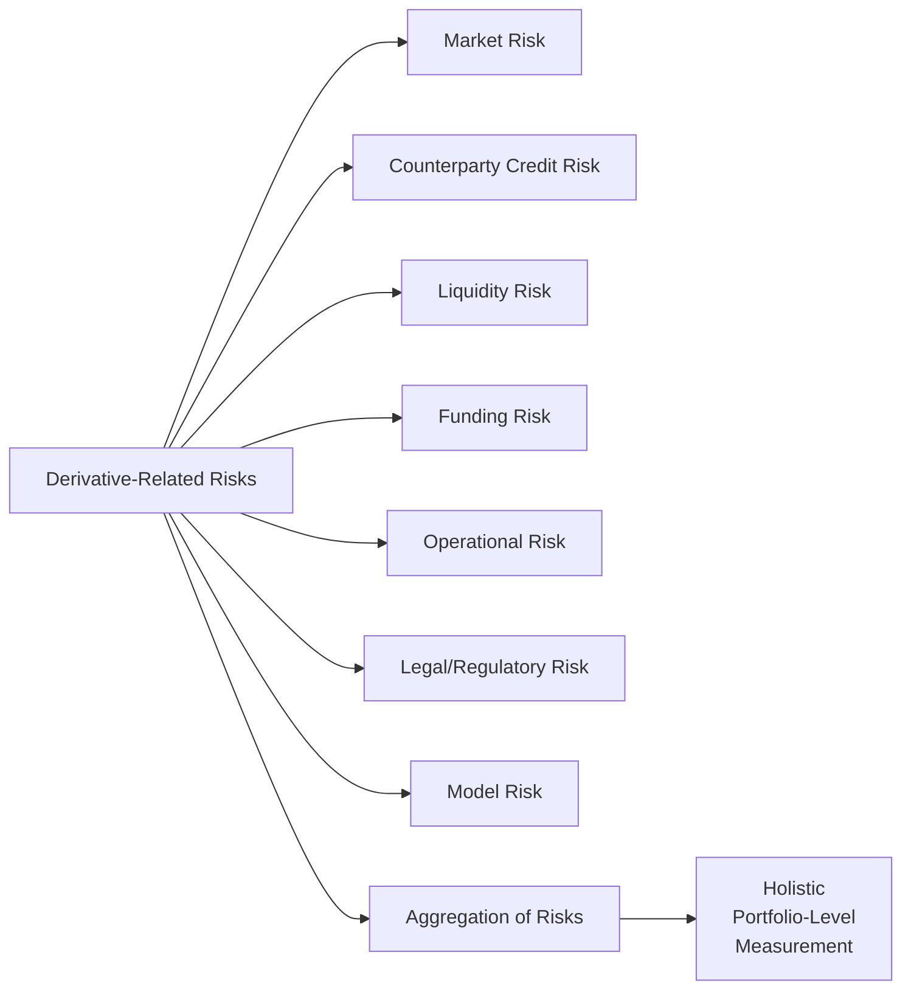

## Introduction

If my memory serves me right, the first time I ever encountered a derivative blow-up story, I was absolutely stunned. I remember thinking, “Wait—how can something that starts off so small and specialized cause such massive financial damage?” But that’s the nature of derivatives: They’re potent financial instruments, designed for a wide range of uses like risk management, speculation, and sometimes just plain old curiosity-driven trading. Yet with their potential to either hedge or amplify exposure, derivatives also bring a unique set of risks. It’s like driving a race car: you can go super fast, but you’d better make sure you know how to brake.

Below, we break down the major categories of derivative-related risks in a systematic way. We also examine best practices for measuring, monitoring, and mitigating those risks in portfolios. For the CFA Level I candidate (and, frankly, for every finance professional), it’s crucial to thoroughly understand these risks. After all, once we’re armed with the knowledge of what could go wrong, we’re in a much better position to stop those risks from becoming actual losses.

Before diving in, the main categories of derivative-related risks we’ll explore are:  
• Market Risk  
• Counterparty Credit Risk  
• Liquidity Risk  
• Funding Risk  
• Operational Risk  
• Legal/Regulatory Risk  
• Model Risk  
• Aggregation and Correlation of Risks  

Throughout, we’ll keep an eye on how these risks interrelate and how one might measure them in a holistic manner—especially important given the interconnected nature of many derivative portfolios. Let’s get started.

## Market Risk

Market risk is perhaps the most intuitive risk—changes in prices or rates can cause the value of a derivative to fluctuate significantly. That’s the bread and butter of derivatives. Because of leverage (and sometimes optionality), a relatively small move in the underlying asset can translate into an outsized change in a derivative’s payoff.

• Influence of Volatility: Derivatives often gain or lose value based on implied volatility in the market. If you’re holding an option, for instance, an unexpected spike in implied volatility might drive the option’s premium higher (good for the option buyer, not so good for the writer). On the other hand, if volatility tanks, option values might crumble.

• “Delta,” “Gamma,” and “Vega”: You’ve likely heard these terms—collectively known as “the Greeks”—when dealing with options. Though the specifics aren’t always tested at a deep quantitative level in Level I, it’s prudent to know that these parameters measure sensitivity to various market factors, such as changes in the underlying price (delta, gamma) or volatility (vega).

• Tail Events: The risk of large, unforeseen price moves (think Monday in October 1987 or the financial crisis in 2008) can easily outstrip risk estimates based on “normal” distributions. As you might have guessed, derivatives that carry embedded leverage can suffer disproportionate damage during such extremes.

In practice, many derivative traders use measures like Value at Risk (VaR) or scenario analysis to quantify market risk. VaR, for instance, indicates a potential loss over a specified time horizon at a given confidence level (e.g., 1% or 5%).

In KaTeX notation, a simplified model for VaR might look like:


\text{VaR} = \mu - z_{\alpha}\sigma


where:  
• \\(\mu\\) is the expected return of the portfolio (or trader’s P&L),  
• \\(\sigma\\) is the standard deviation of returns,  
• \\(z_{\alpha}\\) is the z-score corresponding to the chosen confidence level (e.g., \\(z_{0.05} \approx 1.645\\) for a one-tailed 95% confidence interval).

Realistically, though, this normal distribution approach might underestimate severe market events, so practitioners often rely on stress testing and scenario analysis to capture the possibility of extreme moves.

## Counterparty Credit Risk

When you enter an over-the-counter (OTC) derivative, you’re not just dealing with the underlying asset’s price changes. You’re also relying on your counterparty—the bank, dealer, or hedge fund on the other side—to honor the contract. If your counterparty fails (say, it declares bankruptcy or is otherwise unable to meet its payments), you might not receive the gains you’re entitled to. This is counterparty credit risk.

• Collateral and Margin: One common method to mitigate (but not eliminate) counterparty risk is posting collateral. By requiring counterparties to maintain margin accounts or pledge highly liquid assets, both sides have some insurance. If the derivative moves against one side, collateral calls are triggered to protect the other side.

• Netting Agreements: In large portfolios with multiple derivative contracts with the same counterparty, netting agreements allow gains on some instruments to offset losses on others. This reduces overall credit exposure. An International Swaps and Derivatives Association (ISDA) Master Agreement often includes netting provisions.

• Credit Support Annex (CSA): A CSA typically outlines detailed procedures on how and when collateral is posted or returned. For instance, a specific “threshold” might define the minimum exposure above which you’re required to post collateral.

• Potential Future Exposure (PFE): Instead of just looking at current mark-to-market (MTM) exposure, sophisticated models will forecast how the exposure could evolve over time, given volatility in the underlying.

## Liquidity Risk

Sometimes, derivative traders say that “liquidity risk is the silent killer.” After all, it’s not so loud or obvious until—bam—you need to exit your position (or post collateral) and you can’t find a ready buyer or seller at a fair price.

• Bid-Ask Spreads: This is a telltale sign of liquidity. Tight bid-ask spreads reflect a liquid market with plenty of buyers and sellers. If the market for a particular option or forward is wide and shallow, you may end up incurring large transaction costs or moving the market when you try to trade.

• Market Depth: A contract might look liquid during normal market conditions but can dry up when volatility spikes. So what’s “liquid” in a calm environment may not be so in a market panic.

• Exchange-Traded vs. OTC: Exchange-traded futures and options tend to have standardized terms and typically boast deeper liquidity. OTC derivatives can be custom-tailored, but they might not be as liquid, or they might rely on one or very few dealers making markets.

• Rollover Risk: If you have a position in a short-dated derivative product and it expires, you need liquidity to roll it forward. If the underlying market is illiquid at that point, you can face unexpectedly high costs or be unable to rollover at all.

## Funding Risk

Funding risk is all about whether you have the cash or eligible collateral to meet margin calls or settlement payments when required. It’s possible for a derivative position to be fundamentally profitable but still cause problems for you if it demands excessive margin at the wrong time.

• Variation Margin and Initial Margin: In the futures market, for example, your account is marked to market daily, and you might be required to post additional funds if your account falls below the maintenance margin. For OTC swaps, collateral rules from central clearing counterparties (CCPs) can also be demanding.

• Collateral Transformation: Sometimes, institutions hold assets that are not eligible as collateral. They might need to borrow or swap them for high-quality liquid assets (e.g., Treasuries). This adds an extra layer of complexity—and potential cost—particularly in times of market stress.

• Liquidity Mismatch: Even if you have the funds overall, a mismatch can arise between how quickly your derivative losses pile up and how quickly you can liquidate other assets (perhaps with big haircuts or selling constraints) to generate cash.

## Operational Risk

We can’t forget the behind-the-scenes machines, systems, people, and processes that facilitate derivative trading. Operational risk often stays in the shadows—until they manifest in a serious disruption.

• Technology Glitches: A popular example is when a risk management system or trading platform fails mid-trade. Maybe your servers freeze or there’s a coding bug in your automated hedging system. This might leave your positions exposed longer than intended, or cause order mismanagement.

• Settlement Errors: For physically settled forward contracts, late or incorrect delivery of the underlying asset can result in penalties. Paperwork problems or miscommunication between front, middle, and back offices can also lead to confusion or duplication.

• Process and Human Errors: Inadequate oversight of complex derivatives can let major problems go unnoticed. We’ve seen historical calamities in financial institutions triggered by unauthorized trades that managers simply didn’t spot in time.

• Cybersecurity Threats: Derivative markets are not immune to hackers. A well-timed cyberattack on an exchange or broker could compromise trade data or hamper your ability to post margin.

## Legal/Regulatory Risk

If you’re anything like me, you’ve probably skimmed a 200-page derivatives contract and wondered how attorneys do this for a living. Unfortunately, if you don’t pay attention to the fine print—or if regulations change midstream—you can be in for a rude awakening.

• Enforceability of Contracts: In certain jurisdictions, the legal enforceability of derivative contracts might be less robust than expected. Cross-border trades can complicate contract law, especially where local legal frameworks differ significantly.

• Regulatory Changes: Post the 2008 crisis, for example, the Dodd-Frank Act in the United States forced many OTC swaps to clear through central counterparties—this drastically changed how dealers and end users handle margin and reporting. Unexpected changes can introduce both cost and compliance challenges.

• Documentation Risk: ISDA Master Agreements and credit support annexes can be extremely detailed. Any ambiguities or insufficient detail can lead to disputes over settlement terms or termination clauses.

## Model Risk

Even the best theoretical models involve assumptions. If those assumptions break down (and they often do in real-world markets), the model’s outputs may become unreliable or downright misleading. Remember LTCM (Long-Term Capital Management) in the late 1990s?

• Incorrect or Overfitted Parameters: Using historical data to calibrate volatility or correlation might fail to capture future market dynamics. Perhaps your sample period excluded major tail events, so your model thinks they’re far less likely than they are.

• Complex Derivatives: Exotic derivatives like barrier options, rainbow options, or certain swaps might require specialized pricing models. These models can be highly sensitive to small input changes in volatility, correlation, or interest rates.

• “Volatility Smile” Effects: Standard Black–Scholes–Merton-based models assume constant implied volatility across strikes. Markets, however, exhibit a “volatility smile” or “volatility skew,” especially in equity markets. Failing to incorporate this effect can lead to mispricing—and risk exposures you didn’t intend to hold.

• Validation and Stress Testing: Best practice is to subject your models to an independent validation team that might run stress tests, compare model outputs with historical outcomes, and check the appropriateness of assumptions.

## Aggregation and Correlation of Risks

So, you have a portfolio of multiple derivative contracts, each with its own set of risk factors. But guess what? Those risks can correlate—and sometimes in non-intuitive ways—during market disruptions.

• Overlapping Exposures: Let’s say you’re long a currency forward on the EUR/USD pair and short a put option on an American tech stock. At first glance, those might look unrelated. But if a widespread shock leads to a “flight to safety,” the U.S. dollar might strengthen, affecting your currency forward, and a broad equity sell-off could also cause your short put to sink in value.

• Netting and Hedging: If you properly net out offsetting exposures, you might find your portfolio is actually balanced. But if you neglect cross-correlations, you might have more risk than you realize.

• Portfolio-Level Metrics: Tools like portfolio VaR, stressed VaR, or expected shortfall (a.k.a. Conditional VaR) help measure the combined risk across diverse derivative positions. The big lesson is to always measure risk at the portfolio level rather than just summing up individual derivative exposures.

Here is a simple Mermaid diagram illustrating how multiple types of risks flow into an aggregate risk framework:

## Managing Extreme Tail Risk

As a brief aside (though crucially important), extreme tail risk can cripple a derivative strategy. Traditional risk models might focus on “normal” or “mildly stressed” conditions. But historical market data reveals events that are well beyond 3 or 4 standard deviations happen more often than a normal distribution would predict.

• Stress Testing and Scenario Analysis: Construct hypothetical (but plausible) scenarios where markets move violently. For example, you might test how your portfolio behaves if interest rates spike by 200 basis points overnight, or if a major currency devalues by 15% in a single session.

• Skew Risk: In equity markets, significant downside moves are often accompanied by large spikes in implied volatility (a phenomenon known as “volatility skew” or “volatility smile”). So if you’re short options, your losses could be higher than a simple model suggests.

• Use of Protective Options/Structures: Sometimes, an effective way to guard against tail events is to include deeply out-of-the-money options that serve as portfolio “insurance.” While this can be costly, it may be worthwhile for investors needing a fail-safe.

## Practical Examples and Case Studies

• The 2008 Credit Crisis: Many institutions used credit default swaps (CDS) to hedge or speculate on subprime mortgage risk. When mortgage delinquencies soared, exposures were magnified, and the financial system recognized that counterparty credit risk had been severely underestimated. Large dealers required government bailouts. This fiasco underscored how derivative risk can spill over widely.

• The “London Whale”: In 2012, a trader at JPMorgan took on massive positions in credit derivatives, leading to billions in losses. This event highlighted model risk (the bank’s internal models underestimated potential losses), combined with operational risk (lack of oversight) and liquidity risk (unwinding such big positions was extremely difficult).

• LTCM (1998): Long-Term Capital Management’s collapse was partly due to model risk (their pricing and hedging strategies didn’t anticipate the Russian default and resulting global flight to quality) and leverage. The correlation assumptions were fine—until they weren’t.

## Best Practices and Strategies for Mitigation

So how do we handle all these risks without losing our sanity?

• **Comprehensive Risk Framework**: Use integrated enterprise risk management systems that measure exposures across all derivatives, and incorporate robust stress testing.

• **Dynamic Margin Control**: Keep a liquidity buffer. You never want to be forced to liquidate at terrible prices just because you can’t meet a margin call.

• **Legal Diligence**: Ensure documentation (ISDA Master Agreements, netting clauses, and CSAs) is robust across jurisdictions, especially for cross-border trades.

• **Independent Model Validation**: Don’t rely on the same desk that builds the model to sign off on its accuracy. Independent risk teams or even external consultants can lessen model risk.

• **Regulatory Compliance**: The post-2008 period has seen increased focus on transparency, central clearing, and standardized reporting. Be proactive—stay updated on potential changes to rules that might impact your derivative positions.

• **Limit Concentration and Correlation**: If your portfolio is heavily concentrated in a single asset class or correlated exposures, you open yourself to big hits from a single market event.

## Exam Relevance and Final Tips

On the CFA Level III exam, you might see item sets or mini case scenarios describing a portfolio containing multiple derivatives. They’ll ask how to measure the combined exposures, or how to handle a counterparty nearing default. You might have to propose a hedge, a type of margin arrangement, or question a set of assumptions in a given risk model. When tackling these questions:

• Identify All Major Risk Factors: Marking just “market risk” is rarely enough. They might specifically want you to note liquidity, counterparty, or model risk.  
• Tie It to Portfolio-Level Impacts: They could ask how one derivative might offset or exacerbate the risk of another.  
• Show Practical Understanding: Demonstrate knowledge of how margin calls, ISDA netting, or collateralization mitigate risks (or are compromised if not administered properly).  
• Keep an Eye on Regulation: Don’t forget about regulatory constraints or capital requirements when describing risk management solutions.

A best practice for exam preparedness? Review prior question types for derivatives risk management. Practice constructing short-answer or essay responses that integrate multiple risk categories and thoroughly explain your reasoning with references to real events or standard risk frameworks (like VaR, stress tests, or scenario analyses).

## References

• Bank for International Settlements (BIS) Publications on Counterparty Risk  
• Hull, John C. “Risk Management and Financial Institutions.”  
• International Swaps and Derivatives Association (ISDA) Guidelines and Documentation  
• CFA Institute Official Curriculum, Derivatives Sections  
• Handbooks on Stress Testing and Scenario Analysis (Various Resources)

------

## Derivative Risk Mastery Quiz



### Which of the following best describes operational risk in the context of derivatives trading?

- [ ] Risk associated with interest rate fluctuations negatively impacting bond futures.
- [x] Risk stemming from inadequate internal controls, technology breakdowns, or human errors.
- [ ] Risk associated with the default of a counterparty.
- [ ] Risk that the transaction cannot be easily unwound at a reasonable price.

> **Explanation:** Operational risk involves losses from system failures, settlement errors, flawed processes, and inadequate internal controls. Though it’s often overlooked, it can lead to severe losses.

### What is the primary purpose of collateral in an OTC derivative contract?

- [x] To reduce counterparty credit risk by ensuring funds are available to cover large adverse movements in the contract’s value.
- [ ] To provide immediate profit to the derivative buyer.
- [ ] To eliminate all market risk exposures.
- [ ] To resolve any legal disputes regarding the settlement price.

> **Explanation:** Collateral postings protect both parties by reducing the net credit exposure should the market move against one side or if the counterparty defaults.

### Liquidity risk in derivatives most directly refers to:

- [ ] The inability to find a creditworthy counterparty.
- [ ] Using the wrong assumptions in pricing models.
- [ ] Variations in everyday margin requirements.
- [x] The difficulty of unwinding or closing a position at or near its fair value without causing a drastic price movement.

> **Explanation:** Liquidity risk is about market depth and the potential cost (or impossibility) of exiting a position quickly. It can manifest in wide bid-ask spreads or a lack of market participants.

### All of the following help mitigate counterparty credit risk for OTC derivatives except:

- [ ] Posting collateral as outlined in a Credit Support Annex (CSA).
- [x] Utilizing uncollateralized bilateral agreements without netting arrangements.
- [ ] Central clearing through a clearinghouse.
- [ ] Netting agreements that reduce exposure to the net of gains and losses across multiple contracts.

> **Explanation:** Uncollateralized bilateral agreements without netting provisions can increase counterparty risk rather than mitigate it.

### Which of the following is commonly used to measure market risk in the context of derivative instruments?

- [x] Value at Risk (VaR).
- [ ] Beta measurements relative to a market index.
- [ ] Sharpe ratio.
- [ ] Alpha, as defined in CAPM methodologies.

> **Explanation:** VaR is a widely used statistical measure for market risk, estimating potential losses given certain probabilities and a time horizon.

### Model risk can arise when:

- [ ] The risk-free rate remains stable throughout the life of the derivative.
- [x] Critical incentives, assumptions, or parameters within a pricing model are flawed or misapplied.
- [ ] A clearinghouse steps in to handle default risk for exchange-traded derivatives.
- [ ] The contract is governed by a robust legal framework under the ISDA Master Agreement.

> **Explanation:** Model risk primarily results from incorrect assumptions or parameters leading to mispricing and erroneous risk assessments.

### A severe spike in implied volatility during a market downturn would most directly impact which of the following?

- [ ] Futures on interest rates.
- [x] Options premiums (calls and puts).
- [ ] Variations in the risk-free rate.
- [ ] Commodity swaps with fixed payments.

> **Explanation:** Implied volatility directly affects the premiums of options, making them more expensive. A sharp jump in volatility will especially increase the prices of out-of-the-money options.

### A stress test in the context of derivative risk management typically involves:

- [x] Simulating harsh market conditions to evaluate potential portfolio losses.
- [ ] Calculating real-time variation margin using normal distributions.
- [ ] Ensuring each trade is executed on an exchange to minimize legal risks.
- [ ] Checking for daily settlement errors internally.

> **Explanation:** Stress tests simulate extreme but plausible market scenarios (e.g., large interest rate and currency swings) to see how the portfolio would perform.

### Funding risk primarily materializes when:

- [ ] The clearinghouse rejects the posted collateral.
- [x] An investor lacks the cash or assets required to meet margin calls or settlement obligations.
- [ ] Government regulations invalidate the derivative contract.
- [ ] The underlying itself has no market depth.

> **Explanation:** Funding risk is the risk that you cannot raise the necessary funds promptly to meet capital or margin requirements, even if your portfolio is fundamentally sound longer-term.

### True or False: Legal and regulatory risk only poses a minor concern for global OTC derivatives traders who use ISDA Master Agreements.

- [x] True
- [ ] False

> **Explanation:** Although an ISDA Master Agreement is considered a robust framework, legal and regulatory risk can still be quite significant. Cross-border transactions, local jurisdictional laws, and potential future regulatory changes expose traders to lawsuits, contract enforceability issues, and compliance complications.


