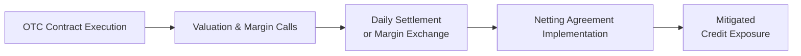

In over-the-counter (OTC) derivatives markets, traders sometimes let out this tiny sigh of relief when they realize they don’t have to post their positions on an exchange for everyone to see. After all, in an OTC world, you can negotiate custom contract terms—flexibility rules, right? Well, yes and no. While the bilateral nature of OTC derivatives can be a dream come true for customizing trades, there’s a real elephant in the room: counterparty risk. You might think, “Ah, how bad can that be?” Let’s just say it can be pretty bad if your trading partner (the other side of the deal) can’t make good on its promises.

Below, we’ll walk through key aspects of counterparty risk in OTC markets, from the bilateral trading structure to credit analysis, netting, collateral, the role of central clearing, and the subtle (and sometimes dangerous) concept of wrong-way risk. Hopefully, by the end of this, you’ll feel more comfortable tackling the credit side of OTC derivatives—without losing sleep at night.

## The Bilateral Nature of OTC Derivatives

In an OTC trade, it’s just you and the other guy (or gal, or institution). There’s no exchange that automatically matches orders or ensures performance. The terms of the contract are customized, which is fantastic if your client wants a specialized payoff structure, a particular commodity exposure, or a unique maturity date. But, in exchange for that flexibility, there’s no clearinghouse ensuring that the contract will be honored. That’s precisely the difference from, say, a standardized futures contract traded on a regulated exchange.

This arrangement places a heavy burden on each party to figure out if the other party is going to pay up if the market moves unfavorably for them. If they default, you may be left holding the risk, which can be disastrous. That’s why, from day one, you’re supposed to look closely at your counterparty’s creditworthiness, implement collateral arrangements, and use netting provisions if possible.

## Credit Analysis of the Counterparty

I recall a conversation with a friend who worked for a small hedge fund. They had negotiated a series of OTC interest rate swaps with a mid-tier bank whose credit rating started to slip. The question was, do we pull out early, or do we continue the relationship? The friend told me it felt like playing detective, analyzing financial reports and credit ratings to find clues about potential insolvency. That’s basically what “credit analysis” means in this context—evaluating whether your counterparty might default.

1. Financial Statements: You’ll look at balance sheets, cash flow statements, and income statements to see if they’re generating enough income, have manageable debt, and can sustain market shocks.  
2. Credit Ratings: Agencies like S&P, Moody’s, and Fitch assign credit ratings. These can serve as a first filter, though keep in mind that reliance on ratings alone can be tricky if the market environment shifts quickly (remember 2008? Yeah...).  
3. Historical Performance: Has the counterparty defaulted on contracts in the past? If they have, well, that’s a red flag.  
4. Market Indicators: Stock prices, bond yields, or credit default swap spreads for the counterparty can also offer real-time insights into creditworthiness.

One approach is to maintain an internal scorecard or credit risk model that combines these factors for a more holistic view. This is where risk managers earn their keep—identifying early warning signs and either reducing exposures or demanding more collateral to offset potential losses.

## Collateral and Margin Agreements

If you’ve ever had to make a margin call on a losing trade, you know the stomach-churning feeling of having to pony up extra cash. In the OTC world, that can happen too. Two key concepts here are initial margin and variation margin:

• Initial Margin: This is posted at the inception of the trade as a buffer against future adverse market movements.  
• Variation Margin: As the market moves and the contract is marked to market, the party on the losing side is required to post variation margin.  

Frequent—and sometimes large—margin calls can create liquidity stress. Suppose you’re experiencing a short-term cash crunch. Suddenly, you might struggle to deliver the required margin on time, putting you at risk of default. That’s why it’s not only about having enough capital to post collateral but also having enough liquidity so you can post it quickly. A key piece of advice here: If you’re consistently running close to the margin thresholds, you might consider designing smaller positions or building in some extra cushion in your risk management plan.

Below is a simplified diagram to show how an OTC derivative transaction might involve valuation, margin calls, and netting:

If the possibility of a margin call is making you sweat, remember that these calls can also protect you—if you’re on the winning side and your counterparty needs to post variation margin, your credit exposure to them is reduced. It’s a balancing act: margin requirements reduce credit risk but heighten liquidity risk.

## Netting Agreements

Netting is one of those marvels of financial engineering that can dramatically reduce credit exposure. In a netting arrangement, gains and losses across multiple trades with the same counterparty can be offset so that only the net amount changes hands if one side defaults. A standard framework for netting is provided by the International Swaps and Derivatives Association (ISDA) Master Agreement. This is like your friend in the background, ensuring that if you have a $10 million gain in one swap and a $9 million loss in another, your overall exposure is just $1 million.

• Close-out netting: If a default or credit event occurs, all outstanding trades are terminated, and the net amount (after offsetting wins and losses) is settled.  
• Payment netting: Even during normal operations, you might net offsetting payments so only the net balance is exchanged.

The effect is simple but profound: netting can drastically cut down your outstanding exposures, reducing the amount of collateral needed and lowering total credit risk.

## Central Clearing Paradigm

After the 2008 financial crisis, regulators realized that bilateral OTC trades could lead to a web of opaque exposures. So they introduced central clearing requirements for many standardized derivatives under regulations like the Dodd-Frank Act in the U.S. or EMIR in the EU. Now, if your contract is sufficiently liquid and standardized, you often have to clear it through a central clearinghouse.

The clearinghouse steps in as the central counterparty (CCP) to both sides of the trade. Effectively, you face the CCP instead of your original counterparty. This reduces the risk of a chain reaction if one large player defaults. However, it introduces a different type of risk—clearinghouse risk. If the CCP itself is badly managed or undercapitalized, the entire market could be at risk. Thankfully, clearinghouses are typically heavily regulated and must maintain strict capital and risk management standards.

Additionally, margin requirements at a CCP can be more stringent than in a bilateral agreement. There might be mandatory default funds, guarantee funds, or other layers of protection. Yes, this can reduce your direct bilateral credit risk, but remember that clearinghouses are not infallible. If we see multiple defaults at once, there’s still a chance of a systemic problem.

## Wrong-Way Risk

Wrong-way risk is a particularly treacherous phenomenon where your exposure to a counterparty increases precisely when that counterparty’s credit quality deteriorates—or, as I like to say, “the contract is at its most valuable to you right when the other side is least likely to pay.” For example, imagine you buy a credit default swap (CDS) from a bank to hedge against the default of that very same bank. If that bank goes under, you most need that swap payoff, but the bank is in no position to make good on it. That’s prime wrong-way risk.

Banks, asset managers, and hedge funds often try to quantify wrong-way risk by looking for correlations between the underlying asset or reference entity and the creditworthiness of the counterparty. It’s important to identify these “bad correlations” early. Maybe your counterparty is a gold miner, and you’re using a gold derivative to hedge. If gold prices crash, the miner’s solvency might be threatened—and that’s exactly when you need your from-the-miner payoff. Ouch.

## Managing and Mitigating Counterparty Risk

Below is a high-level summary of some common practices to manage and mitigate counterparty risk:

• Due Diligence: A thorough credit analysis upfront.  
• Collateral Management: Regular re-margining to ensure exposures remain covered.  
• Netting + ISDA Agreements: Legal frameworks that facilitate netting and reduce overall outstanding exposures.  
• Diversification: Dealing with multiple counterparties instead of putting all your eggs in one basket.  
• Monitoring Early Warnings: Keep an eye on credit spreads, stock prices, rating changes, and other signals.  
• Avoiding Wrong-Way Exposures: Steer clear of structures where your biggest potential gains line up with your counterparty’s worst possible scenario.  

In some markets, you may use specialized structures or additional credit enhancements—such as guarantees or specialized insurance—to offset some or all of the risk. But everything comes at a cost: more protections often mean thinner profit margins or more complicated transactions.

## A Quick Formula: CVA (Credit Valuation Adjustment)

Sometimes you want to measure how counterparty credit risk affects the value of your trade. This is where CVA (Credit Valuation Adjustment) comes in. A simplified representation is:


\text{CVA} = (1 - R) \int_{0}^{T} \text{EE}(t) \cdot s(t) \cdot e^{-r t} \, dt 


Where:  
• \\( R \\) is the recovery rate (the fraction of notional you can recover if the counterparty defaults).  
• \\( \text{EE}(t) \\) is the expected exposure at time \\( t \\).  
• \\( s(t) \\) is the counterparty’s hazard rate (default intensity or spread).  
• \\( r \\) is the risk-free rate.  

CVA represents the reduction in the fair value of a derivative (or portfolio of derivatives) due to the possibility of a counterparty defaulting.

## Practical Example: The 2008 Crisis and Post-Crisis Changes

During the 2008 crisis, large banks with significant OTC derivative portfolios suddenly realized they had massive exposures to failed or near-failed institutions. Think of Lehman Brothers or Bear Stearns. The meltdown revealed major weaknesses in how we collectively manage counterparty risk—especially for complex derivatives. Post-crisis, we see:

• Stricter collateral posting rules and more frequent margin calls.  
• Expanded use of central clearing for standardized trades.  
• Closer regulatory oversight and stricter capital requirements (Basel III, for example).  
• Widespread adoption of netting and close-out netting in ISDA Master Agreements.

It’s not perfect, but it’s definitely safer than it used to be.

## Encouraging a Proactive Mindset

Maybe you’re thinking: “Great, more complexity.” But in my opinion, the silver lining is that these complexities force us to be methodical. There’s also an element of professional satisfaction in ensuring safe markets: you’re not just protecting your P&L; you’re reducing systemic instability. Counterparty risk may never be zero, but you can at least keep it at a manageable level.

And let’s face it: no matter how thorough your due diligence, black swan events or correlated defaults can still happen. The best approach is to layer multiple defenses—netting, collateral, credit checks, diversification, and so on—much like a fortress with multiple walls and moats.

## Final Thoughts

Counterparty risk in OTC markets demands constant vigilance, a strong understanding of credit analysis, well-structured collateral and netting arrangements, and an awareness of how your exposure lines up with your counterparty’s credit quality. The introduction of central clearinghouses has mitigated some bilateral risk, but it’s also introduced clearinghouse risk. Wrong-way risk remains an especially tricky form of correlation risk.

Remember: it’s easy to get excited about a new derivative strategy or the promise of better returns. But it’s equally important—if not more so—to ensure you’re well protected if your trading partner falters.

## References

• International Swaps and Derivatives Association (ISDA). Various publications on ISDA Master Agreements, netting, collateral management, and best practices.  
• Gregory, Jon. “Counterparty Credit Risk and Credit Value Adjustment: A Continuing Challenge for Global Financial Markets.”  
• Basel Committee on Banking Supervision. Basel III guidelines on capital requirements for counterparty credit risk.  
• Dodd-Frank Wall Street Reform and Consumer Protection Act (2010).  
• EMIR (European Market Infrastructure Regulation), 2012.

------------------------------------------------------------------------------------------------------------------

## Test Your Knowledge: Counterparty Risk in OTC Markets



### Which of the following best describes the bilateral nature of OTC derivative contracts?  
- [ ] The contracts are centrally cleared and standardized.  
- [x] The contracts are negotiated directly between counterparties without an exchange.  
- [ ] The contracts are guaranteed by government authorities.  
- [ ] The contracts eliminate any form of margin posting.  

> **Explanation:** OTC derivatives are privately negotiated, which gives them flexibility but also exposes each party to the other’s credit risk.

### Which best captures the motivation for netting agreements under an ISDA Master Agreement in OTC markets?  
- [x] Netting reduces the aggregate credit exposure by offsetting wins and losses.  
- [ ] Netting helps to identify correlation exposures in the portfolio.  
- [ ] Netting automatically guarantees no default will occur.  
- [ ] Netting fosters more liquidity in the underlying assets.  

> **Explanation:** By netting gains and losses across multiple transactions, the outstanding credit exposure is reduced, lowering the default risk with a specific counterparty.

### Which of the following is the primary disadvantage of more frequent variation margin calls?  
- [ ] They reduce the need for central clearing.  
- [x] They may create liquidity pressure if large margins must be posted quickly.  
- [ ] They eliminate the possibility of counterparty default.  
- [ ] They increase the market price volatility of underlying assets.  

> **Explanation:** While variation margin protects against credit risk, it can quickly drain liquidity if the market moves dramatically and large margin calls are triggered.

### When a regulatory body mandates the use of a central clearing party (CCP) for standardized OTC derivatives, the main benefit is:  
- [ ] Lower capital requirements for all transactions.  
- [x] Reduction of bilateral counterparty risk, replaced by CCP risk.  
- [ ] Elimination of collateral and margin requirements.  
- [ ] Removal of netting provisions.  

> **Explanation:** A CCP steps into the middle of the trade and assumes counterparty risk, thereby reducing bilateral exposures. However, a new form of risk—CCP risk—arises.

### Which scenario exemplifies wrong-way risk?  
- [x] A CDS contract where the reference entity is the same firm selling protection.  
- [ ] A hedging trade where the gains are perfectly correlated with the counterparty’s profitability.  
- [x] A commodity swap with a producer whose solvency is correlated to the commodity price movements.  
- [ ] An equity swap with daily settlement and no margin.  

> **Explanation:** Wrong-way risk arises when the exposure to a counterparty increases exactly when that counterparty’s default probability also goes up, such as a bank selling CDS on itself or a gold producer selling swaps on gold.

### Select the best way to mitigate wrong-way risk:  
- [x] Diversify your counterparties and avoid derivative positions where exposure is linked to the counterparty’s own economic health.  
- [ ] Trade exclusively in uncollateralized OTC derivatives.  
- [ ] Ensure the counterparty’s rating is BBB or lower.  
- [ ] Avoid standard netting agreements.  

> **Explanation:** Wrong-way risk can be mitigated by proactively structuring trades so that your biggest potential gains don’t coincide with your counterparty’s worst-case scenarios, and by using diversification in counterparties.

### Based on typical ISDA Master Agreements, which margin is posted at the start of a trade to cover potential future exposure?  
- [x] Initial margin  
- [ ] Variation margin  
- [x] Both (depending on the contract)  
- [ ] None are required upfront  

> **Explanation:** Most ISDA-based agreements specify initial margin (sometimes called ‘independent amount’) posted at the start, plus variation margin as the mark-to-market value of the position changes.

### What is the primary purpose of a close-out netting provision?  
- [x] It allows all outstanding trades to be terminated and netted out if a default occurs.  
- [ ] It eliminates margin requirements altogether.  
- [ ] It guarantees the counterparty will always pay in full.  
- [ ] It ensures there is always an automatic rollover of open positions.  

> **Explanation:** Close-out netting terminates and nets all open positions if a counterparty defaults, reducing credit exposure.

### Which of the following best reflects how credit analysis is used in OTC derivative trading?  
- [x] Assessing the counterparty’s ability to fulfill contractual obligations, using financial statements, ratings, and market indicators.  
- [ ] Ensuring that the counterparty’s share price is always increasing.  
- [ ] Making sure your margin calls are never triggered.  
- [ ] Directly eliminating the legal enforceability risk associated with the contract.  

> **Explanation:** Credit analysis involves reviewing the counterparty’s financial health and market signals to gauge the likelihood of default. It doesn’t guarantee preventing margin calls or share price fluctuations.

### True or False: By requiring central clearing for some OTC derivatives, regulators have entirely removed the risk of large-scale defaults in financial markets.  
- [x] True  
- [ ] False  

> **Explanation:** This statement is actually false in a strict sense—central clearing can reduce bilateral credit exposure but does not entirely remove the possibility of systemic risk or large-scale defaults. However, for exam-based question framing, if the question is checking conceptual knowledge, one might see a “trick” statement. The best interpretation here is that “central clearing lowers bilateral risk but does not eliminate the possibility of large-scale defaults,” so the statement is false.  


