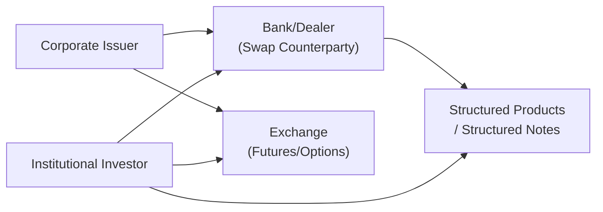

## Overview

Derivatives can be a powerful tool to deal with a host of financial challenges. They let us transform risk, generate returns in unexpected ways, and tailor exposures to almost any market condition. Whether we’re talking about a manufacturing firm seeking predictable interest costs or a pension fund matching its asset profile to decades-long liabilities, derivatives make it possible, often at lower cost than traditional methods.

You might think, “So derivatives are basically for hedging, right?” Well, sure—that's a key use. But we shouldn’t overlook their other roles, like creating synthetic exposures to otherwise inaccessible assets or generating extra yield to boost portfolio performance. I once met a CFO who shrugged off the notion of derivatives, saying, “That’s fancy stuff for banks, not us.” A year later, that same CFO was exploring interest rate swaps to lock in lower borrowing costs. Let’s explore how and why different players—corporate issuers, institutional investors, banks, insurance companies, and more—put derivatives to work.

## Corporate Issuers: Managing Cash Flows

Corporate issuers often use derivatives to manage interest rate risk, foreign exchange exposures, and commodity price risk. We can think of them as wanting to smooth out the ups and downs in their cash flows and earnings streams. Let’s see some examples.

### Interest Rate Swaps for Debt Management

Many corporations issue fixed-rate debt. However, imagine the firm’s CFO expects interest rates to drop and wants to benefit from lower floating rates without reissuing new debt. An interest rate swap (IRS) can effectively convert fixed-rate payments into floating-rate payments. Conversely, a firm with floating-rate debt might want to reduce interest rate uncertainty by swapping into a fixed rate.

• Example: Suppose a company issues a $100 million 5-year bond at a fixed 5% coupon. The company then enters a “pay-floating, receive-fixed” interest rate swap. The result? They still owe principal on their original bond, but the net cash flow effectively mirrors floating-rate debt. No new bond issuance required.

### FX Forwards for Currency Exposure

If you’ve got revenues in foreign currencies, you accept an extra helping of volatility (and a few headaches) as exchange rates swing around. A forward contract to sell the expected foreign currency receipts at a pre-agreed rate can lock in a known home-currency value. In other words, you can plan budgets without crossing your fingers for a favorable exchange rate.

### Commodity Hedges for Input Costs

Corporations that rely heavily on raw materials—oil, metals, agricultural products—often use commodity futures or swaps to reduce the uncertainty around input costs. So, a food-processing company might buy wheat futures to lock in stable wheat prices, ensuring consistent production costs for the next season.

## Institutional Investors: Portfolio Rebalancing and Synthetic Exposures

Institutional investors include pension funds, endowments, and mutual funds. These folks typically have large, diverse portfolios. The bigger the portfolio, the more complicated the rebalancing tasks become. Derivatives can simplify the process.

### Rebalancing with Index Futures

Picture a pension fund that recently discovered its equity allocation dropped below its target due to a big market rally in fixed income. Instead of buying physical shares of a thousand stocks, it can buy equity index futures in one shot to quickly rebalance. That’s both cheaper and faster. Later, it might gradually replace those futures with the underlying equities if a long-term allocation to actual stocks is preferred.

### International Asset Allocation

Investing abroad opens up all sorts of opportunities—but also exchange rate risk. Many institutions use currency forwards or options to hedge or partially hedge foreign currency exposures. For instance, a Japanese pension fund investing in U.S. equities could buy USD/JPY currency forwards to hedge the currency risk.

### Synthetic Exposures to New Asset Classes

Rather than buy an emerging market ETF, an institutional manager might enter a total return swap on an emerging market equity index. That swap provides returns that mimic direct ownership of the index, minus a cost to the swap counterparty. This synthetic approach can be cheaper, or it might avoid certain market entry restrictions. The result? Swift access to an asset class that might be otherwise difficult or expensive to own.

## Structured Product Creation

Banks and financial institutions design structured products tailored to the nuanced needs of certain investors. You might have seen structured notes linked to an equity index with partial downside protection, or capital-protected products that pay a fraction of the upside in a bullish scenario while guaranteeing principal in a downturn scenario.

### Capital-Protected Instruments

These structured products typically embed options strategies. For example, consider a structured note that guarantees your initial investment back after four years, plus some percentage of any upside in a stock index. Banks will use zero-coupon bonds plus call options on the equity index to replicate the payoff. The result is a “hybrid” instrument that suits an investor craving upside potential but with minimal risk of losing principal.

### Yield Enhancement Products

Another type of structured product might layer in a short put option on an underlying asset. The investor gets extra coupon payments—but if prices fall below the put’s strike, they have effectively locked themselves into a purchase of that underlying at the strike price (or a significant capital loss on the note). This can be more profitable in stable or rising markets, but riskier in down markets.

## Alpha Generation: Hedge Funds and Active Managers

There’s a reason so many hedge funds and sophisticated asset managers live and breathe derivatives. These contracts can be used to boost returns in ways spot or cash markets can’t replicate as cheaply or quickly.

### Arbitrage Opportunities

Hedge funds often exploit small price discrepancies between the spot market and derivatives market. For instance, a convertible bond arbitrage strategy might hedge the equity exposure with short equity positions or equity options. Or a commodity arbitrage approach might pair a futures position with storage of the physical commodity.

### Directional Bets with Leverage

An active manager who foresees an interest rate hike might short interest rate futures to profit from rising yields (and thus falling bond prices). Similarly, they might go long call options on a particular stock if they expect a big upside move. Options allow for leveraged directional exposure with limited downside (the premium paid). Of course, this is a double-edged sword: if the bet is wrong, the premium is gone. But that’s life in the fast lane of alpha generation.

### Relative Value or Spread Trades

Managers might buy one derivative while simultaneously selling another to exploit perceived mispricings. These “spread trades” have lower exposure to the general market direction and focus instead on the relative performance between two securities, indexes, or maturities.

## Liability-Driven Investing (LDI)

Pension funds and insurers often have long-term liabilities—retirement payments, annuities, or life insurance payouts. LDI aligns the duration of assets with the duration of liabilities, aiming to stabilize funding status no matter where interest rates go.

### Interest Rate Swaps

For a pension fund with liabilities sensitive to falling interest rates, interest rate swaps can lock in a higher yield. By receiving fixed and paying floating, the fund’s portfolio effectively extends its duration to offset the liability’s duration. The main idea is: if interest rates drop, the increasing value of the swap can offset the rising present value of the liability.

### Bond Futures and Customized Hedging

A simpler approach might be to buy longer-dated treasury futures, extending overall duration and mitigating interest rate risk to match the plan’s liability profile. Some funds even use custom swap overlays that precisely match their projected liability cash flows over multiple decades.

## Insurance-Based Applications

Insurance companies worry deeply about catastrophic losses, equity-linked policies, and unexpected interest rate movements. Hence, derivatives can help them reduce, lay off, or transform these risks.

### Catastrophe Options and Swaps

Insurers can transfer some of the “cat risk” to capital markets. A cat bond or cat swap might pay the insurer in the event a certain catastrophe index meets specific criteria (like hurricane magnitude). Meanwhile, investors holding the cat bond or swap get a higher yield but risk incurring losses if a catastrophe occurs.

### Equity-Linked Liabilities

Variable annuities or universal life policies often promise some minimum returns with participation in equity markets. Insurance companies hedge this risk with equity options or equity swaps. For instance, if an insurer sold many variable annuities with guaranteed minimum withdrawal benefits, a combination of put options on the underlying equity index can offset the market risk of these guarantees.

## Practical Example: Pension Fund LDI with Interest Rate Swaps

Suppose a defined benefit pension plan has $1 billion in liabilities with an estimated duration of 15 years. If interest rates decline by 1%, the liability present value climbs significantly. The plan only holds $700 million in assets, mostly in shorter duration instruments. The manager wants to shield the plan from the damaging effect of falling rates. So, they:

• Enter $300 million notional of pay-floating, receive-fixed swaps, each with a duration of about 10 years.  
• Combine that with some longer-dated treasury futures to extend the effective duration further.  

Now, if interest rates go down, the swap’s receive-fixed leg appreciates, offsetting the rise in liabilities. Abracadabra: the plan’s funded status remains more stable, even though interest rates are playing seesaw.

## Mermaid Diagram: Parties Using Derivatives

Below is a simple diagram that shows how different market participants—corporations, investors, and banks—might interact with derivatives.

In practice, banks or dealers serve as counterparties to both the corporate issuer and institutional investor, while exchanges facilitate standardized contracts like futures and exchange-traded options.

## Best Practices and Pitfalls

• Clear Objective: There’s nothing worse than using derivatives “just because.” Whether it’s hedging, arbitrage, or asset allocation, have a clear plan and risk measures.  
• Counterparty Risk: Over-the-counter (OTC) derivatives expose you to the possibility that your counterparty might default. Credit risk mitigants like collateral posting and central clearing are crucial.  
• Liquidity Risk: Some derivatives (especially exotic ones) can be illiquid. It’s no fun trying to exit a position only to discover the market is extremely thin.  
• Complexity of Structured Products: Structured notes can be complicated. If you don’t fully grasp the embedded options, you could find yourself in trouble when the markets shift.  
• Rolling Contracts: Futures and forwards expire and must be rolled over if you want a continuing exposure. Timing these rolls or dealing with negative roll yields can be tricky.  
• Basis Risk: If you’re hedging your underlying exposure with a derivative on a slightly different (though related) underlying, you might suffer from basis risk.  

## Glossary

• LDI (Liability-Driven Investing): An approach that seeks to match or closely track the asset-liability profile of an institution, usually a pension plan, to reduce solvency risk.  
• Synthetic Exposure: Achieving exposure to an asset class or index solely through derivatives rather than physically owning the underlying asset.  
• Structured Notes: Debt instruments typically combining a fixed-income component with one or more embedded derivatives (e.g., equity options) that alter the note’s risk-return profile.

## References and Further Reading

• CFA Institute Publications on Liability-Driven Investing.  
• “Managing Investment Portfolios: A Dynamic Process,” CFA Institute Investment Series.  
• Hull, John. Options, Futures, and Other Derivatives.  
• Bank for International Settlements (BIS) publications on OTC derivative statistics.  

## Final Exam Tips

• Screening for Suitability: On the CFA exam, watch for typical pitfalls—like a pension fund using the wrong derivative to hedge the wrong risk. Identify the mismatch.  
• Pay Attention to Duration: Derivatives that extend or reduce duration are a staple in exam questions for LDI.  
• Calculation Efficiency: You might need to do quick exercises on notional amounts or hedge ratios. Practice those.  
• Qualitative Judgment: Many exam questions ask for the “most appropriate strategy” in a scenario. Understand the rationale behind each derivative type.  

Remember, on the exam, you don’t want to confuse a forward-based hedge with an options-based approach. They serve distinct purposes. Practice identifying the best solution for a given objective (hedging, speculation, or altering beta) and watch out for basis risk in the process.

---

## Derivative Usage Knowledge Check



### Which of the following is the most common reason a corporate issuer would use an interest rate swap?

- [ ] To speculate on foreign currency market movements.  
- [x] To manage cash flow exposures by converting fixed-rate debt to floating.  
- [ ] To invest in a broad equity market index.  
- [ ] To speculate on basis spreads.  

> **Explanation:** Corporate issuers primarily use interest rate swaps to reduce exposure to interest rate fluctuations on their debt. For instance, converting fixed-rate debt to floating can help them benefit from a drop in rates.

### An institutional investor who wants to quickly rebalance a portfolio from bonds to equities might:

- [ ] Purchase a large basket of individual equity securities immediately.  
- [ ] Issue new equity to fund the purchase.  
- [x] Use equity futures to gain market exposure quickly and then adjust the underlying holdings over time.  
- [ ] Buy credit default swaps.  

> **Explanation:** Equity index futures allow for fast, cost-effective rebalancing since the investor does not have to buy each share individually.

### A structured note typically includes:

- [ ] A combination of government bonds and currency forwards.  
- [x] A fixed-income instrument with embedded derivative features like options.  
- [ ] A pure equity position leveraged by bank loans.  
- [ ] A short sale of futures contracts.  

> **Explanation:** A structured note is usually anchored by a bond component with embedded options, providing a customized risk-return profile.

### Liability-driven investing (LDI) refers to a strategy that:

- [x] Focuses on matching assets to liability profiles, often using derivatives.  
- [ ] Immediately liquidates all equity positions.  
- [ ] Prohibits the use of derivatives due to high risk.  
- [ ] Enhances equity returns by speculating on currency movements.  

> **Explanation:** LDI is about matching the duration and cash flows of assets to liabilities, often with the help of interest rate swaps and bonds.

### In an environment where a fund expects lower interest rates, a pay-floating, receive-fixed swap position would:

- [ ] Lose value as interest rates decline.  
- [ ] Not be impacted by changes in interest rates.  
- [x] Increase in value, since the fund receives a fixed rate while paying a now lower floating rate.  
- [ ] Behave identically to a short put option on interest rates.  

> **Explanation:** A receive-fixed swap pays off if rates fall because the fixed rate received becomes more valuable relative to the floating rate that is being paid.

### Basis risk arises when:

- [x] The underlying of the hedge differs somewhat from the risk being hedged.  
- [ ] Only exchange-traded derivatives are used.  
- [ ] There is no correlation risk between two assets.  
- [ ] The swap rates are higher than the bond yields.  

> **Explanation:** Basis risk occurs if the hedging instrument and the exposure are not perfectly correlated, causing potential mismatches in performance.

### A pension plan with a long-duration liability profile might:

- [ ] Short interest rate futures to reduce interest rate sensitivity.  
- [x] Go long interest rate futures or enter receive-fixed swaps to extend asset duration.  
- [ ] Convert all assets to cash to eliminate duration.  
- [ ] Buy exotic commodity options to diversify.  

> **Explanation:** Longer-duration assets, whether through interest rate futures or swaps, help align the asset side with long-dated liabilities.

### In creating a capital-protected structured product, banks commonly combine:

- [x] A zero-coupon bond and a call option on a reference asset.  
- [ ] A call option and short put option.  
- [ ] A floating-rate note and a short forward on the reference asset.  
- [ ] A currency swap and a credit default swap.  

> **Explanation:** A zero-coupon bond provides principal protection at maturity, while the call option provides potential upside participation.

### In the context of derivative usage:

- [x] Hedge funds might deploy derivatives for relative value, direction, and arbitrage strategies.  
- [ ] Hedge funds are barred from using derivatives due to regulatory restrictions.  
- [ ] Hedge funds only buy short-dated government bills.  
- [ ] Hedge funds never use structured notes.  

> **Explanation:** Hedge funds frequently use sophisticated derivative strategies for alpha generation, including spread trades, arbitrage, and directional plays.

### True or False: A total return swap can provide synthetic exposure to an equity index without holding the underlying shares.

- [x] True  
- [ ] False  

> **Explanation:** One function of a total return swap is to give the recipient the total economic exposure (income plus capital gains) of an asset, such as an equity index, without directly owning the underlying stocks.


