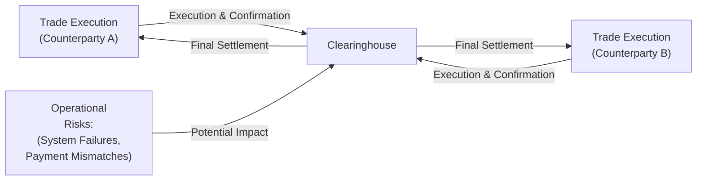
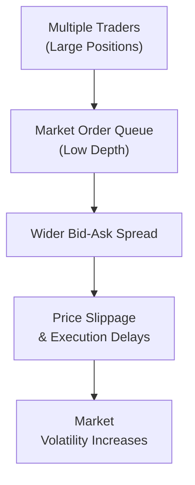

## Overview

Operational, legal, and liquidity risks shape just about every corner of the derivatives market. When I first started trading futures (a very long time ago, I might add), I remember how easy it was to overlook the nitty-gritty details. “Hey, if my strategy is good, everything else will take care of itself,” I thought. Then, one day, an unexpected settlement delay left me scrambling to reconcile payments. That was a wake-up call and, trust me, it wasn’t fun.  

These sorts of risks might not headline the excitement we typically associate with derivatives—like big directional bets or fancy spread trades—but they can pose huge consequences if left unmanaged.  

Below, we’ll walk through how settlement failures can arise, how legal documentation can protect you (or not!), and how liquidity risk can strike when you least expect it. We’ll also highlight best practices and mention resources for further reading, so you’ll be ready to manage these often-underestimated threats.

## Operational Risk in the Derivatives Context

It’s helpful to think of operational risk as the risk that arises from inadequate or failed internal processes and systems. In the derivatives landscape, these can range from data entry errors in a trading system to large-scale technology outages.

### Settlement Failures and Payment Mismatches

When you enter a derivative contract—let’s say a forward contract on a currency pair—both parties expect to settle periodically or at contract expiration. Settlement risk crops up if something goes wrong with that settlement process. Maybe the money transfer instructions are unclear, or a technology glitch prevents timely data transfer between clearing members. In some cases, an entire settlement system might temporarily freeze (think of system maintenance or an unexpected cyber event), leading to a mismatch in payments.  

A widespread example could be if you buy an interest rate swap expecting to receive a fixed rate and pay a floating rate. On the scheduled settlement date, your floating rate payment might be processed (thus debiting your account), but you run into an issue receiving the fixed payment from the counterparty due to a system error. That mismatch can spur immediate cash-flow problems.  

Below is a simple illustration of how settlement flows work, and where operational risk might surface:

You can see that both Counterparties A and B rely on the clearinghouse for timely settlement. Any system issue or data-processing error within the clearinghouse (or at the counterparties’ own internal systems) could delay or disrupt a payment flow. That’s operational risk in action, folks.

### Mitigating Operational Risks

So how do we mitigate it? Strong internal controls remain the backbone. These include:  
• Automated trade-matching systems that verify terms immediately after execution.  
• Frequent reconciliations between a firm’s internal records and clearinghouse data.  
• Clear sets of standard operating procedures for trade confirmation, margin calls, and settlement.  

People sometimes skip these steps because they’re tedious. But ignoring them is like skipping routine maintenance on your car—eventually, you’ll have a breakdown, probably at the worst possible time.

## Legal Documentation and Enforceability

If you’ve ever waited nervously for a final signature on a massive contract, you know how uneasy life can feel when legal enforceability isn’t guaranteed. In the derivatives world, legal risk intensifies due to the global nature of transactions and the complexity of products.

### Master Agreements and Netting

An over-the-counter (OTC) derivative is typically governed by an International Swaps and Derivatives Association (ISDA) Master Agreement. This powerful legal framework is completed with detailed schedules (often called Master Agreement Schedules) and confirmations that specify each trade. The big advantage? Netting. In many jurisdictions, if a counterparty defaults, you can net all of the in-the-money and out-of-the-money positions across all derivatives under that single master agreement. That can drastically reduce your credit exposure.  

But netting only works if it’s recognized by that jurisdiction’s legal system. You might see references to ISDA’s “netting opinions,” which effectively confirm that netting will be legally enforceable in a specific country. A mismatch between local law and the Master Agreement can invalidate netting in a default scenario.  

### Documentation Risk and Ambiguities

Even the best Master Agreement can’t fix sloppy drafting. Think about it: if your contract language is ambiguous, you and your counterparty might interpret settlement terms differently. Suppose you’re rolling over a forward position, and the contract doesn’t explicitly define how the new settlement date is determined. Trust me, you don’t want to find out about conflicting interpretations the day before a payment is due.  

Common best practices include:  
• Using standardized language from ISDA protocol documents.  
• Involving legal counsel proficient in derivatives law.  
• Conducting regular reviews to ensure your agreement terms keep pace with regulatory changes and market conventions.

## Liquidity Risk in Derivatives

Liquidity risk is the risk of being unable to enter or exit positions promptly at a fair price. When markets are calm, you might not even notice it. But in stressed conditions, liquidity can evaporate fast—suddenly you’re holding a big position in a derivative that only a handful of counterparties are willing to take off your hands.

### The Dynamics of Market Stress

Picture a day when volatility suddenly spikes (maybe there’s surprising macroeconomic news or a global crisis). Market participants rush to hedge or exit positions, and your previously liquid derivatives instruments might showcase wide bid-ask spreads or vanish from your order book. This is particularly acute in products with narrower trading volumes, such as emerging-market currency swaps or commodity futures on niche agricultural goods.

Ever tried to unload a chunk of illiquid equity index options on an emerging market exchange in the midst of a geopolitical shock? Let’s just say, the prices you see on your screen can be drastically different from what you’ll get when you actually hit the sell button.

### Concentration Risk and Slippage

One big contributor to liquidity risk is concentration risk. If you hold large positions relative to the typical daily trading volume in an instrument, your own trades can significantly move the market—resulting in slippage. As a quick recap:

• Slippage is when your final execution price ends up being worse (for you) than the price you intended to trade at, due to insufficient volume or large order size.  

This can happen both in a calm market (if your position is truly massive) or in a hectic market, where the first trade blasts through quote levels and triggers a cascade of price moves.

Below is a diagram showing how liquidity risk can balloon when multiple market participants simultaneously attempt to exit large positions:

## Best Practices for Mitigating Liquidity Risk

• Diversify: Avoid taking on extremely large exposures in a single product, especially a thinly traded one.  
• Use limit orders and partial fills: If you’re worried about moving the market, consider limit orders or partial fills to reduce major slippage.  
• Monitor Market Depth: Tools like Level II market data or specialized liquidity analytics can help you see if the market can handle your trade size.  
• Hedge with correlated products: In a pinch, you might trade a correlated product if your primary market is locked up. This can introduce basis risk but might preserve capital during a major liquidity crunch.

## Practical Examples and Real-World Case Studies

• Settlement Glitch at a Regional Exchange: There was a situation a few years back where a regional futures exchange’s clearing system had a major software bug. Traders who expected daily mark-to-market payments found themselves waiting two extra days for receipts. Meanwhile, margin calls were still triggered on schedule. That mismatch forced participants to scramble for temporary liquidity, underscoring how technology mishaps lead to real stress.  

• Legal Dispute from Ambiguous Contract Language: A well-known Asia-based commodity trader once got embroiled in a lengthy legal battle over a forward contract’s definition of “force majeure.” The contract was drafted locally with minimal input from standard ISDA references. When a natural disaster disrupted shipments, the question of whether that event excused deliveries triggered a multi-year litigation process.  

• Liquidity Freeze in 2008: The financial crisis of 2008 famously brought certain credit default swaps (CDS) to the forefront. Many firms that relied on daily or weekly quotes for CDS found that, at the height of the crisis, no one wanted to make a market. Let’s just say it was like trying to sell a valuable painting in a city where galleries had all closed up shop.  

## Exam Tips and Pitfalls to Avoid

• Pay close attention to how operational, legal, and liquidity risks might appear in scenario-based questions. For instance, you might be asked about the consequences if a clearinghouse’s systems fail right before option expiration.  
• When you see a question about netting agreements, watch for jurisdictional references. If the question hints that local laws do not honor netting, you might need to treat your exposures as if netting doesn’t exist.  
• For liquidity risk, be prepared to calculate potential slippage costs or to demonstrate how wide bid-ask spreads can affect a hedge’s effectiveness.

## References

• Basel Committee on Banking Supervision: “Operational Risk Management.”  
• ISDA (International Swaps and Derivatives Association): Legal opinions and country netting opinion library.  

## Test Your Knowledge: Operational, Legal, and Liquidity Risks



### Which of the following best describes operational risk in derivatives?

- [ ] The risk arising from unfavorable market movements.
- [ ] The risk that a counterparty will default on a payment.
- [x] The risk that internal processes or systems fail, causing disruptions in trade settlement or execution.
- [ ] The risk that regulatory changes invalidate existing contracts.

> **Explanation:** Operational risk addresses potential failures in internal systems and processes, such as late settlement instructions or technology outages.

### What is the primary benefit of an ISDA Master Agreement in OTC derivatives?

- [ ] It eliminates credit risk by guaranteeing all payments.
- [x] It allows for netting of positions, potentially reducing overall exposure under a single legal document.
- [ ] It always prevents a counterparty from declaring bankruptcy.
- [ ] It serves as a substitute for collateral.

> **Explanation:** ISDA Master Agreements standardize derivative contracts and permit netting. While they don’t guarantee that the counterparty won’t fail, they streamline the legal framework.

### If a firm has a large concentration of thinly traded commodity swaps, what main risk might they face trying to close those positions quickly?

- [x] Slippage and wide bid-ask spreads.
- [ ] Lower required margins.
- [ ] Guaranteed zero-basis risk.
- [ ] Exemption from default rules.

> **Explanation:** Thinly traded markets can have significant slippage and wide spreads, making it expensive or nearly impossible to exit or hedge positions quickly.

### How can documentation risk most directly manifest in a derivative transaction?

- [ ] Lower credit risk from standardized terms.
- [x] Legal disputes due to ambiguous terms or incomplete references in the contract.
- [ ] Higher liquidity if terms are well-defined.
- [ ] Reduced possibility of counterparty defaults.

> **Explanation:** Documentation risk involves unclear or missing provisions in a contract, which can lead to misinterpretation and potential legal conflicts.

### Which best describes the advantage of Master Agreement Schedules?

- [x] They allow parties to customize standard ISDA agreements by specifying jurisdiction or netting conditions.
- [ ] They automatically convert plain vanilla swaps into exotic products.
- [ ] They are only useful if trading commodity futures.
- [ ] They are mandated for exchange-traded derivatives only.

> **Explanation:** Master Agreement Schedules adapt the standardized terms of the ISDA agreement to each party’s legal requirements and specifics of the transaction.

### During a market crisis, liquidity risk in derivatives often increases because:

- [ ] Clearinghouses freeze all accounts automatically. 
- [x] Bid-ask spreads widen and fewer participants are willing to trade.
- [ ] There is always a surplus of buyers.
- [ ] Algorithmic platforms guarantee immediate execution.

> **Explanation:** In stressed markets, participants reduce their trading, leading to wider spreads and less willingness to take on new exposures.

### What is the term “Enforceability” referring to in a derivative contract context?

- [x] The legal capacity to compel compliance with contract terms and obligations.
- [ ] The measure of a contract’s payoffs under different scenarios.
- [ ] A standard metric for liquidity in OTC trading.
- [ ] A specialized tool for netting credit exposures in currency swaps.

> **Explanation:** Enforceability focuses on the legal framework’s ability to uphold the contractual clauses, ensuring that parties are bound by the agreement.

### Which measure is most effective in mitigating operational risk in settlement processes?

- [x] Regular reconciliation of trade data and robust internal controls.
- [ ] Relying solely on manual processes for settlement.
- [ ] Eliminating margin calls entirely.
- [ ] Using untested software updates right before settlement dates.

> **Explanation:** Ensuring all systems and records are accurate and consistent through systematic reconciliations is key to minimizing operational disruptions.

### How does concentration risk amplify stress in a derivative position?

- [ ] By providing continuous liquidity feed.
- [ ] By reducing margin requirements.
- [x] By increasing market impact when unwinding a sizable position.
- [ ] By guaranteeing no default from the counterparty.

> **Explanation:** When a large position is offloaded in a relatively illiquid market, the sheer trade size can trigger significant price moves, magnifying losses.

### True or False: Ambiguous contract language in derivative documents can lead to expedited settlements.

- [ ] True
- [x] False

> **Explanation:** Ambiguous language creates uncertainty and can lead to legal disputes, delaying rather than expediting settlements.


