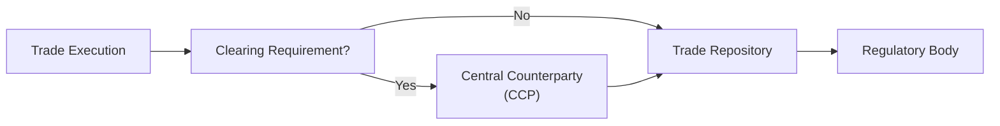

## Context and Rationale

Regulatory oversight is a crucial backbone to modern derivatives markets. In the wake of high-profile financial crises—especially the 2008 meltdown—policymakers decided to tighten the reins on a number of areas they deemed under-managed or outright risky. You might recall (I sure do) the confusion that ensued when new rules started popping up from all corners—the United States, Europe, Asia—each with a slightly different spin. My first brush with Dodd-Frank made me realize, “Wow, if you’re doing business outside the U.S., guess what, you might need to follow U.S. rules too!” This patchwork of regulations can be overwhelming, but at the heart of it lies a single goal: ensuring the stability and transparency of financial markets. 

In earlier sections (especially those in Chapter 1 on market structure and in Chapter 6 on the benefits and risks of derivatives), we covered how derivatives can be powerful tools for hedging and speculation. But with great power comes (yep, you guessed it) great responsibility. Regulators want participants to follow robust risk management practices, keep enough collateral aside to handle big price moves, and promptly report what they’re up to. This section will provide a detailed look at these regulatory requirements—particularly focusing on post-crisis reforms like Dodd-Frank, EMIR, and MiFID II. We’ll also explore mandatory clearing thresholds and position limits, reporting obligations, cross-border complications, and the oh-so-important enforcement actions that regulators can bring.

## Key Post-Crisis Reforms

Large-scale regulatory frameworks such as the Dodd-Frank Act in the U.S. and the European Market Infrastructure Regulation (EMIR) in the EU emerged to fix weaknesses revealed during the global financial crisis. If you chat with someone who traded derivatives before 2008, you’ll likely hear that it was “the Wild West,” with privately negotiated contracts hidden away, overshadowing any semblance of transparency. 

• Dodd-Frank Act (USA): Enacted in 2010, it set out to force standardized derivatives (interest rate swaps, credit default swaps, etc.) onto central clearing platforms and introduced real-time trade reporting.  
• EMIR (EU): Lays down rules for OTC derivative clearing requirements, reporting of trades to repositories, and margin obligations.  
• MiFID II (EU): Broadened the scope of investor protection and increased transparency requirements. It also increased position limit rules for commodity derivatives.  

In essence, these reforms aim to push derivatives into more transparent, standardized frameworks, requiring participants to use central counterparties (CCPs) if they surpass certain notional thresholds.

## Mandatory Clearing Thresholds

One of the biggest changes in the post-crisis environment is the requirement to clear certain derivatives through a central counterparty (CCP). Think of a CCP as a giant, regulated middleman: If Party A and Party B enter into a standardized interest rate swap, for instance, the CCP steps in as the buyer to every seller and the seller to every buyer. This structure helps mitigate counterparty risk. 

But mandatory clearing does not apply to every single trade under the sun. Laws in jurisdictions (like the U.S. or EU) often stipulate notional thresholds—these are basically triggers saying, “If your volume is so large that you pose systemic risk, you must clear your trades.” So if your cumulative notional value in a specific category of derivatives crosses that threshold, you must route those trades through a CCP. 

Below is a simplified diagram to illustrate how this might look when a firm decides whether to clear trades:

• If the trade meets the criteria (standardized contract, surpassing volume thresholds), it’s submitted to the CCP.  
• Whether or not it’s cleared, it must typically be reported to a trade repository.  
• Regulatory bodies want that data to monitor overall market exposures.

This multi-layer approach attempts to ensure no single counterparty can take a huge derivative position that flies under the radar. 

## Position Limits 

Position limits impose restrictions on the maximum number of futures (or futures-equivalent) contracts any single participant may hold, especially in commodity markets. Regulators and exchanges set these caps to curb excessive speculation and prevent market corners or squeezes. 

You might wonder if position limits infringe on legitimate hedging. They can, but regulators often grant exemptions for bona fide hedgers who actually deal in the underlying commodity or risk. In the U.S., the Commodity Futures Trading Commission (CFTC) is typically the main body in charge of these rules, with position limits often focusing on physically delivered commodity futures. Meanwhile, MiFID II extends position limits to certain commodity derivatives traded on European trading venues. 

If your trading volumes are approaching these limits, you need to consider the possibility of forced liquidation or partial roll into alternative instruments. This can impact your hedging strategies and can also lead you to consider or redesign your approach to speculation and market-making. 

## Reporting Obligations

Long gone are the days of handshake deals behind closed doors—well, mostly. Now, even if you trade over-the-counter (OTC) derivatives, you often must report the transaction’s details to a recognized repository. The idea is to furnish regulators with near real-time data, letting them see who’s building up large positions, and in turn, allowing them to spot systemic risk. 

In the U.S., Dodd-Frank mandates real-time reporting to a Swap Data Repository (SDR). In the EU, EMIR requires timely reporting to Trade Repositories (TRs). If you’re operational across borders, you might find yourself double-reporting or seeking equivalence determinations from your home regulator. These complexities can be quite a puzzle—trust me, the first time I tried to figure out which repository my U.S. trades would go to if I’m physically located in Frankfurt was, “um,” baffling to say the least.

### Common Reporting Elements

• Counterparty identifiers (LEI: Legal Entity Identifier)  
• Notional amounts, currency, maturity date  
• Pricing details or relevant reference rates  
• Collateral or margin data (if required)  

Failing to meet these reporting obligations can spook regulators, leading to fines or, worse, possible trade bans until the firm sorts out its compliance. 

## Cross-Border Challenges

Picture the scenario: You’re a global investment bank with operations in New York, London, and Singapore. Each region might impose its own rules about clearing (UK’s onshore version of EU rules post-Brexit, EMIR in the EU, CFTC rules in the U.S., MAS in Singapore). There’s a risk you could be forced to comply with overlapping or contradictory regulations.

This fragmentation can hamper liquidity if participants find the compliance overhead too burdensome. Some regulators have hammered out “equivalence” or “substituted compliance” frameworks—basically saying, “If your home market’s rules are good enough, you don’t have to re-apply ours on top.” But these deals aren’t universal and can be subject to political swings.  

The net result: risk managers must carefully design their booking models and entity structures to minimize duplication, remain legally compliant, and ensure cost-effectiveness.  

## Enforcement Actions

Regulatory bodies across the globe have ramped up enforcement actions in recent years—levying fines that sometimes reach into the hundreds of millions of dollars for significant breaches. Enforcement can target:

• Failure to clear mandated contracts  
• Inaccurate or delayed reporting  
• Surpassing position limits  
• Insufficient margin or inadequate collateral practices  
• General misconduct, such as market manipulation attempts  

Enforcement doesn’t simply mean writing a check for a fine. It can impede your ability to do business, especially if regulators suspend or revoke licenses. Some participants, like big dealers or major commodity houses, have entire compliance departments dedicated to ensuring no one steps afoul of these multifaceted rules. 

## Case Studies and Experience

Many folks (and entire institutions) learned the hard way. One notable case involved energy traders misreporting natural gas trades to manipulate published index prices. Regulators clamped down, resulting in multi-million-dollar fines. Another instance that’s often discussed is the “London Whale,” who might not have been in direct violation of clearing or position-limit rules, but whose massive positions in credit derivatives eventually caught regulators’ eyes and led to intense scrutiny of risk oversight.

These episodes highlight that regulators have grown more watchful of large or unusual positions. They want to ensure that if your positions sour, you won’t sink the entire financial sector along with you. 

## Best Practices in Navigating Regulation

Even if you’re a smaller market participant, it’s wise to embed a robust regulatory compliance process in your larger risk management framework. Some recommended approaches include:

• Automated reporting systems that capture trade details in real time and submit them to the relevant repository.  
• Frequent stress tests, so you know how quickly your derivative positions can grow and whether additional margin might be required.  
• Position tracking systems that alert you if you’re nearing a regulatory limit or a clearing threshold.  
• Engaging external advisors for cross-border trades to ensure you meet all local variations of global regulations.  
• Maintaining strong working relationships with local regulators and fulfilling “Know Your Counterparty” rules to avoid dealing with flagged entities.  

## Glossary

**Dodd-Frank Act (USA)**  
Post-2008 legislation aimed at improving stability and transparency—most famously introducing mandatory clearing and reporting for many OTC derivatives. 

**EMIR (EU)**  
European Market Infrastructure Regulation, which sets out clearing, reporting, and risk mitigation standards for OTC derivatives in the European Union. 

**CCP (Central Counterparty)**  
An intermediary that clears trades by becoming the buyer to every seller and the seller to every buyer for standardized derivative contracts. 

## References & Further Reading

• U.S. Commodity Futures Trading Commission (CFTC): https://www.cftc.gov/  
• European Securities and Markets Authority (ESMA): https://www.esma.europa.eu/  
• Basel Committee on Banking Supervision – Standards for margin requirements, capital charges, and other guidelines  
• MiFID II Official Text: https://eur-lex.europa.eu/  
• EMIR Legislation and Updates: https://ec.europa.eu/info/business-economy-euro/banking-and-finance_en  

## Practical Exam Tips

• Know your definitions: Understand the nuances of who must clear, who’s exempt, and at what notional amounts. CFA Level III exam questions often ask you to identify thresholds or recommend regulatory steps in scenario-based item sets.  
• Use logic-based strategies in constructed responses: If a question says a firm’s swap notional value soared above a certain threshold, mention how that triggers mandatory clearing or additional margin.  
• Keep an eye on cross-border angles: The exam might force you to consider which rules apply if a U.S.-based firm books trades in Europe. Show you’re aware of equivalence or substituted compliance frameworks.  
• Watch out for common pitfalls: For instance, mismatch in reporting timings or failure to incorporate initial margin rules. The exam loves to test these details.  
• Memorize position limit logic: If a commodity derivative is approaching regulatory caps, you might have to demonstrate how rolling the position or partial liquidation could address the limit.  

Be sure to practice with scenario-based questions, like “what happens if Firm X fails to report a newly constructed interest rate swap?” or “describe which regulation would apply if Firm Y surpasses the threshold for clearing.” These are typical ways the CFA exam tests real-life application.

---

## Test Your Knowledge: Regulatory Considerations in Derivatives Risk Management



### The main purpose of post-crisis reforms such as Dodd-Frank and EMIR is to:
- [ ] Protect banks from defaulting on loans.
- [ ] Replace all OTC derivative contracts with exchange-traded derivatives.
- [x] Improve market stability by mandating clearing, reporting, and margin requirements.
- [ ] Eliminate the existence of credit risk entirely.

> **Explanation:** Post-crisis reforms target market transparency and stability rather than outright eliminating OTC derivatives or removing credit risk.  

### Which of the following best describes the role of a Central Counterparty (CCP)?
- [ ] Acting as a regulator responsible for enforcing position limits.
- [x] Interposing itself as the buyer to every seller and the seller to every buyer.
- [ ] Transferring all derivative positions from the buyer to the seller automatically.
- [ ] Providing market-making services in illiquid assets.

> **Explanation:** A CCP becomes the contract’s counterparty, reducing counterparty risk by standing in the middle of trades.  

### Under EMIR, which of the following is true regarding reporting obligations for OTC trades?
- [ ] Submitting trade details is voluntary if notional values are small.
- [x] All OTC derivative trades must generally be reported to a recognized Trade Repository.
- [ ] Only trades executed on-exchange need to be reported.
- [ ] Reporting obligations are only for foreign exchange spot trades.

> **Explanation:** EMIR requires that OTC derivative transactions be reported regardless of size, subject to specific exemptions outlined in the regulation.  

### Position limits are primarily designed to:
- [ ] Increase market liquidity regardless of the contract amount.
- [ ] Maximize the potential gains of speculators.
- [ ] Replace margin requirements in all asset classes.
- [x] Prevent excessive market concentration or manipulation.

> **Explanation:** Position limits aim to curb large positions that might allow a participant to corner or squeeze the market.  

### When a firm surpasses a mandatory clearing threshold:
- [x] The firm must start clearing certain standardized derivatives through a CCP.
- [ ] The firm may close out all existing positions to avoid clearing.
- [ ] Regulatory oversight is waived.
- [ ] The firm must only notify relevant regulators and do nothing else.

> **Explanation:** Surpassing the threshold triggers mandatory clearing requirements for derivatives that meet standardization criteria.  

### Which entity in the U.S. is primarily responsible for regulating commodity futures and derivatives?
- [ ] Securities and Exchange Commission (SEC)
- [ ] Federal Reserve Board
- [x] Commodity Futures Trading Commission (CFTC)
- [ ] Federal Deposit Insurance Corporation (FDIC)

> **Explanation:** The CFTC oversees commodity futures, options, and swaps in the U.S.  

### A cross-border derivative transaction might subject a firm to multiple regulatory regimes due to:
- [ ] The notion that local regulators have no jurisdiction.
- [x] Overlapping rules in different geographical areas.
- [ ] The transaction being automatically void.
- [ ] Exemptions granted by every regulator involved.

> **Explanation:** If a transaction crosses borders, each jurisdiction’s rules may apply, potentially creating overlapping or duplicative compliance obligations.  

### Failure to report an OTC derivative trade to a trade repository can result in:
- [x] Fines or other enforcement actions by regulators.
- [ ] A mandatory increase in interest rates for the derivatives.
- [ ] Automatic conversion of the trade to an exchange-traded futures contract.
- [ ] A lower notional value for calculation of risk exposure.

> **Explanation:** Regulators can impose fines or other penalties for non-reporting.  

### Which of the following scenarios may trigger a regulatory inquiry under position limits rules?
- [ ] A small position in a rarely traded OTC contract.
- [ ] A long position of 50 futures contracts in widely traded 2-year Treasury notes (well below large-lot thresholds).
- [x] An unusually large net position in a commodity derivative approaching or exceeding official limits.
- [ ] A diversified portfolio of swaps and futures that collectively lowers the overall exposure to zero.

> **Explanation:** Breaching position limits or getting dangerously close draws regulatory scrutiny.  

### True or False: Enforcement actions for breaking derivative regulations can include both fines and restrictions on market access.
- [x] True
- [ ] False

> **Explanation:** Regulators can penalize firms not only monetarily but can also restrict their ability to trade, ensuring compliance and deterring future violations.  


