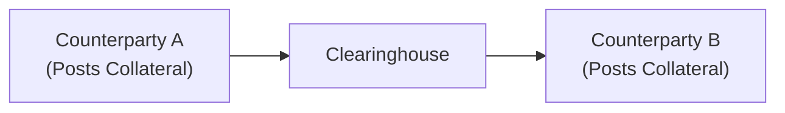

## The Role of Collateral in Derivative Markets

Collateral is like the seatbelt of derivatives trading. It’s there to protect each counterparty—you know, in case the other one doesn’t hold up their end of the deal. The basic idea is simple: if party A and party B enter into a contract (maybe an interest rate swap or a currency forward), each side wants to ensure the other can fulfill its obligations. By posting collateral, both sides have a cushion—an asset posted in a margin account—to help handle any unexpected losses. That’s the big risk management angle: mitigating counterparty credit risk.

But here’s the catch (and you might’ve guessed this): once you post collateral, it’s effectively tied up. You can’t freely use those funds elsewhere, and that means you lose the opportunity to invest them in profitable ventures. For large-scale entities like banks and big asset managers, carrying mountains of collateral can get expensive, especially if short-term funding rates are high or if they need that capital for other critical investments. So in balancing the benefits of risk reduction, we’re also dealing with real funding costs and capital constraints. 

Within the derivatives world, we typically see two broad types of collateral arrangements:

• Collateral posted for centrally cleared trades (those that go through a clearinghouse)  
• Collateral posted for bilateral over-the-counter (OTC) trades (governed by agreements such as the ISDA Credit Support Annex)

In both cases, your seatbelt is on, but the design, color, and cost might vary depending on regulatory requirements and the nature of the trade.

## Initial vs. Variation Margin

When it comes to margin—the “official” term for collateral—there are two main categories: initial margin and variation margin.

### Initial Margin
Think of initial margin as the “foundation.” It’s the capital you deposit as a performance bond at the beginning of a trade (especially relevant in futures and centrally cleared swaps). This initial margin is calculated to cover potential changes in the value of your position across a certain horizon (often one or two days for most futures, but possibly longer for OTC trades). The idea is that if the market moves against you, there’s enough cushion before the clearinghouse faces a shortfall. 

So, if you’re trading interest rate futures, your initial margin might be a relatively small percentage of the notional value—maybe 3% to 5%. If you hold a large number of contracts, that can add up quickly. The clearinghouse or broker sets the initial margin based on market volatility, liquidity, and other risk factors. 

### Variation Margin
Now variation margin is more like a “running tab.” After the trade is active, each day the losing party pays an amount equal to the mark-to-market loss to the gaining party. Those funds are posted as variation margin. If you have a profitable day (i.e., your derivative position increases in value), you’re likely to receive variation margin from your counterparty, which will be credited to your account. 

For example, suppose you go long on an S&P 500 futures contract. If the index goes up, you typically receive the difference in account value as variation margin. If it goes down, you pay. This daily pay-and-receive system ensures that parties remain current on losses as they accrue, greatly reducing counterparty credit risk. However, from a real-world perspective, you, as a trader, need to have the liquidity to handle any margin call at the end of the day. Funding that margin call can have real costs—especially if short-term funding rates or lines of credit are expensive.

## Rehypothecation

Rehypothecation might sound fancy, but in plain English, it means that banks or brokers can take the collateral you posted and use it for their own activities—maybe to secure another transaction, fund a short-term cash need, or engage in other trades. 

It’s a bit like lending your neighbor your lawnmower, and then the neighbor flips around and rents that lawnmower out to someone else. In good times, that re-lending (or re-using) can enhance market liquidity—everyone’s happy, trades are fluid, and capital flows freely. But if your neighbor suddenly faces financial trouble and can’t return the lawnmower when you want it back, well... that’s a problem. This is why rehypothecation can introduce systemic risk. Collateral is no longer static; it’s actually circulating around the financial system, sometimes being pledged multiple times over. 

During the Global Financial Crisis of 2008, the dangers of excessive rehypothecation became strikingly clear. Double-pledged or triple-pledged assets could cause chaos if one link in the chain broke. Post-crisis regulations (like Basel III, EMIR in Europe, Dodd-Frank in the U.S.) have forced more rigorous oversight of rehypothecation. Still, it remains a very real part of modern finance.  

## Cost of Funding

The cost of funding is basically the interest expense you (or your institution) incur when placing collateral. When short-term interest rates are high (or your creditworthiness is less than stellar), it can be pricey to fund margin requirements. On the flip side, if you keep your collateral in cash and interest rates are exceptionally low (or even negative), you might be earning little to nothing on that posted cash, which is a lost opportunity. 

To incorporate funding costs into derivative pricing, dealers often use overnight indexed swap (OIS) rates for discounting expected cash flows, considering these to be a more accurate reflection of the risk-free funding environment. Additionally, some advanced derivative pricing models factor in something called the Funding Value Adjustment (FVA). This tries to account for the fact that if you’re paying a certain internal or external funding rate to maintain your derivative positions, that cost affects the final “fair value” of the derivative.  

### Funding Value Adjustment (FVA)

FVA modifies the traditional pricing of derivatives to reflect the cost or benefit of funding the collateral. Suppose a bank is entering into a swap and it expects to pay a certain spread above the risk-free rate to source its collateral. The present value of that spread, over the life of the swap, can be factored in as an additional cost for the derivative. This can materially change the value at which the bank is willing to enter the deal.

A simplified expression for a single period might be:


\text{FVA} = \sum_{t=1}^{T} \left( \text{Funding Rate}_t - r_t \right) \times \text{Exposure}_t \times \Delta t,


where  
• \\( \text{Funding Rate}_t \\) is your actual cost of raising funds,  
• \\( r_t \\) is the risk-free or OIS rate,  
• \\( \text{Exposure}_t \\) is the expected or contingent exposure requiring funding,  
• \\( \Delta t \\) is the time fraction.

Granted, in real-world multi-period derivative valuation, this gets more complicated. But the overarching principle is: If it costs you something to keep collateral posted, you should factor that cost into your derivative valuation.  

## Collateral Optimization

“Collateral optimization” is the fancy phrase used to describe how institutions try to minimize the cost of posting margin. Because not all collateral is created equal. Some clearinghouses or counterparties accept government bonds, while others might accept certain high-grade corporate bonds or cash only. Some might even let you post equities—although that’s less common in derivatives clearing contexts. The goal is to find the “cheapest” asset that meets the eligibility requirements.

Let’s say you can post either short-term government T-bills or cash. If you hold a large inventory of T-bills paying 2% interest, while your broker charges you a 1.5% funding rate on margin loans, it might be cheaper overall to post T-bills as collateral rather than turning them into cash. By systematically monitoring and analyzing your inventory of assets, you can choose the cheapest-eligible collateral. 

This approach also involves thinking about “cheapest-to-deliver” (CTD) for certain futures or forward contracts. For example, in a Treasury futures contract, the short party can decide which treasury bond to deliver. They typically deliver the one that’s most economical for them—i.e., the cheapest-to-deliver. In a similar vein, from a margin perspective, you’d prefer to post the asset that costs you the least in lost opportunities or interest expense.

### A Quick Example of Optimization

Imagine your firm is a major commodity trader with a large pool of different securities. You might hold:

• Cash at 0.5% yield (or maybe 0% if it’s just in a checking account)  
• Short-term corporate paper at 2.3% yield  
• High-quality government bonds at 2.0% yield  

If your broker or clearinghouse accepts government bonds and corporate paper but imposes a higher “haircut” on corporate paper, you compare the net cost. Maybe you lose more principal value if you post corporate paper (via haircuts), but that paper yields more. By running a quick cost-benefit analysis (taking into account haircuts, the time horizon, potential next best use of the asset), you might find it cheaper to post government bonds. Or maybe not—there’s no universal answer. Collateral optimization is an ongoing process that large institutions manage daily, often involving complex algorithms to handle multiple constraints and market changes.

## Common Pitfalls

Even with the best planning, folks can get caught off guard. Some classic pitfalls:

• Underestimating Liquidity Risk: Maybe you have enough assets to post as collateral, but are they liquid enough? If you can’t convert them quickly, you might face a margin call you can’t meet.  
• Over-Reliance on Rehypothecation: If you’re the one allowing rehypothecation of your posted collateral, you might be unknowingly taking on someone else’s credit or operational risks.  
• Collateral Shortfalls in Stress Scenarios: During big market moves, initial margin requirements can jump. If all your capital is tied up, you might scramble to meet new demands.  
• Ignoring FVA and Other Valuation Adjustments: In the real world, ignoring the cost of funding or other credit valuation adjustments can lead to mispricing.  

Anyway, the bottom line is: margin rules exist for good reasons, but they can be a double-edged sword. You reduce counterparty credit risk, but you also have to watch your liquidity and funding costs.  

## Conclusion and Final Exam Tips

Collateral and funding costs may seem straightforward at first, but they embed crucial mechanics that shape the actual cost and pricing of derivatives. When you’re studying for the CFA exam (or dealing with real clients), it’s super important to connect the dots:

• Collateral’s big function is to limit credit risk.  
• Initial margin sets a baseline, and variation margin keeps the daily losses (or gains) current.  
• Rehypothecation can enhance liquidity, but watch out for heightened systemic risk.  
• Funding rates directly affect how you should value your derivative positions; the lower your funding cost, the more flexibility you’ll have in trades (and vice versa).  
• Collateral optimization is an ongoing puzzle: find the cheapest eligible collateral that meets the margin requirements.  

From an exam perspective, practice scenario-based questions that test your understanding of how margin calls occur, how cost of funding might shift the fair value of a swap, or how a big jump in volatility affects initial vs. variation margin. For constructed-response questions, be sure you can articulate the link between collateral posting and credit risk mitigation, demonstrate the basic math behind daily margin calls, or talk about FVA as a separate line item in pricing.  

In real portfolio management, these decisions can significantly influence returns. Don’t overlook the operational side—like how quickly you can move collateral across accounts to meet margin calls. The difference of a few hours or a short delay can transform a risky derivative position from manageable to meltdown.  

## Glossary

• Rehypothecation: The practice of reusing collateral posted by clients as collateral for the broker’s or bank’s own trades or funding.  
• Cheapest-to-Deliver (CTD): The security that is least expensive for the short side of a futures contract to deliver to fulfill contract obligations.  
• Funding Value Adjustment (FVA): An adjustment to a derivative’s fair value to account for the cost (or benefit) of funding the margin or collateral associated with the position.  

## References

• ISDA guidelines on collateral management (visit: https://www.isda.org for the latest publications).  
• Michael Simmons (2019), “Collateral Management: A Guide to Mitigating Counterparty Risk.”  
• Basel III / EMIR / Dodd-Frank regulations for margin and clearing requirements.  
• CFA Institute’s official curriculum for in-depth examples on margin requirements and credit risk mitigation.

The above diagram illustrates how each counterparty posts collateral (initial + variation) to the clearinghouse. The clearinghouse manages daily margin calls, ensuring the system remains balanced and credit risk is minimized.

---

## Collateralization and Funding Costs Knowledge Check



### Which of the following best describes the primary purpose of collateral in derivative transactions?
- [ ] To reduce operational risk by tracking daily positions
- [x] To mitigate counterparty credit risk by securing potential losses
- [ ] To guarantee a higher return for the holder of the asset
- [ ] To provide tax advantages for institutional investors

> **Explanation:** Collateral in derivatives primarily serves to limit credit risk. By posting collateral, counterparties secure any potential losses and reduce credit exposure.

### When discussing collateral posted in derivatives trading, “initial margin” primarily refers to:
- [ ] Daily trade-related gains forfeited
- [ ] A legal fee charged by the clearinghouse
- [x] A performance bond set at the start of the trade to cover potential future exposure
- [ ] The value of all variation margin collected over the life of a trade

> **Explanation:** Initial margin is deposited at the outset of a trade to protect against adverse future price movements.

### Variation margin serves to:
- [x] Mark profits or losses to market on a daily basis
- [ ] Set the long-term credit rating of a counterparty
- [ ] Calculate the total required capital under Basel III
- [ ] Offset only the broker’s commission costs

> **Explanation:** Variation margin is the daily settlement amount that reflects the gains or losses on open positions, ensuring both parties keep credit exposure current.

### Rehypothecation refers to the practice of:
- [ ] Liquidating collateral promptly in the event of a default
- [ ] Posting pledges to multiple clearinghouses using the same capital
- [x] Using collateral posted by clients to fund the intermediary’s own trades or other activities
- [ ] Banning short sales on highly liquid assets

> **Explanation:** Rehypothecation is when a broker or dealer takes the collateral you posted and re-pledges it for its own funding or trading purposes.

### Which of the following statements about funding costs is most accurate?
- [ ] Funding costs are negligible in modern low-interest-rate environments
- [x] Higher funding costs increase the effective cost of maintaining derivative positions
- [ ] Funding costs have no impact on the fair value of derivative contracts
- [ ] Regulators prohibit factoring funding costs into derivatives pricing

> **Explanation:** When an institution has a higher cost of funding, it raises the overall cost of maintaining positions, which influences market behavior and derivatives pricing.

### Funding Value Adjustment (FVA) is:
- [x] An adjustment in derivative pricing to account for the cost of funding a position
- [ ] A measure of market volatility
- [ ] A penalty applied for late settlement
- [ ] A credit rating downgrade risk measure

> **Explanation:** FVA captures the benefit or cost of funding and therefore modifies the theoretical fair value of a derivative.

### “Cheapest-to-Deliver” (CTD) generally describes:
- [x] The security delivered at minimal cost to satisfy a futures contract
- [ ] The secondary market for distressed collateral
- [x] A concept used by the short party to minimize the cost of physically delivering under a contract
- [ ] A regulatory requirement for margin offsets

> **Explanation:** CTD is the lowest-cost eligible security that can be delivered to fulfill a futures or forward contract. The short selects which security to deliver, typically the CTD.

### Which of the following is a likely benefit of collateral optimization?
- [x] It can lower overall funding costs by selecting the cheapest eligible collateral
- [ ] It guarantees a higher return on the posted collateral
- [ ] It eliminates the need for a margin call
- [ ] It removes all counterparty credit risk

> **Explanation:** By carefully choosing which assets to post, institutions improve efficiency and reduce the cost of posted margin.

### One key pitfall in managing margin requirements is:
- [x] Underestimating how rapidly margin can increase during volatile markets
- [ ] Overestimating the importance of operational risk
- [ ] Failing to understand that margin is purely optional
- [ ] Posting more collateral than needed to minimize capital usage

> **Explanation:** Margin requirements jump during large or rapid market swings, leading to potential liquidity risk if a firm is unprepared to fund additional margin calls.

### True or False: Rehypothecation can increase systemic risk if multiple parties reuse the same collateral.
- [x] True
- [ ] False

> **Explanation:** Yes, rehypothecation can chain collateral obligations through multiple hands, raising the risk if one link in the chain defaults.


