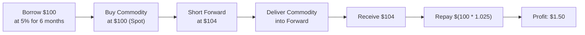

## Introduction

“No-arbitrage” is one of those bedrock concepts in finance that somehow manages to be both elegant and powerful. It basically says, “Look, you can’t get something for nothing in a well-functioning market.” This principle, closely tied to the Law of One Price (LOOP), underpins how we price just about everything in derivatives—forward and futures contracts, swaps, options, and all sorts of exotic instruments.

Working through no-arbitrage might bring some recollections of times you saw an apparent trading discrepancy and thought, “Wait, is that free money?” Well, as soon as you try to jump on that potential free lunch, you usually discover (1) transaction costs, (2) liquidity constraints, or (3) super-speedy market participants who beat you to it. In short, true arbitrage—risk-free profit with zero net investment—rarely lasts in efficient markets.

This section will walk you through the main ideas. We’ll discuss how no-arbitrage and the Law of One Price interact, why they’re so important, and where they fit into the broader structure of modern finance. We’ll also look at a few real-world examples, consider transaction costs, and poke around at a little code that demonstrates how you might apply these ideas in real time.

## Foundations of No-Arbitrage

### Understanding Arbitrage

Arbitrage is often defined as a series of trades that yields risk-free profit at zero net cost. In a frictionless, perfectly efficient market, this should never persist. Why? Because if it did, tons of people would exploit it, and in exploiting it, they would drive prices back into equilibrium. There’s an old adage: “There’s no free lunch in the markets.” Well, no-arbitrage is the fancy version of that adage.

Imagine you see gold futures on one exchange priced at USD 1,900 per ounce for a settlement in three months, but on another exchange, the same futures contract sits at USD 1,880. If you can buy low on one exchange and sell high on the other, that discrepancy should theoretically be your free lunch. However:

• Other traders will see the same thing and pile in.  
• The price discrepancy will close fast.  
• Transaction costs, margin requirements, and potential execution delays might kill the profit.  

### Law of One Price (LOOP)

Closely intertwined with no-arbitrage is the Law of One Price. LOOP dictates that identical assets—after accounting for currency conversions, shipping, or other transaction basics—should trade at the same price across all locations. If there’s a meaningful and sustainable difference, you can buy where it’s cheaper, sell where it’s more expensive, and walk off with a near-instant profit. LOOP is as foundational as they come in price theory, and it’s the reason that asset prices converge across different markets over time.

Of course, real markets have structural nuances:

• Transaction costs (commissions, market impact).  
• Taxes.  
• Trading restrictions or capital controls in certain countries.  
• Illiquidity in smaller markets.  

These frictions can produce brief price differentials, but truly free money is extraordinarily rare.

### Risk-Free Profit and Market Efficiency

The no-arbitrage principle also ties into market efficiency, a theme you might recall from your earlier studies (e.g., in Chapter 1: Introduction to Derivatives, especially Section 1.3 “Derivative Markets and Participants” and Section 1.7 “Distinguishing Hedgers, Speculators, and Arbitrageurs”). In an efficient market, any small pricing discrepancy will be discovered and exploited so quickly that there’s almost no time to gain a systematic edge—unless, of course, you have a lightning-fast high-frequency trading system and the ability to cross markets in microseconds. Even then, those opportunities are ephemeral.

## Real-World Frictions and Temporary Arbitrage Opportunities

You might have heard stories about traders in the 1970s making risk-free profits from gold or silver price discrepancies in different regional markets. The existence of these “classic trades” often hinged on slow communications technology, high shipping costs, or regulatory fragmentation. The costs and time lags overshadowed some of the potential gain, but these were real trades that exploited the market’s inefficiencies.

In modern markets:

• Regulatory frameworks can differ widely, especially for cross-border trades.  
• Some assets might be restricted to local investors, preventing perfect cross-market arbitrage.  
• Liquidity can dry up in crisis scenarios, allowing short-lived mispricings.  

But in normal, everyday markets, the no-arbitrage condition stands as the bedrock assumption in derivative pricing.

## Core Applications in Derivatives Pricing

If you skim through the rest of Chapter 7 in this Volume—particularly if you check Section 7.2 “Replicating Payoffs with Derivatives,” Section 7.3 “Cost of Carry Model for Pricing,” and so on—you’ll note that no-arbitrage is essential for building replication strategies and deriving forward and futures prices. 

In a typical cost-of-carry relationship for a forward contract on a non-dividend-paying stock, the no-arbitrage forward price for a time horizon \\( T \\) is often expressed as:


F_0 = S_0 \, e^{rT}


Here:

• \\( S_0 \\) is the current spot price.  
• \\( r \\) is the risk-free interest rate (continuously compounded).  
• \\( T \\) is the time to maturity.  

Why is this formula correct? Because if the forward price \\( F_0 \\) is higher than \\( S_0 e^{rT} \\), you can buy the stock today (at \\( S_0 \\)), store it until maturity, and simultaneously short the overpriced forward contract, locking in a profit. On the flip side, if \\( F_0 \\) is too low, you could short the stock now, invest your proceeds at the risk-free rate, and buy the artificially cheap forward for future delivery.

### Regulatory Influence

Regulatory environments can shape how quickly or effectively participants can engage in arbitrage. In heavily regulated OTC markets—like certain interest rate swaps or credit derivatives—trading might be more opaque, margins might be higher, and so the speed at which arbitrage trades bring markets to equilibrium could slow down. But as you’ll see in Chapter 6.4 (“Counterparty Risk in OTC Markets”) or 6.17 (“Uncleared Margin Requirements for OTC Derivatives”), regulators generally aim to foster market integrity that prevents easy exploitation of naive mispricings.

## Using the No-Arbitrage Condition: A Simple Example

Let’s walk through a straightforward, hypothetical example. Suppose:

• A commodity is trading at USD 100 in the spot market.  
• The risk-free annual rate is 5%.  
• Storage costs are negligible, and the commodity pays no yield.  
• We’re looking at a six-month forward contract.  

Under no-arbitrage conditions, the fair forward price \\( F_0 \\) for six months can be approximated (using simple annual compounding for illustrative ease) as:


F_0 = 100 \times \left(1 + 0.05 \times 0.5\right) = 100 \times 1.025 = 102.50


If the actual forward price is, say, \\( 104 \\):

1. You’d short the forward at \\( 104 \\).  
2. Borrow \\( 100 \\) at 5% for six months and buy the commodity now.  
3. In six months, deliver the commodity into the forward.  
4. You receive \\( 104 \\), pay back your loan which has grown to \\( 100 \times 1.025 = 102.50 \\).  
5. Pocket the difference: \\( 104 - 102.50 = 1.50 \\), guaranteed.  

Sure, in real life, you’ll face transaction costs, possible capacity issues, or credit risk from your counterparties, but in a frictionless model, that’s the essence of “riskless” arbitrage.

### Visualizing the Arbitrage Flow

Below is a simple Mermaid diagram illustrating the steps in such an arbitrage:



## Python Snippet for Quick Checks

If you’re curious about automating a no-arbitrage forward price calculation, here’s a tiny Python snippet:

```python
import math

def fair_forward_price(spot, rate, time_in_years):
    # Assuming continuous compounding for demonstration
    return spot * math.exp(rate * time_in_years)

spot_price = 100
annual_risk_free_rate = 0.05
time_horizon_years = 0.5

forward = fair_forward_price(spot_price, annual_risk_free_rate, time_horizon_years)
print(f"Fair Forward Price: {forward:.2f}")
```

Running this might print “Fair Forward Price: 102.53,” which is extremely close to our previous approximate result that used simple compounding. This quick check can come in handy when you need a basic, no-arbitrage-based estimate before diving into more complex derivative pricing.

## Potential Pitfalls and Market Realities

• Transaction Costs: Commissions, bid–ask spreads, and taxes can quickly erode apparent profits.  
• Counterparty Risk: In OTC markets, you may face the chance your counterparty defaults. For a risk-free trade to truly exist, you need near-zero credit risk.  
• Market Liquidity: Sparse liquidity might mean you can’t trade at the posted price. Large trades can move the market (market impact cost).  
• Timing Mismatch: Even a little delay in execution can cause you to miss the short-lived opportunity.  

Quite a few institutional traders specialize in looking for mild dislocations in prices. But these are rarely the outlandish risk-free trades textbooks outline. The big trades nowadays may revolve around capturing small spreads with large leverage or sophisticated cross-asset strategies that effectively lock in low-risk returns (though not always truly “risk-free”).

## Conclusion and Final Exam Tips

The no-arbitrage principle is your best friend when it comes to intuitively grasping derivative pricing. It provides an anchor to confident analysis: “If I find a strategy that yields infinite money for no risk, I’m probably missing something.” In the context of the CFA Program, it’s crucial to grasp not just the definitions and formulas surrounding no-arbitrage, but also the market realities that might limit its application.

In the Level I curriculum (and continuing into advanced levels), you’ll see no-arbitrage logic applied repeatedly—whether you’re examining put-call parity, forward/futures cost-of-carry, or interest rate swap valuation in Chapter 3 (Swaps). By internalizing the principle that “prices must line up or else people will make them line up,” you’ll be in a great position to tackle complexities in your derivatives studies.

As for exam tips:

• Be prepared to show how you’d construct a hedge or replication strategy to lock in a profit if a price is off.  
• Practice identifying arbitrage boundaries for derivatives—e.g., put–call parity for options, forward/futures pricing for commodities.  
• Keep an eye out for typical exam pitfalls: not accounting for dividends, ignoring transaction costs, or mixing up compounding conventions.  

Stay sharp, and remember: if it looks too good to be true, in an efficient market, it probably is.

## References

- Hull, John C. “Options, Futures, and Other Derivatives.” 10th ed., Pearson.  
- CFA Institute. CFA Program Curriculum Level I & II, readings on Derivatives Pricing.  
- Chance, Don M., and Roberts Brooks. “An Introduction to Derivatives and Risk Management.” Cengage Learning.  

## No-Arbitrage and the Law of One Price: Practice Questions



### A simple definition of arbitrage is:
- [x] Earning a risk-free profit with zero net investment.
- [ ] Earning a risky profit by juggling multiple markets.
- [ ] Earning a guaranteed loss in a volatile market.
- [ ] Buying and holding an asset for long-term growth.

> **Explanation:** Arbitrage specifically refers to making a profit with no initial outlay and no risk of loss, consistent with the no-arbitrage principle.

### Which best describes why the Law of One Price (LOOP) is tied to arbitrage?
- [x] If identical assets are priced differently, traders can profit by buying the cheaper one and selling the more expensive one.
- [ ] If identical assets are mispriced, then markets are always trending downward.
- [ ] LOOP only applies to stocks, not commodities.
- [ ] LOOP is unrelated to arbitrage strategies.

> **Explanation:** LOOP states that two identical assets must sell at the same price; otherwise, arbitrage forces would quickly eliminate any price discrepancies.

### Suppose a forward contract on a dividend-free stock is priced below the no-arbitrage fair value. An investor can exploit this, at least in theory, by:
- [x] Buying the undervalued forward and shorting the stock today.
- [ ] Buying the stock and ignoring the forward market.
- [ ] Shorting both the stock and the forward immediately.
- [ ] Purchasing a put option on the stock.

> **Explanation:** If the forward’s price is too low, you can short the stock today (receiving the current spot price) and buy the forward (locking in delivery at maturity), collecting a risk-free profit.

### In a perfectly efficient market with no frictions, if two assets produce the same cash flows, they:
- [x] Must trade at the same price.
- [ ] Can trade at vastly different prices over the long term.
- [ ] Must have negative price correlations.
- [ ] Must only be traded on one exchange.

> **Explanation:** In an ideal market, identical cash flows yield identical prices, adhering to no-arbitrage and the Law of One Price.

### Which of the following is the most common reason real arbitrage trades don’t typically yield risk-free profits?
- [x] Transaction costs and market frictions erode gains.
- [ ] There are no real-world arbitrage opportunities at all.
- [ ] The assets are not traded enough to make profits.
- [ ] Regulatory conditions mandate arbitrage failure.

> **Explanation:** While arbitrage may exist in theory, transaction costs, slippage, and other market frictions frequently nullify these profits in practice.

### The core no-arbitrage relationship in forward pricing for a non-dividend-paying asset (using continuous compounding) is:
- [x] F₀ = S₀ e^(rT).
- [ ] F₀ = S₀ / e^(rT).
- [ ] F₀ = S₀ × e^(-rT).
- [ ] F₀ = S₀ × (r / T).

> **Explanation:** For a non-dividend-paying asset, you can replicate the payoff by borrowing money at the risk-free rate to buy the asset and delivering it at maturity, implying F₀ = S₀ e^(rT).

### If a currency can be converted among three different markets in such a way that you end up with more units of your original currency:
- [x] This is an example of triangular arbitrage.
- [ ] This is an example of covered interest arbitrage.
- [ ] This is an example of negative interest rate arbitrage.
- [ ] This is an example of pure speculation.

> **Explanation:** When currency conversions across three distinct currency pairs produce a sure profit, it is triangular arbitrage.

### Why do regulatory frameworks sometimes allow price discrepancies to linger?
- [x] They can restrict capital flows, slow down trade execution, or cause incomplete information sharing.
- [ ] They prohibit arbitrage trades entirely.
- [ ] They standardize all asset prices overnight.
- [ ] They force minimal bid–ask spreads for every trade.

> **Explanation:** In certain jurisdictions, restrictions or reporting delays can impede swift arbitrage, allowing price discrepancies to subsist longer than in fully open markets.

### Which of the following statements about the Law of One Price is true?
- [x] It underpins many valuation models by ensuring identical claims on cash flows have identical prices.
- [ ] It is irrelevant to exchange rates.
- [ ] It guarantees an immediate profit whenever spot and forward markets differ.
- [ ] It becomes invalid when interest rates change.

> **Explanation:** The Law of One Price is the foundation of modern pricing models; it holds that identical cash flows command equal prices, irrespective of currency or interest rate shifts, once you account for these factors properly.

### No-arbitrage opportunities can persist in real markets if:
- [x] Frictions such as transaction costs or capital barriers prevent traders from exploiting them.
- [ ] Markets operate too quickly to spot them.
- [ ] Nobody is aware that a discrepancy exists.
- [ ] Regulators legally fix asset prices at equal levels.

> **Explanation:** Arbitrage opportunities can linger when certain market participants cannot act—maybe due to high costs, restricted flows, or lack of liquidity. Without these constraints, such opportunities vanish quickly.


