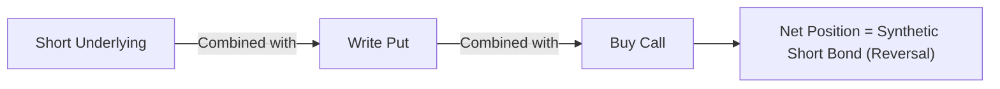
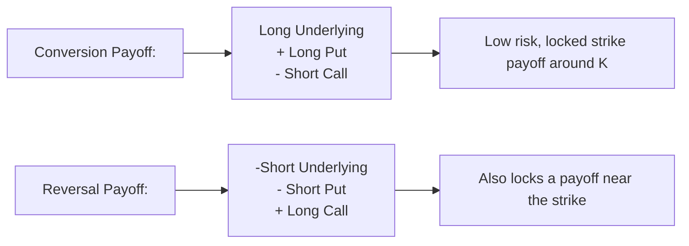

## Introduction
Picture this for a moment: You’re sitting on a trading desk, scanning the options chain, and you notice a curious discrepancy between the prices of calls, puts, and the underlying stock. You’ve read somewhere that if the relationship between calls, puts, and the underlying drifts away from the theoretical put–call parity, there might be a chance for risk-free profits. Does that actually happen in the real world? Sometimes, yes—though fleetingly—and this is exactly where two related strategies, known as conversions and reversals, come in.

At their core, conversion and reversal trades are all about exploiting mispricings in the options market. They hinge on put–call parity, a foundational concept in options pricing that states the value of a call, a put, and a position in the underlying asset must collectively align to avoid arbitrage. The moment they get out of line—even by a hair—arbitrageurs can come in to earn relatively risk-free profits, assuming transaction costs and margin requirements don’t demolish the trade’s viability.

This section walks you through the essence of conversions and reversals: how they work, why they theoretically produce risk-free returns, and how you might spot them in a trading environment. We’ll also talk about the pitfalls—because, let’s face it, no strategy is free from real-world frictions.

## Foundations of Put–Call Parity
To really appreciate conversions and reversals, we need to revisit put–call parity. The standard put–call parity (for European options on a non-dividend-paying underlying) can be expressed as:

(1)  
C - P = S - Ke^{-rT},  

where:  
• C is the premium of the European call option.  
• P is the premium of the European put option.  
• S is the current price of the underlying asset.  
• K is the strike price of the options.  
• r is the risk-free interest rate (continuously compounded).  
• T is the time to maturity.  
• Ke^{-rT} is effectively the present value of the strike price.  

This equation basically says that if you buy a call and short an equivalent put (i.e., same underlying, strike, and maturity), you create a synthetic forward position on the stock, whose fair value should match (S - Ke^{-rT}). If it doesn’t, some sharp-eyed trader can construct an arbitrage trade to lock in a profit.

In practice, you also consider dividends, carry costs, and discrete compounding. But the big-picture principle remains the same: calls, puts, and the underlying asset are interconnected puzzle pieces—any mismatch can be exploited.

## The Conversion Strategy
When you think “conversion,” think about converting your options position into a synthetic long (or bond-like) position that collects a relatively certain payoff. The schematic is:

• Buy 1 unit of the underlying asset.  
• Buy 1 put option with strike K (same maturity).  
• Write 1 call option with strike K (same maturity).  

This can be a neat little strategy if the option premiums and the underlying’s price are misaligned in your favor. Essentially, the position has the same payoff as a zero-coupon bond or a forward contract at strike K—depending on perspective—because:

• The long underlying and long put together provide downside protection at strike K.  
• The short call option caps your upside at strike K.  

### How It Locks in Risk-Free Returns
Here’s the gist: if the put is relatively cheap or the call is relatively expensive (or both), and the underlying is priced appropriately, you might receive more premium from selling the call than the cost of buying the put—potentially netting an upfront credit. Meanwhile, holding the underlying is offset by the obligation from the short call plus the protection of the long put. If all the numbers line up properly (and we ignore transaction costs), you end up with a guaranteed profit that is realized upon expiration or early exercise exercise (for American-style options).

### Simplified Example of a Conversion
Suppose you observe the following quotes for a stock currently trading at $100:

• Underlying spot price (S): $100  
• Call premium (C) with strike $100 (1-month maturity): $3  
• Put premium (P) with strike $100 (1-month maturity): $1  
• Risk-free rate is negligible for 1 month.

Now, if you put on a conversion, you would:  
1. Buy 1 share at $100.  
2. Buy the put for $1.  
3. Write (sell) the call for $3.  

Net cash flow at initiation = -$100 (for the share) - $1 (for the put) + $3 (premium from call) = -$98.

At expiration (assuming no early exercises and ignoring time value of money for brevity):  
• If the underlying is above $100, your share is worth > $100, but you get called away at $100. You effectively receive $100.  
• If the underlying is below $100, you exercise your put and sell your shares at $100.  

In either scenario, you lock in $100 at settlement. Since you only tied up $98 initially (plus any applicable financing costs), you generate a $2 arbitrage profit if everything goes perfectly. This $2 is relatively risk-free if we assume zero transaction costs, no margin requirements, and no dividend payments on the stock. Of course, the real world is more complicated, but in an exam setting, this is the classic logic.

## The Reversal Strategy
A reversal is basically the mirror image of a conversion. Instead of going long the underlying, you go short, and instead of buying a put, you write it. Instead of writing a call, you buy it. So, in bullet form, a reversal is:

• Short sell 1 unit of the underlying asset.  
• Write 1 put option (with strike K, same maturity).  
• Buy 1 call option (with strike K, same maturity).  

### How It Works
If a stock and its options are priced in such a way that being short the underlying while collecting put premium and paying for the call results in a net credit exceeding the cost of carrying the short position over time, you can lock in a risk-free spread. This typically arises when the synthetic forward you create by buying the call and writing the put is overpriced relative to the actual forward or spot price of the underlying.

### Reversal Example
Using the same example but flipping it: if the call premium were inexplicably low or the put premium were inexplicably high, you might find that shorting the stock and writing the put while buying the call yields a positive net credit above the implied cost. If you can hold onto that difference through expiration, you’ve just made a near risk-free profit.

## Understanding Synthetic Positions
Both conversion and reversal strategies rely heavily on synthetic positions, which replicate the payoff of another asset (or set of assets). In put–call parity terms, going long a stock plus a put and short a call is the same as a long bond or forward, depending on the precise strike and maturity. Whenever synthetic and actual positions deviate in price, you seize that gap for a no-arbitrage gain.

Below is a brief Mermaid diagram illustrating how each leg of a conversion ties together:

In the same vein, for a reversal:

In each arrangement, you end up with a forward-like payoff structure, harnessing put–call parity to weed out pricing inconsistencies.

## Transaction Costs, Margins, and Carry Costs
You might be thinking: “This sounds too good to be true! Are markets really that inefficient?” Well, they’re typically not, at least not for long. Any potential conversion or reversal arbitrage is often eliminated within seconds by automated trading systems. But for educational and exam-oriented purposes, let’s see what might diminish your profit:

• Commissions, bid–ask spreads, and market impact.  
• Margin requirements—short selling requires margin, and options positions themselves might require margin or capital.  
• Early exercise risk in American-style options can introduce complications.  
• Dividend payments on the underlying: if you hold a conversion through a dividend ex-date, your net outcome changes.  

If these “frictions” are small enough and the mispricing is large enough, you can still capture a (nearly) risk-free gain. But in modern electronic markets, such opportunities are often arbitraged away quite fast.

## Combining Conversions with Collars
Conversions are conceptually similar to a “collar,” which is simply a position where you buy the underlying, buy a put, and sell a call (often with different strikes). A standard collar aims to hedge downside risk (with the put) while giving up some upside potential (with the short call). In a perfectly priced market, a collar that’s constructed using the same strikes and maturities is essentially the same as a conversion (though the collar may involve different strikes if it’s a protective measure, not an arbitrage).

## Real-World Anecdote
During my early days as a junior trader—I still recall the adrenaline rush—I once spotted what I thought was an arbitrage opportunity in a stock undergoing a corporate action. The call prices seemed oddly high compared to the puts. For a brief moment, left pocket for calls, right pocket for puts, the numbers seemed off enough to do a conversion. But by the time I confirmed the margin requirements and transaction costs, updated quotes came in, and the mispricing disappeared. That was the day I realized that while textbook arbitrage is straightforward in principle, the real-life window for action can be incredibly short. Still, the idea was too cool because it felt like genuine “free money.”

## Diagnosing Mispricings
How do you check if a conversion or reversal is viable? A standard approach is:

1. Identify an option strike and maturity where you suspect inconsistency.  
2. Compute the theoretical forward price implied by the options (with put–call parity or put–call-forward parity).  
3. Compare it against the actual forward or spot price plus cost of carry.  
4. Factor in commissions, bid–ask spreads, and potential financing costs.  

If, after all costs are accounted for, you’d lock in a profit, you have an opportunity for a conversion or reversal.

## Advanced Modeling in Practice
In advanced equity derivatives desks, sophisticated models keep track of forward implied by each option pair (call–put with the same strike and maturity) and the actual cost of carry. Whenever the difference crosses a threshold that accounts for friction, the system automatically flags a possible arbitrage. Traders might step in manually or rely on algorithms to go for the perceived risk-free trade. However, frequent rehedging, early exercises, and dividends can muddy the waters.

## Potential Pitfalls and Best Practices
• Watch for carrying costs: If you’re long the underlying, you might pay interest on borrowed funds (if you financed that purchase), or if you’re short, you might owe dividends if the stock pays dividends.  
• Option liquidity: The strike you want might be illiquid. Even a small mismatch in timing or partial fills at worse prices can eat your arbitrage profit.  
• Early exercise: For American-style options, the call might be exercised early if dividends are large enough, or the put might be exercised if deep in the money. This changes your overall payoff structure.  
• Market timing: Conversion and reversal strategies rely on quick entry and exit. The faster you can get filled at your intended price, the closer you get to “free” money.  
• Regulatory environment: Under IFRS or US GAAP, how you account for margin, dividends, and interest is crucial in your actual P&L statement. Also, the CFA Institute Code of Ethics reminds us that we must abide by all market manipulation and fair dealing standards. This is a legitimate arbitrage, not manipulative behavior, but always check local rules around short selling and margin.  

## Practical Tips for the CFA Exam
• Know your put–call parity cold. You’ll definitely see it across the CFA curriculum.  
• Be ready to show how to construct a conversion or reversal and to identify if there’s an arbitrage profit net of carrying costs.  
• Don’t forget dividends if the question references a dividend-paying stock. The parity formula changes to (C - P = S - PV(dividends) - Ke^{-rT}).  
• For exam-style calculations, watch out for small details like interest on margin or the present value of dividends.  
• Time management on the exam: these questions can be fairly mechanical if you understand the relationships. If you see a question about mispricing with calls and puts, try plugging the data into put–call parity, and see if there’s a mismatch.

## References and Further Reading
- Natenberg, Sheldon. “Option Volatility & Pricing.” McGraw-Hill.  
- Official CFA Program Curriculum readings on Options Strategies and Put–Call Parity  
- Hull, John C. “Options, Futures, and Other Derivatives.” Pearson  

Below is a final conceptual overview of the payoff diagrams for conversions and reversals (ignoring net cost credits or debits):

Both strategies aim to match some variant of a fixed payoff or synthetic forward at maturity, capitalizing on any mispricing along the way.

---

## Test Your Knowledge: Conversion and Reversal Option Arbitrage



### Which fundamental principle underlies both conversion and reversal arbitrage strategies?

- [ ] The Law of Large Numbers.
- [x] Put–call parity.
- [ ] Portfolio diversification.
- [ ] The efficient frontier in modern portfolio theory.

> **Explanation:** Both conversions and reversals exploit discrepancies in put–call parity. If the actual market prices violate put–call parity, arbitrage opportunities arise through these strategies.

### Which combination best describes a conversion strategy?

- [ ] Long call, short put, short underlying.
- [x] Long underlying, long put, short call.
- [ ] Short underlying, long call, short put.
- [ ] Long underlying, short call, short put.

> **Explanation:** A conversion arbitrage involves buying the underlying and a put while writing a call. This locks in a synthetic position that captures potential mispricing.

### What is the primary reason that arbitrage profits from conversions or reversals can quickly disappear in real markets?

- [x] High-frequency trading systems rapidly exploit any mispricing.
- [ ] Investors typically hate conversions and reversals.
- [ ] Markets ignore put–call parity.
- [ ] Regulators prohibit conversion and reversal strategies.

> **Explanation:** In modern markets, automated trading systems instantly detect and act on mispricings, causing them to be corrected almost immediately.

### How does an impending dividend payment affect a conversion or reversal strategy?

- [ ] Dividends have zero impact on either strategy.
- [ ] It makes reversals more profitable than conversions.
- [x] It requires adjusting the put–call parity formula and might reduce arbitrage profits.
- [ ] It only matters if the strike price is below the dividend payment.

> **Explanation:** Dividends adjust the fundamental put–call parity relationship, altering the fair value of calls and puts and thus affecting whether a conversion or reversal is profitable.

### If the call option premium is excessively high and the put option premium is comparatively low, which strategy might be more likely to yield an arbitrage profit?

- [ ] Reversal, by shorting the underlying.
- [x] Conversion, by going long the underlying.
- [ ] A straddle, by buying both put and call.
- [ ] No standard arbitrage strategy would capture this discrepancy.

> **Explanation:** A high call premium and low put premium often favor a conversion, where you buy the underlying, buy the put, and sell the call, netting a premium that might exceed costs.

### Which of the following does NOT typically reduce the potential profit from conversion or reversal arbitrage in practice?

- [ ] Transaction costs and bid–ask spreads.
- [ ] Margin requirements for short selling.
- [ ] Early exercise of American-style options.
- [x] Increasing liquidity in the options market.

> **Explanation:** High liquidity often helps ensure stable pricing and reduces slippage, potentially allowing better fills. The other factors typically erode profits.

### In a typical exam-style question, what is often the final step in testing for a conversion or reversal opportunity after computing the implied forward price and comparing it to the actual spot?

- [ ] Immediately place a market order for a conversion or reversal.
- [x] Subtract transaction costs and confirm that a net profit margin remains.
- [ ] Consult historical data to confirm repeated mispricing.
- [ ] Switch to a directional option strategy if the mispricing is small.

> **Explanation:** Exam questions highlight the need to account for frictional costs. Only if there’s still profit after accounting for commissions and margin do you have a valid arbitrage.

### What primary risk is introduced if you undertake a conversion or reversal on American-style options instead of European-style options?

- [x] Early exercise risk.
- [ ] Lower liquidity and higher spreads.
- [ ] No risk—American and European are effectively identical.
- [ ] Forced daily settlement.

> **Explanation:** American-style calls and puts can be exercised at any time, changing the payoff profile and potentially eroding the locked-in arbitrage profit if early exercise occurs.

### A trader initiates a reversal by shorting an underlying at $100, writing a put at strike $100 for $4, and buying a call at strike $100 for $1. Ignoring financing costs, what is the initial cash flow?

- [ ] +$3
- [x] +$103
- [ ] -$3
- [ ] Impossible to determine without interest rates

> **Explanation:** The trader gains $100 from short selling the underlying, receives $4 from writing the put, and pays $1 for the call. That totals $100 + $4 - $1 = $103.

### True or False: Conversions can be described as “long the underlying, long a call, and short a put.”

- [ ] True
- [x] False

> **Explanation:** A conversion is long the underlying, long the put, short the call. The structure stated in the question is incorrect.


