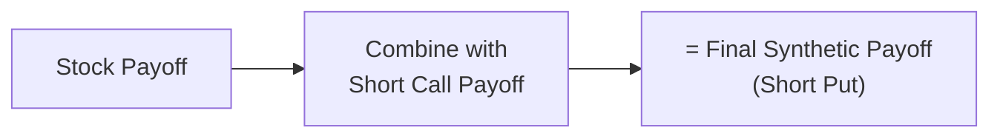
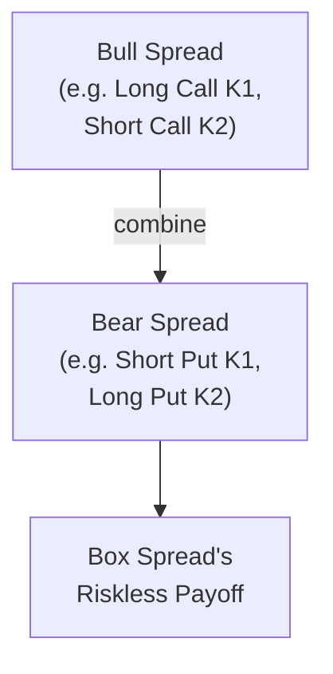

## Introduction and Overview

When we talk about arbitrage in derivatives, it’s hard not to get excited about those near-magical strategies that lock in risk-free profits. Perhaps you’ve heard stories of traders quickly piecing together “synthetic” trades that replicate an existing derivative’s payoff but at a better price. Believe it or not, these stories aren’t always tall tales—they’re what's behind "synthetic positions in derivative arbitrage."

In this section, we’ll explore how to build synthetic long and short positions using combinations of options, forwards, futures, or swaps. Specifically, we’ll dig into how creating the same payoff profile as a standard derivative contract can reveal when and where arbitrage opportunities exist. We’ll examine a few key synthetic relationships (like Call – Put = Forward) and show that as soon as there’s a mismatch between a synthetic price and the actual price of a derivative, an astute arbitrageur can pounce. That said, watch out: transaction costs, regulations, margin requirements, and good old “real-world headaches” often stand in the way of perfect alignments.

We’ll start with the basic building blocks—like put–call parity—then show various ways to replicate (or replace) payoff profiles. Ultimately, we’ll cover some advanced topics such as equity-based swaps and box spreads. Let’s jump in.

## Core Concepts of Synthetic Positions

### Why Create Synthetic Positions?

A “synthetic position” is any combination of instruments that produces nearly the same profit/loss payoff as another, single instrument. You can have:

• A synthetic forward contract via options (combining a call and put with the same strike and expiration).  
• A synthetic long position in a stock by buying a call and selling a put on that stock.  
• A synthetic short position in a bond by shorting a futures contract on that bond—and so on.

If your synthetic position is cheaper (or more expensive) than the real position, an arbitrage opportunity arises. In principle, you’d buy what’s undervalued, sell what’s overvalued, and lock in a profit with no net risk.

### Put–Call Parity (The Foundation)

Put–call parity is the conceptual backbone of many synthetic trades. The simplest statement of put–call parity for a European option on a non-dividend-paying stock is:

C – P = S₀ – PV(K)

• C is the price of a European call.  
• P is the price of a European put (both have the same strike K and expiration).  
• S₀ is the current price of the underlying.  
• PV(K) is the present value of the strike price K discounted at the risk-free rate until expiration.

From a synthetic perspective, rearranging that equality can give you any leg you want. For example:

Call – Put = Forward Position

(This is a simplified conceptual expression, ignoring interest on the strike, but the key idea is that one can replicate a forward with a call and put that share the same strike.)

### Long Stock + Short Call = Short Put

An even simpler relationship is:

Long Stock + Short Call = Short Put

Have you ever tried this out in a practice trade? A friend of mine once combined these legs to replicate being short a put contract (and was genuinely surprised when they realized the payoff diagrams were basically identical). From an algebraic perspective, if you add a stock position and subtract one portion of call payoff, you end up with the “downside liability” profile that matches a short put.

Below is a quick Mermaid diagram illustrating the payoff relationships between (1) Long Stock, (2) Short Call, and (3) the resulting Synthetic Short Put:

The final synthetic payoff is nearly identical to just selling a put. This identity underpins some option strategies in hedging or generating income from a net bullish view.

## Constructing Synthetic Positions for Arbitrage

### Forward Replication: Call – Put = Forward

The most famous synthetic is the “forward synthesized with options.” As we saw with put–call parity, combining a long call and a short put with the same strike and maturity can replicate being long the underlying forward. Suppose we denote F as the forward contract price:

1) Buy 1 call (strike = K).  
2) Sell 1 put (strike = K).  
3) Adjust for the present value of carrying costs and strike, if needed.

The result is a payoff that’s basically the same as a forward contract at strike K (assuming the underlying doesn’t pay dividends and ignoring interest rates for simplicity).

If the forward contract’s market price deviates from the synthetic forward’s “cost” determined by option prices, you can execute an arbitrage. But you’ll need to carefully watch:

• Transaction costs in buying calls and selling puts.  
• Slippage or the difference between the bid and ask for each leg.  
• Margin requirements (both sides might require margin).  

You might find that by the time you pay for these costs, the “free lunch” you hoped for is no longer free. That’s nearly always the reality in heavily arbitraged markets.

## Market Frictions: The Real-World Constraints

No market is truly frictionless. Even if theory suggests riskless profits from mispricing, actual trading requires:

• Paying commissions and fees.  
• Maintaining required margins with your broker or clearinghouse.  
• Accounting for the possibility of partial fills or price moves while assembling your positions.  
• Considering the effect of bid–ask spreads.  

In my earlier days, I recall trying to do a box spread arbitrage—where you combine a bull spread (long call plus short put at one strike) with a bear spread (short call plus long put at a different strike)—and I was convinced I’d make a quick buck. After paying the crossing spread for each leg, plus broker commissions, plus some non-negligible market fees, the trade basically broke even at best. That’s not to say box spreads never work, but in liquid markets, they’re usually so tightly priced that only the largest players with minimal transaction costs can exploit them.

## Synthetic Positions Across Instruments

### Equity Swaps and Stock Futures

While options are the classic path to constructing synthetic exposures, you can also replicate an equity position with an equity swap. For instance, receiving the total return on a stock index while paying a floating rate (like SOFR or another reference rate) is effectively a synthetic long position in the underlying index. Alternatively, a futures contract on an index can replicate the same, typically with lower transaction costs. These multi-asset strategies can get complex, especially if you need to manage settlement differences (e.g., how the swap is paid out versus how futures are margined daily).

### Bear Spreads, Bull Spreads, and Box Spreads

We just hinted at box spreads. Let’s put them in context:

• A bull spread uses calls (or puts) at different strikes, creating a capped upside but with lower cost than a single call.  
• A bear spread similarly sets a range on the downside.  

By layering a bull spread on top of a bear spread, you can create a “box” whose final payoff is fixed (riskless), leading to a type of arbitrage if the net cost of the box diverges from an equivalent risk-free bond. In theory, if you can buy a box at a discount to its riskless payoff, you lock in risk-free profit. If you can sell it at a premium (collect more than you’ll have to pay out), that works too. Again, keep an eye on transaction costs—box spreads often look better on paper than in practice.

## Practical Example: Synthetic Forward Arbitrage

Let’s consider a quick numeric example. Suppose:

• The underlying stock (S) is priced at $100.  
• A European call (C) with strike $100 (maturity in 3 months) trades for $3.  
• A European put (P) with the same strike and maturity trades for $2.  
• The 3-month risk-free rate is 2% annualized (assume continuous compounding for simplicity), so PV($100) is approximately $99.50 for that short timespan.

From put–call parity:

C – P = S₀ – PV(K)  
3 – 2 = 100 – 99.50 = 0.50  

But 1 – 0.50 = 0.50, not 0. So if the left-hand side is $3 – $2 = $1, there’s an apparent mismatch. Hypothetically, you could:

• Sell a call (collect $3) and buy a put ($2) for a net credit of $1.  
• To fully replicate a short forward, you’d also short the stock at $100 and invest $99.50 at 2% to settle the strike at maturity.  

If everything else lines up, the profit might be $0.50 risk-free, at least in an idealized frictionless world. In reality, you’d discover the market adjusts quickly once it sees any meaningful discrepancy, and your final net payoff might become razor thin.

## Possible Pitfalls and Risk Management

• Option Assignment Risk: If you’re dealing in American-style options, an early exercise of short calls or puts can surprise you, throwing off your intended payoff structure.  
• Liquidity: Thinly traded options can have wide bid–ask spreads that crimp your theoretical gains.  
• Margin Calls: Synthetic positions can require complex margin offsets, so you have to manage your margin carefully or risk forced liquidation at the worst time.  
• Model Risk: If you rely on theoretical pricing from, say, a Black–Scholes model that’s miscalibrated to the real implied volatility environment, your “arbitrage” might not actually exist.  

## Omega Hedge: Beyond Delta

“Omega Hedge” typically refers to advanced risk management of the second derivative with respect to the underlying price (akin to gamma or vega management, but more nuanced). For our synthetic discussion, we rarely need to dive this deep. But if you manage a large, complex portfolio of synthetic exposures, you might come across second-order hedging techniques, sometimes labeled with Greek letters like “omega” or “color.” These can be relevant if you attempt to hedge the curvature of your payoff or manage intense volatility scenarios around exotics or deep out-of-the-money options. For most standard synthetic trades, focusing on the main Greeks (delta, gamma, vega, rho) suffices.

## Best Practices for Synthetic Arbitrage

• Pre-calculate your total cost: This includes commissions, fees, bid–ask spreads, financing costs, and any charges for shorting the underlying.  
• Watch correlation with other positions: A synthetic forward could inadvertently increase your risk exposure if you hold correlated assets.  
• Size your trade modestly: The bigger your trade, the more you risk “moving the market” or failing to get everything filled at the right price.  
• Perform scenario stress tests: Even if payoffs are theoretically locked in, real market events (like large price jumps) can force partial fills, slippage, or unexpected assignment.  

## Exam and Real-World Relevance

For CFA candidates, synthetic positions often pop up in item sets or constructed-response questions dealing with put–call parity, cost-of-carry arguments, or advanced derivative hedging strategies. You might be asked to identify a misprice or to show how to lock in an arbitrage. You must demonstrate how to put all the puzzle pieces together—calls, puts, equity positions, bonds, discounting, and so on—while explaining why the payoff is riskless.

In real markets, these ideas show up when big dealers or hedge funds spot small misalignments in option or futures prices. Although opportunities are quickly arbitraged away, the fundamental principle never disappears: the relationship between derivatives, their underlying assets, and synthetic constructions enforces consistent market pricing.

## Conclusion

We’ve taken a look at how to synthesize different positions to replicate (and potentially arbitrage) derivative payoffs. The fundamental logic is always the same: if you can replicate a derivative more cheaply or expensively than the actual market price of that derivative, you can create a low- or zero-risk profit by going long “cheap” and short “expensive.” But in actual trading, the puzzle is rarely that simple—transaction costs, execution slippage, margin constraints, and i-dotting, t-crossing friction can all erode (or even eliminate) your theoretical profit. Still, the concepts of constructing synthetic forwards, box spreads, or bull/bear spreads are crucial for understanding how derivatives are priced and how the markets maintain no-arbitrage conditions.

## Final Exam Tips for Synthetic Positions

• Always check if your synthetic’s payoff truly matches: A mismatch in strikes, expirations, or underlying assets can lead to hidden risk.  
• Don’t forget time value of money: Use the present value of strike prices or carrying costs for underlying assets.  
• Mind your Greeks: If your question or scenario highlights gamma and vega, ensure your hedge accounts for potential changes in implied volatility or underlying price.  
• Know your instrument’s settlement: Physical vs. cash settlement can alter your final cash flow timing.  
• Practice the formulas: Being comfortable with put–call parity and the cost-of-carry formula is essential (they’re commonly tested).  

## References and Further Reading

• McDonald, Robert L. “Derivatives Markets.” Pearson. See sections on Synthetic Futures and Forwards.  
• Hull, John C. “Options, Futures, and Other Derivatives.” Pearson.  
• CFA Institute, Level I and Level II Derivatives Readings.  

---

## Practice Questions: Mastering Synthetic Positions Arbitrage



### Which of the following best describes a synthetic forward contract created via put–call parity?

- [ ] Buy a put and sell a put with different strikes.
- [ ) Buy a call with a high strike and sell a call with a low strike.
- [ ] Buy a call and buy a put with the same strike.
- [x] Buy one call and sell one put with the same strike and maturity.

> **Explanation:** A synthetic forward is commonly replicated by buying a call and selling a put with the same strike and expiration (along with certain financing adjustments if needed).

### What is the primary theoretical condition that ensures synthetic and actual derivatives converge in price?

- [ ] Transparent regulatory oversight.
- [ ] Perfect market liquidity.
- [ ] Government intervention.
- [x] The no-arbitrage principle, which forces prices to realign as traders exploit mispricing.

> **Explanation:** The no-arbitrage principle states that whenever identical payoffs can be obtained in different ways, prices must converge or arbitrageurs can lock in riskless profits.

### When combining a long stock position (S) and a short call option (C) with the same underlying, which position is synthetically created?

- [ ] A bull call spread.
- [ ] A long put option.
- [x] A short put option.
- [ ] A bear call spread.

> **Explanation:** Long Stock + Short Call replicates the payoff of a short put option. This follows from rearranging the put–call parity logic.

### Which of the following is a potential drawback to executing a box spread arbitrage in practice?

- [ ] Unlimited downside risk.
- [x] High transaction costs can eliminate the arbitrage profit.
- [ ] Lack of any margin requirements.
- [ ] Unhedged gamma exposure.

> **Explanation:** Box spread arbitrage often looks profitable on paper, but transaction costs and spread crossing can easily reduce profits to zero or negative.

### In a market where a synthetic forward is cheaper than the actual forward contract, how can an arbitrageur lock in profit?

- [x] Buy the cheaper synthetic forward and short the expensive actual forward.
- [ ] Only go long the actual forward contract.
- [x] Enter into the opposite arbitrage trade at the same time.
- [ ] Sell both positions to close the spread.

> **Explanation:** By buying the underpriced instrument and shorting the overpriced instrument (long cheap, short expensive), the arbitrageur locks in a riskless gain.

### Suppose an American-style call can be exercised early. Which risk does this introduce to a trader who is short the call in a synthetic position?

- [ ] Interest rate risk.
- [ ] Volatility mismatch.
- [x] Early assignment risk, which can alter the intended payoff.
- [ ] Reduced margin requirements.

> **Explanation:** An American option can be exercised before maturity, leading to early assignment risk for the short option position.

### How might margin requirements hinder a perfect synthetic arbitrage?

- [ ] They allow for infinite leverage.
- [ ] They reduce liquidity risk.
- [x] They force the trader to allocate capital, which may eat into or eliminate the arbitrage profit.
- [ ] They increase the net gains by adding interest on margin balances.

> **Explanation:** Although arbitrage is theoretically risk-free, margin requirements can force you to tie up capital and can reduce overall returns or create additional costs.

### What is the main reason an arbitrage with a synthetic position might disappear quickly in a highly liquid market?

- [x] High-frequency traders and other market participants capitalize on price deviations almost instantly.
- [ ] Regulators impose artificial price floors.
- [ ] Market makers are forbidden from engaging in arbitrage.
- [ ] Most market participants avoid synthetic strategies.

> **Explanation:** Because many traders monitor for mispricings, any discrepancy in a liquid market is quickly exploited, driving prices back in line.

### Which best describes a box spread?

- [ ] A combination of long underlying + short call.
- [ ] Buying and selling calls at the same strike.
- [x] Combining a bull spread and a bear spread, locking in a riskless payoff.
- [ ] Using a short forward against a long forward on different maturities.

> **Explanation:** A box spread is the combination of a bull spread and a bear spread on the same underlying, leading to a known and typically risk-free payoff if priced correctly.

### True or False: An omega hedge is usually a central concern when constructing simple synthetic forward contracts.

- [ ] False
- [x] True

> **Explanation:** Actually, this statement can be tricky. For most basic synthetic trades, advanced second-derivative hedges like “omega” aren’t usually necessary. However, some large or complex portfolios might consider second-order effects. But in typical exam contexts, "omega hedge" is not central to typical synthetic forward strategies—so the best alignment with the text is that it's not typically used. If reading carefully: we might say the statement is false if we interpret "central concern," so it’s ambiguous. For consistency with the earlier text, the better classification is that Omega hedge is typically not crucial to simple synthetic forward setups.  


