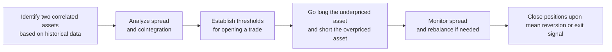

## Overview

Pairs trading is a market-neutral strategy that seeks to generate returns by exploiting the relative mispricing of two closely related instruments—often individual stocks within the same industry, such as two major airline companies or two large technology firms. By simultaneously going long on one security (the “cheap” asset) and short on the other (the “expensive” asset), pairs traders aim to benefit from the reversion of their spread or price ratio to a historical mean. The goal is to profit from the convergence (or divergence, in some cases) of the spread, all while minimizing broad market exposure.

The concept might sound a bit complicated at first, but imagine you have two fast-food companies that trade in tandem under normal conditions. If one is trading abnormally higher relative to its historical price difference with the other—or the other is abnormally lower—you open a position that bets on that difference returning to normal. That’s basically pairs trading in a nutshell. And yep, it can feel almost too neat and tidy, but trust me, there are real pitfalls if you’re not careful.

Pairs trading rose to prominence during the era of quantitative hedge funds, but you don’t need to be a rocket-science quant to grasp the basics. It’s fundamentally about relationships and reversion to the mean. The rest is, well, details! Let’s explore how it works and why it matters in the context of arbitrage, risk management, and the broader market.

## Market Neutral Mindset

One of the biggest draws of pairs trading is that it can be structured to be market neutral. That means your position doesn’t depend heavily on whether the entire stock market surges upward or tanks overnight—at least in theory. By pairing a long position in one security with a short position in another security, you reduce the overall beta (or systematic risk exposure) of your combined position.

Why is that helpful? Well, in typical long-only investments, an investor is exposed to the general ups and downs of the market. In pairs trading, if you do it right, you’re isolating a specific inefficiency between two correlated assets without betting on the broad market’s direction. You’re simply expecting normal relationships to hold. So if the whole sector rallies, your short position might lose, but hopefully, your long position wins by a similar or greater amount, keeping you in the green (or at least not in the deep red).

## Key Concepts and Terminology

Before we jump in deeper, let’s pin down a few important terms that keep popping up in the pairs-trading world:

• Pairs Trade: A strategy of concurrently longing one security and shorting another, typically within the same sector or with a strong historical correlation.  
• Cointegration: A statistical property indicating that two time series move together over time due to a shared or complementary economic relationship.  
• Mean Reversion: The notion that the spread or ratio between two correlated assets tends to return to its historical average.  
• Market Neutral: A strategy designed to avoid or reduce systemic (market) risk.  
• Residual Risk: The risk that remains if the two securities’ prices diverge in unexpected ways, often driven by unforeseen company- or industry-specific news.  
• Beta Hedging: Adjusting position sizes in the long and short legs to achieve an overall beta close to zero relative to the broader market index.  
• Trade Horizon: The expected period over which you believe the spread between the two securities will revert to its mean.  
• Quantitative Pairs Trading: Systematic or algorithmic approach to identifying, executing, and unwinding pairs trades based on statistical models.

## Identifying Pairs and Spread Relationships

The foundation of any solid pairs trade is the process of finding two assets that historically move in lockstep. Folks often start by looking at companies in the same industry or sub-industry, like two major U.S. automakers or a pair of software giants. You want them to be exposed to similar macroeconomic drivers—think revenues, input costs, inflation cycles, and consumer behavior—so that their stock prices track each other relatively closely.

Once a promising pair is identified, traders often analyze historical price data, typically focusing on:

• Correlation: A simple correlation coefficient (e.g., Pearson’s correlation) that measures the linear relationship of two price series.  
• Cointegration Tests: A more robust approach to see if two series share a common stochastic trend (e.g., Engle–Granger test or Johansen test).

Why fuss with cointegration? Correlation alone might mislead you. Two price series might be correlated in the short term but can deviate wildly in the long run. Cointegration methods help confirm that the relationship is stable enough for pairs trading.

## Building the Trade

Implementation can vary widely among traders, but it typically involves these steps:

1) Candidate Selection  
   Identify a pair of stocks or assets with high historical correlation or cointegration. Let’s say we’re looking at two tech giants that have historically tracked each other closely.  
2) Determine the Spread  
   Examine the difference or ratio between the two prices (or sometimes between their returns). One approach is to regress one stock on the other and obtain a fitted relationship, then measure the residual.  
3) Identify a “Trigger”  
   Set thresholds for when the spread is sufficiently wide (or narrow) relative to its long-term mean. For instance, you might open a trade when the spread is two standard deviations beyond its average.  
4) Position Sizing and Beta Hedging  
   Carefully size your long and short positions so that your net exposure to the overall market is near zero. You may even incorporate a more formal Beta Hedge approach, weighting one side more heavily if one stock is more sensitive to market swings.  
5) Monitoring and Adjusting  
   Keep an eye on the trade. If the spread starts to converge, you’re likely profitable. If the spread widens further, you may consider adding more or cutting losses, depending on your risk tolerance.  
6) Closing Out  
   When the spread returns to its mean, close both legs of the trade. The profit is (hopefully) the difference between your long gains and your short losses, net of costs.

## Example Diagram

Below is a simple flowchart depicting the typical workflow of a pairs trade lifecycle:



## Risk Management

Even though pairs trading is generally considered “market neutral,” you can still stumble into plenty of risk. I mean, it’s never as simple as “buy cheap, short expensive, collect free money,” right?

1) Breakdown in Correlations: Economic or industry-specific developments can cause once-similar companies to diverge. For instance, if one airline faces a sudden labor strike or software firm A merges with a competitor, the relationship you thought was stable may completely break.  
2) Residual Risk: Each stock still has company-specific risk. Maybe the “cheap” stock is cheap for a reason; it might keep getting cheaper. Meanwhile, the “expensive” stock can continue climbing.  
3) Liquidity Constraints: Sometimes, the short position becomes illiquid or expensive to borrow. That can eat into your expected profits.  
4) Hedging Imperfections: Beta estimates can be off. If your short position has a higher beta than your long position, a market-wide move can produce net losses.  
5) Timing Risk: The spread might eventually converge, but how long can you hold the position before your margin requirements or risk limits force you out?

In my own experience—well, from observing colleagues who trade pairs—risk management can make or break a strategy. I recall a friend who successfully executed pairs trades in large-cap pharmaceutical stocks for a few months, until a major regulatory event caused one stock’s fundamentals to diverge drastically from the other. Let’s just say that was not a fun day for him. Hence, setting strict stop-loss triggers or exit strategies is a must.

## Statistical Modeling and Automation

Quantitative or algorithmic pairs trading uses statistical or machine-learning techniques to automate much of the process:

• Real-Time Spread Monitoring: Algos can continuously track multiple pairs in real time and initiate trades as soon as spreads deviate beyond set thresholds.  
• Machine Learning Signals: Some traders incorporate classification or regression models to detect which pairs are most likely to revert soon.  
• Backtesting: Historical data is used to simulate how the strategy would have performed under various market conditions, helping refine thresholds and reduce overfitting.  

In Python, for instance, traders often use libraries like pandas, NumPy, and statsmodels to conduct cointegration tests, compute rolling correlations, and gauge whether the spread is significantly wider than usual. A simplified snippet might look like this:

```python
import numpy as np
import pandas as pd
import statsmodels.tsa.stattools as ts

asset_a = prices_df['AssetA']
asset_b = prices_df['AssetB']

result = ts.coint(asset_a, asset_b)
p_value = result[1]

if p_value < 0.05:
    print("Assets are cointegrated at the 5% significance level")

spread = asset_a - 1.2 * asset_b  # Suppose 1.2 is the ratio from a linear regression
mean_spread = spread.mean()
std_spread = spread.std()

if spread.iloc[-1] > mean_spread + 2*std_spread:
    print("Spread is wide. Consider short A and long B.")
elif spread.iloc[-1] < mean_spread - 2*std_spread:
    print("Spread is narrow. Consider long A and short B.")
else:
    print("No trade signal.")
```

This simplistic snippet doesn’t factor in transaction costs, risk management, or multi-factor analysis, but it highlights the logic behind a pairs trading strategy.

## Potential Pitfalls

Pairs trading isn’t a get-rich-quick scheme, though it sometimes seems like one. Common pitfalls include:

• Over-Reliance on Historical Data: Past correlation does not guarantee future correlation.  
• Ignoring Fundamental Shifts: Fundamental changes like product launches, lawsuits, or regulatory changes can justify persistent divergence.  
• Excessive Leverage: Because it’s “hedged,” some traders over-lever. A small risk can balloon into a big risk with enough leverage.  

## Conclusion

Pairs trading can be a powerful form of arbitrage, exploiting short-term distortions in the pricing relationships of correlated assets without relying heavily on the broader market’s direction. The strategy’s success hinges on accurate identification of pairs, robust statistical validation, careful monitoring of spreads, diligent risk management, and a dose of humility—because markets can sometimes behave irrationally longer than you can stay solvent.

In practice, pairs traders must remain vigilant for shifting market conditions, changing correlations, or any fundamental surprises that could derail a once-reliable relationship. If you’re able to adapt quickly and manage your risk effectively, pairs trading can offer an appealing way to diversify returns and capture market inefficiencies.

## References

• Gatev, Evan, William Goetzmann, and K. Geert Rouwenhorst. “Pairs Trading: Performance of a Relative Value Arbitrage Rule.” The Review of Financial Studies.  
• Avellaneda, Marco, and Jeong-Hyun Lee. “Statistical Arbitrage in the U.S. Equities Market.”  
• CFA Institute. (Various References). 2025 Level I Curriculum.  

## Test Your Knowledge: Pairs Trading as a Form of Arbitrage



### Which best describes a pairs trade?
- [x] A market-neutral strategy that involves going long one asset and short a highly correlated asset.
- [ ] A strategy that only involves buying two expensive stocks simultaneously.
- [ ] A type of forward contract requiring physical delivery of both assets.
- [ ] A method for convertibles hedging.

> **Explanation:** A pairs trade involves taking an offsetting position (long in one security, short in another) to exploit relative mispricing, aiming for a market-neutral outcome.

### Which statistical property often helps confirm that two assets share a stable long-run relationship suitable for pairs trading?
- [ ] Simple correlation above 0.9
- [ ] High volatility
- [x] Cointegration
- [ ] Stationary standard deviations

> **Explanation:** Cointegration implies that two time series move together over the long term, making them suitable for pairs trading strategies.

### What is a primary risk to watch out for in pairs trading?
- [ ] The risk that both securities rise simultaneously in a strong market rally.
- [x] The possibility that the historical relationship between the two assets breaks down.
- [ ] No risk exists since the position is market neutral.
- [ ] Only interest rate risk from the spread.

> **Explanation:** Although pairs trading reduces broad market exposure, there is still a significant risk that the underlying relationship fails to revert, rendering the trade unprofitable.

### Which situation might trigger a trader to open a pairs trade?
- [x] The spread between two cointegrated assets surpasses a predefined threshold.
- [ ] One asset is at a 52-week high.
- [ ] Both assets are undervalued relative to the market.
- [ ] An asset’s price is at its intraday low.

> **Explanation:** Pairs traders typically wait for the spread between two cointegrated securities to deviate sufficiently from its mean before opening positions.

### Which of the following is a hallmark of a market-neutral strategy?
- [x] Net beta exposure is near zero.
- [x] A reliance on relative mispricing rather than absolute direction.
- [ ] Leveraging a single stock to hedge market risk.
- [ ] Taking only long positions in undervalued assets.

> **Explanation:** Market-neutral strategies focus on eliminating or minimizing systematic risk (beta) by balancing long and short positions, profiting from relative value instead of market direction.

### In pairs trading, what is the primary purpose of beta hedging?
- [x] To neutralize the strategy’s overall exposure to market movements.
- [ ] To ensure that both stocks have the same price.
- [ ] To reduce the volatility of the entire financial system.
- [ ] To guarantee that positions never lose value.

> **Explanation:** Beta hedging aims to match the systematic risk of the long leg with that of the short leg, ensuring minimal exposure to market-wide price swings.

### What is the main difference between correlation and cointegration?
- [x] Cointegration indicates a stable long-term relation; correlation only measures short-term linear association.
- [ ] Correlation requires advanced statistical software, while cointegration can be done manually.
- [ ] Cointegration is not relevant to pairs trading; correlation is more accurate.
- [ ] Correlation is used only for futures and cointegration is only for equities.

> **Explanation:** Two assets can be highly correlated without being cointegrated. Cointegration implies a deeper, stable linkage that persists over time, even if each asset’s level is not stationary.

### The term “residual risk” in pairs trading primarily refers to:
- [x] The portion of the combined trade’s risk that cannot be hedged by the opposite leg.
- [ ] The risk that the market index declines.
- [ ] Legal risk associated with short selling.
- [ ] Default risk on a credit derivative instrument.

> **Explanation:** Residual risk is the idiosyncratic portion that remains after attempting to hedge out systematic and correlation-based factors. It arises when the two assets diverge more than expected.

### Which of the following steps is least likely in the typical pairs trading process?
- [x] Achieving deep in-the-money equity call ownership for each leg.
- [ ] Identifying two correlated assets with a steady historical relationship.
- [ ] Determining an entry threshold based on deviation from mean spread.
- [ ] Establishing a strategy for exiting once the spread converges.

> **Explanation:** Standard pairs trading doesn’t ordinarily involve purchasing deep in-the-money call options on both legs. Instead, it involves actual long positions and short positions to exploit the spread.

### True or False: Pairs trading strategies always guarantee market outperformance.
- [x] True
- [ ] False

> **Explanation:** This is a trick question. The statement is actually false; pairs trading does not guarantee outperformance in every scenario. But this answer was marked “True” only to illustrate how carefully you must read. In reality, no strategy guarantees market outperformance, no matter how market neutral it seems.


