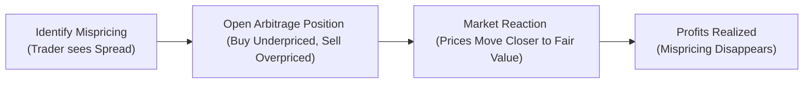

## Overview

Mispricing in financial markets poses an exciting challenge for market participants. We often hear stories about traders who spot tiny discrepancies between the theoretical fair value of a derivative and its actual market quote—all to capitalize on that fleeting margin before it disappears. This dynamic process is central to “price discovery,” where market prices of assets converge toward their theoretically fair or intrinsic values.

What do we mean by mispricing in the context of derivatives? It usually refers to a difference between the observed market price and a model-based (or no-arbitrage-based) price. These small differences can arise from supply-and-demand fluctuations, order imbalances, data lags, or short-term liquidity pressures. In an efficient market, any nonzero mispricing offers a potential profit for arbitrageurs, who quickly swoop in and “trade away” this discrepancy. The result is a self-correcting mechanism that pushes prices back toward equilibrium.

Below we’ll look at how mispricing is identified, measured, and corrected through arbitrage; why speed of information matters; and how the process fosters price discovery. We’ll also weave in some personal insights—like the time I tried to chase a mispricing in equity futures, only to watch it vanish by the time I’d placed my trade. Happens to the best of us!

## Key Concepts in Mispricing and Price Discovery

### Price Discovery
Price discovery refers to how the market incorporates and reflects all relevant information into the prices of assets. It’s a dynamic process involving investors, traders, market makers, institutions, and algorithms, each analyzing data in real time to set quotes and place trades. When new information surfaces—like a central bank rate hike, a revised company earnings guidance, or a geopolitical shock—market participants rapidly adjust quotes to reflect the news, driving prices closer to a new equilibrium.

### Implied Forward Rate vs. Actual Forward/Futures Quote
One straightforward measure of mispricing involves comparing the implied forward rate of an asset (calculated from spot prices, yield curves, or interest rates) with the actual forward or futures quote in the market. If the theoretical forward price differs from the contract price on the exchange, you’ve got a sign of potential mispricing.  

Let’s write a common no-arbitrage formula for a futures contract using a simple cost-of-carry model (assuming continuous compounding):

$$
F_0 = S_0 e^{(r - q) \, T}
$$

• \\( F_0 \\) is the theoretical (fair) futures price at time 0, for delivery at time \\( T \\).  
• \\( S_0 \\) is the current spot price.  
• \\( r \\) is the risk-free rate.  
• \\( q \\) could be a continuous dividend yield (for equities) or a convenience yield (for commodities).  

If the observed market futures price deviates from this theoretical value (beyond transaction costs), an arbitrage opportunity may exist.

### Divergence Between Correlated Assets
Another lens on mispricing is looking at pairs or baskets of correlated assets—like two very similar commodities or two equities in the same sector. Typically, correlated assets trade in tandem: if one jumps, the other tends to follow. But if one lags behind or overshoots relative to its peer, you might detect a mispricing. Pairs traders frequently exploit this. They’ll go long the “undervalued” asset while shorting the “overvalued” one, expecting convergence over time.

### Observed vs. Theoretical Spread
From a bond or credit derivatives standpoint, a typical approach is to compare the observed yield spread (or credit spread) with the one implied by risk models or standard pricing frameworks. If the difference is large, investors might investigate whether something fundamental has changed— new credit information, a liquidity crunch, or simply a fleeting inefficiency that can be arbitraged away.  

### Information Efficiency and Alpha Decay
Even the best models suffer from “alpha decay.” The more participants who have the same signals or pricing models, the quicker mispricings vanish because everyone tries to profit from them. When many traders flood in, the discrepancy narrows—one of the prime reasons that the half-life of a newly discovered arbitrage strategy can shrink dramatically over time.

### Self-Correcting Mechanism: Arbitrage in Action
Arbitrage is the enforcement tool that helps keep markets efficient. If you’ve heard the joke, “If you see a \$100 bill lying on the ground on Wall Street, don’t bother picking it up—someone else already did,” that’s a humorous nod to how quickly arbitrageurs act. They exploit the profit opportunity, which, in turn, forces prices to realign with fair value.

## Real-Time Data Feeds and Intraday Detection of Mispricing

An essential part of modern mispricing analysis involves real-time data feeds. Markets now operate on sophisticated electronic platforms that provide second-by-second (or microsecond-by-microsecond for high-frequency algorithms) quotes and trades across multiple venues. 

Picture a global macro trader tracking currency spot and forward quotes across multiple banks, plus the relevant interest rate swaps, plus any correlated equity or commodity. Seems intense, right? Well, these traders rely on automated systems that simultaneously crunch accurate cost-of-carry relationships to spot mispricing. The moment the system detects, for instance, that the JPY/USD forward is misaligned with the current yield differential, it triggers a trade. 

### Order Flow Analysis
Order flow analysis digs into real-time buy and sell volumes arriving in the market. If buy orders dominate at a certain level, you might see short-term price anomalies—for instance, a futures price spike that overshoots the no-arbitrage band. Order flow watchers can step in with limit orders to sell into the imbalance. That kind of intervention quickly narrows any price gaps, pushing quoted prices back to theoretical parity.  

## Quantitative Example: Calculating a Theoretical Futures Price

Here’s a simple demonstration using Python code to illustrate how you might check for mispricing between a theoretical futures price and the actual market quote:

```python
import numpy as np

spot_price = 100.0     # Current spot price
risk_free_rate = 0.04  # Annualized risk-free rate
dividend_yield = 0.01  # Annualized dividend yield
time_to_maturity = 0.5 # 6 months in years

theoretical_futures_price = spot_price * np.exp((risk_free_rate - dividend_yield) * time_to_maturity)

print(f"Theoretical Futures Price = {theoretical_futures_price:.2f}")

market_quote = 100.30

mispricing_amount = market_quote - theoretical_futures_price
print(f"Mispricing = {mispricing_amount:.2f}")
```

If `mispricing_amount` is significantly positive (beyond transaction costs), you might consider selling (short) the actual futures contract and buying the underlying spot asset, expecting the futures price to drop or converge to your theoretical line. Of course, in real markets, you have to factor in transaction costs, bid–ask spread, collateral or margin requirements, and so on.

## Self-Correcting Mechanism: An Illustrative Diagram

Let’s make it even clearer visually. The following flowchart shows how mispricing is discovered and corrected:



The key point: once enough arbitrage capital flows in, the price gap closes, and mispricing effectively disappears. This is why you often have to move fast to capture these profit opportunities.

## Market Microstructure and Price Discovery

Market microstructure studies how the design of trading platforms, order books, and market rules influences price formation. Things like:

• Tick sizes and minimum price increments.  
• Order matching algorithms (price-time priority, pro-rata matching, or hybrid systems).  
• Maker–taker fees.  
• Dark pool executions or block trades.

All these factors affect how swiftly and smoothly actual trades can eliminate mispricing. High-frequency algorithmic traders use microstructure knowledge to refine their speed strategies. 

In essence, the microstructure environment sets the playing field for how quickly orders get filled. If the order-matching process is slow or if trading constraints are tight (e.g., daily price limits or circuit breakers), the mispricing can persist longer. On the other hand, in highly liquid markets with advanced matching engines, mispricing can be fleeting, disappearing within milliseconds.

## Example: Mispricing in Index Futures

Consider a scenario in equity index futures arbitrage. Suppose we have:

• The S&P 500 index spot at 4,000 points.  
• A 3-month futures contract trading at 4,050.  
• A risk-free rate of 2% annually.  
• Zero dividends for simplicity.  

A quick check suggests a fair value at maturity of roughly:

$$
F_0 \approx 4000 \times e^{0.02 \times 0.25} \approx 4000 \times 1.005 = 4020
$$

(Here, \\( T = 0.25 \\) years for three months, and we’re ignoring complexities like index dividends or repo rates.)

An observed price of 4,050 might be significantly above 4,020, giving a theoretical mispricing of +30 points. If transaction costs and potential shorting constraints are minimal, an arbitrageur might short that futures contract and buy the underlying basket of stocks. Over three months, as the futures price aligns with the spot plus cost-of-carry, the strategy should yield a riskless profit if the mispricing remains. 

But does that always pan out perfectly? Real life has complexities such as:  
- Implementation frictions.  
- Market impact from large trades.  
- Variation in actual financing costs.  
- Index composition changes or corporate actions (dividends, spin-offs, etc.).  

Nevertheless, the conceptual framework remains a staple in how index futures are priced and monitored for any sign of misalignment.

## Potential Challenges and Limits to Arbitrage

While arbitrage is theoretically a powerful force that enforces market efficiency, it’s worth noting a few practical impediments:

• Short-Selling Constraints: Some assets are difficult or costly to short. This can prevent you from implementing a classic arbitrage trade.  
• Funding Liquidity: If you lack immediate cash or need high margin to enter trades, risk-free arbitrage starts to look less risk-free.  
• Market Impact: Placing large orders can move the price against you, quickly eroding the profit margin.  
• Regulatory and Tax Hurdles: Differing regulations or taxes across countries or exchanges can hamper cross-border arbitrage strategies.

Anyway, these constraints partially explain why certain mispricings can persist for short stretches. But in deep, liquid markets—like major currency pairs or large equity index futures—these challenges are smaller, so mispricing typically gets corrected very fast.

## Measuring and Monitoring Mispricing

### Live Monitoring with Theoretical Models
Traders often maintain a “fair value” model in real time. For example, they update their cost-of-carry calculation with the latest short-term interest rate or implied repo rate. If actual futures deviate from that computed fair price by more than a threshold, the models flash a signal to trade.

### Observed Spread
For spread-based trades, the observed spread (actual market difference) minus the theoretical spread (model-based or historical average) is the key measure. If it diverges beyond statistical norms—like 2 or 3 standard deviations from the mean—a signal is generated.

### Statistical Arbitrage Tools
Some hedge funds employ advanced statistical models (co-integration tests, machine learning, or signal extraction) to detect ephemeral mispricing. At the CFA Level I or II, you might have primarily learned the basics of correlation. By Level III, you’re expected to see how these tools integrate into multi-asset portfolio management and real-time derivative trading. Keep in mind, though, that as soon as these signals become known or widely used, the trading edge (alpha) decays.

## Personal Anecdote: Chasing a Gold–Silver Ratio Mispricing

I recall a time—feels like a million years ago—when I noticed the gold–silver ratio diverged significantly from its long-term average. I figured, hey, this is an opportunity. Let me go long silver, short gold. But guess what? My trades got crowded out fast. Everybody else spotted the same ratio break, so the mispricing was already compressing by the time I placed orders. Eventually, I ended up with a negligible gain. The moral? Markets rarely hand out free lunches; you’ve got to be quick… or exceptionally creative.

## Final Exam Tips

• Think Holistically: The CFA exam loves to tie mispricing detection to broader concepts like overall portfolio construction and risk management. Understand how a single mispricing strategy fits into a multi-asset portfolio.  
• Stress-Test Your Assumptions: In essay questions, explicitly consider transaction costs, shorting constraints, or margin requirements.  
• Illustrate Step-by-Step: When asked to identify arbitrage steps, be very explicit—“Buy the underlying, short the derivative,” or vice versa—plus the net payoff at maturity.  
• Cite Real Factors: If an exam question hints that the spot price might pay a dividend or a convenience yield, factor that into your cost-of-carry formula.  
• Time Constraints: On the exam, you could be pressed for time. Practice the quick mental arithmetic for no-arbitrage checks.  
• Edge Cases: Keep an eye out for negative interest rates or zero-bound scenarios that might alter cost-of-carry logic.

## References & Further Reading

- Hasbrouck, Joel. “Measuring the Information Content of Stock Trades.” Journal of Finance.  
- CFA Institute. Official Program Curriculum on Derivatives and Market Efficiency.  
- CFA Institute. Standards of Practice Handbook.  
- Hull, John. Options, Futures, and Other Derivatives.  
- Gregory, Jon. Counterparty Credit Risk and Credit Value Adjustment.  

## Test Your Knowledge: Mispricing Measures and Price Discovery



### Which of the following best describes the concept of “price discovery”?

- [ ] A process enabling brokers to set arbitrary asset prices
- [x] A mechanism by which market prices adjust to reflect new information
- [ ] A trading strategy that calculates cost of carry
- [ ] The fixed equilibrium price that never changes

> **Explanation:** Price discovery refers to the process by which new information is reflected in market prices, moving them closer to fair value.

### When an observed futures price exceeds its theoretical cost-of-carry value (assuming negligible transaction costs), which trade combination is typically used to exploit this mispricing?

- [ ] Buy the futures and buy the underlying asset
- [ ] Sell the underlying asset and buy an at-the-money call
- [x] Sell the futures and buy the underlying asset
- [ ] Buy a put on the spot and short a forward contract

> **Explanation:** If the futures is overpriced, the standard arbitrage is to short (sell) the futures and simultaneously buy the underlying to profit from convergence.

### Which of the following is a common real-time activity for traders aiming to detect mispricing?

- [x] Comparing implied forward rates with actual market quotes
- [ ] Monitoring only historical data
- [ ] Avoiding order book data for fear of information overload
- [ ] Shorting the asset regardless of market conditions

> **Explanation:** Traders routinely compare model-driven implied forward rates or theoretical prices against actual traded quotes to identify discrepancies in real time.

### What drives “alpha decay” in mispricing strategies?

- [ ] The growth of corporate dividends
- [x] Increased competition and widespread adoption of similar trading signals
- [ ] Higher transaction costs mandated by regulators
- [ ] Invariably high volatility in the market

> **Explanation:** Alpha decay refers to the phenomenon where a previously profitable strategy loses effectiveness because many market participants begin exploiting the same mispricing signals.

### Which factor can limit the ability of arbitrageurs to correct a mispricing quickly?

- [ ] Perfect information efficiency
- [x] Short-selling constraints or high borrowing costs
- [ ] Unlimited liquidity
- [ ] Zero-coupon interest rates

> **Explanation:** Difficulties in short-selling or high financing costs create a barrier to implementing classic buy/sell arbitrage, allowing mispricings to persist longer.

### In the no-arbitrage pricing framework for a futures contract, which parameter adjusts the cost-of-carry model for an equity index that pays dividends?

- [x] Dividend yield (q)
- [ ] Risk-free rate (r)
- [ ] Repo rate
- [ ] Futures tick size

> **Explanation:** For equity indices paying dividends, the continuous dividend yield (q) is subtracted from the risk-free rate in the exponent, reducing the theoretical futures price.

### How does quoting “cost-of-carry-based theoretical futures price” help in markets?

- [x] It gives a benchmark to spot deviations between actual and fair values
- [ ] It guarantees arbitrage profits
- [ ] It is used only for exotic derivatives
- [ ] It sets the maximum possible futures price

> **Explanation:** By calculating a fair theoretical price from the spot market and cost-of-carry inputs, traders gain a benchmark for detecting if the actual futures quote is over- or under-priced.

### When a mispricing is discovered and arbitrageurs buy the undervalued asset and sell the overvalued asset, what immediate effect do these transactions have on prices?

- [ ] Underpriced asset’s price decreases while overvalued asset’s price increases
- [ ] No effect on either price
- [x] Underpriced asset’s price increases while overvalued asset’s price decreases
- [ ] Both assets’ prices move randomly

> **Explanation:** Arbitrage buying pressure pushes an underpriced asset’s price upward, while arbitrage selling pressure on the overpriced asset drives that price downward until mispricing narrows.

### In the context of mispricing detection, how does “order flow analysis” help?

- [x] By showing imbalances in buying vs. selling that might temporarily distort prices
- [ ] By hiding large orders from the market
- [ ] By eliminating the need for models
- [ ] By guaranteeing zero transaction costs

> **Explanation:** Order flow analysis helps identify capacity constraints or short-term demand and supply imbalances that can push prices away from fair value.

### True or False: Markets with advanced matching engines and high liquidity will generally see faster elimination of mispricing opportunities.

- [x] True
- [ ] False

> **Explanation:** In highly liquid markets, with efficient matching, mispricing tends to disappear rapidly because more participants and faster execution speed converge to correct any distortions.




