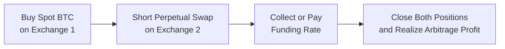

## Overview of the No-Arbitrage Principle in Crypto Markets

Let’s begin by highlighting that the same no-arbitrage principle we see in traditional financial markets also appears in crypto markets—albeit with a little more drama, thanks to much higher volatility and the occasional internet-buzz that, well, you know, sends coin prices hopping around like they’re on a trampoline. The fundamental premise is the same: if you can generate a sure profit by buying and selling the same asset (or related assets) simultaneously in two or more different markets with zero net investment, you’ve found an arbitrage. Any consistent presence of these so-called “free lunches” violates the idea that the market is efficient.

Institutions, market makers, and individuals alike all hunt for these opportunities—especially in the crypto sphere. In practice, crypto arbitrage can be driven by little more than the cross-exchange variation in Bitcoin or Ethereum spot prices. But it can also be a lot more complex, involving stablecoin pairs (like USDT, USDC, or even algorithmic stablecoins) or derivatives such as perpetual swaps and futures. We’ll explore both the simpler and the more nuanced versions below.

## Understanding Perpetual Swaps

A perpetual swap is a type of derivatives contract originally designed and popularized in the crypto realm. Traditional futures contracts have an expiry date; perpetual swaps do not. This means you can hold them indefinitely—so long as you can pay any funding costs that arise.

• Perpetual Swap Mechanics:  
  Imagine you have a typical Bitcoin Perpetual Swap contract. Its value is intended to track Bitcoin’s spot price. Since there’s no expiry, the exchange typically implements a periodic “funding rate” to ensure that the perpetual swap price converges to spot. If the swap is trading at a premium to the spot market, the funding rate may be positive, so long positions pay short positions. Conversely, if the perpetual swap trades at a discount, the funding rate might be negative, so shorts pay longs. This approach keeps the perpetual swap tethered to the underlying coin’s spot price.

• Funding Rate:  
  The funding rate is typically computed based on:  
  1. The interest rate differential between the crypto (or stablecoin) and fiat benchmarks.  
  2. The difference between the perpetual swap price and the spot price.  
  3. A time component (e.g., the rate gets updated every 8 hours).  

  Sometimes, the rate is small. Other times, particularly in bull markets, the rate can soar. In such cases, it can literally cost you a lot simply to hold a long perpetual swap position over time. This cost, of course, also creates arbitrage and hedging opportunities.

• Liquidation Engines:  
  Because crypto can get extremely volatile, perpetual swaps often come with robust liquidation engines. These automatically close out positions before they go deep into the red. So, if you’re leveraged and the market moves hard against you, the engine steps in. That’s probably not your happiest moment—but it keeps the rest of the market from big shortfalls or from dealing with insolvent counterparties.

## Cross-Exchange Arbitrage Strategies

Cross-exchange arbitrage in crypto is a fundamental tactic: buy a particular token, like ETH, on Exchange A (where it’s underpriced) and simultaneously sell it on Exchange B (where it’s overpriced). If the price discrepancy is greater than any transaction and slippage costs, you lock in a riskless profit. For example, if Exchange A’s BTC/USDT price is 25,000 USDT and Exchange B’s price is 25,100 USDT, you might buy at 25,000 on A and sell at 25,100 on B, collecting the 100 USDT difference (minus fees).

The concept expands to derivatives. If there’s a mismatch in the futures or perpetual swap prices for the same currency pair on different exchanges, you can go long on the cheaper futures contract and short on the more expensive contract. Over time, the below-market contract price should converge to the above-market contract price (or vice versa), netting you an arbitrage profit.

But keep in mind some real-world complexities:

• Exchange Reliability:  
  Some platforms may freeze order books or experience outages during high volatility. If you can’t close your positions, or if your margin is forced to get liquidated, your theoretical arbitrage profit could vanish.  

• Collateral Requirements:  
  Some exchanges demand stablecoins as collateral, while others let you deposit Bitcoin or Ether. The friction to shift collateral between platforms can hamper the speed of your trades.  

• Slippage and Fees:  
  If you’re trading large notional amounts, your specific orders might move the price (“slippage”). Exchange taker fees can also eat into your profits.

## Funding Rate Imbalances

In crypto markets, traders often look at the “basis” formed by the difference between the spot price and the perpetual swap price. This difference, or spread, is influenced by investor sentiment, liquidity, and the overall risk environment.

When markets are bullish, perpetual swap prices may trend above spot (i.e., a premium). That usually means the funding rate is positive because longs are the ones who want to ride that upward momentum and are effectively paying the shorts to stay in the game. During bearish markets, it’s the opposite.

Arbitrageurs exploit this in various ways. One straightforward approach is:

1. Buy the underlying crypto asset in the spot market.  
2. Enter a short position in the perpetual swap.  
3. Collect periodic funding payments if the funding rate is positive and the perpetual swap trades above spot.  

Your net exposure to the price movement is theoretically hedged if the position sizes match. However, you might be subject to something called “mark price” or “fair price” mechanics that the exchange uses to trigger liquidations. Always keep an eye on how the exchange calculates margin.

## Real-World Bottlenecks and Constraints

While the theory of arbitrage in crypto derivatives looks neat on paper, day-to-day practice can be murkier. For instance, maybe you see a big mismatch between BTC’s price on two major exchanges, but try moving large amounts of USDT from one exchange to the other. By the time your deposit has arrived, the window for profitable arbitrage may have closed. Or you might not trust the second exchange’s reliability because you heard some rumor about potential downtime. Let’s review the big ones:

• Stablecoin Liquidity:  
  Many crypto trading pairs revolve around stablecoins such as USDT or USDC. If stablecoin peg confidence ever dips, you could inadvertently face a decline in stablecoin value while you’re still in the middle of an arbitrage (which might reduce your profits once you convert back to fiat).

• Blockchain Transaction Times:  
  A Bitcoin transaction can take 10 minutes or more. If the network is congested, good luck turning that around in time to catch a momentary price discrepancy. Layer-2 solutions and faster blockchains exist, but each has unique risks and requirements.

• Regulatory Constraints:  
  Different countries treat crypto derivatives differently. In some jurisdictions, you might not have access to certain products or might face strict capital controls or reporting requirements. If you can’t open an account on the exchange that’s offering the best arbitrage, that potential profit is worthless to you.

• DeFi and Oracle Risk:  
  In decentralized finance (DeFi), perpetual swaps may rely on external or “oracle” price feeds. If oracles lag or fail during rapid price changes, discrepancies can occur. Traders might exploit these but face the risk that the protocol changes its pricing or reverts trades.

## Example: Spot-Futures or Spot-Perpetual Basis Arbitrage

Let’s illustrate a classic trade. Suppose you see that Bitcoin’s spot price is USD 25,000, while a BTC perpetual swap is quoting the equivalent of USD 25,300. You suspect this is a sign that the market is overbought in the perpetual swap. This is the classic “cash-and-carry” approach adapted to perpetual swaps:

1. Buy 1 BTC in the spot market at USD 25,000.  
2. Short 1 BTC of the Perpetual Swap at the implied price of USD 25,300.  
3. If the perpetual price remains above the spot price, you (as the short in the swap) collect the net positive funding payments.  
4. As the spread narrows—spot might rise a bit, or the perpetual might fall—a portion of your eventual profit arises from the spread returning to normal.  

The idea is that if the perpetual is indeed overpriced, there’s a mechanism (the funding rate) that incentivizes short selling. Ultimately, the price difference should converge, letting you close out both positions for an arbitrage gain—minus fees and any funding payments you might pay or receive in the interim.

## Diagram: Simple Cross-Exchange Arbitrage Flow

Below is a high-level flowchart illustrating how a trader might deploy a cross-exchange arbitrage strategy using a spot crypto purchase on one exchange and a short perpetual swap on another:

The key steps are:  
• Acquire BTC at a cheaper spot price (Exchange 1).  
• Short an equivalent position on another exchange’s perpetual swap (Exchange 2).  
• Periodically settle funding rates, which reflect market sentiment.  
• Close both legs when the spread disappears.

## Best Practices and Common Pitfalls

• Avoid Overleverage:  
  Yes, margin can amplify returns, but it can also crush you if volatility spikes. Crypto is notorious for sudden 10% or 20% moves within hours. Overleverage leads to forced liquidation, ironically turning a sure-win arbitrage into a losing situation.

• Watch for Fees:  
  Maker/taker fees, exchange withdrawal fees, deposit fees, custody fees—these add up quickly. A seemingly attractive 1% spread can vanish after you factor in 0.4% in trading fees, 0.3% in withdrawal fees, and so forth.  

• Slippage and Order Execution:  
  Markets move fast. If you’re not able to place both trades simultaneously, or if you try to do one leg and get “stuck” waiting to fill the other, you can be left exposed to the underlying price risk.

• Network Congestion:  
  Blockchain networks can become clogged, especially during peak times. This might inflate transaction fees or confirmation times. That’s an especially big deal if your plan relies on speed.

• Regulatory Surprises:  
  Crypto regulations evolve rapidly. Exchanges might unilaterally limit certain types of trades for certain jurisdictional customers. Keeping track of the compliance dimension is nontrivial but absolutely crucial.

## Real-World Anecdote

I remember one day being excited about a “juicy” arbitrage opportunity on a major altcoin. I saw a 3% difference in the altcoin’s price between two large exchanges. Hypothetically, that was easy profit, right? I quickly discovered that the altcoin in question had a super slow blockchain and minimal liquidity. By the time I got the funds over to the second exchange, about four hours passed and the difference flattened. Even worse, I paid a huge transaction fee on the altcoin network. So the final result? A big lesson: “check liquidity, check speed, and don’t forget fees.”

## Steps for Effective Arbitrage Implementation

1. Identify Exchange Pairs and Collateral Setup  
   • Research which exchanges have the largest liquidity for your intended asset.  
   • Set up collateral (stablecoins, BTC, or fiat) in both exchanges in advance, minimizing downtime.

2. Track Market Data in Real Time  
   • Use robust data feeds (through API or third-party aggregator).  
   • Monitor both spot and derivative (perpetual/futures) prices alongside funding rates.

3. Calculate Transaction Costs and Fees  
   • Estimate fees, potential slippage, withdrawal costs, and the possibility of partial fills.

4. Develop Automation and Execution Strategies  
   • If you’re serious about capturing fleeting opportunities, consider building or subscribing to an algorithmic trading platform that can place trades within milliseconds.

5. Manage Your Risk  
   • Maintain strong risk controls. Watch your margin usage carefully, especially in leveraged positions.

## Mathematical Angle: The Cost of Carry in Crypto

In a typical no-arbitrage model, the forward (or futures) price F₀ is given by:  

F_{0} = S_{0} e^{r (T - t)}
  
where  
• \\(S_{0}\\) is the spot price,  
• \\(r\\) is the risk-free rate (in the desired currency),  
• \\(T-t\\) is the time to maturity.

In crypto, the concept of “risk-free rate” can be complicated, especially if you’re dealing with stablecoins or yield-generating staking protocols. But the principle remains: if the forward price deviates too widely from the spot plus cost of carry, you have an arbitrage. In perpetual swaps, the “funding rate” effectively replaces the standard cost of carry mechanism with a continuous settlement approach.

## Conclusion

Crypto futures and perpetual swaps might look like a whole new frontier, but the underlying rules are still governed by time-tested finance concepts. The no-arbitrage principle, the cost of carry, convergence, and basis trading all apply with a twist or two for the unique features of blockchain technology. Whether you’re exploring cross-exchange spot opportunities or diving into the complexities of perpetual swap funding rates, the key is in the details: transacting quickly, controlling fees, managing risk, and staying compliant with ever-evolving regulations.

## Final Exam Tips

• Be prepared to apply the no-arbitrage framework to digital assets just as you do to equities or commodities.  
• Clearly understand the role of the funding rate in perpetual swaps: who pays, who receives, and how it keeps the contract tethered to the spot market.  
• Expect scenario-based questions requiring you to assess whether a given price difference or funding rate scenario presents a profitable arbitrage opportunity.  
• Keep an eye out for questions referencing how network speed, exchange fees, and regulatory hurdles might stall or negate otherwise profitable trades.  

## References

• Antonopoulos, A. M. (2017). Mastering Bitcoin. O’Reilly Media.  
• Binance Academy, “Perpetual Futures Contracts Explained.”  
• Coinbase Institutional Research, “Crypto Futures and Options: Primer.”  
• CFA Institute Articles on Cryptoassets and Digital Asset Valuation.  

---

## Test Your Knowledge: Arbitrage in Crypto Futures and Perpetual Swap Markets



### Which best describes the funding rate in a perpetual swap contract?

- [ ] A fee that stablecoin issuers charge for issuing new coins.  
- [ ] A payment made only when the contract expires.  
- [ ] The interest rate that central banks charge for overnight lending on crypto positions.  
- [x] A periodic payment or receipt that aligns the contract price with the spot price.  

> **Explanation:** The funding rate is a periodic transfer of funds between longs and shorts. It ensures the perpetual swap price converges to the underlying spot price, compensating for deviations that would otherwise persist in a contract with no expiry date.

### If Bitcoin’s spot price is $25,000 and the corresponding perpetual swap is trading at $25,500, which statement is most accurate?

- [x] The perpetual swap is likely at a premium, implying a positive funding rate.  
- [ ] The perpetual swap is likely at a discount, implying a negative funding rate.  
- [ ] The risk-free rate must be zero.  
- [ ] No arbitrage is possible because these prices are always in equilibrium.  

> **Explanation:** A higher perpetual swap price indicates a premium to spot, which typically leads to a positive funding rate. Traders who are short the perpetual swap may receive a payment from those who are long.

### In a typical cross-exchange arbitrage strategy, an individual would…

- [ ] Buy only on the cheaper exchange but never sell on the more expensive one.  
- [ ] Enter into a single position anticipating a future price increase.  
- [x] Buy on the cheaper exchange and sell on the more expensive exchange simultaneously.  
- [ ] Wait until prices on both exchanges converge before placing any trade.  

> **Explanation:** Cross-exchange arbitrage exploits pricing disparities by simultaneously purchasing the underpriced asset and selling the overpriced asset, effectively locking in a risk-free spread.

### Which risk is most associated with a sudden spike in crypto market volatility?

- [ ] Your trading fees will drop to zero.  
- [x] Potential forced liquidation of highly leveraged positions.  
- [ ] You’ll be guaranteed a higher arbitrage profit.  
- [ ] The funding rate will permanently freeze.  

> **Explanation:** Crypto markets can experience large price swings, potentially triggering forced liquidations if leverage is high. This can negate an arbitrage opportunity.

### A funding rate that is significantly positive for a particular crypto perpetual swap indicates:

- [ ] Shorts are paying longs.  
- [x] Longs are paying shorts.  
- [x] The perpetual price is likely above the spot price.  
- [ ] No cost is involved for maintaining a long position.  

> **Explanation:** When the perpetual swap trades at a premium, the funding rate is usually positive, meaning longs pay shorts. This helps bring the perpetual swap price closer to the spot price.

### Which statement about stablecoins in crypto arbitrage is correct?

- [x] They behave like digital cash but can face liquidity and peg risks.  
- [ ] They are always free from volatility.  
- [ ] They cannot be used as collateral on crypto exchanges.  
- [ ] Their value never deviates from 1:1 with fiat currency.  

> **Explanation:** Although stablecoins aim to remain pegged to fiat currencies, they can experience liquidity, redemption, or regulatory risks that cause deviations from their intended peg.

### When implementing a basis trade involving going long the spot Bitcoin and short a Bitcoin perpetual swap:

- [x] You profit if the perpetual trades at a persistent premium, receiving positive funding.  
- [ ] You must pay funding to hold your spot BTC.  
- [x] Your net price risk is hedged if sizes match.  
- [ ] You can only profit by liquidating the positions at a future date.  

> **Explanation:** Buying the spot and shorting the perpetual can produce trackable funding payments that benefit the short side, with minimal price exposure if positions are sized properly.

### What is the primary function of liquidation engines in crypto derivatives?

- [ ] Guarantee offsetting positions across all participants.  
- [ ] Transfer profits automatically to a designated wallet.  
- [x] Protect counterparties by closing out undercollateralized positions.  
- [ ] Distribute dividends when the underlying asset appreciates.  

> **Explanation:** Liquidation engines close positions that can no longer meet margin requirements, thus protecting both the exchange and other traders from severe counterparty shortfalls.

### Which of the following is a practical challenge to timely completing cross-exchange arbitrage?

- [x] Block times and network congestion can delay transfers of crypto.  
- [ ] All exchanges allow free and instant transfers of any coin.  
- [ ] All arbitrage trades settle within seconds regardless of technology.  
- [ ] High volatility always decreases transaction fees.  

> **Explanation:** Different blockchains have varying transaction speeds and fees, and network congestion may cause delays, undermining short-lived arbitrage opportunities.

### True or False: The no-arbitrage principle ceases to apply in crypto markets if there is high volatility.

- [x] True  
- [ ] False  

> **Explanation:** The no-arbitrage principle still applies conceptually, but high volatility can create temporary pricing anomalies. These anomalies do not permanently invalidate no-arbitrage logic; rather, they may introduce short-term profit opportunities or added risks.


