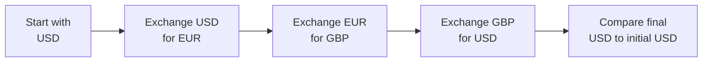

## Overview

Have you ever spotted a price discrepancy between three different stores selling the same product? Maybe you checked one store that sold a gadget at $100, another at $105, and a third at a slightly odd exchange rate in foreign currency. Well, if you quickly whipped out your phone and made a series of trades (or purchases) that ended up netting you a profit, you basically performed the shopping equivalent of triangular arbitrage. Except in the foreign exchange (FX) world, these loops involve currencies and the potential for nearly immediate, risk-free profit—at least in theory.

Triangular arbitrage in currency derivative markets is a process that exploits misalignments among three exchange rates. In real markets, it’s literally about making a sequence of conversions—like USD → EUR → GBP → back to USD—to see if you end up with more dollars than you started with. Because the FX market is extremely large and liquid, you might feel a sense of excitement discovering that these opportunities could exist. But let’s be totally honest: in practice, such arbitrages are tiny and short-lived. High-frequency traders (HFT) and advanced algorithms typically detect and close them within milliseconds. Nevertheless, understanding triangular arbitrage is a cornerstone of your FX and derivatives knowledge, which is super handy for the CFA exam and, more importantly, for real-world currency trading and risk management.

Below, we’ll explore the nuts and bolts of triangular arbitrage, how to spot it, when (and why) it can occur, and what role derivatives play in expanding—or limiting—these opportunities. We’ll also tackle some best practices, common pitfalls, and exam considerations for advanced learners.

## Foundational Concepts

### Exchange Rates and Quotes

In FX markets, exchange rates are quoted in pairs, typically as “Base Currency/Quote Currency.” For instance, USD/EUR might represent how many U.S. dollars one needs to buy one euro. But make no mistake: quoting conventions vary. Some pairs are quoted as EUR/USD, others as USD/JPY, etc., and sometimes the reciprocal is used. The important point is to keep track of which currency is the “base” and which is the “quote.”

• Spot Rate: The instantaneous rate for swapping one currency for another.  
• Forward Rate: An agreed-upon rate for swapping currencies at a future date.  

When people talk about “pip” or “point,” they’re typically referring to the smallest incremental move in an exchange rate—like 0.0001 for many currency pairs. This matters because small differences in exchange rates can be enough to open or close an arbitrage window in large transaction sizes.

### Cross Rates

A cross rate is any exchange rate between two currencies that is derived from their relationships with a third currency. Suppose you know the rates:

• USD/EUR = 1.10  
• USD/GBP = 1.25  

You might derive EUR/GBP as follows (in simplified terms):
  

\text{EUR/GBP} = \frac{\text{USD/GBP}}{\text{USD/EUR}} = \frac{1.25}{1.10} \approx 1.1364


If the market quotes EUR/GBP at 1.14, that’s out of line with 1.1364, meaning potential arbitrage might exist. Of course, you’d have to do the actual conversions to see whether that difference is big enough—after transaction costs—to create a risk-free profit.  

## Mechanics of Triangular Arbitrage

The hallmark sequence in triangular arbitrage is:

1. Start with Currency A.  
2. Convert Currency A → Currency B.  
3. Convert Currency B → Currency C.  
4. Convert Currency C → Currency A.  
5. Compare the ending units of Currency A to your starting units.  

If you wind up with more Currency A than you started with, you’ve successfully performed triangular arbitrage. Let’s illustrate with an imaginary example.

### Simplified Example

Imagine you’ve got the following quotes (spot) at your disposal:

• USD/EUR = 1.10 → $1.10 per €1.  
• EUR/GBP = 1.13 → €1.13 per £1.  
• GBP/USD = 1.27 → $1.27 per £1.  

Now, let’s do a currency loop. You start with $1,000 (Currency A = USD).

1) USD → EUR  
   - Since USD/EUR = 1.10, you get  
     
     \frac{1000}{1.10} = 909.09 \, \text{EUR (approx)}.
     

2) EUR → GBP  
   - Since EUR/GBP = 1.13, you get  
     
     \frac{909.09}{1.13} \approx 804.51 \, \text{GBP}.
     

3) GBP → USD  
   - Since GBP/USD = 1.27, you get  
     
     804.51 \times 1.27 \approx 1{,}021.73 \, \text{USD}.
     

You started with $1,000 and ended up with about $1,021.73, a risk-free profit of $21.73. In practice, you’d have to factor in bid–ask spreads, transaction fees, and any other frictional costs, so chances are the real profit would be smaller—or vanish entirely. But the principle remains—and if markets are truly mispriced enough to overcome these costs, the arbitrage is real.

### Algebraic Representation

Mathematically, if the product of the three cross rates as you chain them around is greater than 1 (once you account for the correct direction of multiplication and the relevant base/quote arrangements), you have a profitable arbitrage loop. If it’s less than 1, the arbitrage might work in the reverse direction. A simplified version can look like this:


\text{A → B → C → A} \longrightarrow 
\text{Rate}_{A/B} \times \text{Rate}_{B/C} \times \text{Rate}_{C/A} > 1


If this product is greater than 1, a profitable triangular arbitrage opportunity may exist.

## Triangular Arbitrage in Forward and Derivative Markets

So far, we’ve been chatting about spot rates. But forward and derivative markets create additional layers of complexity. If forward rates among three currencies fail to line up properly with their spot (or each other), triangular arbitrage can occur in the forward market as well.

For instance, if the forward quotes for USD/EUR, EUR/GBP, and GBP/USD are not consistent (based on interest rate differentials, for example), advanced traders can enter into forward contracts that lock in a series of currency conversions to exploit the mismatch. The typical steps look like this:

1. Enter a forward contract to convert currency A into currency B at forward rate F(A,B).  
2. Enter a second forward contract to convert currency B into currency C at forward rate F(B,C).  
3. Enter a third forward contract to convert currency C back into currency A at forward rate F(C,A).  
4. If the product of those forward cross rates is out of sync with the “fair” cross rate implied by interest rate parity, you pocket a profit when all forward contracts settle—assuming no default risk or credit friction from counterparties.

### Forward Cross-Rate Calculation

An important concept for forward triangular arbitrage is that forward cross-rates can be derived from the forward quotes of each currency pair. If the “implied cross-rate” doesn’t match the “direct cross-rate,” you have spotted an arbitrage. The typical formula:


F_{EUR/GBP} = \frac{F_{EUR/USD}}{F_{GBP/USD}}


Any deviation beyond normal transaction costs signals a possible triangular forward arbitrage. In real life, you’d do a more rigorous check by factoring in the relevant day counts, interest rates for each currency, and potential collateral or margin requirements.

## Practical Considerations

### Market Efficiency and Liquidity

In major currency pairs, such as EUR/USD, USD/JPY, and GBP/USD, triangular arbitrage opportunities last for extremely short timeframes. We’re talking microseconds to milliseconds in a high-frequency environment. The FX market is extremely deep—arguably the deepest financial market in the world. Banks, hedge funds, and proprietary trading firms use lightning-fast servers to keep prices aligned. So while triangular arbitrage is important academically and conceptually, you might never manually witness a puzzle piece big enough for easy picking in the real world.

### Transaction Costs and Slippage

Let’s say you find a potential loop. You might get stuck with wide bid–ask spreads if you’re not a major player. Or you might face slippage, because the price you saw on your screen changed by the time your trade executed. In practice, these frictions can erode or destroy your profit. That’s why institutional traders seeking triangular arbitrage often require:

• Access to direct interbank markets with tight pricing.  
• Algorithmic engines that execute trades in fractions of a second.  
• Deep liquidity to avoid moving the market.  

### Computational Latency

You’ve probably heard stories about trades executing at the “speed of light,” minus a few limitations. In the FX world, collocation (placing your servers physically close to the exchange data center) can reduce latency by microseconds, creating advantage. Of course, building and maintaining this infrastructure is expensive. As a result, only well-capitalized firms can attempt consistent success in triangular arbitrage in real-time electronic markets.

### Regulatory and Clearing Considerations

When dealing with forward or swap-based triangular arbitrage, be aware of credit risk and clearing requirements under various regulatory regimes. Banks and large trading firms typically offset these trades cleared via central counterparties or bilateral credit support annexes. Collateral and margin rules further complicate the net payoff from any arbitrage strategy.

## Real-World Anecdote

The first time I witnessed a near “risk-free” arbitrage in an academic setting was in a live trading simulation for a finance class. We had euro, British pound, and U.S. dollar quotes from a fictional market maker. Only one person in our group noticed that if you took USD to EUR, then EUR to GBP, and then GBP back to USD, you ended up with around 2% more money. Did that mean we were all about to retire early? Well, not quite—because once everyone caught on, the software instantly adjusted the quotes, and that 2% advantage quickly disappeared into fractions of a pip. But the lesson stuck: triangular arbitrage is all about speed, vigilance, and having the right data.

## Illustration Using Diagrams

Below is a simple mermaid diagram illustrating the flows in a triangular arbitrage loop. Imagine each step as a node, with arrows representing currency conversions:

As you can see, you start in one currency, hop to the second, hop to the third, and then come back to see if you’ve gained or lost. If everything lines up well—and you do it fast—you lock in an arbitrage profit.

## Best Practices and Common Pitfalls

• Always include transaction costs. A naive approach ignoring bid–ask spreads may overstate your potential profit.  
• Confirm the direction of the trade. If you mix up the quotations and go the wrong way around the triangle, you might transform an arbitrage opportunity into a loss.  
• Monitor multiple trading platforms. Sometimes, the quoted price on one platform might differ from another, presenting a fleeting opportunity.  
• Watch out for partial fills. If your order is large (e.g., tens or hundreds of millions in notional), slippage might drastically impact your final execution price.  
• Check counterparty credit risk. In forward or swap-based arbitrage, you rely on the financial stability of your counterparty to honor the contract at the future date.

## Exam Tips for CFA Candidates

• Triangular arbitrage problems are a staple in FX sections. You can expect to calculate whether a cross-rate is mispriced or whether translating a certain amount of currency gets you more or less than you started with.  
• Practice manipulations of the base currency and quote currency. Knowing which side of the fraction to invert is crucial.  
• Because the CFA exam typically assumes frictionless markets (or minimal friction) unless stated, you’ll usually see “spot” or “forward” quotes that are obviously out of line. But be sure to interpret the question carefully.  
• Familiarize yourself with interest rate parity, because forward mispricings often tie back to differences in interest rates across countries.  
• Common pitfalls: messing up decimal placements, ignoring or incorrectly applying the bid–ask spread, and mixing up the direction of the currency quote.  
• When you see a cross-currency arbitrage question, watch for the “chain of conversions” approach. The exam might test your ability to quickly parse multiple steps, from entering a forward contract in one currency to swapping into another.

## Conclusion

Triangular arbitrage demonstrates one of the purest examples of the law of one price in action—if three exchange rates are out of line, you can walk away with a profit by trading around the “triangle.” In modern FX markets, these mispricings usually vanish in a flash, but the very possibility helps tie exchange rates together. Derivatives, especially forward and swaps, can add further layers of complexity—and fleeting arbitrage opportunities—if you can process quotes and execute trades at lightning speed.

It might feel a bit magical to get back more of your starting currency than you began with, effectively “creating money out of thin air.” But don’t forget: markets are competitive, transaction costs are real, and advanced players have powerful tools to keep those inefficiencies extremely short-lived. For exam purposes, triangular arbitrage is a great demonstration of no-arbitrage conditions, cross-rate consistency, and how currency derivative markets function in tandem with the spot market.  

Anyway, I hope this gave you a solid roadmap for conceptualizing triangular arbitrage in currency derivative markets. The next time you stare at a series of quotes, you can confidently say, “Wait, something’s off here,” and might just realize a puzzle piece is out of place—if only for a fleeting moment.

## References and Further Reading

• Shapiro, Alan C. Multinational Financial Management. (General coverage on FX mechanics and arbitrage.)  
• Bank for International Settlements (BIS) Triennial Central Bank Survey (comprehensive data on global FX liquidity).  
• CFA Institute Level I and Level II materials on Currency Management, which provide additional arithmetic examples of triangular arbitrage.  
• “No-Arbitrage Pricing: Spot & Forward Rates,” in the official CFA Institute curriculum readings.  

-----

## Triangular Arbitrage Knowledge Check



### Which of the following best describes the concept of triangular arbitrage?

- [ ] Buying one currency and holding it until its exchange rate appreciates.  
- [x] Exploiting misaligned exchange rates among three currencies to generate risk-free profit.  
- [ ] Speculating on interest rate differentials via forward contracts.  
- [ ] Using advanced algorithms solely to reduce latency in trade execution.  

> **Explanation:** Triangular arbitrage refers to the process of converting from one currency to another, then another, and finally back to the initial currency to realize a profit if the product of the exchange rates is misaligned.

### In a frictionless environment, which condition indicates a triangular arbitrage opportunity exists among currencies A, B, and C?

- [x] The product of the cross rates A/B, B/C, and C/A is greater than 1.  
- [ ] The sum of the cross rates A/B, B/C, and C/A is greater than 1.  
- [ ] The product of the cross rates A/B, B/C, and C/A is less than 1.  
- [ ] The difference between the cross rates A/B and B/A is zero.  

> **Explanation:** If (A/B) × (B/C) × (C/A) > 1, it implies a mispricing allowing for risk-free profit by cycling through the currencies.

### How does a wide bid–ask spread typically affect a potential triangular arbitrage strategy?

- [x] It may erode or eliminate profits by increasing transaction costs.  
- [ ] It often amplifies the arbitrage profit.  
- [ ] It prevents the conversion back to the base currency.  
- [ ] It has no effect on triangular arbitrage strategies.  

> **Explanation:** Bid–ask spreads are a key transaction cost and can reduce or remove the net profit from any apparent arbitrage opportunity.

### Which of the following is the primary reason triangular arbitrage opportunities are short-lived in major FX markets?

- [ ] Low trading volume in currency pairs.  
- [ ] High currency volatility.  
- [x] High-frequency trading and advanced algorithms rapidly eliminate mispricings.  
- [ ] Regulatory interventions force banks to adjust exchange rates.  

> **Explanation:** Powerful technology and a deeply liquid market enable instant price updates, making any misalignment (and thus arbitrage) vanish quickly.

### You observe the following spot quotes: USD/JPY = 110, EUR/USD = 1.20, and EUR/JPY = 132. Which statement is most accurate?

- [x] The cross rate EUR/JPY implied by USD/JPY and EUR/USD differs from 132, suggesting an arbitrage check.  
- [ ] The cross rate EUR/JPY implied by USD/JPY and EUR/USD is exactly 132, no arbitrage check is needed.  
- [ ] There must be a profitable triangular arbitrage with these quotes.  
- [ ] These quotes imply the Japanese yen is undervalued, but no arbitrage is possible.  

> **Explanation:** If you calculate (110 × 1.20) = 132, that’s precisely the quoted EUR/JPY rate. If it differed significantly, an arbitrage might exist. But you always need to check the precise numbers and factor in transaction costs.

### Which best describes forward triangular arbitrage?

- [ ] Borrowing money in one currency, converting at the spot rate, and repaying the loan in the future.  
- [x] Using forward contracts among three currencies to exploit mismatched forward cross-rates.  
- [ ] Buying options on three currency pairs to hedge interest rate risk.  
- [ ] Initiating swaps that convert currency risk to equity risk.  

> **Explanation:** Forward triangular arbitrage occurs when forward quotes among three currencies do not align properly, permitting a profit by entering offsetting forward contracts.

### In the context of triangular arbitrage, why is it essential to pay attention to quoting conventions?

- [ ] Because major currency pairs always quote USD as the base currency.  
- [x] Mixing up the base/quote currency can lead to direction errors and potentially a loss.  
- [ ] Quoting conventions reveal central bank interventions.  
- [ ] Quoting conventions do not affect currency conversions.  

> **Explanation:** Properly interpreting which currency is the base and which is the quote is vital; reversing the quote can lead to incorrect calculations and the wrong trade direction.

### What is the main challenge when attempting triangular arbitrage in less-liquid currency pairs?

- [x] Wider bid–ask spreads and limited market depth can negate potential profits.  
- [ ] There are always infinite arbitrage opportunities.  
- [ ] Trading platforms do not allow transactions in minor currencies.  
- [ ] Volatility is nearly zero, removing any need for arbitrage.  

> **Explanation:** Less-liquid pairs often have higher transaction costs and lower market depth, making profitable arbitrage more difficult.

### In a high-frequency trading environment, what aspect of triangular arbitrage is most critical for securing a profit?

- [x] Low latency in execution.  
- [ ] Long holding periods for currency positions.  
- [ ] Relying solely on manual trade entry.  
- [ ] Large directional bets on one currency pair.  

> **Explanation:** Speed is essential. Minimizing latency ensures you execute trades before the market reprices and eliminates the misalignment.

### True or False: Triangular arbitrage in highly efficient FX markets typically persists for long periods.

- [x] True  
- [ ] False  

> **Explanation:** Actually, this statement is false in real-world practice; triangular arbitrage opportunities rarely persist for long in deep, efficient markets. However, some exam scenarios may assume idealized conditions with or without friction. Always watch for disclaimers in the question stem.


