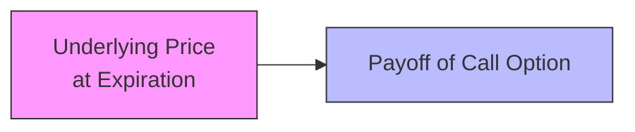
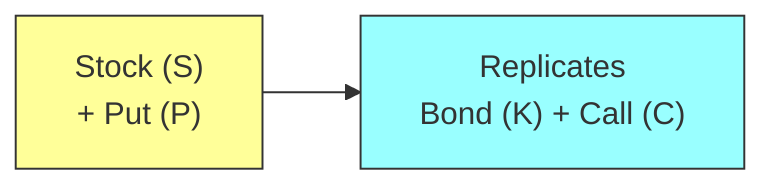

## Introduction
Replication is one of those concepts that, when we first encounter it, can feel almost magical—like you’re conjuring an entire payoff stream out of thin air. I remember the very first time I tried to replicate a call option using a combination of the underlying stock and a risk-free bond. It felt a bit like pulling a rabbit out of a hat. But beneath the surface, replication is straightforward: if you set up a portfolio that has exactly the same final payoff as the derivative, the price of that portfolio must equal the derivative’s price. Otherwise, there’s an opportunity for arbitrage profit.

This idea sits at the heart of modern derivatives pricing, including the Black–Scholes–Merton model and the binomial option pricing framework. In this article, we’ll explore how these models (and practical strategies in the real market) use replication to price derivatives without explicitly relying on risk preferences. We’ll also go into some real-world frictions—like transaction costs and liquidity issues—that make real-life replication a tad more complicated.

## Key Concepts in Replication
Before diving into examples, let’s clearly define the essential ideas:

• Replication: This means combining instruments—like the underlying asset (often a stock) plus a risk-free bond—in such a way that their combined payoff exactly matches the payoff of another asset or derivative. If two assets yield the same payoff at expiry, they must have the same present value in an arbitrage-free market.

• Self-Financing Strategy: Once the replicating strategy is initiated, you do not inject or withdraw money from it; you simply adjust positions (e.g., buy or sell some portion of the underlying) in response to price changes. Any changes in one position are offset by an opposite funding effect in the other so that no external capital is required.

• No-Arbitrage Pricing Principle: If you set up two portfolios with identical final payoffs but different current prices, traders will buy the cheaper portfolio and/or short the more expensive one until the prices converge. This principle ensures consistent derivative pricing.

• Risk-Neutral Valuation: Under the risk-neutral approach, all investors discount expected payoffs at the risk-free rate, ignoring risk aversion. This is justified by the idea that when payoffs are perfectly replicated by a self-financing strategy, risk preference is irrelevant—everyone can lock in the arbitrage.

## Constructing a Replicating Portfolio
To replicate the payoff of a derivative, you typically break down your target payoff into parts—a position in the underlying plus a risk-free bond. It all boils down to answering the question: “How many units of the underlying do I need to hold, and how much do I invest/borrow at the risk-free rate so that the final payout equals the derivative’s payout for any future scenario?” 

### Simple Example: Replicating a Call Payoff
Consider a European call option on a stock with strike price K that expires in one period. Let’s set up a very short, purely illustrative numeric example using a binomial framework:

• Current stock price: S₀  
• Next period, the stock can go up to Sᵤ or down to S_d  
• Risk-free rate for the period: r (so that $1 grows to $1×(1+r) in one period)

In a one-period binomial model, the replicating portfolio for a call is:
(1) Δ shares of stock, and  
(2) an amount B in the risk-free asset (which can be positive if we invest or negative if we borrow).

Our goal is for this portfolio—holding Δ shares of stock plus B of bonds—to match the call option payoff in both the up and the down scenarios.

If the stock goes up to Sᵤ at expiration, the option payoff is max(Sᵤ – K, 0). Our replicating portfolio must have the same payoff:  
Δ × Sᵤ + B × (1 + r) = max(Sᵤ – K, 0).

If the stock goes down to S_d at expiration, the option payoff is max(S_d – K, 0). So the replicating portfolio must also match that:  
Δ × S_d + B × (1 + r) = max(S_d – K, 0).

From these two linear equations, we can solve for Δ and B. Once Δ and B are found, the cost to set up the position at inception gives us the theoretical fair value of the call. Specifically,  
Call⁰ = Δ × S₀ + B  
(assuming no arbitrage and no transaction costs).

### Payoff Diagram
The payoff diagram of a European call is upward sloping above the strike K and flat (zero payoff) below K. Here’s a simple visual depiction of a call option payoff at expiration:



In practice, the replicating strategy’s payoff must align perfectly with the diagonal line after K. The exact position in the stock (Δ) ensures the slope after K is correct, and the bond position (B) sets the starting intercept to match zero payoff below K.

## Risk-Neutral Pricing and Arbitrage
One of the coolest insights in derivatives pricing is that you don’t need to know an investor’s risk preferences if you can replicate the derivative’s payoff. In a risk-neutral world, we assume that everyone is indifferent to risk, so expected returns on all securities are the risk-free rate. 

By constructing the replicating portfolio, you effectively “lock in” the final payoff. If the price of the derivative diverges from the cost of setting up that replicating portfolio, you immediately earn an arbitrage profit:
• If the derivative is overpriced, you sell (or short) it and simultaneously compose the replicating portfolio for less.  
• If the derivative is underpriced, you buy it and short the replicating portfolio.  

In either case, you pocket a riskless profit at inception.

## Dynamic Hedging in Continuous Time
Replication doesn’t only apply to a one-period or discrete-time framework. The Black–Scholes–Merton (BSM) model extends the same idea to continuous time. Under the BSM model:

• You continuously “delta-hedge” your option by buying or selling infinitesimal amounts of the underlying.  
• By dynamically maintaining this hedge, you replicate the option’s payoff at expiration.  
• The cost of setting up this continuously adjusted hedge equals the option’s fair price.

In real markets, this dynamic hedging approach is more of a guiding principle than something you apply exactly, because you face real costs (bid-ask spreads, phone calls, broker fees, you name it). Still, the concept is crucial in ensuring that the model is free of arbitrage.

### Example: Delta-Hedging a Call
Delta (Δ) is the sensitivity of an option’s price to small changes in the underlying asset. In the BSM framework:

(1) Start by computing the option’s delta: Δ = ∂C/∂S.  
(2) Buy Δ units of the underlying to hedge a short call option position. If the underlying price rises slightly, the short call loses some value, but the underlying position gains just enough to offset that loss.  
(3) As time passes and the stock price moves, delta changes. You adjust your position to maintain a hedge (i.e., dynamic hedging).  

Over time, your net position is “riskless,” so you earn the risk-free rate. That leads to the BSM differential equation and the classic closed-form solution for calls.

## Real-World Frictions in Replication
Now, it’s one thing to talk about replication in a frictionless textbook environment. In real life, there are transaction costs, short-sale constraints, liquidity issues, and sometimes even regulatory restrictions. These can cause:

• Imperfect Replication: You can’t continuously trade to maintain a delta hedge with zero cost if each trade has a commission.  
• Slippage and Slower Execution: Prices can move while your hedge transaction is trying to fill.  
• Liquidity Gaps: In stressed markets, the underlying might not have the depth to support a large hedge trade without serious market impact.

So while replication is theoretically elegant, it’s a best-case ideal. Securities might be slightly mispriced in real life if replication is expensive or complicated. Still, the principle of replication remains central for setting a reference or “fair” price.

## Practical Illustrations
Small practices help to solidify the concept:

1. Put–Call Parity (Forward-Based): Put–call parity (for European options) states that:  
   C – P = S₀ – K·(1+r)^(-t)  
   This relationship can be derived by replicating the payoff of a call minus that of a put with the underlying stock and a zero-coupon bond. If the relationship is violated, arbitrage becomes possible.

2. Stock + Put = Bond + Call: Another expression of put–call parity. You can replicate a protective put (a stock plus a put) with a zero-coupon bond plus a call. Both positions yield the same payoff: a guaranteed floor at K with unlimited upside.



If for some reason Stock + Put trades at a lower price than Bond + Call, you’d buy the cheaper combination and short the more expensive one, making an immediate, riskless profit.

3. Synthetic Stock: Suppose for some reason you want to create a synthetic “stock” position without actually holding the stock. You might combine a long call and a short put on the same strike, along with an investment at the present value of the strike. The final payoff (ignoring early exercise considerations) replicates being long the stock.

## Numerical Illustration in a Binomial Model (Python Example)
Below is a concise Python snippet that shows a one-period binomial approach to finding the fair price of a European call using replication:

```python
import math

S0 = 100.0       # current stock price
K  = 100.0       # strike
r  = 0.02        # risk-free rate per period
u  = 1.20        # up factor (stock goes to 120)
d  = 0.80        # down factor (stock goes to 80)

call_up   = max(u*S0 - K, 0)
call_down = max(d*S0 - K, 0)

# Δ * (u*S0) + B*(1+r) = call_up
# We want Δ and B

Delta = (call_up - call_down) / ((u - d)*S0)
B = (call_up - Delta*(u*S0)) / (1+r)

call_price = Delta*S0 + B

print(f"Delta: {Delta:.4f}")
print(f"Risk-free asset (B): {B:.4f}")
print(f"Call option value: {call_price:.4f}")
```

In a frictionless market, “Delta × S₀ + B” must equal the option price to avoid arbitrage. If the market price deviates significantly from that computed option value, there’s a short-lived opportunity to make a risk-free profit via replication.

## Exam Relevance and Key Takeaways
• Understand the logic that if two assets (or portfolios) have the same payoff in all future states, they must be priced identically—this is the fundamental no-arbitrage argument.  
• Remember that both the binomial model and the Black–Scholes–Merton framework rely on replicating payoffs and no-arbitrage logic.  
• Keep in mind that delta-hedging is a real-life application: traders who write (sell) options often hedge themselves by dynamically trading in the underlying.  
• Watch for small mistakes—like ignoring transaction costs or forgetting to re-hedge. Those details might appear in exam scenarios discussing “frictions” or “slippage.”  
• Derivative pricing questions can test your ability to set up a replicating portfolio and show how it leads to a unique fair price.

## Final Tips for the Exam
1. Show All Steps: Whether it’s a binomial-tree question or a BSM-type question, break down each step: compute Δ, compute B, or apply put–call parity. Clarity matters.  
2. Watch Out for Continuous vs. Discrete Rates: The exam might mix up notations for continuous compounding (“e^(–rT)”) vs. discrete compounding (“(1+r)^(–T)”).  
3. Embed the Replication Argument in Your Answers: Even if the question doesn’t explicitly mention replication, you can mention how you’d replicate the contract to check for mispricing.  
4. Practice Time Management: Replication problems are typically straightforward if you keep track of the formulas, but in the heat of the exam, be sure to manage your time so you don’t get bogged down in algebraic detail.  
5. Mind the Risk-Neutral Probabilities: In a binomial model, the “p” you compute is the risk-neutral probability, not the real-world probability. This is often a trick point.

## References
• Hull, John C. “Options, Futures, and Other Derivatives.” 10th ed., Pearson.  
• Cox, John C., Stephen A. Ross, and Mark Rubinstein. “Option Pricing: A Simplified Approach.” Journal of Financial Economics.  
• CFA Program Curriculum, Derivatives and Risk Management sections.  

---

## Test Your Knowledge: Replicating Payoffs with Derivatives Quiz



### Which of the following best describes replication in the context of derivatives pricing?

- [ ] Using complex algorithms to measure trading volume and volatility.  
- [x] Constructing a portfolio of simpler instruments that matches a target derivative’s payoff.  
- [ ] Buying derivatives at a discount and selling at a premium.  
- [ ] Holding no positions because markets are efficient.  

> **Explanation:** Replication involves combining underlying assets and bonds (or other instruments) so that the total payoff mirrors the derivative’s payoff at maturity.

---

### In a one-period binomial model, you replicate a call option payoff by:

- [x] Purchasing Δ shares of stock and an amount B invested (or borrowed) at the risk-free rate.  
- [ ] Writing a put option and adjusting it daily.  
- [ ] Selling short the risk-free bond while purchasing shares.  
- [ ] Matching the call with forward contracts only.  

> **Explanation:** The binomial replication approach requires a specific number of shares (Δ) plus a risk-free bond position B that achieves the same outcomes as the call in both up and down states.

---

### According to no-arbitrage principles, if two assets have the same final payoff:

- [ ] They must have the same beta.  
- [ ] They must have the same volatility.  
- [x] They must have the same current price (in frictionless markets).  
- [ ] They must be continuously hedged.  

> **Explanation:** If two assets or portfolios produce the same terminal payoff in every state, their prices must converge in a frictionless, arbitrage-free market.

---

### Which of the following is true about delta-hedging in continuous time under the Black–Scholes–Merton framework?

- [ ] You hedge once at initiation only.  
- [x] You continuously rebalance to maintain a riskless hedge.  
- [ ] It relies solely on investor risk preferences.  
- [ ] It is irrelevant for European options.  

> **Explanation:** The core of the BSM model is that the option seller dynamically (continuously) hedges the option to replicate a riskless payoff, thus leading to the risk-free valuation approach.

---

### What does the "risk-neutral" assumption specifically imply in pricing derivatives?

- [x] Investors are indifferent to risk, so all cash flows are discounted at the risk-free rate.  
- [ ] The stock price has zero volatility.  
- [ ] Investors have identical risk tolerances.  
- [ ] The underlying asset always goes up.  

> **Explanation:** Under risk neutrality, the expected return on all assets is the risk-free rate, simplifying pricing by removing the need for subjective risk premia.

---

### When we say a replication strategy is “self-financing,” we mean:

- [x] Rebalancing requires no additional money once the initial strategy is set.  
- [ ] The government provides special subsidies.  
- [ ] Margin calls never happen.  
- [ ] Investors are guaranteed a profit without investment.  

> **Explanation:** In a self-financing strategy, changes in the underlying positions are compensated by proceeds from other parts of the portfolio, avoiding the need for fresh capital inflows.

---

### Suppose the current stock price is $50, and you replicate a European call with strike $50 by holding 0.5 shares and borrowing $20. If the market price of the call is $27:

- [x] The call is overpriced; you can short the call and buy the replication portfolio for $25.  
- [ ] The call is underpriced; you can buy the call for $27 and short the replication portfolio.  
- [ ] The call is fairly priced; no arbitrage is possible.  
- [ ] The replication portfolio costs exactly $27.  

> **Explanation:** If it costs only $25 to replicate a payoff that the call sells for $27, you can sell the call for $27 and set up the replication for $25, capturing a $2 arbitrage profit.

---

### In a binomial model, if you fail to incorporate transaction costs but real markets have them:

- [x] The model may incorrectly identify nonexistent arbitrage opportunities.  
- [ ] Pricing results are exactly the same.  
- [ ] The call option must be more expensive than the model’s value.  
- [ ] The put option must be cheaper.  

> **Explanation:** Omitting transaction costs can lead to perceived (but unrealizable) arbitrage. Real trading frictions shrink or eliminate many textbook arbitrage strategies.

---

### When using put–call parity for European options, which combination replicates a long call position?

- [ ] A short put and short zero-coupon bond.  
- [ ] A long stock and short put.  
- [x] A long stock, long put, and short bond (equivalent to subtracting the strike’s present value).  
- [ ] A long forward contract and a short put.  

> **Explanation:** By rearranging put–call parity, you’ll see that owning a call is equivalent to holding the stock and a put, while shorting the present value of the strike.

---

### In practical markets, does dynamic replication typically eliminate all risks?

- [x] False  
- [ ] True  

> **Explanation:** Dynamic replication in the real world faces transaction costs, liquidity issues, and price jumps, so perfect replication is not entirely feasible.


